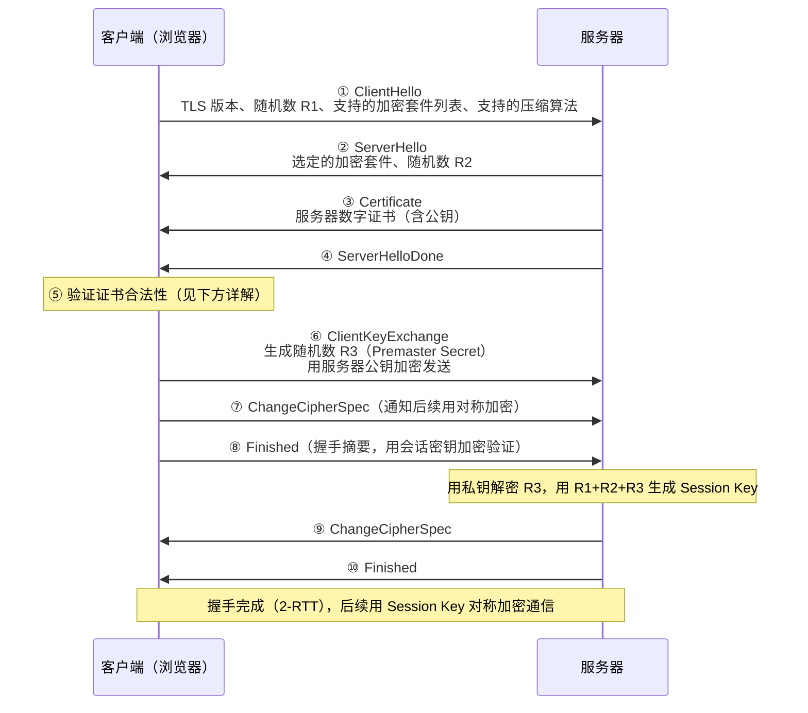
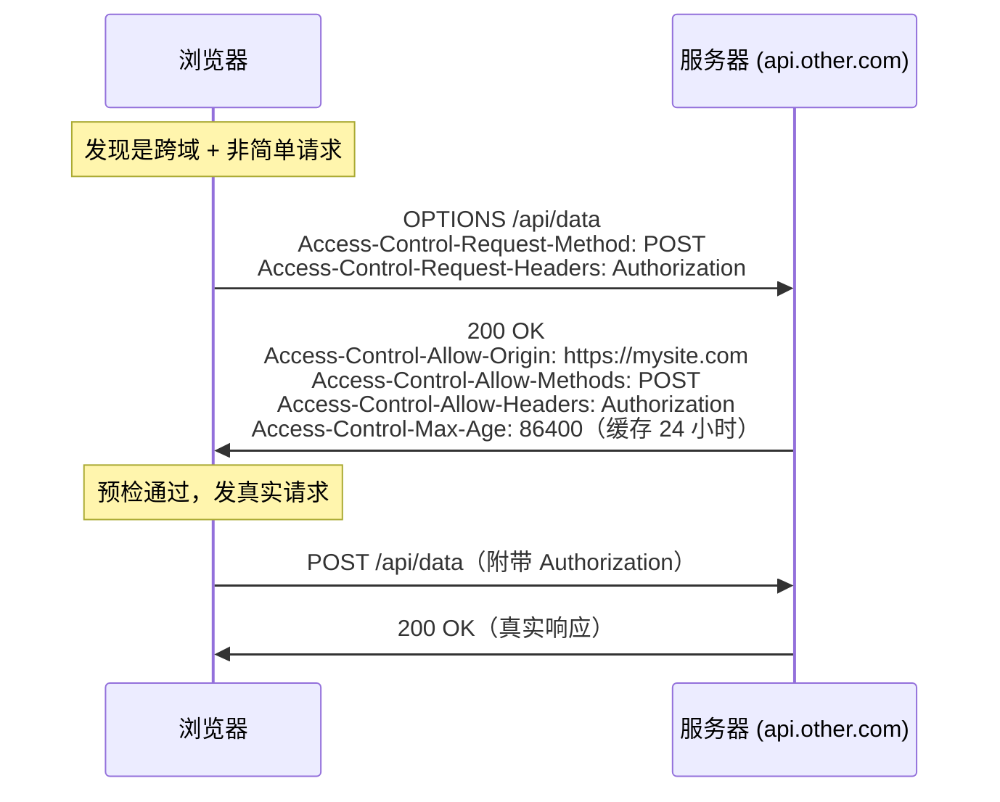
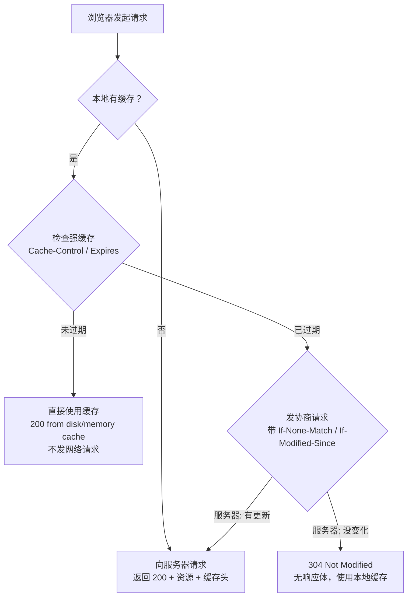
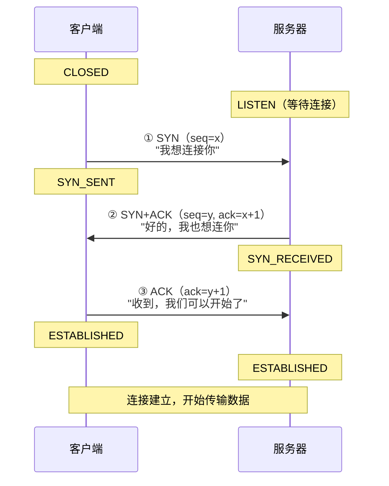
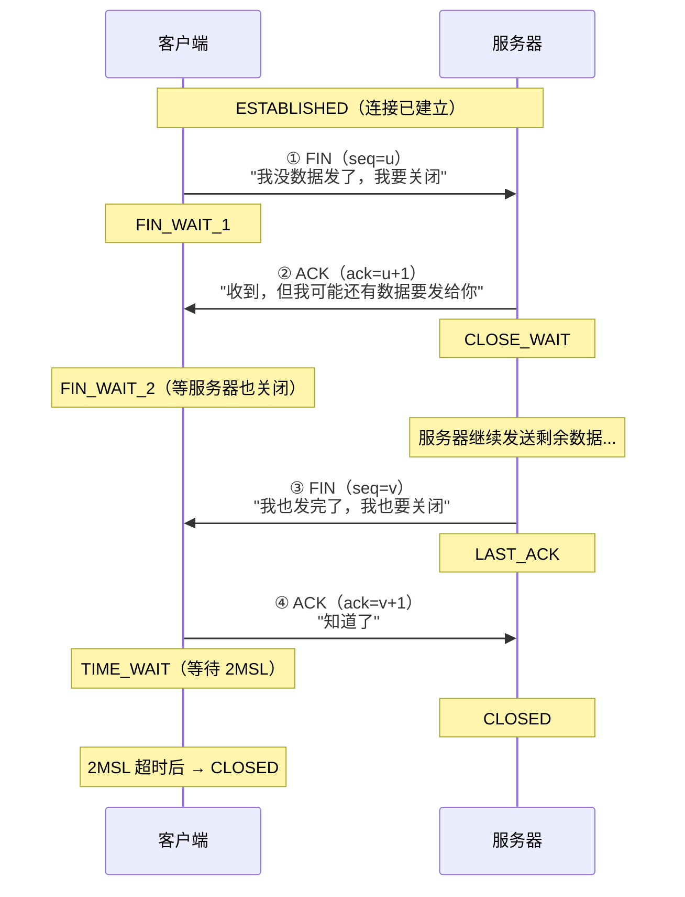
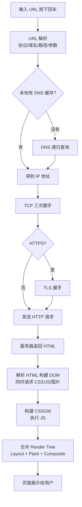
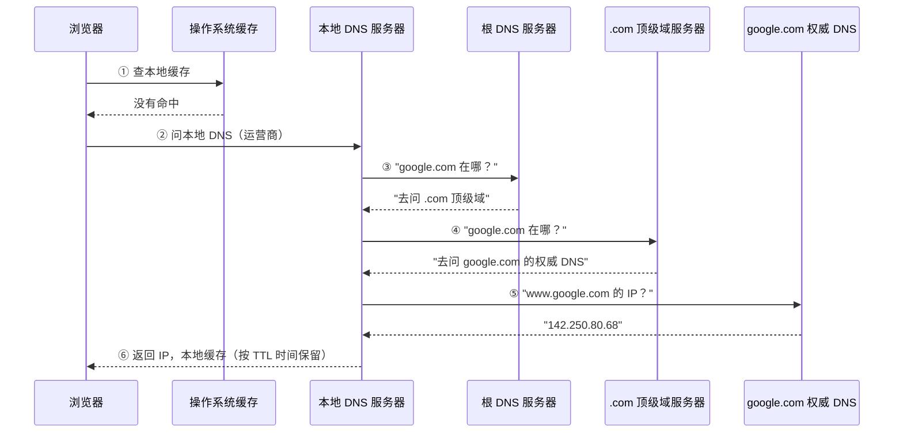
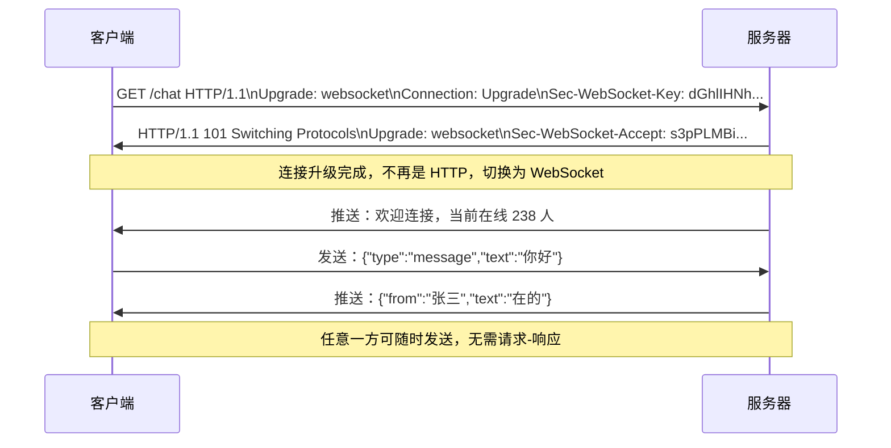
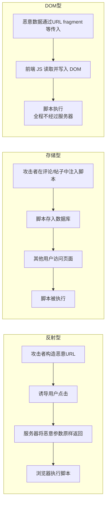
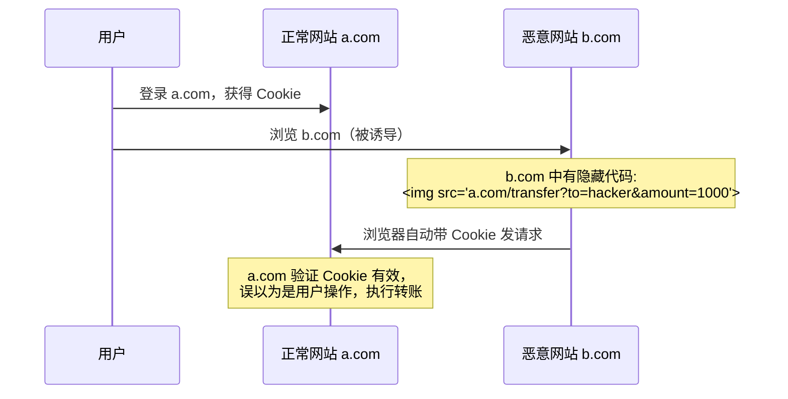

# 网络与 HTTP 面试题整理

## TCP 与 UDP

### TCP 和 UDP 有什么区别？分别适用什么场景？

一句话区别：TCP 是"挂号信"，可靠但慢；UDP 是"广播站"，快但不保证到达。

| 特性 | TCP | UDP |
|---|---|---|
| 是否连接 | 面向连接（三次握手） | 无连接 |
| 可靠性 | 可靠（确认 + 重传） | 不可靠（发送即忘） |
| 传输方式 | 字节流（连续不断） | 数据报（每包独立） |
| 首部开销 | 最小 20 字节 | 固定 8 字节 |
| 流量/拥塞控制 | 有（滑动窗口） | 无 |
| 通信方式 | 只能一对一 | 支持一对一、一对多、多对多 |
| 传输速度 | 较慢（有握手、确认开销） | 较快 |

**TCP 适用场景**：文件传输（FTP）、网页浏览（HTTP）、邮件（SMTP）——需要保证数据完整性。

**UDP 适用场景**：视频通话（WebRTC）、直播、在线游戏、DNS 查询——对实时性要求高、能容忍少量丢包。

**为什么丢包对视频影响不大？**  
视频编码（H.264/H.265 等）具有容错能力，丢失少量非关键帧（P 帧、B 帧）时视频可用相邻帧插值填补。但如果丢失的是关键帧（I 帧），就会出现马赛克或卡顿。

#### TCP 可靠性的底层机制（高频追问）

TCP 靠以下几个机制保证可靠传输：

**1. 序号与确认应答（ACK）**

每个字节都有序号，接收方收到数据后回复 ACK（确认号 = 下一个期望收到的字节序号）。发送方收不到 ACK，就超时重传。

**2. 滑动窗口（流量控制）**

不等每个包都收到 ACK 再发下一个，而是允许发送方一次发送"窗口大小"个字节的数据。接收方通过调整窗口大小来控制发送速率，防止接收缓冲区溢出。

```
发送方：[已发已确认] [已发未确认] [可发未发] [不可发]
                    ←───── 滑动窗口 ─────→
接收方回复 ACK 时，窗口向右滑动
```

**3. 拥塞控制**

防止发太快把网络打垮，分四个阶段：

```
cwnd（拥塞窗口）
    │
    │         /---------- 加性增
    │        /
    │       /
    │      /
ssthresh │-----
    │    /
    │   /  慢启动（指数增）
    │  /
    │ /
    └─────────────────────▶ 时间
      发生丢包时：ssthresh = cwnd/2，重新慢启动
```

- **慢启动**：初始 cwnd = 1，每收到一个 ACK 翻倍（指数增）
- **拥塞避免**：达到 ssthresh 后改为每轮 +1（线性增）
- **快重传**：收到 3 个重复 ACK 立即重传，不等超时
- **快恢复**：快重传后 ssthresh = cwnd/2，cwnd = ssthresh，继续拥塞避免

**4. 超时重传**

如果超过 RTO（Retransmission Timeout）没收到 ACK，就重传该报文段。RTO 会根据网络 RTT 动态调整。

TCP 和 UDP 都工作在**传输层**，负责端对端通信，将数据包中的端口信息解析出来交给对应的应用层程序。

---

## HTTP 基础

### HTTP 和 HTTPS 有什么区别？

```
HTTP  请求：
浏览器 ──── 明文数据 ────▶ 服务器
           （任何中间节点都能看到内容）

HTTPS 请求：
浏览器 ──── 加密数据 ────▶ 服务器
           （中间节点只能看到密文）
```

| 特性 | HTTP | HTTPS |
|---|---|---|
| 传输内容 | 明文，可被窃听和篡改 | 加密，防窃听防篡改 |
| 身份认证 | 无，无法验证服务器真实性 | 有，通过数字证书验证 |
| 默认端口 | 80 | 443 |
| 证书 | 不需要 | 需要 SSL/TLS 证书 |
| 性能 | 较快 | 稍慢（握手和加解密有开销） |
| OSI 层次 | 应用层 | 应用层 + 传输层（TLS） |

**HTTPS = HTTP + SSL/TLS**（SSL 是旧称，TLS 是新称，当前主流是 TLS 1.2/1.3）

**HTTPS 的优点**：加密传输、身份认证、防数据篡改。  
**HTTPS 的缺点**：握手阶段费时、加解密消耗 CPU/内存、证书需要付费（Let's Encrypt 可免费）。

**HTTPS 是否完全安全？** 不是。攻击者可以用伪造证书欺骗用户，或利用中间人攻击（MITM）在 TLS 握手阶段拦截。HTTPS 大幅提高攻击成本，但不是万能盾。

### HTTPS 握手过程是怎样的？

HTTPS 同时用到了**非对称加密**（交换密钥阶段）和**对称加密**（实际传输阶段）。

为什么不全程用非对称加密？非对称加密（RSA/ECDHE）运算代价很高，大量数据加解密会很慢。所以用非对称加密安全地协商出一个对称密钥，之后用对称加密（AES）传输数据，兼顾安全和性能。

**TLS 1.2 握手（2-RTT）**：



**TLS 1.3 改进（1-RTT，甚至 0-RTT）**：

TLS 1.3 是 2018 年发布的主流版本，主要改进：
- 握手轮次从 2-RTT 减少到 **1-RTT**（移除了不必要的往返）
- 移除了不安全的加密算法（RSA 密钥交换、RC4、MD5 等）
- 强制使用**前向保密**（Forward Secrecy）——即使私钥泄露，过去的会话也无法解密
- 支持 **0-RTT**（Session Resumption）：复用已建立的会话，首个数据包就可以携带应用数据

```
TLS 1.2: Client Hello → Server Hello → Certificate → ... → 2个来回才能通信
TLS 1.3: Client Hello (含密钥共享) → Server Hello + Finished → 1个来回即可通信
```

#### 数字证书验证原理（面试高频追问）

客户端如何判断证书是真的？靠**证书链**和**CA（证书颁发机构）**。

```
证书信任链：
Root CA（根证书，内置在操作系统/浏览器）
    │  签名
    ▼
Intermediate CA（中间证书）
    │  签名
    ▼
网站证书（example.com，包含公钥）
```

验证过程：
1. 浏览器拿到服务器发来的证书，取出其中的签名
2. 用证书里声明的颁发者（Intermediate CA）的公钥验证签名
3. 再用 Root CA 的公钥验证 Intermediate CA 的证书
4. Root CA 证书内置在操作系统/浏览器，天然可信
5. 还要检查：证书域名是否匹配、是否在有效期内、是否已被吊销（CRL/OCSP）

**为什么伪造证书很难？** 攻击者即使能造出一张证书，也没办法用 Root CA 的私钥签名（Root CA 私钥严格离线保存），浏览器拿到签名一验就露馅。

### HTTP 无状态中的"状态"是什么意思？

**状态** = 客户端和服务端某次会话中产生的数据（如登录信息、购物车）。

**无状态** = HTTP 协议本身不保留这些数据，每次请求对服务器来说都是全新的。

解决方案：通过 **Cookie** 和 **Session** 机制让 HTTP 变得"有状态"——Cookie 存在客户端，Session 存在服务端，两者配合标识用户身份。

---

## HTTP 请求方法

### GET 和 POST 有什么区别？

常见误解："GET 不安全 POST 安全"——实际上两者都不安全，HTTPS 才是安全的保障。

| 特性 | GET | POST |
|---|---|---|
| 语义 | 获取资源（幂等） | 提交数据（非幂等） |
| 参数位置 | URL 查询字符串 | Request Body |
| 缓存 | 浏览器默认缓存 | 默认不缓存 |
| 历史记录 | 参数会保存在浏览器历史 | 不会 |
| 长度限制 | 受浏览器/服务器 URL 长度限制 | Body 理论上无限制 |
| 书签/分享 | 可以，URL 完整 | 不可以 |
| 回退行为 | 不会重新提交 | 会提示是否重新提交 |

**幂等性**：同一个 GET 请求执行多次，结果相同；POST 多次提交会多次创建数据。

追问：**GET 产生一个 TCP 数据包，POST 产生两个？**  
这个说法并不准确。POST 的 `Expect: 100-continue` 机制确实会先发 Header 等服务器确认再发 Body，但不是 HTTP 规范要求，而是某些实现的优化行为，并非 POST 的本质区别。

### POST 和 PUT 有什么区别？

- **POST**：创建资源（非幂等）——创建订单、提交表单
- **PUT**：更新资源（幂等）——修改用户信息，多次调用结果相同

记忆方式：POST = 新建，PUT = 更新/替换，PATCH = 部分更新。

### 为什么 POST 请求会先发一个 OPTIONS 请求？

这是浏览器的 **CORS 预检请求**（Preflight Request）机制。

触发条件（满足其一即会触发）：
1. 请求方法不是 GET/HEAD/POST
2. POST 请求的 Content-Type 不是 `application/x-www-form-urlencoded`、`multipart/form-data`、`text/plain`
3. 请求中有自定义 Header（如 `Authorization`、`X-Custom-Header`）



`Access-Control-Max-Age` 可以缓存预检结果，避免每次都发 OPTIONS。

### HTTP 常见请求方法有哪些？

| 方法 | 语义 | 幂等 |
|---|---|---|
| GET | 获取资源 | 是 |
| POST | 创建资源 | 否 |
| PUT | 更新/替换资源 | 是 |
| PATCH | 部分更新资源 | 否 |
| DELETE | 删除资源 | 是 |
| HEAD | 获取响应头（不含 Body） | 是 |
| OPTIONS | 询问支持的方法（预检） | 是 |
| CONNECT | 建立隧道（用于代理） | — |
| TRACE | 回显请求（调试用） | 是 |

---

## HTTP 版本演进

### HTTP 1.0、1.1、2.0、3.0 有什么区别？

```
HTTP 1.0 (1996)：
请求1 ──[建立连接]──[响应1]──[断开]──
请求2 ──[建立连接]──[响应2]──[断开]──
▲ 每次请求都重新建立 TCP 连接，代价极高

HTTP 1.1 (1999)：
TCP 连接 ──────────────────────────────▶（持久连接）
  请求1 → [响应1] → 请求2 → [响应2] → 请求3 → [响应3]
▲ 复用同一 TCP 连接，但响应必须按顺序，存在队头阻塞

HTTP 2.0 (2015)：
TCP 连接 ──────────────────────────────▶
  流1: 请求1 ──────────────[响应1]
  流2:    请求2 ────[响应2]
  流3:      请求3 ──────────────[响应3]
▲ 多路复用，同一 TCP 连接并发，无顺序限制

HTTP 3.0 (2022)：
QUIC 连接（基于 UDP）─────────────────▶
  流1: 请求1 ──────────────[响应1]
  流2:    请求2 ────[响应2]（流2丢包，不影响流1/3）
  流3:      请求3 ──────────────[响应3]
▲ 彻底解决队头阻塞，内置 TLS，0-RTT 连接
```

**HTTP 1.0**：每个请求独立 TCP 连接，无缓存支持，无 Keep-Alive。

**HTTP 1.1**：
- 持久连接（Keep-Alive，默认开启）
- 管道化（pipelining，并发发请求，但响应必须按序）
- 支持 ETag、Cache-Control 缓存控制
- 引入 `Transfer-Encoding: chunked` 分块传输
- **遗留问题**：HTTP 层的队头阻塞

**HTTP 2.0 深度解析**：

1. **二进制分帧层**：HTTP 1.1 是文本协议，HTTP 2.0 把所有数据拆成二进制帧（Frame），每个帧有帧头（包含流 ID）。多个流的帧可以在同一连接上交错传输。

```
HTTP 1.1（文本）：
GET /index.html HTTP/1.1\r\n
Host: example.com\r\n
...

HTTP 2.0（二进制帧）：
[Length:3B][Type:1B][Flags:1B][Stream ID:4B][Payload]
 ├── HEADERS 帧（stream 1）
 ├── DATA 帧（stream 3）
 └── HEADERS 帧（stream 5）— 交错传输
```

2. **HPACK 头部压缩**：HTTP 请求头往往重复（User-Agent、Cookie 每次都发），HPACK 用静态表（61 个常用头部）+ 动态表 + 哈夫曼编码，相同头部只传索引，大幅节省带宽。

3. **服务器推送（Server Push）**：服务器在客户端请求 HTML 时，可以主动推送 CSS/JS，客户端不用等解析 HTML 后再发请求。实际中因实现复杂已在 HTTP/3 中移除。

4. **HTTP 2.0 的遗留问题**：TCP 层队头阻塞——TCP 丢一个包，整个连接的所有流都必须等重传。高丢包率的网络下 HTTP 2.0 反而可能比 HTTP 1.1 慢（1.1 多个 TCP 连接，一个连接出问题不影响其他）。

**HTTP 3.0 / QUIC 深度解析**：

QUIC 在 UDP 上自己实现了可靠传输，但以"流"为粒度重传，而不是整个连接：

```
QUIC 连接内部：
┌──────────────────────────────────┐
│  流 1: HTTP 请求/响应             │
│  流 3: 另一个请求/响应            │← 流 3 丢包，只重传流 3，不影响流 1
│  流 5: 又一个请求/响应            │
└──────────────────────────────────┘
         QUIC 连接（UDP）
```

- **0-RTT 连接**：已连接过的服务器，第一个数据包就可以带应用数据，比 TCP+TLS 的 3-RTT（TCP 握手 1-RTT + TLS 握手 2-RTT）快得多
- **连接迁移**：QUIC 用 Connection ID 标识连接，而不是四元组（IP+端口），手机从 Wi-Fi 切 4G 时连接不中断
- **内置 TLS 1.3**：加密不可选，无法降级为明文

### 什么是队头阻塞？如何解决？

**HTTP 1.1 应用层队头阻塞**：TCP 管道中的请求串行，前面慢后面全等。

```
请求队列：[慢请求A] [快请求B] [快请求C]
                  ↑ A 慢了，B、C 全部阻塞
```

**TCP 层队头阻塞**（HTTP 2.0 依然存在）：TCP 是字节流协议，保证有序交付。丢一个段，后续所有段在接收缓冲区等重传，上层什么都收不到。

```
TCP 接收缓冲区：[  ] [段2已到] [段3已到] [段4已到]
                 ↑ 段1丢了，2/3/4 全部卡住等段1重传
                   → HTTP 2.0 所有流都阻塞了
```

**解决路径**：

| 方案 | 解决的阻塞 | 副作用 |
|---|---|---|
| HTTP 1.1 并发连接（最多6个） | 应用层 | 增加 TCP 握手开销 |
| 域名分片 | 应用层 | 增加 DNS 解析开销 |
| HTTP 2.0 多路复用 | 应用层 | TCP 层仍有阻塞 |
| HTTP 3.0 / QUIC | 应用层 + 传输层 | 实现复杂，服务端成本高 |

### `Connection: keep-alive` 是什么？

HTTP 协议默认是"用完即断"——每个请求/响应后关闭 TCP 连接。

`keep-alive`（持久连接）让 TCP 连接复用：同一个连接可以发送多个 HTTP 请求，避免重复的三次握手开销。

- **HTTP 1.0**：默认关闭，需要显式添加 `Connection: Keep-Alive`
- **HTTP 1.1**：默认开启，需要显式 `Connection: close` 才关闭

---

## HTTP 请求头与响应头

### 常见请求头有哪些？

```http
GET /home.html HTTP/1.1
Host: example.com                          # 目标主机（必须）
User-Agent: Mozilla/5.0 ...               # 浏览器信息
Accept: text/html,application/json        # 告诉服务器能接受的内容类型
Accept-Encoding: gzip, deflate, br        # 支持的压缩算法
Accept-Language: zh-CN,zh;q=0.9          # 语言偏好
Connection: keep-alive                    # 持久连接
Referer: https://google.com              # 从哪个页面来的
Cookie: session_id=abc123                 # Cookie 数据
Authorization: Bearer <token>             # 身份认证
If-None-Match: "etag-value"              # 协商缓存（ETag）
If-Modified-Since: Mon, 1 Jan 2024 ...   # 协商缓存（时间）
Cache-Control: no-cache                  # 缓存控制
```

### 常见响应头有哪些？

```http
HTTP/1.1 200 OK
Content-Type: application/json; charset=utf-8  # 响应体类型
Content-Encoding: gzip                          # 压缩方式
Content-Length: 1024                            # 响应体字节数
Cache-Control: max-age=3600                     # 强缓存有效期
ETag: "abc123"                                  # 资源指纹（协商缓存）
Last-Modified: Mon, 1 Jan 2024 00:00:00 GMT    # 最后修改时间
Set-Cookie: token=xxx; HttpOnly; Secure         # 设置 Cookie
Access-Control-Allow-Origin: *                  # 允许跨域的来源
Location: https://new.example.com              # 重定向目标地址
Transfer-Encoding: chunked                      # 分块传输
Content-Security-Policy: default-src 'self'    # CSP 安全策略
Strict-Transport-Security: max-age=31536000    # HSTS（强制 HTTPS）
```

**Content-Type 常见值**：
- `application/x-www-form-urlencoded`：表单默认格式，key=val&key2=val2
- `multipart/form-data`：文件上传
- `application/json`：JSON 数据（接口常用）
- `text/plain`、`text/html`：纯文本/HTML

---

## HTTP 缓存

### HTTP 缓存机制是怎样的？强缓存和协商缓存有什么区别？

HTTP 缓存分两层，先判断强缓存，命中则直接用；未命中再问服务器（协商缓存）。



**强缓存**（不发请求，直接用本地）：

```http
# 响应头示例
Cache-Control: max-age=86400        # 资源 86400 秒内（1天）有效，优先级更高
Expires: Wed, 22 Sep 2026 00:00:00 GMT  # 具体过期时间（HTTP 1.0 遗留，受客户端时钟影响）
```

`Cache-Control` 优先级高于 `Expires`。

**协商缓存**（发请求，服务器判断是否需要返回新内容）：

| 请求头 | 响应头 | 机制 |
|---|---|---|
| `If-None-Match: "abc123"` | `ETag: "abc123"` | 比对资源指纹（哈希值），精确 |
| `If-Modified-Since: 时间` | `Last-Modified: 时间` | 比对最后修改时间，精度到秒 |

- 命中 → `304 Not Modified`（无响应体，省流量）
- 未命中 → `200 OK` + 新资源

**ETag 优于 Last-Modified 的三个原因**：
1. 文件修改时间可能变但内容没变（ETag 不会误判为有更新）
2. Last-Modified 精度只到秒，1 秒内多次修改无法感知
3. 分布式服务器不同节点的文件修改时间可能不一致

**高频追问：`Cache-Control` 各字段的区别**

| 值 | 含义 |
|---|---|
| `max-age=N` | 资源从响应时间起 N 秒内有效，强缓存 |
| `no-cache` | 不跳过验证，每次必须向服务器发协商请求确认（不是"不缓存"！） |
| `no-store` | 真正不缓存，每次都重新下载，不写入磁盘/内存 |
| `public` | 任何中间缓存（CDN/代理）都可以缓存 |
| `private` | 只有浏览器可以缓存，CDN 不能 |
| `s-maxage=N` | 针对共享缓存（CDN/代理）的 max-age，优先级高于 max-age |
| `must-revalidate` | 缓存过期后必须向服务器验证，不能使用过期缓存 |
| `immutable` | 资源在有效期内绝对不会变（如带 hash 的静态资源），浏览器不发协商请求 |

**实际工程中的缓存策略**：

```
HTML 文件：Cache-Control: no-cache
  ↑ 每次都验证，保证 HTML 内容是最新的

带 hash 的静态资源（main.abc123.js）：Cache-Control: max-age=31536000, immutable
  ↑ 永久强缓存。因为内容变了文件名就变了，旧 URL 永远不会更新

API 接口：Cache-Control: no-store
  ↑ 不缓存，保证拿到最新数据
```

---

## HTTP 状态码

### 常见状态码有哪些？分别代表什么？

**分类一览**：

```
1xx  信息  ── 继续处理（101: 协议升级，如 WebSocket）
2xx  成功  ── 请求处理成功
3xx  重定向 ── 需要进一步操作
4xx  客户端错误 ── 请求有问题
5xx  服务器错误 ── 服务器处理出错
```

**高频状态码**：

| 状态码 | 含义 | 场景 |
|---|---|---|
| 200 | OK | 请求成功，返回数据 |
| 201 | Created | 创建成功（POST 新建资源） |
| 204 | No Content | 成功但无响应体（DELETE 操作） |
| 206 | Partial Content | 范围请求，断点续传、视频分段加载 |
| 301 | 永久重定向 | 域名迁移，SEO 权重转移 |
| 302 | 临时重定向 | 活动页、登录跳转 |
| 304 | Not Modified | 协商缓存命中，使用本地缓存 |
| 400 | Bad Request | 请求参数错误（缺少必填字段等） |
| 401 | Unauthorized | 未登录或 token 过期 |
| 403 | Forbidden | 已登录但无权限 |
| 404 | Not Found | 资源不存在，路径错误 |
| 405 | Method Not Allowed | 请求方法不被允许 |
| 413 | Payload Too Large | 请求体过大（文件上传超限） |
| 429 | Too Many Requests | 触发限流 |
| 500 | Internal Server Error | 服务器内部错误 |
| 502 | Bad Gateway | 网关/反向代理从上游收到错误响应 |
| 503 | Service Unavailable | 服务器过载或维护中 |
| 504 | Gateway Timeout | 代码执行超时，或上游服务无响应 |

### 301、302、303、307 有什么区别？

```
HTTP 1.0 时代：
302 ── 临时重定向（行为不明确：有些浏览器 POST 会变成 GET）

HTTP 1.1 细化：
303 ── 明确：重定向后必须用 GET（POST 表单提交后跳转结果页）
307 ── 明确：保持原方法不变（POST 重定向还是 POST）
308 ── 永久版的 307（保持方法的永久重定向）
```

记忆：**303 = POST → GET**（重定向后降级），**307 = 方法不变**（严格保留）。

### 101 状态码是什么？

101 Switching Protocols——协议升级。最常见的场景是 **WebSocket 握手**：

```http
// 客户端发起升级请求
GET /chat HTTP/1.1
Upgrade: websocket
Connection: Upgrade
Sec-WebSocket-Key: dGhlIHNhbXBsZSBub25jZQ==

// 服务器同意升级
HTTP/1.1 101 Switching Protocols
Upgrade: websocket
Connection: Upgrade
Sec-WebSocket-Accept: s3pPLMBiTxaQ9kYGzzhZRbK+xOo=
```

101 之后，连接不再使用 HTTP 协议，切换为 WebSocket 全双工通信。

---

## TCP 三次握手与四次挥手

### TCP 三次握手是怎样的？为什么是三次而不是两次？



**为什么是三次？**

每次握手验证的内容：
- 第一次（C→S）：服务器确认了「客户端能发」
- 第二次（S→C）：客户端确认了「服务器能收能发」
- 第三次（C→S）：服务器确认了「客户端能收」

三次后，**双方都确认了对方的收发能力正常**，可以开始通信。

**两次握手的问题**：若客户端发的 SYN 报文在网络中滞留很久后才到达服务器，服务器回 ACK 就认为连接建立，但客户端早已超时重发了。服务器白白等待一个"幽灵连接"，浪费资源。

**第三次握手可以携带数据吗？** 可以。客户端已是 ESTABLISHED，知道服务器能正常收发，携带数据没问题。前两次不行，连接未建立，容易被攻击利用。

#### SYN Flood 攻击（高频追问）

攻击者伪造大量不同源 IP 的 SYN 报文，服务器每收到一个 SYN 就分配资源等待第三次握手（状态 SYN_RECEIVED）。由于 IP 是伪造的，服务器永远收不到 ACK，**半连接队列被打满**，正常连接无法进来。

```
攻击者（伪造 IP）：
SYN（IP:1.2.3.4）──────▶
SYN（IP:5.6.7.8）──────▶  服务器半连接队列：
SYN（IP:9.10.11.12）───▶  [SYN_RCVD × 1000] ← 被打满，正常用户无法握手
...
```

**防御方案**：
1. **SYN Cookie**：服务器收到 SYN 后不立即分配资源，而是用客户端 IP/端口/时间等信息生成一个加密 Cookie 作为 SYN-ACK 的序号。只有当收到包含正确 Cookie 的 ACK 才建立连接，半连接队列不再是瓶颈。
2. **调整半连接队列大小**：`net.ipv4.tcp_max_syn_backlog`
3. **缩短 SYN 超时时间**：让假连接更快消亡
4. **防火墙限速**：限制单 IP 单位时间的 SYN 数量

### TCP 四次挥手是怎样的？为什么是四次？



**为什么是四次而不是三次？**

TCP 是**全双工**的，两个方向独立关闭。服务器收到客户端 FIN 后，立刻 ACK 确认，但服务器可能还有数据没发完——必须等发完，再单独发 FIN。所以 ACK 和 FIN 不能合并，需要四次。

**为什么客户端最后要等待 2MSL？**

MSL（Maximum Segment Lifetime，报文最大生存时间）= 报文在网络中的最长存活时间。

等待 2MSL 的原因：
1. **保证最后的 ACK 送达**：若服务器没收到最后的 ACK，会重发 FIN。客户端在 TIME_WAIT 期间可以再次发 ACK，确保服务器正确关闭。
2. **让旧报文从网络消失**：防止旧连接的延迟报文被新连接误认（2MSL 后所有报文必然已过期）。

---

## DNS 解析

### 浏览器输入 URL 到页面展示，中间发生了什么？

这是一道综合题，把网络知识串联起来，面试必考。完整流程：



每一步都可以展开提问，重点考察 DNS、TCP 握手、TLS 握手、浏览器渲染流程。

### DNS 解析过程是怎样的？

DNS（Domain Name System）就是互联网的"电话本"——把好记的域名（`www.google.com`）翻译成机器能用的 IP 地址（`142.250.80.68`）。

**查询顺序（从快到慢）**：

```
浏览器 DNS 缓存
    ↓ 没有
操作系统 DNS 缓存
    ↓ 没有
hosts 文件（/etc/hosts）
    ↓ 没有
本地 DNS 服务器（运营商分配）
    ↓ 没有缓存，开始递归查询
根 DNS 服务器 → 顶级域服务器(.com) → 权威 DNS 服务器
```



**关键概念**：

- **TTL（Time To Live）**：DNS 记录的有效时间，控制缓存时长。改域名迁移时，先把 TTL 调小（如 60 秒），切换后再调回大值（如 3600 秒），否则缓存失效前旧 IP 还在生效
- **A 记录**：域名直接指向 IP 地址
- **CNAME 记录**：域名指向另一个域名（如 CDN 域名），CDN 再解析到最近节点的 IP
- **DNS 预解析**：提前解析第三方域名，减少用户等待：

```html
<link rel="dns-prefetch" href="//cdn.example.com">
<link rel="dns-prefetch" href="//api.example.com">
```

**DNS 被污染/劫持怎么办？**

运营商有时会劫持 DNS，把访问重定向到广告页面。解决方案：
1. 改用可靠的公共 DNS（`8.8.8.8` / `114.114.114.114` / `1.1.1.1`）
2. 使用 DNS over HTTPS（DoH）——DNS 查询走 HTTPS 加密，防止中间人篡改

---

## WebSocket

### WebSocket 是什么？和 HTTP 长轮询有什么区别？

HTTP 是"你问我才答"——服务器不能主动推消息。实现实时功能（聊天室、行情、协作）有几种方案：

```
轮询（每隔N秒问一次）：
客户端：有新消息吗？→ 服务器：没有
客户端：有新消息吗？→ 服务器：没有
客户端：有新消息吗？→ 服务器：有！
缺点：大量无效请求，延迟高

长轮询（服务器憋住不回）：
客户端：有新消息吗？→ 服务器：...（憋着）...有了！回复
客户端：有新消息吗？→ 服务器：...（憋着）...
缺点：连接一直被占用，服务器并发压力大

WebSocket（全双工，打电话模式）：
建立一次连接后，双方随时可以互发消息
客户端 ←─────────── 服务器 推送
客户端 ────────────→ 服务器 发送
优点：实时、高效、双向
```

**WebSocket 握手（借用 HTTP 升级到 101）**：



**WebSocket vs HTTP 对比**：

| 特性 | HTTP | WebSocket |
|---|---|---|
| 通信方式 | 请求-响应，客户端主动 | 全双工，双方随时通信 |
| 服务器推送 | 不支持（需轮询/SSE） | 原生支持 |
| 协议 | `http://` / `https://` | `ws://` / `wss://` |
| 连接持续 | 短连接（Keep-Alive 复用但不持久） | 持久连接，直到主动断开 |
| 数据帧开销 | 每次带完整 Header（几百字节） | 帧头极小（2-14 字节） |
| 适用场景 | 普通页面、API 调用 | 聊天、游戏、协同编辑、实时行情 |

**前端基本用法**：

```javascript
const ws = new WebSocket('wss://example.com/chat');

ws.onopen = () => {
  console.log('连接建立');
  ws.send(JSON.stringify({ type: 'join', room: 'general' }));
};

ws.onmessage = (event) => {
  const data = JSON.parse(event.data);
  console.log('收到消息:', data);
};

ws.onclose = (event) => {
  console.log('连接断开，code:', event.code);
  // 需要做断线重连
};

ws.onerror = (error) => {
  console.error('WebSocket 错误', error);
  ws.close(); // 让 onclose 统一处理重连
};
```

**断线重连（实际项目必须处理）**：

```javascript
function connect(url) {
  const ws = new WebSocket(url);
  let retryDelay = 1000;  // 初始重连间隔 1 秒

  ws.onclose = () => {
    console.log(`${retryDelay}ms 后重连...`);
    setTimeout(() => {
      retryDelay = Math.min(retryDelay * 2, 30000); // 指数退避，最大 30 秒
      connect(url);
    }, retryDelay);
  };

  ws.onopen = () => {
    retryDelay = 1000; // 连接成功，重置间隔
  };
}
```

**心跳保活（防止连接被中间节点断掉）**：

```javascript
// 每 30 秒发一次心跳，服务器回 pong
setInterval(() => {
  if (ws.readyState === WebSocket.OPEN) {
    ws.send(JSON.stringify({ type: 'ping' }));
  }
}, 30000);
```

---

## 跨域（CORS）

### 什么是跨域？同源策略是什么？

**同源策略**：浏览器的安全机制，要求**协议 + 域名 + 端口**三者完全相同才算"同源"。

```
https://a.com:443/api   和 https://a.com:443/user  → 同源 ✓（路径不同不影响）
https://a.com           和 http://a.com            → 跨域 ✗（协议不同）
https://a.com           和 https://b.com           → 跨域 ✗（域名不同）
https://a.com           和 https://a.com:8080      → 跨域 ✗（端口不同）
https://a.com           和 https://sub.a.com       → 跨域 ✗（子域名不同）
```

**为什么需要同源策略？** 假设你登录了银行网站，如果没有同源限制，任何网站的 JS 都能读你银行账户的数据，非常危险。

**哪些不受同源策略限制？**
- `<script src="...">` 引入第三方 JS（JSONP 的原理）
- `<link href="...">` 引入 CSS
- `` 显示图片
- 表单的 `action` 提交（这是 CSRF 攻击的来源）

### 跨域有哪些解决方案？

**方案一：CORS（主流方案，后端配置）**

服务器在响应头里声明允许的来源，浏览器就不拦截了：

```http
Access-Control-Allow-Origin: https://myapp.com     # 允许的来源（不能用 * 配合 Credentials）
Access-Control-Allow-Methods: GET, POST, PUT        # 允许的方法
Access-Control-Allow-Headers: Content-Type, Authorization  # 允许的自定义头
Access-Control-Allow-Credentials: true             # 允许携带 Cookie
Access-Control-Max-Age: 86400                      # 预检结果缓存 1 天
```

注意：`Allow-Origin: *` 和 `Allow-Credentials: true` 不能同时存在，需要携带 Cookie 时必须指定具体域名。

**方案二：代理服务器（开发时最常用）**

同源限制只对**浏览器**生效，服务器之间通信没有限制。

```
浏览器 → /api/user（同域请求）→ 开发服务器（代理） → api.other.com
```

Vite 配置：

```javascript
// vite.config.js
server: {
  proxy: {
    '/api': {
      target: 'https://api.other.com',
      changeOrigin: true,
      rewrite: (path) => path.replace(/^\/api/, '')
    }
  }
}
```

生产环境 Nginx 配置：

```nginx
location /api/ {
  proxy_pass https://api.other.com/;
  proxy_set_header Host api.other.com;
  proxy_set_header Origin https://api.other.com;
}
```

**方案三：JSONP（了解即可，只支持 GET）**

利用 `<script src>` 不受跨域限制，服务器返回一段回调函数调用：

```javascript
// 前端：动态创建 script 标签
function jsonp(url, callback) {
  const fnName = '__jsonp_' + Date.now();
  window[fnName] = callback;
  const script = document.createElement('script');
  script.src = `${url}?callback=${fnName}`;
  document.head.appendChild(script);
}

// 服务端返回：__jsonp_1234({"name": "张三"})
```

缺点：只支持 GET，存在 XSS 风险，现代项目基本不用。

---

## 网络安全

### XSS、CSRF、DDoS 攻击原理及防御

#### XSS（跨站脚本攻击，Cross-Site Scripting）

攻击者在目标网站注入恶意脚本，当其他用户访问时，脚本在其浏览器中执行，可以窃取 Cookie、劫持会话、伪造请求。

**三种类型**：



**防御方案**：

1. **输入转义**：将 `<`、`>`、`&`、`"` 等特殊字符转义为 HTML 实体（`&lt;`、`&gt;` 等）
2. **不用 `innerHTML` 插入用户内容**：改用 `textContent` 或模板框架的安全绑定
3. **HttpOnly Cookie**：JS 无法读取，XSS 偷不到 Cookie
4. **CSP（内容安全策略）**：告诉浏览器只允许加载指定来源的脚本

```http
Content-Security-Policy: default-src 'self'; script-src 'self' https://cdn.example.com
```

#### CSRF（跨站请求伪造，Cross-Site Request Forgery）

攻击者诱导已登录用户访问恶意网站，恶意网站悄悄向被攻击网站发请求，浏览器自动携带 Cookie，被攻击网站以为是用户本人操作。



**XSS vs CSRF 区别**：XSS 是注入代码让用户浏览器执行；CSRF 是利用用户的登录态伪造请求，不需要注入代码。

**防御方案**：

1. **CSRF Token**：服务器生成随机 Token 放在表单/响应中，请求时验证；恶意网站无法获取该 Token
2. **SameSite Cookie 属性**：

```http
Set-Cookie: session=xxx; SameSite=Strict   # 完全禁止跨站携带
Set-Cookie: session=xxx; SameSite=Lax      # 导航请求允许，表单/Ajax 禁止（推荐）
```

3. **Referer 验证**：检查请求来源是否是本站（可被伪造，不是最佳方案）
4. **验证码**：关键操作需要用户手动确认

#### DDoS（分布式拒绝服务攻击）

利用大量请求（通常来自僵尸网络）耗尽服务器资源，导致正常用户无法访问。

**防御方案**：
- 限制单 IP 请求频率（Rate Limiting）
- 接入 CDN 和 WAF（Web 应用防火墙）吸收/过滤攻击流量
- 使用防火墙过滤异常 IP 和报文
- 弹性伸缩（云服务自动扩容）

### 点击劫持（Clickjacking）是什么？如何防御？

攻击者将目标网站用透明 `<iframe>` 覆盖在诱人按钮上面，用户以为在点击自己的按钮，实际点的是 iframe 里目标网站的操作。

```
攻击页面：
┌─────────────────────────────────┐
│   "点击领取 100 元红包！"        │ ← 用户看到的
│   [点 我 领 取]                  │ ← 用户点的按钮
└─────────────────────────────────┘
         ↑ 实际上覆盖着透明 iframe
┌─────────────────────────────────┐
│   透明层（opacity: 0）           │
│   银行网站：[确认转账]           │ ← 实际触发的操作
└─────────────────────────────────┘
```

**防御方案**：

1. **`X-Frame-Options` 响应头**（老方法，仍有效）：
```http
X-Frame-Options: DENY          # 禁止所有页面嵌入 iframe
X-Frame-Options: SAMEORIGIN    # 只允许同域嵌入
```

2. **CSP `frame-ancestors` 指令**（新方法，更强大）：
```http
Content-Security-Policy: frame-ancestors 'none'        # 等同 DENY
Content-Security-Policy: frame-ancestors 'self'        # 等同 SAMEORIGIN
```

### CDN 劫持是什么？如何防御？

攻击者劫持 CDN 节点，篡改 CDN 上的 JS/CSS 文件，注入恶意代码。用户下载到被污染的资源时，恶意代码在用户浏览器运行。

**防御方案**：

1. **SRI（Subresource Integrity）**：在 `<script>`/`<link>` 标签上加 `integrity` 属性，浏览器下载后验证文件哈希，不匹配则拒绝执行：

```html
<script
  src="https://cdn.example.com/jquery.min.js"
  integrity="sha384-oqVuAfXRKap7fdgcCY5uykM6+R9GqQ8K/ux..."
  crossorigin="anonymous">
</script>
```

2. **HTTPS 传输**：防止传输途中被篡改
3. **CSP**：限制可以加载的脚本来源

### 中间人攻击（MITM）是什么？如何防御？

攻击者插入用户和服务器之间，转发并修改双方通信内容。用户以为在和真实服务器通信，实际上经过了攻击者。

```
正常：用户 ──────────────── 服务器
MITM：用户 ──── 攻击者 ──── 服务器
              ↑ 可以看到并修改所有内容
```

**常见手段**：
- 伪造 Wi-Fi 热点，用户连接后所有流量经过攻击者
- SSL Stripping：将 HTTPS 降级为 HTTP

**防御方案**：
- 使用 HTTPS + HSTS（强制 HTTPS，防降级攻击）
- 验证证书合法性（不忽略证书错误警告）
- HPKP（HTTP 公钥固定，绑定特定证书，防伪造证书）

### CSP（内容安全策略）是什么？

CSP 是浏览器的安全机制，通过响应头告诉浏览器哪些资源可以加载和执行，防止 XSS 和 CDN 劫持。

**配置方式**：

```http
# 方式一：响应头（推荐）
Content-Security-Policy: default-src 'self'; script-src 'self' https://cdn.example.com; img-src *

# 方式二：meta 标签
<meta http-equiv="Content-Security-Policy" content="default-src 'self'">
```

**常用指令**：

| 指令 | 说明 |
|---|---|
| `default-src` | 所有资源的默认来源 |
| `script-src` | JS 脚本来源（防 XSS） |
| `style-src` | CSS 样式来源 |
| `img-src` | 图片来源 |
| `connect-src` | Ajax/WebSocket 连接目标 |
| `frame-ancestors` | 允许嵌入此页的来源（防点击劫持） |

---

## 附：等 2MSL 的 TIME_WAIT 状态

客户端发出最后一个 ACK 后，不立即关闭，而是等待 2MSL（约 60-120 秒）。

两个目的：
1. **确保最后的 ACK 送达**：若丢失，服务器会重发 FIN，客户端在等待期间重发 ACK
2. **清除旧报文**：2MSL 后所有该连接的延迟报文必然已过期，避免污染新连接
