# 浏览器篇前端高级面试指南

> 面向前端中高级工程师的浏览器专题复习文档。
>
> 这份文档不追求把 API 名词全部背下来，而是建立一条可以在面试中复述的因果链：**用户输入 URL → 浏览器找到资源 → 网络完成传输 → 浏览器解析并渲染 → JavaScript 驱动交互 → 性能问题被定位和优化**。

## 使用方式

- **第一次阅读**：先看每章开头的“一句话结论”和 Mermaid 图，建立地图。
- **面试前复习**：重点看“30 秒回答”“面试官追问”和“常见误区”。
- **准备项目题**：把“工程实践”替换成自己项目中的真实案例，并补上指标、工具和结果。
- **深入源码或规范**：把文中的“主干模型”当作入口，不要把简化图误认为浏览器所有实现细节。

## 全文知识地图

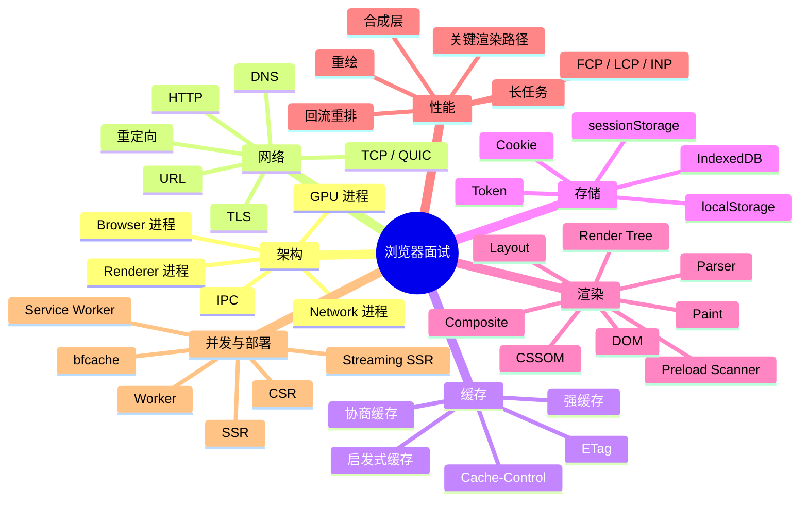

---

# 一、先建立浏览器的整体心智模型

## 1.1 一句话结论

现代浏览器通常采用**多进程 + 多线程 + 进程间通信（IPC）**的架构：不同职责被拆开，某个页面崩溃或被恶意代码攻击时，浏览器可以把影响限制在更小的范围内。

## 1.2 浏览器为什么不把所有事情放在一个进程里？

如果浏览器只有一个进程，那么以下任何一件事都可能拖垮整个浏览器：

- 一个页面的 JavaScript 进入死循环；
- 一个页面触发渲染崩溃；
- 网络请求、磁盘读写或图片解码占满资源；
- 页面加载了不可信内容，试图访问浏览器的高权限能力。

多进程的核心价值不是“让所有任务都并行”，而是三件事：

1. **故障隔离**：Renderer 进程崩溃，不一定导致所有标签页退出。
2. **安全隔离**：渲染进程运行在沙箱中，需要通过浏览器进程请求高权限能力。
3. **职责隔离**：网络、渲染、GPU、浏览器 UI 各自有相对清晰的边界。

> 注意：具体进程数量会根据浏览器版本、操作系统、标签页、站点隔离策略和资源压力动态变化。面试时讲“典型职责”，不要把某个浏览器版本的进程列表说成永远不变的标准。

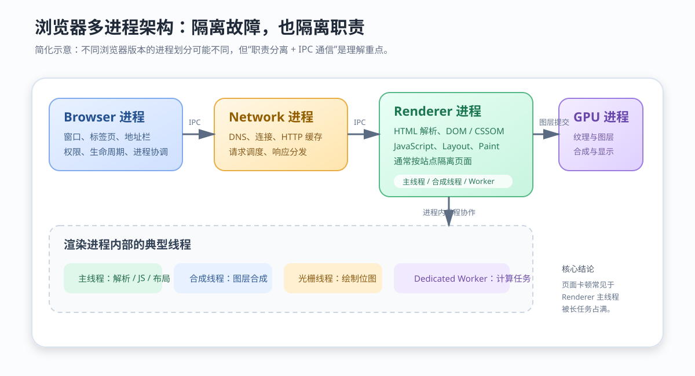

**读图重点：**

- Browser 进程负责浏览器级别的窗口、标签页和权限协调。
- Network 进程负责 DNS、连接、请求调度和 HTTP 缓存等工作。
- Renderer 进程负责页面的 HTML / CSS / JavaScript 和渲染流水线。
- GPU 进程帮助完成图形相关任务，但不能简单理解为“所有 CSS 都交给 GPU”。
- 进程之间不能直接共享普通内存，通常通过 IPC 传递消息、句柄或共享缓冲区。

## 1.3 一个 Renderer 进程里有哪些重要线程？

| 线程 | 主要职责 | 是否适合执行重计算 |
|---|---|---|
| 主线程（Main Thread） | HTML 解析、CSS 计算、JavaScript、DOM 操作、Layout、部分 Paint | 不适合长时间阻塞 |
| 合成线程（Compositor Thread） | 管理可合成图层、处理部分滚动和动画 | 不是通用计算线程 |
| 光栅线程（Raster Threads） | 将绘制指令转成位图 | 由浏览器调度 |
| Dedicated Worker 线程 | 执行 Worker 中的 JavaScript | 适合可拆分的 CPU 密集任务，但不能直接操作 DOM |
| Service Worker 线程 | 处理 Service Worker 事件，如 fetch、push、sync | 生命周期由浏览器管理 |

### 追问：Worker 能让 DOM 操作并行吗？

不能。Worker 没有普通页面 DOM 的直接访问能力。它适合把计算从主线程移走，例如大 JSON 解析、图像像素处理、复杂排序和加密计算；结果需要通过 `postMessage`、Transferable 或 `SharedArrayBuffer` 等机制传回页面。

## 1.4 进程与线程不要混为一谈

- **进程**是资源隔离和调度的基本单位，拥有独立地址空间。
- **线程**是进程内部执行代码的路径，同一进程中的线程通常共享内存。
- 进程之间通信成本通常高于线程之间通信，因为需要 IPC、序列化或共享内存协调。
- 页面卡顿经常是 Renderer 主线程被长任务占满；页面崩溃则可能是渲染进程级别的问题。

### 30 秒回答模板

> 浏览器一般采用多进程架构，常见有 Browser、Renderer、Network 和 GPU 等进程。页面代码主要运行在 Renderer 进程，Renderer 内部还有主线程、合成线程和光栅线程。进程负责隔离故障和权限，线程负责进程内部的并发协作。页面卡顿通常先看主线程长任务，页面崩溃和跨进程通信则是更高一层的问题。

---

# 二、从 URL 输入到页面展现

## 2.1 一句话结论

“输入 URL 到页面显示”不是一个单线程顺序函数，而是一组交错发生的流程：浏览器先解析输入、查找缓存和地址，再完成 DNS、连接、请求、响应，然后在接收数据的同时逐步解析、布局、绘制和执行脚本。

## 2.2 主流程图

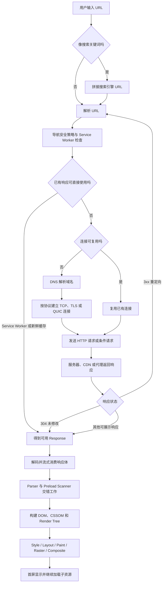

**读图重点：**

- 命中 Service Worker 或新鲜的强缓存时，网络请求可能直接被省掉；缓存过期后则可能携带验证头发起条件请求。
- Service Worker、缓存命中、连接复用和 bfcache 都可能让链路短路，不能把每次导航都当成首次访问。
- HTTPS 不是 HTTP 之后额外发送一个普通业务请求，而是在发送 HTTP 数据前建立安全通道；HTTP/3 使用集成 TLS 1.3 的 QUIC。
- 页面显示不是“所有资源下载完才开始”，HTML 解析、子资源发现和渲染通常会交错进行。
- 首屏显示、DOMContentLoaded、load 和页面完全空闲是不同时间点。


## 2.3 URL 解析：浏览器到底解析什么？

以 `https://www.example.com:8443/docs/index.html?a=1#intro` 为例：

| 部分 | 含义 |
|---|---|
| `https` | Scheme / 协议，决定访问方式和默认端口 |
| `www.example.com` | Host，其中域名通常需要 DNS 解析 |
| `8443` | Port，端口由客户端根据 URL 和默认规则确定，不需要 DNS 解析 |
| `/docs/index.html` | Path，服务器路由或文件路径使用 |
| `?a=1` | Query，通常参与资源定位和业务参数处理 |
| `#intro` | Fragment，只在客户端使用，通常不会发送给服务器 |

### 高频误区：Fragment 会不会发送到服务器？

通常不会。浏览器在发起 HTTP 请求时会去掉 Fragment；它主要用于页面内定位、客户端路由或由 JavaScript 读取。也就是说，服务器通常看不到 `#intro`。

## 2.4 DNS 解析

DNS（Domain Name System，域名系统）的任务是把域名解析成 IP 地址。实际查询可能经过多个缓存层：

1. 浏览器 DNS 缓存；
2. 操作系统缓存；
3. hosts 文件；
4. 本地 DNS 解析器；
5. 递归 DNS 服务器；
6. 根域名服务器、顶级域名服务器和权威 DNS 服务器。

浏览器实际可能拿到 IPv4 地址、IPv6 地址，或多个地址并按策略尝试连接。DNS 解析到 IP 后，端口仍然来自 URL / 默认端口规则。

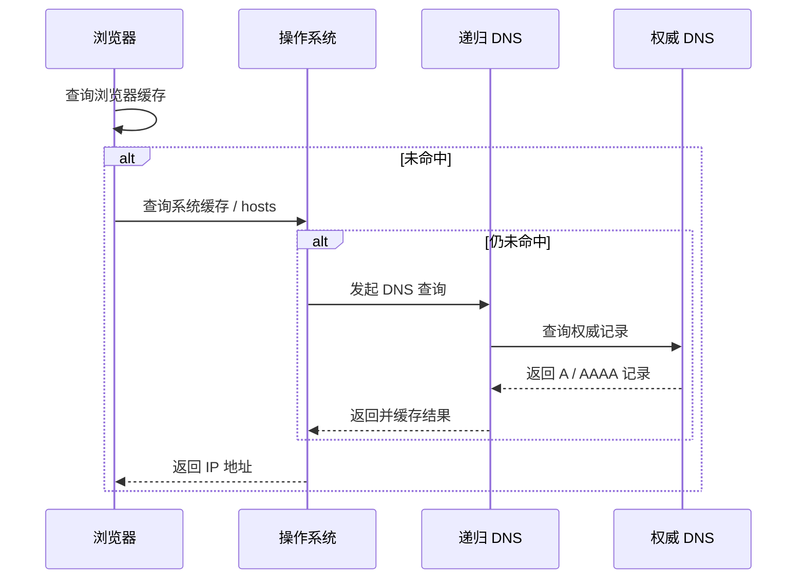

### 工程优化

- 对跨域资源使用 `<link rel="dns-prefetch" href="//cdn.example.com">` 做 DNS 预解析。
- 对真正需要尽快建立连接的来源，考虑 `<link rel="preconnect">`，但不要对大量域名滥用。
- 使用 CDN、合理设置 DNS TTL，并避免让页面依赖过多第三方域名。
- DNS 预解析只能减少解析耗时，不能替代 TLS、TCP 或 HTTP 请求。

## 2.5 TCP、TLS 与 HTTP 的关系

可以把三者理解成不同层次的任务：

- TCP：提供可靠、有序的字节流传输。
- TLS：在传输之上提供加密、身份认证和完整性保护。
- HTTP：定义请求、响应、方法、状态码和头部语义。

在传统 HTTPS over TCP 中，常见顺序是：

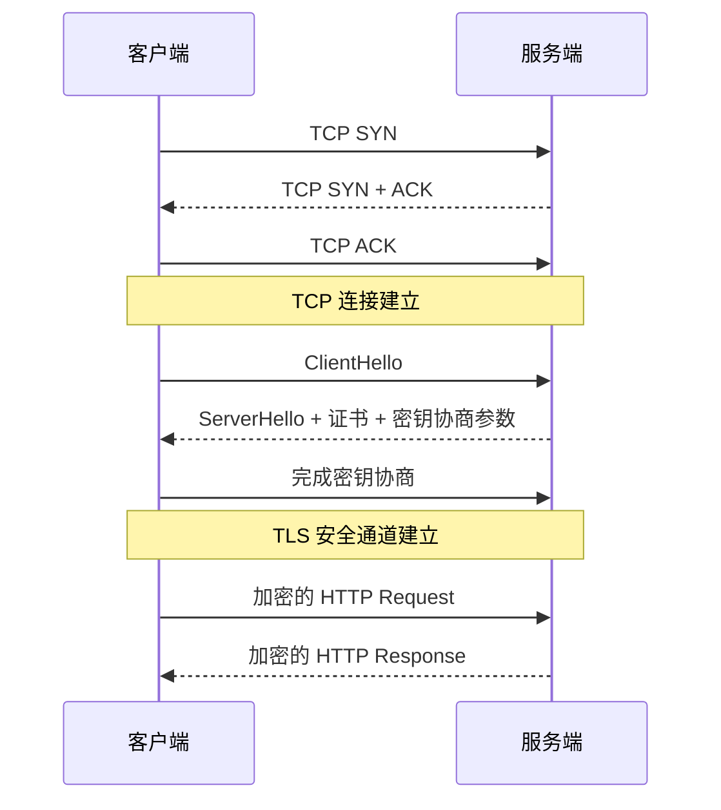

> HTTP/2 通常仍运行在 TLS + TCP 之上；HTTP/3 则基于 QUIC，而 QUIC 运行在 UDP 之上。回答协议问题时要先确认面试官讨论的是哪一代 HTTP。

### TLS 握手不只是“交换证书”

以常见的 TLS 1.3 为例，握手主要解决三个问题：**协商参数、验证身份、生成会话密钥**。

1. 客户端通过 `ClientHello` 发送支持的 TLS 版本、密码套件、随机数和密钥共享等信息；通常还会携带 SNI，告诉服务端想访问的主机名，并通过 ALPN 协商使用 `h2`、`http/1.1` 等应用层协议。
2. 服务端选择参数、返回自己的密钥共享和证书链，并用证书对应的私钥证明身份。
3. 浏览器验证证书链是否能连接到受信任根证书，还会检查主机名、有效期、用途等条件。证书“能解密 HTTPS 内容”是错误说法：现代 TLS 中证书主要用于身份认证和握手签名，业务数据通常由握手协商出的对称密钥加密。
4. 双方基于密钥交换结果派生会话密钥，校验握手完整性，之后才传输加密的 HTTP 数据。

再次访问时，TLS session resumption（会话恢复）可能减少握手成本；TLS 1.3 的 `0-RTT` 能更早发送部分数据，但存在重放风险，不能把非幂等业务无条件放进 early data。HTTP/3 的 TLS 1.3 握手集成在 QUIC 建连中，因此不能把它机械画成“UDP → TCP 握手 → TLS 握手”。

### HTTP/2 和 HTTP/3 为什么仍可能让页面慢？

- HTTP/2 可以在一个连接中多路复用多个 stream，减少 HTTP/1.1 层面的请求排队，但底层仍是一个 TCP 字节流；发生丢包时，TCP 的有序交付可能让多个 stream 一起等待。
- HTTP/3 把 stream 多路复用放到 QUIC 中，一个 stream 的丢包通常不会阻塞其他 stream 的有序交付；但它仍受拥塞控制、网络质量、服务器调度和资源优先级影响。
- 多路复用不等于“资源越多越好”。过大的 JavaScript、错误的资源优先级和主线程长任务不会因为协议升级自动消失。

## 2.6 TCP 三次握手：连接是怎样建立的？

### 先用生活中的例子理解

把 TCP 连接想成打电话：

1. 客户端先拨号：“我想和你建立通话，这是我这边的起始编号。”
2. 服务端接通：“我听到了你的请求，这是我这边的起始编号。”
3. 客户端确认：“我也听到了你的回复，可以正式通话了。”

只有走完这三步，双方才都能确认对方具备正常的收发能力，并且知道这次连接从哪个序列号开始计算。

### 三次握手的具体过程

假设客户端初始序列号为 `x`，服务端初始序列号为 `y`。序列号用于给字节编号，确认号表示“下一个我期望收到的字节编号”。

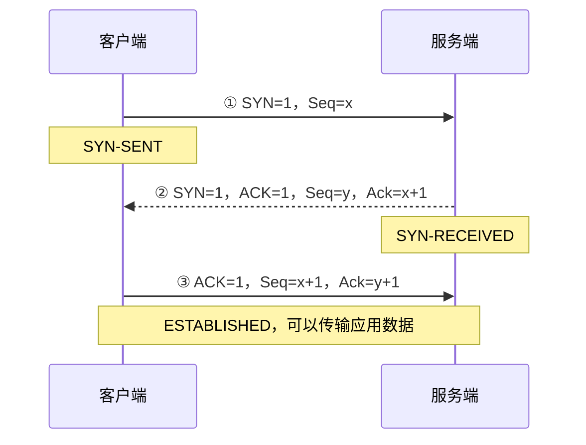

#### 第一次握手：客户端发送 SYN（**Synchronize Sequence Numbers**-（同步序列号））

Seq（**Sequence Number**（序列号））

Ack(**Acknowledgment Number**（确认号）)

客户端向服务端发送一个 TCP 报文，并设置：

- `SYN = 1`：表示希望建立连接；
- `Seq = x`：告诉服务端，客户端本次连接使用的初始序列号是 `x`。

发送后，客户端进入 `SYN-SENT` 状态，等待服务端回应。此时还没有发送正式的 HTTP 请求数据。

#### 第二次握手：服务端确认并发送自己的 SYN

服务端收到第一个报文后：

- 确认自己收到了客户端的连接请求，因此返回 `ACK = 1（把标志位这个“开关”打开，告诉客户端“我在确认你的 SYN”）`；
- 返回 `Ack = x + 1`（**确认号字段值**），意思是“把**确认号字段**这个“数值”填为 x+1，告诉客户端“你的 SYN（序号x）我收到了，下次请从 x+1 开始发”。”；
- 同时发送自己的 `SYN = 1` 和 `Seq = y`，告诉客户端服务端的初始序列号。

服务端进入 `SYN-RECEIVED` 状态。

注意：

**`ACK` 是开关（有没有确认），`Ack` 是数值（确认到哪里）**

#### 第三次握手：客户端确认服务端

客户端收到第二个报文后，确认服务端的 SYN 已到达，于是返回：

- `ACK = 1`；（再次打开确认标志位）
- `Ack = y + 1`，表示服务端的 SYN 已收到；（确认号字段填入 y+1，确认服务端的 SYN。）
- `Seq = x + 1`，表示客户端后续数据从下一个序列号开始。

服务端收到这个 ACK 后，连接进入 `ESTABLISHED` 状态，双方可以传输 HTTP、TLS 或其他应用层数据。

> SYN 本身会占用一个序列号，所以确认号通常是对方 SYN 序列号加 1；普通 ACK 则表示此前连续的字节已经收到，下一段从哪个序列号开始期待。

**y 是什么**：服务端在第二次握手中发送的初始序列号（`Seq = y`）。

**为什么是 y+1**：SYN 标志位本身会**消耗一个序列号**。服务端发了 `Seq=y` 的 SYN，相当于占用了序列号 y 这个位置。客户端收到后，表示“序列号 y 的 SYN 我已完整收到”，因此期望服务端下一个数据从 `y+1` 开始

### `Seq = x + 1`**：客户端自己的下一个序列号**

- **x 是什么**：客户端在第一次握手中发送的初始序列号（`Seq = x`）。
- **为什么是 x+1**：客户端在第一次握手时发送了 `Seq=x` 的 SYN，同样消耗了一个序列号。在第二次握手中，服务端已经通过 `Ack=x+1` 确认收到了这个 SYN。所以客户端在第三次握手时，自己的序列号自然要从 `x+1` 开始。

### 为什么需要三次，不能两次？

三次握手要解决两个问题：

1. **确认双方都能收发**：前两次让客户端知道服务端能收、能发；第三次让服务端知道客户端确实收到了自己的回复。
2. **同步初始序列号**：客户端要知道 `y`，服务端也要知道客户端已经接受了 `y`，双方才能可靠地给后续字节编号和确认。

如果只有两次握手，服务端发送第二个报文后，并不知道客户端是否真的收到。假设这是网络中延迟很久的旧 SYN，服务端可能误以为有一个新连接，提前分配资源；第三次 ACK 就是客户端对服务端 SYN 的最终确认，可以减少这种歧义。

### 握手报文丢失会怎样？

- 第一个 SYN 丢失：客户端超时重传 SYN。
- 第二个 SYN + ACK 丢失：客户端没有收到确认，会重传 SYN；服务端如果已经收到过，会重新发送 SYN + ACK。
- 第三个 ACK 丢失：服务端可能重传 SYN + ACK；客户端收到重复报文后再次发送 ACK。
- 多次重传仍未成功：连接建立失败，具体重传次数和超时时间由操作系统参数决定。

### 30 秒面试回答

> TCP 三次握手是客户端发送 SYN，携带客户端初始序列号；服务端返回 SYN + ACK，既确认收到了客户端的 SYN，又携带服务端自己的初始序列号；客户端再返回 ACK，确认收到了服务端的 SYN。三次的目的，是让双方确认收发能力并同步序列号。第三次不能省，否则服务端无法确认客户端是否收到了自己的回复，也可能被网络中的旧连接请求干扰。

## 2.7 TCP 四次挥手：连接是怎样关闭的？

### 先理解“全双工”

TCP 连接像一条可以双向通话的电话线：客户端到服务端是一条方向，服务端到客户端是另一条方向。即使客户端说“我不再发送数据了”，服务端仍可能还有响应数据没有发送完，所以关闭连接通常要分别关闭两个方向。


### **类比理解：挂电话**

把 TCP 四次挥手比作打电话告别：

- **第一次挥手**：你说“我说完了”（FIN）→ 你不再主动说话（不发应用数据），但你**还在听**。
- **第二次挥手**：对方说“好的，我知道你说完了”（ACK）→ 对方确认了你的告别。
- **第三次挥手**：对方也说“我也说完了”（FIN）→ 对方也不再说话了。
- **第四次挥手**：你说“好的，我也知道你说完了”（ACK）→ **这句话就是你说的！** 虽然你之前已经说了“我说完了”，但这句确认对方告别的话，你仍然可以说、也必须说。

如果你说完“我说完了”之后就把耳朵堵上、嘴巴封死，对方说了“我也说完了”你却没有任何回应，对方就不知道你是否听到了，只能一遍遍重复“我也说完了”。

### 四次挥手的具体过程

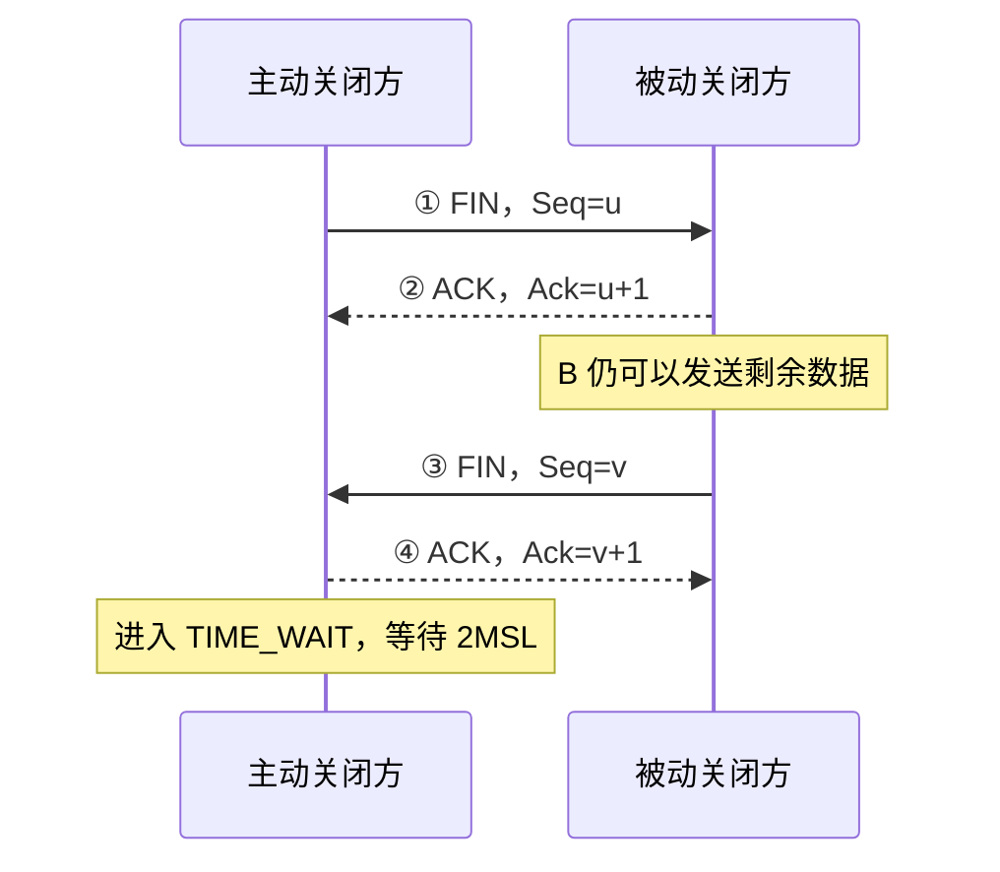

#### 第一次挥手：主动关闭方发送 FIN

假设客户端先关闭连接。客户端发送 `FIN`，表示：

> “我这边没有更多数据要发送了，但我仍然可以接收你发来的数据。”

客户端进入 `FIN-WAIT-1`。这里是“关闭客户端到服务端的发送方向”，不是立即把整条连接瞬间切断。

#### 第二次挥手：服务端确认收到 FIN

服务端收到 FIN 后，返回 ACK，确认号通常是 `u + 1`。这表示服务端已经知道客户端不会再发送新数据。

服务端进入 `CLOSE-WAIT`。这个状态很重要：服务端仍然可以把自己剩余的数据发送完。此时连接处于**半关闭**状态：客户端不能再发，服务端仍可以发。

如果服务端长期停留在 `CLOSE-WAIT`，通常说明应用程序没有及时关闭自己的连接或还有资源没有释放，这可能造成连接泄漏。

#### 第三次挥手：服务端发送 FIN

服务端把剩余数据发送完成后，也发送 `FIN`，表示：

> “我这边也没有更多数据要发送了。”

服务端进入 `LAST-ACK`，等待客户端确认。

#### 第四次挥手：客户端确认服务端 FIN

客户端收到服务端 FIN 后，返回 ACK，确认号通常是 `v + 1`。服务端收到这个 ACK 后关闭连接；客户端则进入 `TIME-WAIT`，等待一段时间后彻底关闭。


注意：

1. **第四次挥手的 ACK 算客户端发送的吗？**
   **算，绝对算。** 这是客户端发出的一个合法 TCP 控制报文。
2. **第一次挥手后，客户端不是不能再发送数据了吗？**
   准确地说，是**不能再发送“应用层数据”**（如 HTTP 请求、文件内容等），但**仍然可以且必须发送“TCP 控制报文”**（如 ACK、RST、窗口更新等）。
3. **核心原则**：`FIN` 只是告诉对方“我的应用层写完了”，但 TCP 协议本身作为一个可靠的传输层协议，**只要连接还没彻底销毁，它就有义务对收到的每一个有效报文进行确认**。如果不允许发 ACK，TCP 的可靠性就无从谈起。

### 为什么第二次和第三次通常不能合并？

服务端收到客户端 FIN 时，只能立即确认“我收到了”；但服务端是否已经把自己的数据发送完，要等应用层处理完才能决定。确认 FIN 和服务端自己的 FIN 在时间上可能分开，所以通常表现为四次报文。

如果服务端恰好没有剩余数据，也可能把确认和自己的 FIN 合并到一个报文中，看起来像三次报文完成关闭，但这不是挥手模型发生了变化，而是两个报文在特定时机合并了。

### 为什么需要 TIME_WAIT 和 2MSL？

主动关闭方收到最后一个 FIN 后不会马上消失，而是进入 `TIME_WAIT`。常见目的有两个：

1. **保证最后一个 ACK 有机会重传**：如果最后的 ACK 丢了，被动关闭方会重新发送 FIN；主动关闭方还在 `TIME_WAIT`，可以再次回复 ACK。
2. **让旧报文从网络中消失**：等待足够长的时间，避免旧连接的延迟报文影响后续使用相同四元组的新连接。

这里的“四元组”指：源 IP、源端口、目标 IP、目标端口。`2MSL` 是最大报文生存时间（MSL）的两倍，具体时长由系统实现和配置决定，不应该死记成所有系统都相同的固定秒数。

### 四次挥手过程中常见状态

| 角色 / 状态 | 说明 |
|---|---|
| `FIN-WAIT-1` | 主动关闭方已经发送 FIN，等待 ACK 或对方 FIN |
| `FIN-WAIT-2` | 主动关闭方的 FIN 已被确认，等待对方 FIN |
| `CLOSE-WAIT` | 被动关闭方已收到 FIN，但应用仍可能需要发送剩余数据 |
| `LAST-ACK` | 被动关闭方已发送 FIN，等待最后 ACK |
| `TIME-WAIT` | 主动关闭方等待 2MSL，处理可能重传的 FIN |

### 挥手报文丢失会怎样？

- 第一个 FIN 丢失：主动关闭方超时后重传 FIN。
- 第二个 ACK 丢失：主动关闭方可能继续等待，服务端通常不需要因为 ACK 丢失就重新开始。
- 第三个 FIN 丢失：服务端重传 FIN；客户端在 `FIN-WAIT-2` 或相关状态继续等待。
- 第四个 ACK 丢失：服务端重传 FIN；客户端在 `TIME-WAIT` 中再次回复 ACK。

### 30 秒面试回答

> TCP 四次挥手是因为 TCP 全双工，两个方向要分别关闭。主动关闭方先发送 FIN，对方返回 ACK；对方把剩余数据发送完后再发送 FIN，主动关闭方最后返回 ACK。被动关闭方收到 FIN 后会进入 `CLOSE-WAIT`，主动关闭方收到对方 FIN 后会进入 `TIME-WAIT`。`TIME-WAIT` 等待 2MSL，既是为了让最后 ACK 丢失时还能重传，也为了让旧连接报文在网络中消失。

### 常见误区

- `FIN` 表示某一方向不再发送数据，不等于双方立刻同时断开。
- `CLOSE-WAIT` 很多通常不是 TCP 本身故障，而是服务端应用没有及时关闭连接。
- `TIME-WAIT` 多出现在主动关闭方，不是“连接还在正常传输”，而是主动关闭方在保护连接关闭过程。
- `Connection: keep-alive` 不是让 TCP 永远不关闭，而是允许连接复用，具体仍受超时和协议版本影响。
- HTTP 请求结束不等于 TCP 连接立刻关闭；HTTP/1.1、HTTP/2 通常会尽量复用连接。

## 2.8 浏览器如何构造请求并处理 HTTP 响应？

### 导航请求是怎样构造的？

在地址栏确认一个 URL 后，浏览器发起的是 navigation request（导航请求）。地址栏直接导航通常使用 `GET`，但一次页面导航也可能来自表单提交、历史记录或脚本，因此不能把所有导航都断言成 `GET`。在真正发送前，浏览器还可能先做：

- 根据 HSTS 记录或升级策略把 HTTP 改为 HTTPS；
- 执行端口限制、恶意网址检测、企业策略等安全检查；
- 判断目标作用域是否受一个已激活的 Service Worker 控制；
- 查询 HTTP Cache，决定直接复用、重新验证还是完整请求；
- 根据 URL、SameSite、Domain、Path、Secure 等规则选择要附带的 Cookie。

请求行与请求头会表达资源和客户端能力，例如：

```http
GET /docs/index.html?a=1 HTTP/1.1
Host: www.example.com
Accept: text/html,application/xhtml+xml
Accept-Encoding: gzip, br
If-None-Match: "page-v3"
Cookie: sid=abc123
```

这是便于观察语义的 HTTP/1.1 写法；在 HTTP/2、HTTP/3 中，请求会编码成 header block 和 frame，不再按这段纯文本原样传输。还要注意 4 个边界：

1. Fragment 不进入请求目标，所以服务端看不到 `#intro`。
2. `Cookie` 是否发送由 Cookie 属性、请求上下文和浏览器隐私策略共同决定，不是“同域就一定全部携带”。
3. `Referer` 会受到 `Referrer-Policy` 控制；`Origin` 也不是每个请求都必然携带。
4. 顶层跨站导航是 Web 的基础能力，一般不按 `fetch` / XHR 的 CORS 读取规则直接禁止；但脚本跨源读取响应、iframe 嵌入和子资源加载还会分别受到 CORS、CSP、CORP / COEP 等机制约束。

### 请求到达源站之前可能经过什么？

“浏览器把请求发给服务器”通常是简化表达。真实生产链路可能是：

```text
Browser → CDN / Edge → WAF → Reverse Proxy / Load Balancer
        → Application → Cache / Database / Upstream Service
```

CDN 可能直接返回缓存内容，WAF 可能拦截请求，反向代理可能终止 TLS、压缩响应或转发到某个实例，应用还可能等待数据库和下游服务。因此 TTFB（Time to First Byte）不只是“后端代码执行时间”，它还包含连接、请求上传、代理排队、服务端计算以及首字节返回的网络耗时。排查 TTFB 时要结合 `Server-Timing`、CDN 日志、网关指标和服务端 trace，而不是只看前端瀑布图。

### 浏览器如何处理响应？

建立连接并不等于页面马上得到 HTML。浏览器首先要读取响应头，再根据响应头决定后续动作。面试时可以把响应处理拆成“状态判断、表示解码、缓存处理、响应体交付”四层。

### 先看状态码：这个响应能不能继续作为文档？

常见状态的处理并不相同：

| 状态 | 浏览器通常做什么 | 面试时的关键点 |
|---|---|---|
| `2xx` | 把响应体交给对应的资源加载器 | `200` 不代表一定是 HTML，还要看 `Content-Type` |
| `3xx` | 根据 `Location` 发起新的导航或子资源请求 | 重定向可能形成多跳，每一跳都可能重新走缓存、连接和安全检查 |
| `304` | 不接收新的正文，复用本地缓存副本 | `304` 是服务器对条件请求的响应，不是浏览器自己“生成”的 |
| `4xx` | 认为请求存在客户端侧问题，具体是否展示错误页由浏览器和站点决定 | `401`、`403`、`404` 的含义不同，不能统称为“请求失败” |
| `5xx` | 认为服务端处理失败 | 可能在代理、网关、源站等不同层产生 |

重定向不是一次请求中的“内部跳转”。例如 `http://example.com` 返回 `301` 到 HTTPS，浏览器通常要重新创建导航请求；如果目标来源不同，还要重新判断 DNS、连接复用、Cookie 和安全策略等条件。永久重定向也可能被浏览器缓存，实际行为不能只根据一次 Network 面板记录推断。

### 再看表示层：字节怎样变成文本？

响应体首先是字节序列，浏览器要根据元信息把它还原为可解析内容：

- `Content-Encoding: gzip/br/zstd` 表示传输压缩，浏览器先解压，再把解压后的内容交给 HTML、CSS 或 JavaScript 解析器；它和 `Content-Type` 不是一回事。
- `Content-Type: text/html` 告诉浏览器按 HTML 文档处理；如果 MIME 类型不正确，可能触发下载、拒绝执行或 MIME sniffing 相关策略。
- 字符编码通常由 HTTP `charset`、HTML `<meta charset>` 和默认规则共同决定。HTML 的字符编码声明应尽早出现，否则前面已经解码的内容可能需要重新解释。
- `Content-Length` 能告诉接收方正文长度；HTTP/1.1 也可以使用 `Transfer-Encoding: chunked` 进行分块传输。HTTP/2 和 HTTP/3 以 frame 为传输单位，但应用层仍可看到一个连续的响应体。

因此，“收到响应”不等于“收到完整 HTML”。浏览器可以在响应体持续到达时把字节送进解析器；只要关键结构和样式已经具备，就可能先发生第一次绘制。

### 响应体会交给谁？

现代浏览器通常会把网络访问、浏览器协调和页面渲染拆到不同进程或线程中，具体进程名称因浏览器实现而不同。可以用职责理解：网络层负责获取字节，浏览器进程负责导航和安全策略，Renderer 进程负责当前页面的解析、脚本和渲染。这里不是每个响应都会直接“传给一个固定线程”，而是由资源加载器、缓存、Service Worker 和渲染器协同完成。

如果 Service Worker 控制了当前页面，导航请求可能先经过它的 `fetch` 事件；它可以返回缓存响应、拼装响应，或者继续请求网络。这个阶段甚至可能没有传统意义上的源站请求，所以回答“输入 URL 后一定先访问服务器”是不准确的。

## 2.9 HTML 是边下载边解析的：Parser 与 Preload Scanner

### HTML 不需要完整下载后才开始解析

浏览器拿到一段 HTML 字节后，通常会执行类似下面的流水线：

```text
字节流
  → 字符解码
  → Tokenizer（词法切分）
  → HTML Parser（处理标签和插入模式）
  → DOM 节点
```

HTML Parser 不是一个简单的正则表达式扫描器。HTML 存在自动补全、嵌套修正、表格插入模式和脚本暂停等规则；例如没有显式写出的 `html`、`head`、`body` 节点，浏览器也可能在 DOM 中创建。因此面试时不要说“浏览器用正则把 HTML 转成 DOM”。

### Preload Scanner 解决什么问题？

普通 HTML Parser 遇到同步脚本时可能暂停，但网络请求不一定要等 Parser 完全恢复。浏览器通常会使用预加载扫描器（preload scanner）快速扫描尚未完成解析的 HTML，提前发现：

- `<link rel="stylesheet">`；
- 普通脚本、`defer` 脚本和模块脚本；
- ``、`<picture>`、`srcset` 中的候选图片；
- 字体、预加载资源和部分内嵌资源。

它的目标是提前发起下载，不是提前执行脚本，也不是替代真正的 HTML Parser。动态创建的资源、依赖脚本计算出的 URL、写在 CSS 中的背景图，通常要等后续处理才能发现。

### 资源发现顺序会影响性能

一个首屏大图如果只在较晚执行的 JavaScript 中创建，浏览器发现它的时间就会晚于直接写在 HTML 中的 ``。这会增加资源发现延迟（resource discovery delay），即使图片服务器本身响应很快，LCP 也可能被推迟。

`preload`、`modulepreload`、`preconnect` 的作用要区分：

| 机制 | 提前什么 | 不解决什么 |
|---|---|---|
| `preconnect` | DNS、连接和 TLS 等建连步骤 | 不会自动下载具体资源 |
| `preload` | 指定资源的下载 | 不会替代资源在文档中的真实使用，类型或跨域配置不匹配会造成浪费 |
| `modulepreload` | 模块及其依赖图的预加载 | 不会绕过模块执行和依赖解析 |
| `dns-prefetch` | DNS 查询 | 不会建立 TCP、QUIC 或 TLS 连接 |

过度使用这些提示会抢占真正关键资源的带宽和连接，因此优化前应先用 Performance、Network 和优先级信息确认关键路径。

## 2.10 DOM、CSSOM 与 Render Tree：为什么不是解析完 HTML 就显示？

HTML 和 CSS 描述的是“结构”和“规则”，而屏幕需要的是带有最终几何信息和绘制指令的像素。中间至少有以下几个概念：

1. **DOM（Document Object Model）**：HTML 解析后形成的文档节点树，反映结构和属性。
2. **CSSOM（CSS Object Model）**：CSS 解析后形成的规则结构，浏览器还需要将层叠、继承、选择器匹配等规则应用到元素上。
3. **Computed Style**：某个元素在层叠、继承和默认样式处理后的最终样式值。
4. **Render Tree**：把参与视觉呈现的节点和计算样式组织起来的渲染结构。

Render Tree 不是 DOM 的复制品：

- `display: none` 的节点通常不进入 Render Tree，也不参与布局；
- `visibility: hidden` 通常仍占据布局空间，只是不绘制可见内容；
- `opacity: 0` 仍可能参与绘制和命中测试，不能简单当成“完全不存在”；
- `::before`、`::after` 等伪元素没有普通 DOM 节点，但可能生成可绘制内容；
- Shadow DOM、iframe 和替换元素（例如图片、视频）有自己的渲染边界。

CSS 不一定阻塞 HTML Parser 建立 DOM，但首次绘制要依赖足够的样式信息；同步脚本如果读取 `getComputedStyle()` 或布局信息，还可能迫使浏览器等待 CSS 加载和样式计算。更准确的说法是：**CSS 通常阻塞依赖它的渲染和部分脚本执行，而不是简单地阻塞所有 DOM 构建。**

## 2.11 JavaScript 为什么会改变这条链路？

脚本不仅是页面资源，也是可以观察和修改 DOM、CSSOM、网络请求及事件循环的执行者。因此脚本会改变“浏览器原本可以并行推进”的流程。

### 四种脚本加载语义

| 写法 | 下载 | 执行时机 | 顺序保证 | 典型用途 |
|---|---|---|---|---|
| `<script src="a.js">` | 通常会触发下载 | 遇到标签时执行，Parser 通常暂停 | 按文档位置 | 依赖当前解析位置的传统脚本 |
| `defer` | 与 HTML 解析并行 | HTML 解析完成后、`DOMContentLoaded` 前 | 多个 `defer` 按文档顺序 | 依赖完整 DOM 的主业务脚本 |
| `async` | 与 HTML 解析并行 | 下载完成后尽快执行 | 不保证多个脚本顺序 | 相互独立的统计和广告脚本 |
| `type="module"` | 按模块依赖图加载 | 默认具有延迟执行特征 | 受依赖图和顶层 `await` 影响 | 现代模块化应用 |

“下载并行”不等于“执行并行”。普通页面 JavaScript 的执行通常仍在 Renderer 主线程上，脚本执行期间会阻塞该线程上的 DOM 操作、样式计算、布局和部分绘制工作。Web Worker 可以分担计算，但不能直接操作页面 DOM。

### `document.write()` 为什么特殊？

当 Parser 正在处理文档时，`document.write()` 可能把字符串重新插入当前解析位置，改变后续输入内容；如果文档已经完成加载，浏览器还可能清空当前文档或采取与历史行为兼容的处理。因此它会让预加载、脚本顺序和解析状态都变得难以推断，现代应用通常不应依赖它。

动态插入的 `<script>`、`import()` 和由脚本创建的图片都遵循“脚本执行后才发现”的路径。它们适合按需加载，但如果被用于首屏关键资源，可能增加发现延迟。

## 2.12 从 Render Tree 到像素：Layout、Paint、Raster、Composite

拿到 Render Tree 还没有得到屏幕像素。可以按主线程与合成线程协作理解后续阶段：

1. **Style Recalculation**：根据 DOM、CSSOM 和样式变化重新计算受影响节点的样式。
2. **Layout / Reflow**：计算盒模型、尺寸、位置、文本换行以及子树之间的几何关系。改变 `width`、`font-size`、`display` 等属性通常可能影响布局。
3. **Paint**：把背景、边框、文字、阴影等绘制操作记录成绘制指令，而不是直接把每个元素画成一张图片。
4. **Raster**：将绘制指令栅格化为位图瓦片，可能由 GPU 或栅格线程完成；具体职责依浏览器和硬件而变化。
5. **Composite**：把不同图层按顺序、透明度、变换矩阵等合成，提交给显示系统。

`transform` 和 `opacity` 在条件合适时可以只触发合成阶段，减少主线程布局和绘制压力，但“上了 GPU 就一定流畅”是错误理解：图层创建会占用显存，过多图层会增加栅格和合成成本，动画内容本身也可能触发重新绘制。最终要结合 DevTools 的 Frames、Main、Layers 和 Memory 面板判断。

这里还要区分两类“显示”：浏览器完成一次合成提交，不代表用户已经看到稳定的首屏；图片可能仍在解码，字体可能仍在交换，下一帧也可能因为长任务而延迟。

## 2.13 页面什么时候算“显示出来”？

面试中“页面加载完成”至少有 5 种含义，不能只回答一个事件：

| 时间点 | 含义 | 能说明什么 |
|---|---|---|
| `FP`（First Paint） | 首次产生任何像素 | 页面开始有视觉输出，但内容可能只是背景或非文本元素 |
| `FCP`（First Contentful Paint） | 首次绘制文本、图片、非白色 Canvas 等内容 | 用户开始看到有意义内容的时间 |
| `LCP`（Largest Contentful Paint） | 视口内最大文本或图片内容完成绘制 | 常用于衡量首屏主要内容出现速度 |
| `DOMContentLoaded` | HTML 文档解析完成，且延迟脚本执行完成 | DOM 可用，但图片、字体等资源未必完成 |
| `load` | 文档及其依赖资源满足加载条件 | 资源加载阶段的事件，不等于可交互或不卡顿 |

还要注意：

- `LCP` 可能被后续更大的元素刷新，不能把 HTML 收到的时间当成 LCP；
- `DOMContentLoaded` 可能被 `defer`、模块依赖和顶层 `await` 推迟；
- `load` 受到图片、iframe 等资源影响，但不保证后续异步请求已完成；
- “首屏已显示”和“可以顺畅操作”是不同指标。长 JavaScript 任务可能让 FCP 很早发生，却让点击响应很晚。

现代性能分析还会关注 **INP（Interaction to Next Paint）**，它衡量交互从输入到下一次视觉更新的延迟；Long Task 则帮助定位主线程被单个任务占用超过 50 ms 的情况。不要把历史上的 TTI（Time to Interactive）当成唯一结论，应结合页面类型、用户交互和实际 RUM 数据解释。

## 2.14 事件循环如何参与首帧和后续绘制？

页面展现不是渲染流水线执行一次就结束，而是事件循环不断处理任务并寻找绘制机会：

```text
Task（脚本、事件、定时器）
  → 清空 Microtask（Promise、queueMicrotask）
  → 浏览器到达渲染机会
  → requestAnimationFrame 回调
  → Style / Layout / Paint / Composite
```

这是便于面试表达的抽象顺序，真实浏览器还会受帧率、页面是否可见、调度优先级和渲染器实现影响。几个容易被追问的点：

- `Promise.then()` 是微任务。微任务会在当前任务结束后持续清空；如果递归添加微任务，可能迟迟不给浏览器绘制机会。
- `setTimeout(fn, 0)` 只是把函数放入后续任务队列，存在最小延迟和调度竞争，不代表立即执行。
- `requestAnimationFrame` 适合在下一次绘制前读取或更新动画状态，但回调中执行重计算仍然会掉帧。
- `await` 让出的是 JavaScript 执行机会，后续 continuation 通常以微任务形式继续，并不会自动把工作移到 Worker。

因此，页面即使已经完成 FCP，后续同步脚本、微任务洪泛或强制同步布局仍可能阻塞下一帧和用户交互。性能排查要同时看 Network 的加载、Main 的任务、Frames 的帧耗时和 Experience 的 Web Vitals。

## 2.15 首次访问、刷新、强制刷新与前进后退有什么不同？

“重新打开同一个 URL”不必然重复完整链路。影响因素包括 HTTP Cache、memory cache、磁盘缓存、Service Worker、连接池和 bfcache（back-forward cache，前进后退缓存）。

| 场景 | 可能复用的内容 | 不能绝对保证的事情 |
|---|---|---|
| 首次访问 | 进程级连接、DNS 或共享缓存中已有的结果 | 不一定真的“全新”，系统可能已有 DNS 或连接缓存 |
| 普通刷新 | 部分连接、缓存副本、协商缓存 | 是否重新验证取决于刷新策略、缓存头和浏览器实现 |
| 强制刷新 | 通常会绕过或重新验证更多缓存 | 仍可能受 Service Worker、代理和浏览器策略影响 |
| 前进后退 | 可能从 bfcache 恢复 DOM、JS 堆和滚动位置 | 页面被哪些条件排除出 bfcache，要看生命周期和浏览器策略 |

命中 memory cache 或 disk cache 时，Network 面板可能显示不同的 `from memory cache`（**内存缓存**）、`from disk cache` 或 `304`。它们的含义不同：前两者可能无需网络验证，`304` 则已经向服务器发起了条件请求。Service Worker 命中时，还要查看 `from ServiceWorker` 以及其 `fetch` 逻辑。

前进后退恢复 bfcache 时，页面可能连 DOM 和 JavaScript 内存都一起恢复，不是重新执行完整的导航流程；此时应用需要正确处理 `pageshow`、`pagehide`，并检查恢复后的数据是否仍然新鲜。

## 2.16 SSR、CSR 与 Streaming SSR 在链路中的位置

渲染模式改变的是“可展示 HTML 从哪里来、何时到达”，不会取消浏览器的解析和渲染阶段。

### CSR（Client-Side Rendering）

服务器先返回一个较小的 HTML 壳，浏览器下载 JavaScript，再由客户端请求数据、创建 DOM。优点是交互模型直接、页面切换灵活；风险是关键内容可能要等脚本下载、执行和数据请求后才能出现，LCP 和 JavaScript 主线程成本容易受到影响。

### SSR（Server-Side Rendering）

服务端先生成带内容的 HTML，浏览器可更早解析并绘制文本。之后仍要下载 JavaScript 并进行 **Hydration（水合）**，把静态 HTML 与事件处理、组件状态连接起来。SSR 改善了内容到达时间，不代表“无需 JavaScript”，也不保证首次点击立刻可用。

### Streaming SSR

服务端分段发送 HTML，浏览器可以在完整响应到达前开始解析和绘制；React 等框架还可以配合 Suspense 逐步输出内容。它同时引入了更复杂的顺序、占位符、错误边界和 Hydration 调度问题：服务器发送得早，不等于客户端一定能立刻完成交互。

面试时应把指标拆开说：SSR 可能改善 TTFB 后的内容可见时间和 FCP，但服务端生成时间会影响 TTFB，Hydration 和大包体又可能影响 INP；最终要看真实内容、网络质量和设备性能，而不是简单断言 SSR 一定比 CSR 快。

## 2.17 面试完整回答模板

### 30 秒版本

> 用户输入 URL 后，浏览器先判断是 URL 还是搜索词，再解析协议、域名、端口、路径和参数。随后会先检查 Service Worker、HTTP 缓存和已有连接；没有可复用结果时才进行 DNS、TCP 或 QUIC 建连，HTTPS 还要完成 TLS，然后发送 HTTP 请求。响应返回后，浏览器会边接收边解析 HTML，预加载扫描器并行发现 CSS、脚本、图片和字体，逐步构建 DOM 和 CSSOM。两者经过样式计算形成 Render Tree，再经过 Layout、Paint、Raster 和 Composite，产生首帧；与此同时 JavaScript、事件循环和后续资源加载仍可能继续影响页面交互和绘制。

### 2 分钟版本

回答时可以补充 3 个边界：

1. **网络边界**：DNS、TCP、TLS、HTTP 属于不同层；HTTP/3 使用 QUIC over UDP，不应机械地说所有 HTTPS 都先 TCP 三次握手。
2. **解析边界**：响应不必完整下载后才解析，HTML Parser、preload scanner 和资源加载器会交错工作；同步脚本可能暂停 Parser，`defer`、`async` 和模块脚本的执行时机不同。
3. **渲染边界**：DOM 不等于最终画面，CSSOM、样式计算、Render Tree、布局、绘制、栅格化和合成共同决定像素；`DOMContentLoaded`、`load`、FCP、LCP 和可交互时间也不是同一时刻。

### 5 分钟深挖版本的组织方式

当面试官继续追问时，建议沿着“现象 → 阶段 → 瓶颈 → 优化”展开：

1. 页面白屏：先区分 TTFB、HTML 下载、CSS 阻塞、脚本执行、首屏资源发现和主线程长任务。
2. LCP 慢：看最大内容是谁、它何时被发现、是否被 CSS 或字体阻塞、图片是否解码过晚、是否有服务端和 CDN 问题。
3. 交互卡顿：看 Long Task、脚本拆分、微任务、强制同步布局和组件更新范围，不要只看网络是否加载完成。
4. 刷新变快：区分 memory/disk cache、协商缓存、Service Worker、连接复用和 bfcache，确认到底省掉了哪一步。
5. 首屏方案：根据内容类型选择 CSR、SSR 或 Streaming SSR，并同时评估 TTFB、FCP、LCP、Hydration 和 INP。

## 2.18 常见错误答案纠正表

| 错误说法 | 更准确的说法 |
|---|---|
| 输入 URL 后一定先 DNS | 可能命中 Service Worker、缓存、hosts、DNS 缓存或已有连接；只有需要解析且没有可用结果时才进行网络 DNS 查询 |
| HTTP 请求一定要等 HTML 下载完 | 响应通常是流式到达的，浏览器可以边接收边解析和发现子资源 |
| CSS 会阻塞 DOM 构建 | CSS 主要影响样式计算、渲染和可能依赖样式的脚本执行，不应简单说成阻塞所有 DOM Parser |
| JavaScript 在独立线程执行 | 普通页面脚本主要运行在 Renderer 主线程；Worker 可分担计算，但不能直接操作 DOM |
| DOM 树就是页面最终显示 | 还要经过 CSSOM、样式计算、Render Tree、Layout、Paint、Raster 和 Composite |
| `load` 代表页面可以交互 | `load` 只表示一组资源加载条件满足；脚本长任务仍可能让页面无法及时响应 |
| GPU 负责所有渲染 | 样式、布局和大量绘制仍可能由主线程完成，GPU 主要参与部分栅格和合成 |
| HTTPS 必然基于 TCP | HTTP/1.1、HTTP/2 通常基于 TCP；HTTP/3 基于 QUIC，而 QUIC 运行在 UDP 之上 |
| TCP 三次握手属于 HTTP | 三次握手属于 TCP 传输层；HTTP 只是使用已经建立的传输通道传递应用数据 |
| 页面显示必须等所有资源完成 | 浏览器可以先完成 FCP 或 LCP，非关键图片、字体、脚本和异步数据还可能继续加载 |
| 304 表示浏览器没有发请求 | 浏览器发出了条件请求，服务器判断资源未变化后返回 `304`，浏览器复用本地正文 |
| SSR 返回 HTML 后就不需要 JavaScript | SSR 通常仍需要 Hydration 来恢复事件和状态；服务器渲染和客户端交互是两个阶段 |

> **答题收束句**：这道题真正考察的不是能否背出一串名词，而是能否说明每个阶段解决什么问题、下一阶段依赖什么输入，以及某个性能现象应该归因到网络、解析、脚本、渲染还是缓存。回答时把链路和边界讲清楚，比机械罗列步骤更有说服力。

---

# 三、HTTP 缓存：强缓存、协商缓存与版本策略

## 3.1 一句话结论

HTTP 缓存解决的是“资源能不能复用”。**强缓存命中时通常不需要向服务器发请求；协商缓存需要发请求验证资源是否变化，未变化时服务器返回 `304 Not Modified`，浏览器继续使用本地副本。**

## 3.2 先区分四个容易混淆的概念

| 概念 | 重点 | 典型内容 |
|---|---|---|
| 前端缓存 | 总称 | HTTP Cache、Web Storage、IndexedDB、内存数据等 |
| HTTP 缓存 | 协议定义的响应复用 | `Cache-Control`、`ETag`、`304` |
| 浏览器缓存 | 浏览器对资源和响应的本地管理 | 磁盘缓存、内存缓存、HTTP Cache |
| Web Storage | 页面脚本主动读写的键值存储 | `localStorage`、`sessionStorage` |

不要回答“localStorage 就是浏览器缓存”。它们都能减少网络请求，但生命周期、访问方式、协议语义和安全边界完全不同。

## 3.3 缓存决策流程

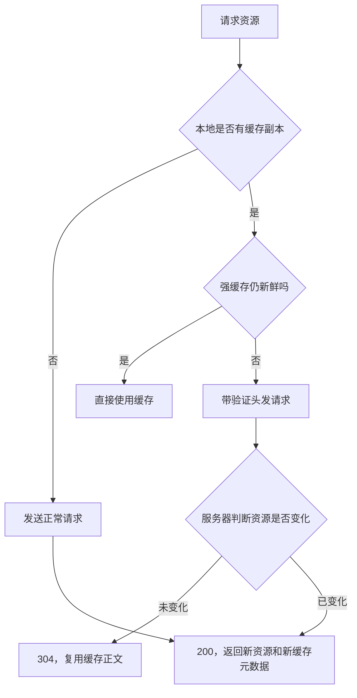

## 3.4 强缓存：不询问服务器，直接用

常见响应头：

```http
HTTP/1.1 200 OK
Cache-Control: public, max-age=31536000, immutable
Content-Type: text/javascript
ETag: "bundle-a1b2c3"
```

- `max-age=31536000` 表示在相对响应生成时间的一段时间内可视为新鲜。
- `public` 表示共享缓存也可以存储，是否允许还要结合响应内容和认证语义判断。
- `private` 常用于只能被用户代理缓存的个性化响应。
- `no-store` 表示不要存储响应，适合非常敏感的数据，但不要和 `no-cache` 混淆。
- `no-cache` 不是“不缓存”，而是使用前需要重新验证。
- `immutable` 常用于内容哈希文件，表示在新鲜期内不需要因为用户刷新而重复验证；是否完全按预期生效仍取决于浏览器和场景。

`Expires` 是较早的绝对过期时间机制。当 `Cache-Control` 与 `Expires` 同时出现且语义冲突时，现代实现通常优先参考 `Cache-Control`。

## 3.5 协商缓存：带着旧版本去问服务器

协商缓存主要有两组字段：

| 响应头 | 后续请求头 | 判断依据 |
|---|---|---|
| `ETag` | `If-None-Match` | 资源实体标签是否一致 |
| `Last-Modified` | `If-Modified-Since` | 最后修改时间是否变化 |

未变化时：

```http
GET /assets/app.js HTTP/1.1
Host: example.com
If-None-Match: "app-20260906-01"
If-Modified-Since: Sat, 06 Sep 2026 02:00:00 GMT
```

服务器可以返回：

```http
HTTP/1.1 304 Not Modified
Cache-Control: public, max-age=0, must-revalidate
ETag: "app-20260906-01"
```

`304` 通常不携带完整响应正文，浏览器会把本地缓存正文和新的响应头组合起来使用。

### 为什么通常说 ETag 优先级高于 Last-Modified？

- 修改时间只能精确到一定粒度，短时间内多次修改可能无法区分。
- 文件内容可能变化后又恢复，时间和内容的关系不一定可靠。
- ETag 可以由内容哈希、版本号或服务器内部版本标识生成，判断粒度更灵活。

但这不是“ETag 永远必须存在”的协议硬规则。服务端可以只提供其中一种，也可能因为分布式部署、压缩差异或生成策略而需要谨慎设计 ETag。

## 3.6 启发式缓存

当响应没有明确的新鲜度策略时，缓存实现可能根据 `Date`、`Last-Modified` 等信息推断一个缓存时间。这种行为具有实现差异，不能作为业务缓存策略的唯一依据。

工程上应该主动设置：

- 对静态资源：明确 `Cache-Control`；
- 对 HTML 入口：根据发布策略使用短缓存或重新验证；
- 对用户私密数据：避免被共享缓存存储；
- 对接口响应：结合数据时效、用户身份和一致性要求设计。

## 3.7 前端发布为什么使用文件名 Hash？

典型构建结果：

```text
index.html
assets/app.8f3a1c.js
assets/vendor.91b2d0.js
assets/style.4a8c21.css
```

推荐策略：

- 带 Hash 的 JS、CSS、字体和图片：内容变化就改变 URL，可以使用较长的强缓存。
- `index.html`：通常使用短缓存、`no-cache` 或协商缓存，让浏览器尽快发现最新资源清单。
- 发布新版本时保证 HTML 与资源文件的兼容窗口，避免 HTML 已更新但 CDN 资源尚未同步。

### Logo 更新但用户仍拿旧图怎么办？

最可靠的方法是修改资源 URL，例如：

```html

```

或者使用查询参数版本号：`/logo.svg?v=20260906`。本质是缓存键发生变化，而不是试图让已经存储的强缓存“远程失效”。如果必须立即失效，还需要通过 CDN / 代理的缓存清理能力配合。

## 3.8 刷新、重新加载和强制刷新有什么区别？

面试时不要把浏览器 UI 行为说成跨浏览器完全一致的协议规则。可以这样回答：

| 操作 | 常见行为 | 注意 |
|---|---|---|
| 地址栏回车 | 重新导航，可能复用缓存 | 具体缓存校验受响应头和浏览器策略影响 |
| 普通刷新 / F5 | 重新发起导航，可能更积极地验证资源 | 不是简单等于“全部强制请求” |
| Ctrl / Cmd + Shift + R 等强制刷新 | 通常更倾向绕过已有缓存重新请求 | 开发者工具“Disable cache”还会影响调试会话 |
| DevTools Disable cache | 在 DevTools 打开期间影响资源缓存 | 不是线上用户行为 |

## 3.9 缓存排查方法

1. 打开 Network 面板，看 `Size` 是否显示 `(memory cache)`、`(disk cache)` 或实际传输量。
2. 查看响应头和请求头：`Cache-Control`、`Age`、`ETag`、`If-None-Match`、`Last-Modified`。
3. 记录是否发生了重定向、Service Worker 拦截或 CDN 命中。
4. 确认 HTML、JS、CSS 的 URL 是否带版本号，是否存在旧 HTML 引用新旧资源不一致的问题。
5. 在无痕窗口、禁用缓存和真实线上环境分别验证，不要只凭本地开发服务器判断。

### 30 秒回答模板

> HTTP 缓存分为强缓存和协商缓存。强缓存根据 `Cache-Control` 或 `Expires` 判断资源是否新鲜，命中时通常不发送请求；强缓存过期后，浏览器携带 `If-None-Match` 或 `If-Modified-Since` 询问服务器，资源没变就返回 `304`，变化则返回 `200` 和新资源。工程上通常给带内容 Hash 的静态资源长缓存，给 `index.html` 使用短缓存或协商缓存，从而兼顾性能和发布更新。

---

# 四、浏览器端存储：数据放在哪里，谁能读到？

## 4.1 一句话结论

选择存储方案时要先回答四个问题：**数据多大、需要多久、是否自动随请求发送、是否需要跨标签页或离线访问**。Cookie、Web Storage、IndexedDB 和 Token 不是同一种东西，也不能互相替代。

## 4.2 存储方式对比

| 方案 | 容量特征 | 是否自动随请求发送 | 生命周期 | 适合场景 | 主要风险 |
|---|---|---|---|---|---|
| Cookie | 较小，通常不适合大数据 | 是，匹配域名和路径时自动发送 | 可会话级或带过期时间 | 会话标识、登录态、少量偏好 | XSS 窃取、CSRF、请求膨胀 |
| localStorage | 适合小型键值数据 | 否 | 持久保存，直到清除 | 非敏感偏好、简单缓存 | XSS 可直接读取、同步 API |
| sessionStorage | 适合小型键值数据 | 否 | 页面会话生命周期 | 当前标签页临时状态 | 刷新 / 复制标签页行为需确认 |
| IndexedDB | 适合结构化和较大数据 | 否 | 持久保存，可事务化 | 离线数据、复杂缓存、草稿 | API 复杂、版本迁移成本 |
| Cache Storage | 缓存 Request / Response | 否，通常由 SW 或脚本控制 | 由应用管理 | 离线资源、请求响应缓存 | 缓存失效和更新策略复杂 |

容量不是跨浏览器、跨设备的固定合同；浏览器还会受到磁盘空间、隐私模式、配额策略和用户清理行为影响。

## 4.3 Cookie 重点字段

```http
Set-Cookie: sid=abc123; Max-Age=3600; Path=/; Secure; HttpOnly; SameSite=Lax
它的意思是：这个 Cookie 只能通过 HTTP(S) 协议发送给服务器，JavaScript 代码无法通过 document.cookie 读取到它。
```

| 字段 | 作用 |
|---|---|
| `Domain` | 控制可匹配的域名范围；不设置时通常是当前主机范围 |
| `Path` | 控制哪些路径的请求携带 Cookie |
| `Expires` / `Max-Age` | 控制过期时间；`Max-Age` 以秒表示相对时间 |
| `Secure` | 只通过 HTTPS 发送 |
| `HttpOnly` | 禁止页面脚本通过 `document.cookie` 读取，不能阻止 Cookie 被自动发送 |
| `SameSite` | 控制跨站请求中 Cookie 的发送行为，涉及 CSRF 防护 |
| `Partitioned` | 在支持的浏览器中用于分区 Cookie 等更细粒度的跨站场景，落地前要验证兼容性 |

### HttpOnly 能防住 XSS （**跨站脚本攻击**）吗？

不能完全防住。`HttpOnly` 可以降低攻击脚本直接读取会话 Cookie 的风险，但 XSS 仍可能：

- 以当前用户身份发起请求；
- 读取页面中的敏感数据；
- 修改页面内容、劫持输入或发起转账动作。

所以还需要输出编码、CSP、输入校验、最小权限和安全审计等多层防护。

## 4.4 localStorage 与 sessionStorage

两者都是同步键值 API：

```js
localStorage.setItem('theme', 'dark');
const theme = localStorage.getItem('theme');

sessionStorage.setItem('draft', JSON.stringify({ title: '面试笔记' }));
```

关键边界：

- `localStorage` 通常按 origin（协议、域名、端口）隔离，跨域页面不能直接读取。
- `sessionStorage` 除了按 origin 隔离，还与页面会话 / 浏览上下文有关，不能简单说成“所有标签页共享”或“永远不共享”。
- 两者都只能存字符串，需要自行序列化和处理版本迁移。
- API 是同步的，大量读写或存储巨大 JSON 可能阻塞主线程。
- 不要把长期有效的高价值密钥直接放入可被 XSS 读取的 Web Storage。

## 4.5 IndexedDB 适合什么？

IndexedDB 是浏览器提供的异步、事务化、面向对象的本地数据库能力，适合：

- 离线应用数据；
- 大量结构化对象；
- 本地草稿、搜索索引、缓存数据；
- 需要按 key / index 查询而不是简单字符串键值的数据。

使用 IndexedDB 时要考虑：

1. 数据库版本升级和 `onupgradeneeded`；
2. 事务范围与读写冲突；
3. 清理策略和配额异常；
4. 数据模型向后兼容；
5. 隐私模式或浏览器策略导致的不可用场景。

## 4.6 Session、Cookie、Token 的关系

- **Session** 是服务端保存的会话状态模型。
- **Cookie** 是浏览器自动管理并可能随请求发送的一种载体。
- **Token** 是一种凭证格式或认证信息，可以放在 Cookie、`Authorization` 请求头或其他载体中。

因此，“Cookie 和 Token 二选一”并不准确。常见组合包括：

- 服务端 Session ID 放在 `HttpOnly; Secure; SameSite` Cookie 中；
- 无状态 access token 放在请求头中，refresh token 采用更严格的 Cookie 策略；
- BFF（Backend For Frontend）让浏览器只持有会话 Cookie，由服务端代替前端访问后端服务。

真正需要比较的是：存储位置、自动发送行为、CSRF / XSS 风险、失效和轮换机制、跨域需求，以及服务端是否需要维护会话状态。


这是一个非常经典且容易混淆的概念。要理清它们的关系，我们可以从**“数据载体”**和**“验证机制”**两个维度来看。

简单来说：

- **Cookie 和 Session 是传统 Web 开发（尤其是 PHP/Java 时代）的配套方案。**
- **Token (JWT) 是现代前后端分离、移动端、微服务架构的主流方案。**

下面通过对比和图解来详细说明：

### **1. 核心概念定义**

表格

| 概念        | 本质                     | 存储位置                             | 主要作用                                                     |
| :---------- | :----------------------- | :----------------------------------- | :----------------------------------------------------------- |
| **Cookie**  | **一种传输协议/机制**    | 客户端浏览器                         | 服务器用来在客户端保存少量数据（如 ID、偏好设置），每次请求自动携带。 |
| **Session** | **服务端状态管理对象**   | 服务器内存/数据库/Redis              | 服务器用来记录用户登录后的状态（如用户名、权限）。它是“有状态”的。 |
| **Token**   | **一段加密的数据字符串** | 客户端（通常存 LocalStorage/Cookie） | 服务器颁发给客户端的一个“通行证”，包含用户信息和签名。服务器只需验证签名即可，无需查库。它是“无状态”的。 |

------

### **2. 它们是如何协作的？（三种模式对比）**

#### **模式一：传统的 Session + Cookie 模式**

这是最经典的 Web 交互方式。

1. **登录**：用户输入账号密码 -> 服务器验证成功 -> **服务器创建 Session 对象**（存入 Redis/DB），生成一个唯一的 `SessionID`。
2. **返回**：服务器将 `SessionID` 放入 **Cookie** 中返回给浏览器 (`Set-Cookie: sessionId=abc123`)。
3. **后续请求**：浏览器每次访问网站，都会自动在 Header 里带上这个 Cookie (`Cookie: sessionId=abc123`)。
4. **验证**：服务器收到请求 -> 提取 `SessionID` ->去 Redis/DB 查找对应的 Session 对象 -> 如果存在且未过期，则允许访问。

> **特点**：服务器压力大（需要查库或查 Redis），但安全性高，可以随时强制用户下线（销毁 Session）。

#### **模式二：现代 Token (JWT) 模式**

这是目前前后端分离、App 开发的主流方式。

1. **登录**：用户输入账号密码 -> 服务器验证成功。
2. **生成**：服务器使用私钥对用户信息（UserID, Role, ExpireTime等）进行签名，生成一串长长的字符串，即 **Token (JWT)**。
3. **返回**：服务器将 Token 返回给前端。前端通常将其存储在 **LocalStorage** 或 **HttpOnly Cookie** 中。
4. **后续请求**：前端在 HTTP Header 中手动添加 Authorization 字段 (`Authorization: Bearer <Token>`)。
5. **验证**：服务器收到请求 -> 提取 Token -> 使用公钥/私钥验证签名是否合法、是否过期 -> **直接解析出用户信息**。无需查询数据库。

> **特点**：服务器无状态（Scale-out 容易），性能高，支持跨域、移动端。缺点是 Token 一旦发出，无法在不改变密钥的情况下立即失效（除非引入黑名单机制）。

#### **模式三：混合模式 (Cookie 存 Token)**----公司应该就是这种

为了兼顾安全性和便利性，很多现代系统采用这种折中方案：

- **Token 内容**：依然由服务器签发，包含用户信息。
- **存储位置**：Token 不放在 LocalStorage（防 XSS 窃取），而是放在 **HttpOnly Cookie** 中。
- **流程**：登录成功后，服务器将 Token 写入 HttpOnly Cookie。后续请求浏览器自动携带 Cookie，后端解析 Cookie 中的 Token 进行验证。

### 高频面试追问：Token 放 localStorage 安全吗？

不能只回答“安全”或“不安全”。localStorage 里的 Token 不会自动随请求发送，使用方便，但同源 XSS 可以直接读取它。若放在 HttpOnly Cookie，脚本不能直接读取，但需要认真处理 CSRF、SameSite、跨站请求和会话失效。安全方案取决于威胁模型和整体防护，而不是一个存储位置决定全部安全性。


---

# 五、渲染流水线：从字节到像素

## 5.1 一句话结论

浏览器渲染的核心是把资源转换成最终像素：HTML 形成 DOM，CSS 形成 CSSOM，二者生成 Render Tree，再经过 Layout、Paint、Raster（光栅化） 和 Composite（合成）。性能优化的关键是减少不必要的工作、降低主线程阻塞，并让适合的变化停留在更便宜的阶段。


简单来说：

- **Layout (布局)** 计算的是“位置”和“大小”（几何信息）。

- **Paint (绘制)** 决定的是“颜色”和“样式”（视觉内容）。

- **Raster (光栅化)** 把上面的信息变成真正的**像素位图**。

- **Composite (合成)** 把这些像素块按层级顺序**拼贴**在一起，最终呈现给用户。

  

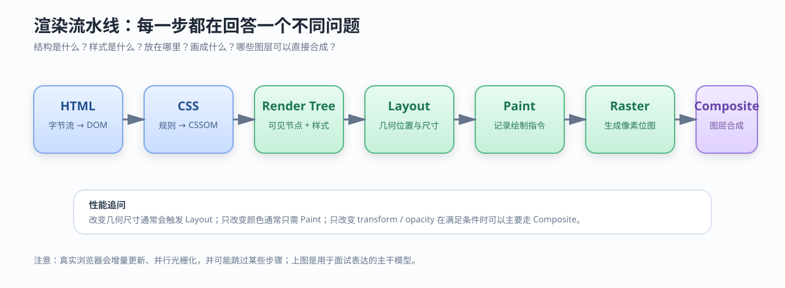

**读图重点：**

- DOM 描述结构，不等于最终绘制内容。
- CSSOM 描述样式规则，样式计算后才知道节点最终长什么样。
- `display: none` 的节点通常不进入 Render Tree；不可见不一定等于不占空间，`visibility: hidden` 仍可能参与布局。
- Layout 计算几何信息，Paint 记录如何画，Composite 决定图层如何合成。

## 5.2 DOM、CSSOM、Render Tree

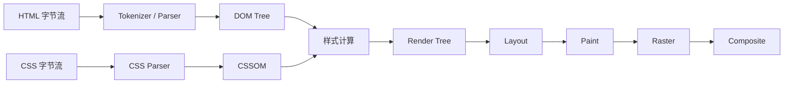

Render Tree 不是 DOM 的简单复制：

- 它只关注参与视觉呈现的节点；
- 节点会带上计算后的样式；
- 伪元素可能参与渲染，但不一定对应普通 DOM 节点；
- iframe、插件、阴影树等边界会让真实实现更复杂。

## 5.3 JavaScript、CSS 为什么会阻塞？

### 同步脚本

```html
<script src="app.js"></script>
```

传统同步脚本出现时，HTML 解析器通常需要暂停，执行脚本后再继续。原因是脚本可能读取或修改当前 DOM，例如 `document.write()`、查询节点或改变结构。

### `defer`

```html
<script defer src="app.js"></script>
```

脚本通常可以并行下载，HTML 继续解析，待文档解析完成后按顺序执行。适合依赖完整 DOM、又不要求尽早执行的脚本。

### `async`

```html
<script async src="analytics.js"></script>
```

脚本下载完成后尽快执行，可能打断 HTML 解析，多个 `async` 脚本之间不保证执行顺序。适合相互独立的统计、广告或不依赖 DOM 顺序的脚本。

### `type="module"`

模块脚本默认具有延迟执行的特征，并支持模块依赖图；实际执行时还需要考虑模块依赖、顶层 `await` 和预加载策略。

## 5.4 CSS 会不会阻塞 DOM 构建？

关于 CSS 是否阻塞 DOM，我的理解是：**它不阻塞 DOM 树的构建，但阻塞渲染流水线和脚本执行。** 具体分为以下三层：

1. **对 DOM 构建的影响**：
   HTML Parser 遇到 `<link>` 时会异步加载 CSS，**不会停止解析后续的 HTML**，所以 DOM 树会继续构建。
2. **对渲染的影响（阻塞 Paint）**：
   浏览器需要同时拥有 DOM 和 CSSOM 才能生成 Render Tree。为了保证用户看到完整的页面而非闪烁的 FOUC，浏览器通常会**阻塞首次绘制**，直到关键 CSS 加载完毕。
3. **对脚本执行的影响（阻塞 Script）**：
   这是最隐蔽的性能瓶颈。因为 JavaScript 可能会通过 API（如 `offsetHeight`）读取样式信息，浏览器无法静态判断 JS 是否需要样式，出于保守考虑，**同步执行的 JS 会被阻塞**，直到 CSSOM 构建完成。

**总结来说**，CSS 主要阻塞的是‘渲染’和‘脚本执行’，而非‘DOM 解析’。

**优化策略上**，我们通常会采用**内联关键 CSS**、**使用 `defer/async` 处理 JS**、或者将非关键 CSS 设为 `media="print"` 来异步加载，以打破这种阻塞链。


### **面试官可能追问的问题（准备好这些）**

1. **“为什么浏览器不智能一点，只阻塞那些真正用到样式的 JS？”**
   - *答*：因为 JS 代码可能是动态生成的，或者是复杂的逻辑，浏览器引擎很难在运行时进行完美的静态分析。保守策略（阻塞）比激进策略（可能导致数据错误）更安全。
2. **“CSS 阻塞 JS 和 JS 阻塞 HTML 解析，哪个影响更大？”**
   - *答*：JS 阻塞 HTML 解析是直接停止 DOM 构建，导致整个页面结构延迟；CSS 阻塞 JS 是间接的。通常 JS 阻塞 HTML 解析的危害更直接可见（白屏时间更长），但 CSS 阻塞 JS 会导致交互逻辑延迟。
3. **“如何测试 CSS 是否阻塞了页面？”**
   - *答*：可以使用 Chrome DevTools 的 Performance 面板，观察 Main Thread 上的任务分布。如果看到大量的 `Scripting` 任务被 `CSS Parsing` 打断，或者 `Layout` 任务在 CSS 加载后才开始，就说明存在阻塞。

## 5.5 关键渲染路径优化

目标是尽快完成首屏所需的最小工作：

1. 减少首屏 HTML 和 CSS 的体积；
2. 提取关键 CSS，延迟非关键 CSS；
3. 使用 `defer`、模块依赖、代码分割和按需加载减少同步脚本；
4. 为图片设置尺寸，避免下载完成后改变布局；
5. 使用响应式图片、现代图片格式和懒加载，但不要懒加载首屏关键图片；
6. 优化字体加载，避免字体交换造成明显布局偏移；
7. 使用 `preload`、`preconnect` 时要基于真实关键路径，不要把所有资源都提升为高优先级；
8. 让服务端尽早返回可渲染内容，必要时采用 SSR / 流式渲染。

---

# 六、回流、重绘、合成：性能问题如何定位

## 6.1 一句话结论

- **回流 / 重排（Reflow / Layout）**：几何信息变化，需要重新计算布局，影响范围可能很大。
- **重绘（Repaint）**：几何不变，但颜色、阴影等视觉属性变化，需要重新绘制。
- **合成（Composite）**：已有图层重新组合，某些情况下可以绕开布局和绘制，成本较低。

“使用 `transform` 就一定没有性能问题”是错误的。动画内容复杂、图层过多、纹理过大、内存不足时，合成同样可能昂贵。

## 6.2 哪些操作容易触发 Layout？

常见几何变化：

- `width`、`height`、`padding`、`margin`、`border`；
- `top`、`left` 等定位属性；
- 字体变化、文本内容变化；
- DOM 插入、删除和改变结构；
- 读取某些布局属性时，浏览器可能为了返回最新值而同步刷新布局，例如 `offsetWidth`、`getBoundingClientRect()`。

### 典型强制同步布局

```js
box.classList.add('expanded');
const width = box.offsetWidth; // 可能迫使浏览器立即完成布局
box.style.transform = `translateX(${width}px)`;
```

问题不在于“读取属性一定坏”，而在于频繁交替读写，可能形成 Layout Thrashing（布局抖动）。

## 6.3 如何优化？

### 合并读写

```js
const width = box.offsetWidth;
const height = box.offsetHeight;

box.style.width = `${width + 20}px`;
box.style.height = `${height + 20}px`;
```

### 批量更新 DOM

- 使用 DocumentFragment 或一次性更新容器；
- 通过切换 class 让样式变化集中处理；
- 对长列表使用虚拟列表，避免一次创建大量节点；
- 对高频输入使用节流、`requestAnimationFrame` 或增量渲染。

### 动画优先选择合成友好属性

```css
.card {
  transition: transform 180ms ease, opacity 180ms ease;
}
```

优先考虑 `transform`、`opacity`，但仍需使用 Performance 面板确认实际效果。

## 6.4 `requestAnimationFrame` 解决什么问题？

`requestAnimationFrame` 让更新回调尽量在浏览器下一次绘制前执行，适合动画和视觉更新。它不会自动让昂贵计算变快，也不会把任务移到 Worker；如果回调本身执行 100ms，仍然会阻塞主线程。

```js
let latestX = 0;
let scheduled = false;

function update(x) {
  latestX = x;
  if (scheduled) return;
  scheduled = true;

  requestAnimationFrame(() => {
    scheduled = false;
    panel.style.transform = `translateX(${latestX}px)`;
  });
}
```

## 6.5 用工具完成性能闭环

不要把“减少回流”当成口号，要能回答如何验证：

1. Chrome Performance 录制交互过程；
2. 找 Long Task、Layout、Recalculate Style、Paint、Composite 的时间；
3. 对照主线程火焰图，看是脚本、样式计算还是布局占用时间；
4. 查看 FPS、Interaction to Next Paint（INP）、Largest Contentful Paint（LCP）、Cumulative Layout Shift（CLS）；
5. 修改后重新录制，比较同一用户路径的指标；
6. 通过 Lighthouse、WebPageTest 或真实用户监控观察线上变化。

### 面试官追问：为什么 transform 通常比 top 更适合动画？

`top` 可能改变元素几何位置，触发 Layout 和后续 Paint；`transform` 在满足合成条件时可以主要改变图层变换，由合成线程处理。但实际成本与元素是否独立成层、图层大小、动画内容和浏览器实现有关，最终要通过性能工具验证。

---

# 七、Worker、SharedWorker 与 Service Worker

## 7.1 一句话结论

三者都与“脱离页面主线程”有关，但职责不同：Dedicated Worker 服务于创建它的页面，SharedWorker 可以被同源多个页面共享，Service Worker 更像一个由浏览器管理的网络代理，能够拦截请求、支持离线和处理推送等事件。

## 7.2 对比表

| 能力 | Dedicated Worker | SharedWorker | Service Worker |
|---|---|---|---|
| 关系 | 一个页面创建并使用 | 同源多个页面可连接 | 以 origin + scope 注册 |
| DOM | 不能直接访问 | 不能直接访问 | 不能直接访问页面 DOM |
| 通信 | `postMessage` | `MessagePort` | `postMessage`、事件机制 |
| 生命周期 | 通常跟随页面和 Worker 控制 | 由连接和浏览器管理 | 独立于页面，可被唤醒和终止 |
| 典型用途 | 计算、解析、图像处理 | 多标签页共享连接或状态 | 离线缓存、请求代理、Push、Background Sync |
| 网络拦截 | 不负责页面请求拦截 | 不负责页面请求拦截 | 可在 `fetch` 事件中决定响应 |

## 7.3 Dedicated Worker 示例

```js
// main.js
const worker = new Worker('/workers/sort.js', { type: 'module' });
worker.postMessage(largeArray);
worker.onmessage = ({ data }) => {
  renderResult(data);
};

// /workers/sort.js
self.onmessage = ({ data }) => {
  const result = [...data].sort((a, b) => a - b);
  self.postMessage(result);
};
```

大数据传输时，可以用 Transferable 转移 `ArrayBuffer` 的所有权，减少复制成本；转移后主线程不能继续使用原 buffer。

## 7.4 Service Worker 生命周期与缓存更新

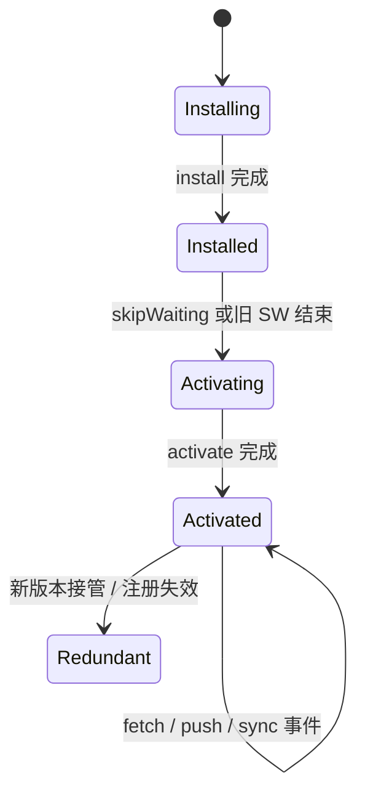

Service Worker 常见流程：

1. 页面注册脚本；
2. 浏览器下载并安装新版本；
3. 安装阶段预缓存关键资源；
4. 激活阶段清理旧缓存；
5. `fetch` 事件决定走缓存、网络或回退页面；
6. 新版本可能需要等待旧客户端关闭，或通过明确策略接管。

### 常见误区

- Service Worker 不是“永久运行的后台线程”，浏览器可以随时终止它，需要把状态持久化。
- 注册成功不代表所有已打开页面立即被新版本控制。
- Cache Storage 不是 HTTP Cache 的简单别名，两者生命周期和控制者不同。
- 通常要求安全上下文（HTTPS；本地开发环境一般有特殊例外），还受 scope 和同源规则约束。

---

# 八、SSR 与 CSR：不要只回答“谁更快”

## 8.1 一句话结论

CSR（Client-Side Rendering）把更多渲染工作放在浏览器；SSR（Server-Side Rendering）先由服务端生成 HTML，再由客户端进行 hydration（注水 / 激活）。两者的选择取决于 SEO、首屏体验、交互复杂度、服务端成本、缓存策略和数据安全边界。

## 8.2 对比

| 维度 | CSR | SSR |
|---|---|---|
| 首屏 HTML | 初始 HTML 可能较空 | 服务端先返回内容结构 |
| 首屏可见时间 | 依赖 JS 下载、执行和数据请求 | 有机会更早展示内容 |
| 交互可用时间 | 客户端代码加载后可用 | HTML 到达后仍需 hydration 才完整交互 |
| SEO | 依赖搜索引擎执行 JS 的能力和策略 | 通常更直接 |
| 服务端成本 | 相对低 | 需要服务端渲染、缓存和扩缩容 |
| 数据边界 | 更多数据到客户端 | 可在服务端隐藏部分数据访问逻辑 |
| 复杂度 | 前端状态简单时较直接 | 需要处理 hydration mismatch、缓存和双端一致性 |

### 关键追问：SSR 返回 HTML 后还需要 JavaScript 吗？

如果页面需要交互，通常仍需要客户端 JavaScript 完成 hydration。SSR 解决的是“更早得到可展示 HTML”的问题，不等于页面从此不需要 JS，也不等于用户拿到 HTML 就立即拥有全部交互能力。

### Hydration mismatch 是什么？

服务端生成的 HTML 与客户端第一次渲染结果不一致时，就可能出现 hydration mismatch。常见原因：

- 服务端和客户端使用了不同时间、随机数或环境变量；
- 依赖 `window`、屏幕尺寸或浏览器 API 的内容在两端不同；
- 数据在服务端渲染后到客户端激活前发生变化；
- HTML 嵌套结构不合法，浏览器自动修正了 DOM。

---

# 九、浏览器安全与同源边界

## 9.1 同源策略

同源由三部分组成：**协议、主机、端口**。三者都相同才是同源。

| URL | 与 `https://app.example.com:443` 是否同源 |
|---|---|
| `https://app.example.com/home` | 是 |
| `http://app.example.com/home` | 否，协议不同 |
| `https://api.example.com/home` | 否，主机不同 |
| `https://app.example.com:8443/home` | 否，端口不同 |

跨域不等于请求一定发不出去。浏览器可能允许请求发送，但限制脚本读取响应；CORS 通过响应头声明哪些来源可以读取响应。

## 9.2 CORS 面试回答框架

- 简单请求可能直接发送，服务端通过 `Access-Control-Allow-Origin` 声明是否允许读取。
- 复杂请求会先发送预检 `OPTIONS`，确认方法、请求头和来源是否被允许。
- 携带凭证时，不能使用通配符 `*` 作为允许来源，并需要正确配置 `Access-Control-Allow-Credentials`。
- CORS 是浏览器的读取安全策略，不是服务端防火墙，也不是所有 HTTP 客户端都会执行的限制。

## 9.3 XSS、CSRF 简要区分

- XSS：攻击者让恶意脚本在受信任页面上下文中执行，重点是输入、输出和脚本执行边界。
- CSRF：攻击者诱导浏览器携带已有凭证向目标站点发起非预期请求，重点是请求来源和状态变更保护。

防护不能只靠一个字段：CSP、输出编码、HttpOnly、SameSite、CSRF Token、Origin / Referer 校验和最小权限需要结合使用。

---

# 十、常见高级面试题：从“背答案”升级为“讲因果”

## 10.1 为什么浏览器要缓存？

**30 秒答法：**缓存减少重复网络传输和服务器处理，让资源更快到达，同时降低带宽和流量成本。HTTP 缓存通过新鲜度判断和条件请求在“性能”和“资源更新”之间做平衡；工程上还会用文件名 Hash 解决静态资源发布后的缓存失效问题。

**追问：缓存越久越好吗？**

不是。静态内容 Hash 后可以长缓存；HTML 入口、用户数据、权限相关响应和经常变化的接口需要更谨慎。缓存的正确目标是“在可接受的一致性范围内复用资源”。

## 10.2 304 是从哪里返回的？浏览器还是服务器？

通常是服务器或中间缓存根据条件请求判断资源未变化后返回 `304 Not Modified`。浏览器发起验证请求、接收 304，再把本地缓存正文用于最终加载。Service Worker 也可能在网络之前介入，因此排查时要确认请求是否被 SW 控制。

## 10.3 DOMContentLoaded 和 load 的区别？

- `DOMContentLoaded`：HTML 已解析完成，通常不需要等待所有图片等资源加载完成；但脚本和样式依赖会影响它的到达时间。
- `load`：页面及其依赖资源完成加载后触发，范围更广。
- 首次绘制、FCP、LCP 与这两个事件也不是同一个指标，性能分析要看用户真正看到内容的时间。

## 10.4 浏览器渲染卡顿怎么排查？

推荐按闭环回答：

1. 先确认用户感知是启动慢、滚动卡、输入延迟还是动画掉帧；
2. 用 Performance 录制真实操作；
3. 看 Main 线程是否有 Long Task；
4. 区分脚本执行、样式计算、Layout、Paint、图片解码和合成开销；
5. 对症处理：拆分任务、虚拟列表、批量 DOM、合成友好动画、图片尺寸和解码优化；
6. 重新录制并用 LCP、INP、CLS、FPS 或业务指标验证。

## 10.5 浏览器中的微任务和宏任务如何回答？

不要只背“微任务优先”。可以这样说：

- JavaScript 任务进入事件循环调度；常见宏任务包括脚本、定时器、用户交互和网络回调。
- Promise reaction、`queueMicrotask` 等微任务通常在当前任务结束后、浏览器进入下一阶段前清空。
- 微任务持续产生会饿死渲染和其他任务，因此“微任务优先”不是“微任务越多越好”。
- 渲染时机还受浏览器调度、帧预算、页面可见性和任务来源影响。

## 10.6 为什么 `document.write()` 不推荐？

它会修改解析器输入流，可能阻塞解析、覆盖文档或造成不可预测的加载行为；现代性能优化一般使用 DOM API、模块脚本、异步加载和明确的渲染边界。

## 10.7 如何解释“浏览器并不是一个单线程程序”？

JavaScript 在一个页面的主线程上执行这一点，不能推出整个浏览器只有一个线程。浏览器还会有网络、合成、光栅、IO、GPU 和 Worker 等线程。需要进一步区分：

- 页面 JS 是否能并行修改同一份 DOM：不能；
- 不同进程和 Worker 是否能并行执行计算：可以，但要通信；
- 并行是否一定更快：不一定，通信、同步和内存成本可能抵消收益。

## 10.8 什么是浏览器指纹？

浏览器指纹是根据 User-Agent、屏幕信息、字体、时区、Canvas、WebGL、特性支持等信号组合出的设备或浏览器特征。它不是 Cookie，也不一定需要在本地存储数据；隐私模式不等于完全消除指纹。现代隐私设计会通过权限控制、分区存储、减少高熵信息暴露等方式降低追踪能力。

---

# 十一、工程场景题：把知识落到项目里

## 11.1 单页应用如何设计缓存？

一个常见策略：

```text
index.html                  短缓存 / 协商缓存
assets/app.<hash>.js        长缓存
assets/vendor.<hash>.js     长缓存
assets/style.<hash>.css     长缓存
图片、字体、静态 JSON       按内容稳定性分别设置
接口响应                    按用户身份和一致性要求设置
```

发布时重点检查：

- HTML 是否引用了已经上传完成的资源；
- CDN 是否存在旧版本和新版本混用；
- 回滚版本的资源是否仍可访问；
- Service Worker 是否会把旧缓存继续返回；
- HTML 缓存是否让用户长时间看不到最新资源清单。

## 11.2 大列表滚动卡顿如何解决？

按瓶颈分类：

- DOM 太多：虚拟列表，只渲染可视区域附近节点；
- 每次滚动计算太多：节流或 `requestAnimationFrame`；
- 图片太重：缩略图、懒加载、尺寸占位和解码策略；
- 单项组件更新范围太大：拆分组件、稳定 key、减少无效渲染；
- 数据处理占满主线程：Worker、分片任务或服务端预处理；
- 布局抖动：合并 DOM 读写，避免逐项读取布局后立即写入。

## 11.3 离线应用如何设计？

可以采用分层方案：

1. Service Worker 缓存应用壳和关键静态资源；
2. Cache Storage 保存 Request / Response；
3. IndexedDB 保存业务数据、操作队列和草稿；
4. 网络恢复后同步待提交操作；
5. 为缓存版本、数据迁移、冲突解决和退出登录清理制定明确策略。

不要只说“加 Service Worker 就离线了”。离线能力是缓存、数据模型、同步协议和用户提示共同完成的系统设计。

---

# 十二、面试速查表

## 12.1 一句话区分

| 题目 | 一句话回答 |
|---|---|
| 强缓存 vs 协商缓存 | 强缓存新鲜时不问服务器；协商缓存要问服务器，未变化返回 304。 |
| Cookie vs localStorage | Cookie 可能自动随请求发送；localStorage 由脚本主动读写。 |
| localStorage vs IndexedDB | 前者是简单同步键值存储；后者适合异步、事务化、结构化数据。 |
| DOM vs CSSOM | DOM 描述文档结构；CSSOM 描述样式规则。 |
| Layout vs Paint | Layout 算位置尺寸；Paint 记录如何绘制。 |
| Reflow vs Repaint | Reflow 影响几何布局；Repaint 只更新视觉绘制。 |
| Worker vs Service Worker | Worker 做后台计算；Service Worker 由浏览器管理并可拦截网络请求。 |
| CSR vs SSR | CSR 主要在客户端渲染；SSR 先在服务端生成 HTML，再由客户端激活。 |
| TCP vs TLS vs HTTP | TCP 传字节，TLS 加密认证，HTTP 定义请求响应语义。 |
| 进程 vs 线程 | 进程做资源隔离；线程是进程中的执行路径。 |

## 12.2 面试回答的通用结构

遇到任何浏览器原理题，都可以按下面顺序组织：

1. **先下结论**：用一句话回答“是什么”。
2. **再讲流程**：按时间顺序说明“什么时候发生”。
3. **明确边界**：说明浏览器、服务器、脚本、代理分别负责什么。
4. **补充取舍**：什么时候用它，代价和风险是什么。
5. **落到验证**：用 DevTools、Performance、Network、指标或日志如何确认。
6. **再接追问**：主动说明 HTTP/2、HTTP/3、Service Worker、缓存失效或安全边界等扩展点。

## 12.3 最后自测

- [ ] 我能在 30 秒内讲清 URL 到页面显示的主链路。
- [ ] 我能解释强缓存、协商缓存、304 和文件名 Hash 的关系。
- [ ] 我能说明 Cookie、Web Storage、IndexedDB 的生命周期和安全边界。
- [ ] 我能区分 DOM、CSSOM、Render Tree、Layout、Paint、Composite。
- [ ] 我能解释同步脚本、`async`、`defer` 和模块脚本的差异。
- [ ] 我能用 Performance 面板定位长任务、布局和绘制问题。
- [ ] 我能说清 Worker、SharedWorker、Service Worker 的差异。
- [ ] 我能解释 SSR 仍然需要 hydration，以及为什么会出现 mismatch。
- [ ] 我能把一个浏览器原理落到真实项目的缓存、性能或离线场景。

---

## 参考边界

本文是面试学习材料，采用了便于复述的主干模型。浏览器的具体实现会随 Chromium、Firefox、Safari、操作系统、协议版本和实验特性变化。遇到版本敏感的问题，应结合目标浏览器的 DevTools、官方文档和实际网络瀑布图验证；不要把简化示意图当成唯一实现。
