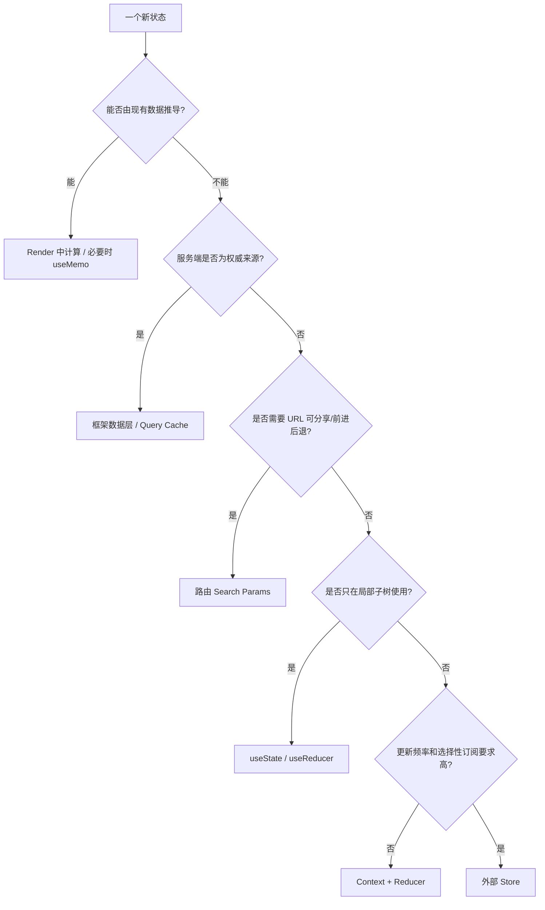
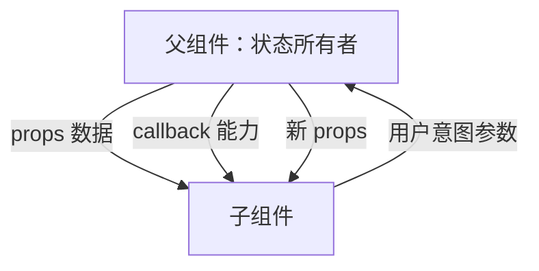
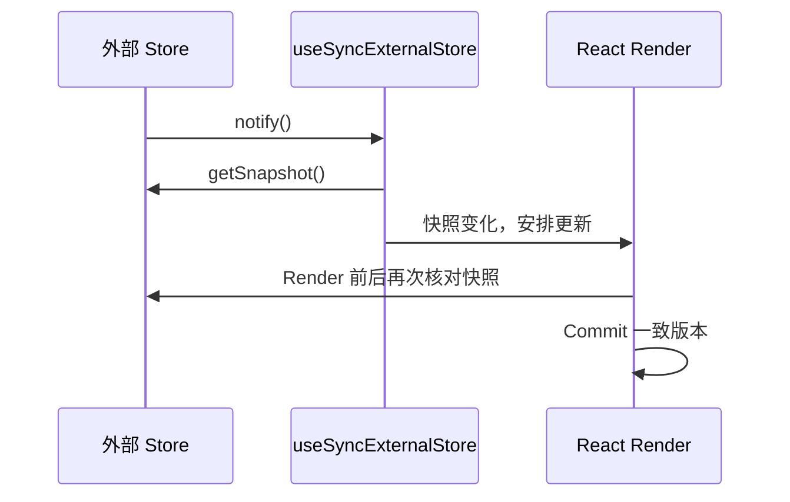
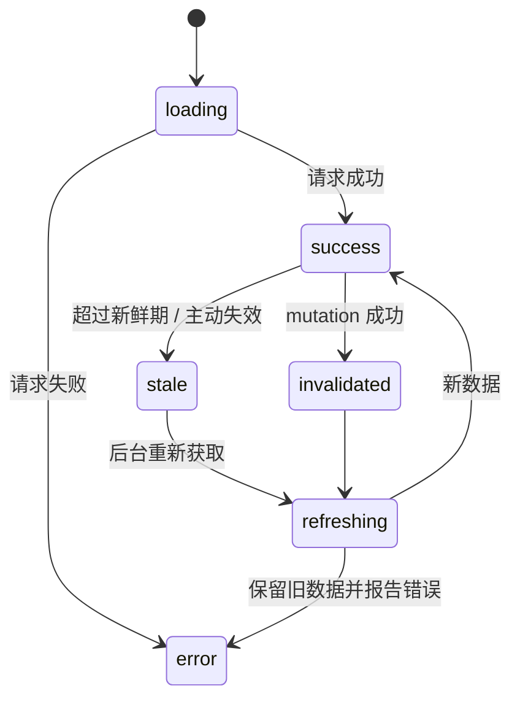
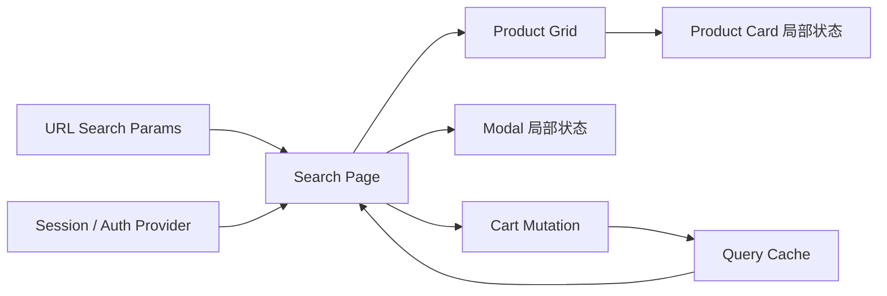

# React 组件通信与状态管理：从局部状态到外部 Store

> 核心原则：先判断“谁拥有状态、谁需要读取、谁能修改、状态属于客户端还是服务端”，再选择通信工具。不要因为跨了两层组件就立刻引入全局 Store。
> 难度标签：`基础必会` `进阶重点` `高级深挖` `历史兼容`

## 目录

- [1. 先给状态分类](#1-先给状态分类)
- [2. 父子组件通信](#2-父子组件通信)
- [3. 兄弟与跨层通信](#3-兄弟与跨层通信)
- [4. Context 的机制与性能边界](#4-context-的机制与性能边界)
- [5. Reducer + Context](#5-reducer--context)
- [6. 外部 Store 与 useSyncExternalStore](#6-外部-store-与-usesyncexternalstore)
- [7. Redux、Zustand 与选型](#7-reduxzustand-与选型)
- [8. 服务端状态与 TanStack Query](#8-服务端状态与-tanstack-query)
- [9. URL、表单与跨窗口状态](#9-url表单与跨窗口状态)
- [10. 状态架构案例](#10-状态架构案例)
- [11. 面试速查](#11-面试速查)

---

## 1. 先给状态分类

### 面试问题

React 应用中的状态应该如何分类？为什么分类比“选 Redux 还是 Context”更重要？

### 30 秒回答

状态至少可分为局部 UI 状态、共享客户端状态、服务端缓存状态、URL 状态、表单状态和外部系统状态。它们的所有权、生命周期、一致性和持久化需求不同。Redux 或 Context 主要解决共享客户端状态，不能天然解决服务端缓存失效、URL 可分享性或表单校验。先分类能避免把所有数据塞进一个全局容器。



### 常见状态类型

| 类型 | 示例 | 默认归属 |
|---|---|---|
| 局部 UI | 弹窗开关、当前 Tab、输入焦点 | 最近使用组件 |
| 表单草稿 | 输入值、校验、dirty | 表单组件 / 表单库 |
| 共享客户端 | 主题、当前组织、编辑器会话 | Context 或 Store |
| 服务端状态 | 用户列表、库存、订单详情 | Query Cache / 框架数据层 |
| URL 状态 | 搜索词、分页、筛选器 | Router / URLSearchParams |
| 外部系统 | 在线状态、媒体查询、第三方 Store | `useSyncExternalStore` |
| 持久化状态 | 偏好设置、离线草稿 | 状态层 + storage 同步策略 |

### 最小状态原则

如果一个值可以从其他状态稳定计算，它不是独立状态：

```tsx
// 中文注释：该示例聚焦当前机制，省略无关工程细节。
const selectedItem = items.find((item) => item.id === selectedId) ?? null;
```

优先存 `selectedId`，而不是同时存整份 `selectedItem`，否则列表刷新后容易出现对象过期。

---

## 2. 父子组件通信

### 面试问题

父子组件有哪些通信方式？

### 30 秒回答

父向子通过 props 传数据和能力；子向父不是“反向改父状态”，而是调用父组件传下来的回调，由父组件作为状态所有者决定如何更新；结构内容通过 `children` 或插槽式 props 组合；极少数命令式能力通过 ref 暴露。默认应保持数据向下、事件向上。



### 受控子组件

```tsx
type QuantityInputProps = {
  value: number;
  onChange: (nextValue: number) => void;
};

function QuantityInput({ value, onChange }: QuantityInputProps) {
  return (
    <input
      type="number"
      value={value}
      onChange={(event) => {
        const nextValue = Number(event.target.value);
        onChange(nextValue); // 只报告用户意图，不直接拥有业务状态
      }}
    />
  );
}

function CartLine() {
  const [quantity, setQuantity] = useState(1);
  return <QuantityInput value={quantity} onChange={setQuantity} />;
}
```

### 回调命名表达意图

优先传领域事件而不是 setter：

```tsx
// ❌ 子组件拿到过强能力，能写入任意状态
<CheckoutForm setOrder={setOrder} />

// ✅ 子组件只报告明确意图，父组件保留校验和状态所有权
<CheckoutForm onAddressChange={changeAddress} onSubmit={submitOrder} />
```

### ref 不是常规数据通道

焦点、滚动、媒体播放等命令式动作可使用 ref，但不要用 ref 绕过 props 同步业务数据。若父组件需要读取子组件业务状态，通常说明状态应该提升。

---

## 3. 兄弟与跨层通信

### 面试问题

兄弟组件、祖孙组件和任意组件如何通信？

### 30 秒回答

兄弟组件共享状态时提升到最近公共父节点；跨层但低频、语义稳定的数据可以使用 Context；更新频繁且消费者多、需要 selector 或跨 React 边界时考虑外部 Store；完全无关模块之间不要默认使用 Event Bus，因为它隐藏依赖和生命周期。

### 状态提升

```tsx
// 中文注释：该示例聚焦当前机制，省略无关工程细节。
function TemperatureCalculator() {
  const [celsius, setCelsius] = useState(0);

  return (
    <>
      <CelsiusInput value={celsius} onChange={setCelsius} />
      <FahrenheitOutput value={(celsius * 9) / 5 + 32} />
    </>
  );
}
```

公共父组件保存最小真相来源，另一个温标在 Render 中推导。

### 组件组合可替代部分 Context

```tsx
// 中文注释：该示例聚焦当前机制，省略无关工程细节。
function Page({ user }: { user: User }) {
  return (
    <Layout
      header={<UserMenu user={user} />}
      content={<Dashboard userId={user.id} />}
    />
  );
}
```

`Layout` 不需要理解 user，只负责摆放调用者传入的节点。这比为了避免一两层 props 就引入 Context 更透明。

### Event Bus 的问题

- 发布者和订阅者关系不可从组件树或类型中直观看到。
- 容易漏清理，产生重复订阅。
- 事件顺序和错误恢复难建模。
- 服务端渲染中全局单例可能造成请求间状态污染。

跨微前端或非 React 系统边界确实可能需要事件协议，但应定义 schema、作用域、生命周期和可观测性，而不是随手创建全局 emitter。

---

## 4. Context 的机制与性能边界

### 面试问题

Context 如何工作？为什么 Context 更新可能导致大量组件渲染？

### 30 秒回答

Provider 提供的 `value` 变化时，读取该 Context 的消费者会收到新值并重新渲染。React 使用 `Object.is` 判断新旧 `value`。Context 适合主题、语言、认证信息、依赖注入等跨层数据，但它不是细粒度 selector Store；把高频变化的大对象放入一个 Context 会扩大更新广播范围。

### 基础用法

```tsx
const ThemeContext = createContext<'light' | 'dark'>('light');

function App() {
  const [theme, setTheme] = useState<'light' | 'dark'>('light');

  return (
    <ThemeContext value={theme}>
      <Toolbar />
      <button onClick={() => setTheme((value) => value === 'light' ? 'dark' : 'light')}>
        切换主题
      </button>
    </ThemeContext>
  );
}

function Toolbar() {
  const theme = useContext(ThemeContext); // 订阅最近的 Provider 值
  return <div data-theme={theme}>工具栏</div>;
}
```

### 为什么 value 引用很重要

```tsx
// 中文注释：该示例聚焦当前机制，省略无关工程细节。
<AuthContext value={{ user, logout }}>
  {children}
</AuthContext>
```

即使 `user` 未变，对象字面量每次都是新引用。可采用的优先级：

1. 拆分状态 Context 与 dispatch Context。
2. 拆分不同更新频率的 Context。
3. 把状态下沉，缩小 Provider 更新范围。
4. 确有收益时用 `useMemo` / `useCallback` 稳定 value。
5. 需要 selector 时选择合适的外部 Store。

```tsx
const value = useMemo(
  () => ({ user, logout }),
  [user, logout], // 只有依赖稳定时，缓存对象才有意义
);
```

### Context 穿透 `memo`

即使组件被 `memo` 包裹，只要它内部读取的 Context 变化，仍需要重新渲染。`memo` 只比较 props，不能阻止组件响应自己订阅的 Context。

### Context 默认值陷阱

可以用 `null` + 自定义 Hook 保证 Provider 存在：

```tsx
// 中文注释：该示例聚焦当前机制，省略无关工程细节。
const AuthContext = createContext<AuthValue | null>(null);

function useAuth() {
  const value = useContext(AuthContext);
  if (value === null) {
    throw new Error('useAuth 必须在 AuthProvider 内调用');
  }
  return value;
}
```

---

## 5. Reducer + Context

### 面试问题

什么时候适合把 `useReducer` 与 Context 组合？

### 30 秒回答

当一个功能子树需要共享中等复杂的客户端状态，而且状态迁移可以由明确 action 描述时，Reducer + Context 是低依赖方案。常见做法是把 state 和 dispatch 拆成两个 Context，让只派发动作的组件不因 state 每次变化而重渲染。但高频大规模数据、selector、时间旅行或复杂中间件需求更适合外部 Store。

### 完整模式

```tsx
// 中文注释：该示例聚焦当前机制，省略无关工程细节。
type Task = { id: string; title: string; done: boolean };
type Action =
  | { type: 'added'; task: Task }
  | { type: 'toggled'; id: string }
  | { type: 'removed'; id: string };

const TasksContext = createContext<Task[] | null>(null);
const TasksDispatchContext = createContext<Dispatch<Action> | null>(null);

function tasksReducer(tasks: Task[], action: Action): Task[] {
  switch (action.type) {
    case 'added':
      return [...tasks, action.task];
    case 'toggled':
      return tasks.map((task) =>
        task.id === action.id ? { ...task, done: !task.done } : task,
      );
    case 'removed':
      return tasks.filter((task) => task.id !== action.id);
  }
}

function TasksProvider({ children }: { children: ReactNode }) {
  const [tasks, dispatch] = useReducer(tasksReducer, []);

  return (
    <TasksContext value={tasks}>
      <TasksDispatchContext value={dispatch}>
        {children}
      </TasksDispatchContext>
    </TasksContext>
  );
}
```

### Reducer 的边界

Reducer 应保持纯净：

```tsx
// ❌ 不要在 reducer 内请求接口或写 localStorage
function reducer(state: State, action: Action) {
  localStorage.setItem('state', JSON.stringify(state));
  return state;
}
```

持久化属于外部同步，可由订阅层、Effect 或 Store middleware 负责。领域命令可先执行异步操作，再 dispatch 结果事件。

---

## 6. 外部 Store 与 useSyncExternalStore

### 面试问题

为什么 React 提供 `useSyncExternalStore`？直接在 Effect 里订阅不行吗？

### 30 秒回答

外部 Store 的状态不由 React 更新队列管理。`useSyncExternalStore` 规定了 `subscribe`、`getSnapshot` 和服务端快照协议，让 React 在并发渲染与 hydration 中获得一致快照，避免 tearing（同一界面不同组件看到不同版本）。Redux、Zustand 等库可在内部使用这一接口接入 React。



### 最小 Store 示例

```tsx
type Listener = () => void;

let count = 0;
const listeners = new Set<Listener>();

const counterStore = {
  getSnapshot: () => count,
  subscribe(listener: Listener) {
    listeners.add(listener);
    return () => listeners.delete(listener); // 订阅必须返回清理函数
  },
  increment() {
    count += 1;
    listeners.forEach((listener) => listener());
  },
};

function Counter() {
  const value = useSyncExternalStore(
    counterStore.subscribe,
    counterStore.getSnapshot,
    () => 0, // SSR 快照应与客户端 hydration 初值协调
  );

  return <button onClick={counterStore.increment}>{value}</button>;
}
```

### Snapshot 必须可缓存

`getSnapshot()` 在 Store 未变化时必须返回 `Object.is` 相同的结果。若每次都创建新对象，React 会认为 Store 一直变化。可返回不可变状态对象，或对可变数据生成并缓存版本化快照。

---

## 7. Redux、Zustand 与选型

### 面试问题

Context、Redux、Zustand 怎么选？

### 30 秒回答

Context 是 React 的值传递机制，适合低频跨层共享；Redux Toolkit 提供强约束的事件驱动状态、DevTools、中间件和成熟生态，适合大型协作与可追踪业务流程；Zustand API 轻量、selector 直接，适合中小型共享客户端状态。选型依据应是状态规模、更新频率、团队约束、调试与持久化需求，而不是样板代码多少。

| 维度 | Context + Reducer | Redux Toolkit | Zustand |
|---|---|---|---|
| 依赖 | React 内置 | 外部库 | 外部库 |
| 更新粒度 | 以 Context 消费为主 | selector 订阅 | selector 订阅 |
| 约束与可追踪 | 中等 | 强 | 灵活 |
| 中间件 / DevTools | 自建 | 成熟 | 可选 |
| 典型规模 | 功能子树 | 中大型业务 | 小中型共享状态 |
| 学习成本 | 低到中 | 中 | 低 |

### 选择前的五个问题

1. 这是客户端状态还是服务端状态？
2. 是否真的跨越多个相距较远的功能域？
3. 更新是否高频，是否需要 selector？
4. 是否要求时间旅行、审计日志、持久化、中间件或跨标签页？
5. 团队更需要严格约束还是快速灵活？

### 常见反模式

- 把 API 响应永久复制进 Redux，同时又维护 Query Cache，形成双真相来源。
- 把每个输入框字符都写进全局 Store，扩大更新和调试噪声。
- Store 中保存 React Element、DOM 节点、Promise 或不可序列化临时对象，却又期望完整持久化和时间旅行。
- 组件直接依赖 Store 全量对象，不使用 selector，导致无关更新传播。

---

## 8. 服务端状态与 TanStack Query

### 面试问题

服务端状态为什么不等于全局状态？什么时候使用 TanStack Query 或框架数据层？

### 30 秒回答

服务端状态的权威来源在服务端，客户端持有的是带时效的缓存副本，需要处理加载、错误、去重、缓存失效、重试、预取和并发请求。普通全局 Store 只提供存取能力，不自动解决这些协议。使用 Next.js 等框架的数据获取能力或 TanStack Query，可以让缓存生命周期与请求语义更明确。

### 服务端状态生命周期



### Mutation 的职责

一次 mutation 不只是 `fetch`：

1. 校验并提交命令。
2. 决定是否乐观更新。
3. 成功后更新或失效相关查询。
4. 失败时回滚并展示可恢复错误。
5. 处理重复提交、幂等和并发冲突。

### 不应过度抽象

如果框架已在服务端组件或路由 loader 层完成请求、缓存和流式渲染，不必为了“统一”再把同一数据搬进客户端 Query Cache。根据渲染边界和交互需求选择所有者。

---

## 9. URL、表单与跨窗口状态

### URL 状态

分页、排序、筛选和当前资源 ID 如果需要可复制链接、刷新保留、浏览器前进后退，应优先放 URL：

```tsx
function usePageParam() {
  const [searchParams, setSearchParams] = useSearchParams();
  const page = Number(searchParams.get('page') ?? '1');

  function setPage(nextPage: number) {
    setSearchParams((current) => {
      current.set('page', String(nextPage)); // URL 成为分页真相来源
      return current;
    });
  }

  return [page, setPage] as const;
}
```

具体 API 由路由库决定，但所有权判断不变。

### 表单状态

小表单可受控；大型表单需要字段级订阅、校验、动态数组和性能优化时可使用 React Hook Form 等工具。服务端提交状态可结合 Action 能力，但客户端校验不是安全边界，服务端必须重新校验。

### 持久化与跨标签页

`localStorage` 是外部系统：

- 需要序列化版本和迁移策略。
- SSR 中不能直接访问 `window`。
- 跨标签页通过 `storage` 事件或 BroadcastChannel 同步。
- 敏感凭证不应因方便直接长期保存。
- 持久化失败、配额和隐私模式需要降级。

---

## 10. 状态架构案例

### 场景：电商搜索页

需求包含搜索词、筛选项、商品结果、购物车、登录用户和弹窗开关。

| 数据 | 推荐所有者 | 原因 |
|---|---|---|
| 搜索词、筛选、页码 | URL | 可分享、刷新保留、前进后退 |
| 商品列表与库存 | Query Cache / 框架 | 服务端权威、需缓存失效 |
| 购物车 | 服务端状态 + 乐观缓存 | 多端一致、需要 mutation |
| 登录用户 | 框架 session + Context 摘要 | 鉴权在服务端，客户端只消费 |
| 商品卡 hover | 卡片本地 state / CSS | 极局部、生命周期短 |
| 登录弹窗开关 | 页面局部 state | 不需要全局化 |
| 主题 | Context / 持久化偏好 | 低频跨层读取 |



### 架构评审问题

- 是否存在两个可写真相来源？
- 状态是否放得比消费范围更高？
- 组件是否订阅了比实际需要更大的对象？
- 服务端缓存是否有明确的 stale / invalidation 规则？
- URL、Store、表单和 Query Cache 之间的同步方向是否唯一？
- SSR 是否会泄漏请求级状态到全局单例？

---

## 11. 面试速查

### 高频问答

**Q：组件通信方式有哪些？**
A：props、回调、children / 插槽组合、状态提升、Context、外部 Store、ref 命令式句柄；跨系统边界还可能有事件或消息协议。

**Q：Context 能替代 Redux 吗？**
A：部分场景可以，但 Context 是广播值的机制，不自带 selector、middleware、DevTools 和完整状态约束；选型取决于需求。

**Q：为什么拆 state 和 dispatch Context？**
A：`dispatch` 引用通常稳定，只派发动作的组件无需订阅每次 state 变化。

**Q：什么是 tearing？**
A：同一次界面渲染中，不同组件读取到外部 Store 的不同版本；`useSyncExternalStore` 提供一致快照协议。

**Q：服务端数据放 Redux 有错吗？**
A：不是绝对错误，但要自行承担缓存、失效、去重、重试和 SSR 等协议；通常专业 Query Cache 或框架数据层更合适。

### 选择表

| 如果你需要…… | 优先考虑 |
|---|---|
| 单组件交互 | `useState` |
| 功能子树复杂迁移 | `useReducer` |
| 低频跨层值 | Context |
| 高频共享 + selector | 外部 Store |
| 服务端缓存与 mutation | Query Cache / 框架数据层 |
| 可分享筛选和分页 | URL |
| DOM 命令式操作 | ref |

## 参考资料

- [Passing Data Deeply with Context](https://react.dev/learn/passing-data-deeply-with-context)
- [Scaling Up with Reducer and Context](https://react.dev/learn/scaling-up-with-reducer-and-context)
- [`useContext`](https://react.dev/reference/react/useContext)、[`useReducer`](https://react.dev/reference/react/useReducer)、[`useSyncExternalStore`](https://react.dev/reference/react/useSyncExternalStore)
- Redux Toolkit、Zustand、TanStack Query 官方文档（仅用于选型边界，不在本专题展开源码）

## 关联专题

- [React 核心与组件模型](./react-core-and-component-model.md)
- [状态更新与渲染](./react-state-and-rendering.md)
- [Hooks 深入](./react-hooks-deep-dive.md)
- [性能与工程化](./react-performance-and-engineering.md)
