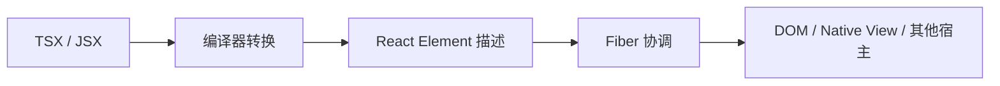
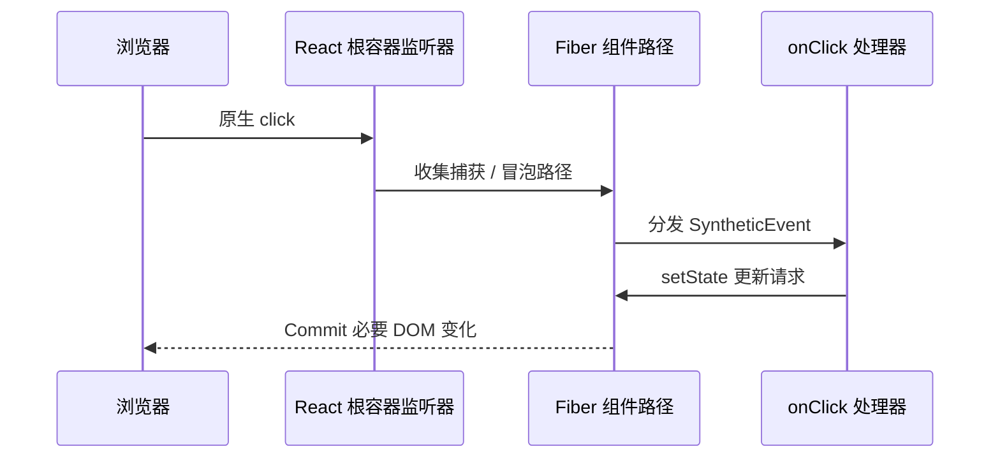

# React 核心与组件模型：从声明式 UI 到可组合组件

> 适用版本：以 React 19.x 函数组件为主；类组件、HOC 与旧生命周期仅作为遗留项目知识。
> 难度标签：`基础必会` `进阶重点` `高级深挖` `历史兼容`

## 目录

- [1. React 的核心心智模型](#1-react-的核心心智模型)
- [2. JSX 到底是什么](#2-jsx-到底是什么)
- [3. React Element、组件、Fiber 与 DOM](#3-react-element组件fiber-与-dom)
- [4. Props、State 与单向数据流](#4-propsstate-与单向数据流)
- [5. 组件设计与组合](#5-组件设计与组合)
- [6. 事件系统](#6-事件系统)
- [7. 受控与非受控组件](#7-受控与非受控组件)
- [8. 函数组件与类组件](#8-函数组件与类组件)
- [9. React 与 Vue 3 怎么比较](#9-react-与-vue-3-怎么比较)
- [10. 面试速查](#10-面试速查)

---

## 1. React 的核心心智模型

### 面试问题

如何理解 React？它为什么强调声明式、组件化和单向数据流？

### 30 秒回答

React 是一个用于构建用户界面的声明式库。开发者不是逐条命令 DOM 怎么修改，而是根据当前 `props`、`state` 和 `context` **计算这一刻界面应该是什么样**。React 再通过协调过程比较前后描述，并在 Commit 阶段把必要变化应用到宿主环境。组件化负责拆分职责，单向数据流让状态来源和更新路径更容易追踪。

### 深入原理

可以把一次 UI 更新理解为一个函数：

```text
UI = render(props, state, context)
```

这不是说 React 组件在实现上永远是数学意义的纯函数，而是要求 **Render 阶段保持纯净**：相同输入应得到相同描述，不能在渲染期间修改外部变量、发请求或直接操作 DOM。


图中要区分两个概念：Render 是“算”，Commit 是“改”。Render 在并发渲染中可能暂停、放弃或重做；Commit 必须保持原子性，不能让用户看到更新一半的界面。

### 声明式与命令式的边界

```ts
// 命令式：调用者必须知道每一步 DOM 操作
function updateCounterImperatively(count: number) {
  const node = document.querySelector<HTMLSpanElement>('#count');
  if (node) {
    node.textContent = String(count); // 手动保证 DOM 与数据一致
  }
}

// 声明式：组件只描述当前 count 对应的界面
function Counter({ count }: { count: number }) {
  return <span id="count">{count}</span>;
}
```

声明式不意味着底层没有命令式操作，而是 React 把“如何更新宿主节点”的复杂度封装在渲染器中。动画、焦点、测量尺寸等场景仍需要受控地使用 `ref` 和 Effect。

### 常见追问

**React 是 MVC 还是 MVVM？**

React 主要解决 View 层，不强制完整 MVC / MVVM 架构。把 React 直接等同于某种完整架构会掩盖路由、数据获取、服务端状态、领域逻辑等额外职责。

**为什么前端框架普遍采用数据驱动视图？**

复杂交互中手工维护“数据状态”和“DOM 状态”的双向同步容易出现组合爆炸。数据驱动把 DOM 视为状态的派生结果，减少可变状态源。

### 易错点

- “虚拟 DOM 一定比原生 DOM 快”是错误结论；React 的价值是可预测的编程模型和跨更新的统一协调。
- “声明式就不用理解浏览器”也是错误的；布局、绘制、事件循环和网络仍决定真实性能。
- 组件函数是计算 UI 的入口，不应在函数体中执行不可重复的副作用。

---

## 2. JSX 到底是什么

### 面试问题

JSX 是什么？为什么浏览器不能直接执行 JSX？为什么 React 要引入 JSX？

### 30 秒回答

JSX 是 JavaScript 的语法扩展，用接近 HTML 的结构表达 UI，但它不是字符串，也不是 HTML。构建工具会把 JSX 转换为创建 React Element 的调用。浏览器原生 JavaScript 解析器通常不认识 JSX 语法，因此需要 Babel、TypeScript 或现代构建工具转换。

### 转换过程

```tsx
// 开发者编写的 JSX
const element = <button className="primary">保存</button>;
```

自动 JSX runtime 可近似理解为：

```ts
// 简化示意：真实生成代码由编译器和 JSX runtime 决定
const element = jsx('button', {
  className: 'primary',
  children: '保存',
});
```

结果是一个普通的描述对象，可近似表示为：

```ts
// 简化示意，并非 React Element 的完整内部结构
const element = {
  type: 'button',
  key: null,
  props: {
    className: 'primary',
    children: '保存',
  },
};
```



### JSX 的价值

1. **结构与行为共置**：一个交互组件的标记、事件和状态往往天然耦合。
2. **仍然是 JavaScript 表达式**：可以使用变量、函数、数组和条件表达式。
3. **利于静态分析与编译优化**：编译器能看到组件结构，而不是解析任意模板字符串。
4. **防止默认字符串注入**：React 会转义普通文本；只有显式使用 `dangerouslySetInnerHTML` 才绕过该保护。

### 条件渲染的推荐写法

```tsx
type ResultProps = {
  loading: boolean;
  error?: Error;
  items: Array<{ id: string; name: string }>;
};

function Result({ loading, error, items }: ResultProps) {
  if (loading) return <p>加载中…</p>;
  if (error) return <p role="alert">加载失败：{error.message}</p>;

  return (
    <ul>
      {items.map((item) => (
        // 使用稳定业务 ID，保证身份与状态正确对应
        <li key={item.id}>{item.name}</li>
      ))}
    </ul>
  );
}
```

### 易错点

- JSX 中的 `{}` 进入 JavaScript 表达式，不等于模板语言的字符串插值。
- `0 && <Panel />` 会渲染数字 `0`；应写成 `count > 0 && <Panel />`。
- 组件名必须大写开头，否则 JSX runtime 会把它当作宿主标签。
- `key` 不会作为普通 `props` 传入组件；需要业务值时应单独传递 `id`。

---

## 3. React Element、组件、Fiber 与 DOM

### 面试问题

React Element、组件实例、Fiber 和真实 DOM 分别是什么关系？

### 30 秒回答

React Element 是一次渲染产生的不可变 UI 描述；组件是产生描述的逻辑单元；Fiber 是 React 内部可变的工作节点，保存组件状态、更新优先级、树关系和副作用标记；DOM 是浏览器渲染器最终操作的宿主节点。不要把虚拟 DOM 对象直接等同于 Fiber。


图中从左到右分别回答“想要什么”“如何完成”“最终呈现什么”。一个组件可以多次执行并产生新的 Element，而 Fiber 节点会在满足身份条件时复用并承载跨渲染状态。

### 关键区别

| 概念 | 主要职责 | 是否跨渲染保留 | 开发者是否直接操作 |
|---|---|---:|---:|
| JSX | UI 语法 | 否 | 是 |
| React Element | UI 描述 | 通常否 | 可读取但不应修改 |
| Component | 计算与组合逻辑 | 函数组件本身无实例 | 是 |
| Fiber | 调度、状态和协调工作单元 | 是，可通过 `alternate` 对应 | 否 |
| DOM | 浏览器宿主节点 | 可能复用 | 通过 `ref` 有限操作 |

### 关联专题

- 更新阶段和状态保留：[`react-state-and-rendering.md`](./react-state-and-rendering.md)
- Fiber 内部结构：[`react-fiber-concurrency-and-modern-react.md`](./react-fiber-concurrency-and-modern-react.md)
- Element 到 Fiber 的 Diff：[`react-diff-vue3-compare.md`](./react-diff-vue3-compare.md)

---

## 4. Props、State 与单向数据流

### 面试问题

`props` 和 `state` 有什么区别？为什么不能直接修改它们？

### 30 秒回答

`props` 是父组件传入的只读输入，`state` 是组件对某段可变信息的记忆。二者在某次渲染中都是只读快照。直接修改对象不会向 React 发出更新请求，还会破坏历史快照和并发渲染的可重试性；应创建新值并调用状态更新函数。

```tsx
type Profile = {
  name: string;
  address: { city: string };
};

function ProfileEditor({ initialProfile }: { initialProfile: Profile }) {
  const [profile, setProfile] = useState(initialProfile);

  function changeCity(city: string) {
    setProfile((previous) => ({
      ...previous,
      // 只复制发生变化的路径，保留未变化分支的引用
      address: { ...previous.address, city },
    }));
  }

  return (
    <input
      value={profile.address.city}
      onChange={(event) => changeCity(event.target.value)}
    />
  );
}
```

### 状态应该放在哪里

使用“最小充分状态”原则：只存无法从现有 `props`、`state` 推导出来且会随时间变化的数据。

```tsx
// ❌ 错误：fullName 是重复状态，可能与 firstName / lastName 不一致
const [firstName, setFirstName] = useState('Ada');
const [lastName, setLastName] = useState('Lovelace');
const [fullName, setFullName] = useState('Ada Lovelace');

// ✅ 推荐：在渲染中推导，不需要 Effect 同步
const fullName = `${firstName} ${lastName}`;
```

### 状态提升与状态下沉

- 两个兄弟组件需要同一真相来源：把状态提升到最近公共父组件。
- 只有局部叶子使用的交互状态：尽量下沉，避免父组件每次更新都扩大渲染范围。
- URL、服务端缓存、表单草稿和跨页面业务状态并不一定都应该放进全局 Store。

---

## 5. 组件设计与组合

### 面试问题

如何设计一个可复用、可维护的 React 组件？组合为什么通常优于继承？

### 30 秒回答

组件应围绕稳定职责设计，用明确的 `props` 表达变化点，把业务状态与纯展示分离。React 通过 `children`、插槽式 props、Context 和自定义 Hook 提供组合能力，通常不需要组件继承。好的抽象不是参数越多越好，而是让非法状态难以表达。

### 用联合类型表达组件状态

```tsx
// 中文注释：该示例聚焦当前机制，省略无关工程细节。
type RequestState<T> =
  | { status: 'idle' }
  | { status: 'loading' }
  | { status: 'success'; data: T }
  | { status: 'error'; error: Error };

type User = { id: string; name: string };

function UserPanel({ state }: { state: RequestState<User> }) {
  switch (state.status) {
    case 'idle':
      return <p>尚未加载</p>;
    case 'loading':
      return <p>加载中…</p>;
    case 'success':
      return <p>{state.data.name}</p>;
    case 'error':
      return <p role="alert">{state.error.message}</p>;
  }
}
```

相比 `isLoading`、`hasError`、`data` 三个可自由组合的 props，联合类型避免“正在加载但同时成功”的非法组合。

### 组合模式

```tsx
// 中文注释：该示例聚焦当前机制，省略无关工程细节。
type DialogProps = {
  title: ReactNode;
  children: ReactNode;
  actions?: ReactNode;
};

function Dialog({ title, children, actions }: DialogProps) {
  return (
    <section role="dialog" aria-labelledby="dialog-title">
      <h2 id="dialog-title">{title}</h2>
      <div>{children}</div>
      {actions && <footer>{actions}</footer>}
    </section>
  );
}
```

### 自定义 Hook、Render Props 与 HOC 怎么选

| 方式 | 适用场景 | 主要代价 |
|---|---|---|
| 自定义 Hook | 复用有状态逻辑 | 只能在 React 组件 / Hook 中调用 |
| 普通函数 | 复用纯计算 | 不具备 React 状态和生命周期语义 |
| 组合组件 | 复用 UI 结构 | 需要设计清晰的组件 API |
| Render Props | 运行时注入渲染逻辑 | 嵌套层级可能较深 |
| HOC | 遗留代码、横切增强 | props 冲突、层级和类型推导复杂 |

> `历史兼容`：HOC 是接收组件并返回增强组件的函数。现代函数组件中，逻辑复用通常优先自定义 Hook，但错误边界等能力仍常由类组件或框架封装承担。

---

## 6. 事件系统

### 面试问题

什么是 React 合成事件？React 为什么不只让组件直接绑定原生事件？

### 30 秒回答

React 事件处理器接收到的是统一封装的事件对象，React DOM 通过事件委托和插件化处理，把浏览器事件转换为组件树中的捕获与冒泡语义。这样可以统一跨浏览器行为，并让事件更新进入 React 的优先级与批处理体系。需要原生监听器时仍可在 Effect 中使用 `addEventListener`。



### 捕获、冒泡与阻止传播

```tsx
function Toolbar() {
  return (
    <div
      onClickCapture={() => {
        // 捕获阶段：从外向内执行
        console.log('capture');
      }}
      onClick={() => {
        // 冒泡阶段：从内向外执行
        console.log('bubble');
      }}
    >
      <button
        onClick={(event) => {
          event.stopPropagation(); // 只阻止后续 React 传播，不等于撤销默认行为
          console.log('save');
        }}
      >
        保存
      </button>
    </div>
  );
}
```

### 易错点

- `return false` 不是 React 中阻止默认行为的标准方式，应使用 `preventDefault()`。
- `stopPropagation()` 与 `preventDefault()` 解决不同问题。
- 不要依赖早期 React “事件池化后对象失效”的旧结论；现代 React DOM 已不再要求为异步读取调用 `event.persist()`。
- 原生监听器和 React 事件混用时，要明确监听目标、阶段和清理逻辑。

---

## 7. 受控与非受控组件

### 面试问题

什么是受控组件和非受控组件？如何选？

### 30 秒回答

受控组件的当前值由 React 状态驱动，通过 `value` 与 `onChange` 形成单一数据源；非受控组件把当前值保存在 DOM 中，通过 `defaultValue` 和 `ref` 按需读取。需要即时校验、联动和可预测重置时优先受控；大型表单或文件输入可按场景使用非受控或表单库。

```tsx
// 中文注释：该示例聚焦当前机制，省略无关工程细节。
function ControlledSearch() {
  const [keyword, setKeyword] = useState('');

  return (
    <label>
      关键词
      <input
        value={keyword}
        onChange={(event) => setKeyword(event.target.value)}
      />
    </label>
  );
}
```

```tsx
function UncontrolledUpload() {
  const inputRef = useRef<HTMLInputElement>(null);

  function submit() {
    // 文件值由浏览器管理，通过 ref 在提交时读取
    const file = inputRef.current?.files?.[0];
    if (file) console.log(file.name);
  }

  return (
    <>
      <input ref={inputRef} type="file" />
      <button onClick={submit}>上传</button>
    </>
  );
}
```

### 易错点

- 不要在同一个输入生命周期中随意从受控切换为非受控。
- `defaultValue` 只设置初始值，后续变化不会像 `value` 一样持续控制 DOM。
- 受控不等于“每个字段必须进入全局 Store”。表单状态通常应保持局部。

---

## 8. 函数组件与类组件

### 面试问题

函数组件和类组件的本质区别是什么？生命周期如何对应 Hooks？

### 30 秒回答

现代 React 以函数组件为主。函数组件每次渲染都会形成新的闭包，通过 Hook 连接跨渲染状态；类组件通过实例字段和生命周期方法组织逻辑。Effect 不是 `componentDidMount` 的机械替代，它表达的是“让外部系统与当前状态同步”，依赖变化时会先清理旧同步再建立新同步。

| 类组件概念 | 函数组件常见表达 | 注意 |
|---|---|---|
| `this.state` | `useState` / `useReducer` | 函数组件读取的是渲染快照 |
| `componentDidMount/Update` | `useEffect` | 不应机械模拟生命周期 |
| `componentWillUnmount` | Effect cleanup | 清理对应那次同步过程 |
| `shouldComponentUpdate` | `memo` + 架构优化 | 先测量再优化 |
| 实例字段 | `useRef` | ref 变化不会触发渲染 |
| Error Boundary | 类组件 / 框架封装 | 普通函数组件暂不直接实现同等边界 |

### 旧生命周期为什么危险

`componentWillMount`、`componentWillReceiveProps`、`componentWillUpdate` 等旧生命周期可能在可中断 Render 阶段重复执行，却被用于副作用，导致行为不可靠。遗留项目应迁移到安全生命周期或函数组件的同步模型。

---

## 9. React 与 Vue 3 怎么比较

### 面试问题

React 和 Vue 3 的核心差异是什么？

### 30 秒回答

两者都采用组件化、声明式 UI 和虚拟 DOM，但响应性路径不同。React 通常由状态更新触发组件函数重新执行，再在运行时协调 Element；Vue 3 通过响应式依赖追踪知道哪些响应式消费者需要更新，并借助模板编译产生 patch flags、静态提升等提示。不能简单说一个“全量更新”、另一个“局部更新”，最终都依赖组件边界、数据结构和编译 / 运行时优化。

| 维度 | React | Vue 3 |
|---|---|---|
| UI 表达 | JSX，JavaScript 优先 | Template 为主，也支持 JSX |
| 响应性 | 显式状态更新 + 重新执行组件 | Proxy 依赖收集与触发 |
| 优化哲学 | 运行时协调；Compiler 可自动记忆化 | 编译时提示 + 运行时响应性 |
| 逻辑复用 | Hooks | Composables |
| 状态快照 | 每次渲染闭包读取固定快照 | ref / reactive 读取当前响应值 |

进一步比较列表 Diff，见 [`react-diff-vue3-compare.md`](./react-diff-vue3-compare.md)。

---

## 10. 面试速查

### 高频追问

1. **组件为什么必须纯净？** Render 可能重试；副作用会被重复执行并破坏一致性。
2. **JSX 是虚拟 DOM 吗？** JSX 是语法；转换结果产生 Element 描述；Fiber 才是协调工作节点。
3. **为什么 state 不可直接修改？** React 不知道需要更新，而且会破坏快照与引用比较。
4. **什么时候使用 ref？** 保存不参与渲染的数据，或访问 DOM / 命令式 API。
5. **受控组件一定更好吗？** 不是，应根据校验、联动、性能和原生约束选择。
6. **HOC 被淘汰了吗？** 没有，但现代逻辑复用通常优先 Hook；遗留生态仍大量存在。

### 一句话边界

- 组件是 UI 的职责边界，不一定等同于业务领域边界。
- Props 是输入，不是组件内部可修改的状态。
- State 是组件记忆，不是所有远程数据的默认容器。
- Effect 用于外部同步，不用于计算本可在 Render 中推导的数据。

## 参考资料

- [Describing the UI](https://react.dev/learn/describing-the-ui)、[Adding Interactivity](https://react.dev/learn/adding-interactivity)、[Managing State](https://react.dev/learn/managing-state)
- [Responding to Events](https://react.dev/learn/responding-to-events)、[Sharing State Between Components](https://react.dev/learn/sharing-state-between-components)
- [Render and Commit](https://react.dev/learn/render-and-commit)、[Keeping Components Pure](https://react.dev/learn/keeping-components-pure)
- [Reacting to Input with State](https://react.dev/learn/reacting-to-input-with-state)

## 关联专题

- [状态更新与渲染](./react-state-and-rendering.md)
- [Hooks 深入](./react-hooks-deep-dive.md)
- [组件通信与状态管理](./react-component-communication-and-state-management.md)
