# React Diff 算法专题：原理、流程与 Vue 3 对比

> 目标：系统梳理 React 的 Diff / Reconciliation（协调）机制，重点讲清楚 React 如何比较新旧 UI 树、如何处理列表、`key` 的作用、Fiber 在其中承担什么角色，以及它和 Vue 3 Diff 的核心区别。
> 适用版本：以 React 19.x 与 Vue 3 当前稳定心智模型为主；源码片段均为**简化示意，并非源码原文**。业务示例使用 TSX，关键逻辑附中文注释。
> 难度标签：`基础必会` `进阶重点` `高级深挖`。

---

## 目录

1. [什么是 React Diff？](#1-什么是-react-diff)
2. [React 为什么需要 Diff？](#2-react-为什么需要-diff)
3. [React Diff 的两个基本假设](#3-react-diff-的两个基本假设)
4. [React 更新链路总览](#4-react-更新链路总览)
5. [React Element、Fiber、DOM 的关系](#5-react-elementfiberdom-的关系)
6. [React Diff 的整体流程](#6-react-diff-的整体流程)
7. [单节点 Diff](#7-单节点-diff)
8. [多节点 Diff：数组 children 的完整流程](#8-多节点-diff数组-children-的完整流程)
9. [`key` 在 React Diff 中的作用](#9-key-在-react-diff-中的作用)
10. [React 如何判断节点移动](#10-react-如何判断节点移动)
11. [React 列表 Diff 完整示例](#11-react-列表-diff-完整示例)
12. [没有 key 或使用 index 作为 key 的问题](#12-没有-key-或使用-index-作为-key-的问题)
13. [React Diff 与组件状态保留](#13-react-diff-与组件状态保留)
14. [React Diff 与 Fiber 架构](#14-react-diff-与-fiber-架构)
15. [React Diff 与 Commit 阶段](#15-react-diff-与-commit-阶段)
16. [React 和 Vue 3 Diff 核心对比](#16-react-和-vue-3-diff-核心对比)
17. [React 与 Vue 3 列表移动策略对比](#17-react-与-vue-3-列表移动策略对比)
18. [高频问题与详细回答](#18-高频问题与详细回答)
19. [完整总结](#19-完整总结)
20. [记忆口诀](#20-记忆口诀)
21. [关联专题](#21-关联专题)
22. [参考资料](#22-参考资料)

---

## 1. 什么是 React Diff？

### 问题

React 的 Diff 算法是什么？

### 回答

React Diff 是 React 在更新 UI 时，用来比较“旧的 UI 描述”和“新的 UI 描述”的过程。React 不会在每次状态变化后直接销毁整棵 DOM 再重建，而是会尽量复用已有节点，只对必要部分执行插入、删除、更新、移动等操作。

在 React 中，开发者写的是 JSX：

```tsx
// 中文注释：该示例聚焦当前机制，省略无关工程细节。
function App({ count }) {
  return <div>count: {count}</div>
}
```

JSX 会被转换成 React Element。组件重新执行后，会生成新的 React Element 树。React 会根据新的 React Element 树和旧的 Fiber 树进行协调，这个协调过程通常就被称为 React Diff 或 React Reconciliation。

可以这样理解：

```text
状态变化
  ↓
组件函数重新执行
  ↓
生成新的 React Element 树
  ↓
React 根据新 Element 和旧 Fiber 做 Diff
  ↓
生成新的 workInProgress Fiber 树
  ↓
在 Fiber 上标记副作用，例如 Placement、Update、Deletion
  ↓
Commit 阶段把变化应用到真实 DOM
```

简图：

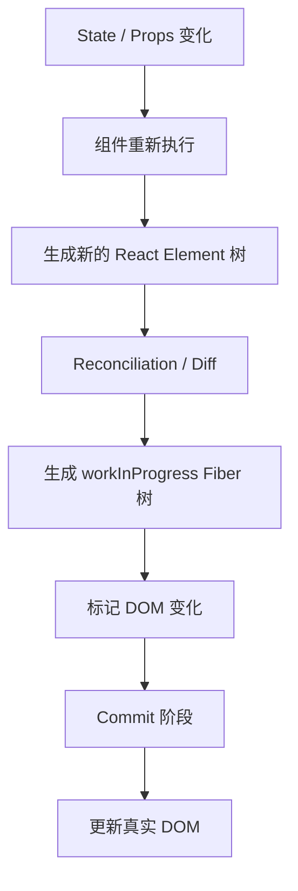

---

## 2. React 为什么需要 Diff？

### 问题

为什么 React 不直接重建整棵 DOM，而要做 Diff？

### 回答

因为真实 DOM 操作成本较高，尤其是大规模节点创建、删除、布局计算、样式重算和重绘。React 通过 Diff 先在 JavaScript 层面判断哪里发生了变化，再把必要变更提交给真实 DOM。

例如：

```tsx
// 中文注释：该示例聚焦当前机制，省略无关工程细节。
function App({ name }) {
  return (
    <div className="user-card">
      <h1>用户信息</h1>
      <p>{name}</p>
    </div>
  )
}
```

当 `name` 从 `'Alice'` 变成 `'Bob'` 时，真实需要变化的只是 `p` 里的文本：

```text
Alice -> Bob
```

如果直接重建整个 DOM，会多做很多没必要的操作：

```text
删除 div
删除 h1
删除 p
重新创建 div
重新创建 h1
重新创建 p
插入文本
```

React Diff 的目标是尽量变成：

```text
复用 div
复用 h1
复用 p
更新 p 的文本
```

所以 Diff 的核心价值是：

1. 减少真实 DOM 操作。
2. 保留可复用组件实例和状态。
3. 让声明式 UI 可以高效更新。
4. 为 Fiber 调度和分阶段渲染提供基础。

---

## 3. React Diff 的两个基本假设

### 问题

React 为什么能把树 Diff 的复杂度控制在可接受范围？

### 回答

如果对两棵树做完全通用的最小编辑距离计算，复杂度会很高，不适合 UI 高频更新。React 使用启发式策略，把复杂问题简化。

React Diff 主要依赖两个假设：

### 假设 1：不同类型的元素会产生不同的树

例如：

```tsx
// 中文注释：该示例聚焦当前机制，省略无关工程细节。
// old
<div>
  <Counter />
</div>

// new
<section>
  <Counter />
</section>
```

`div` 变成 `section`，React 会认为根节点类型不同，旧子树不能直接复用，于是卸载旧的 `div` 子树，再挂载新的 `section` 子树。

即使里面都有 `<Counter />`，React 也不会跨层去寻找“看起来一样”的节点进行复用。

### 假设 2：开发者可以通过 `key` 告诉 React 哪些子节点是稳定的

例如：

```tsx
// 中文注释：该示例聚焦当前机制，省略无关工程细节。
{list.map(item => (
  <li key={item.id}>{item.name}</li>
))}
```

`key` 告诉 React：

```text
即使位置变化，只要 key 一样，它就是同一个业务节点。
```

这两个假设让 React 能用近似 `O(n)` 的方式处理常见 UI 更新，而不是进行昂贵的通用树 Diff。

---

## 4. React 更新链路总览

### 问题

从 `setState` 到真实 DOM 更新，React 大概经历哪些阶段？

### 回答

React 的更新大体可以分成两个大阶段：

1. Render 阶段：计算变化，构建新的 Fiber 树，可被调度、暂停、恢复。
2. Commit 阶段：把变化一次性提交到宿主环境，例如浏览器 DOM。

流程如下：

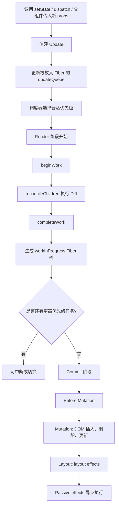

### Render 阶段做什么？

Render 阶段主要做计算：

- 执行函数组件。
- 调用类组件的 render。
- 生成新的 React Element。
- 对比新 Element 和旧 Fiber。
- 创建或复用 Fiber。
- 给 Fiber 标记需要执行的副作用。

Render 阶段一般不直接操作 DOM。

### Commit 阶段做什么？

Commit 阶段执行真实副作用：

- 插入 DOM。
- 删除 DOM。
- 更新 DOM 属性。
- 更新文本节点。
- 执行 ref。
- 执行 effect 的创建和销毁。

可以这样总结：

```text
Render 阶段：算出要改什么。
Commit 阶段：真正去改 DOM。
```

---

## 5. React Element、Fiber、DOM 的关系

### 问题

React Diff 比较的是 React Element，还是 Fiber，还是 DOM？

### 回答

严格来说，React 的协调过程是用“新的 React Element”去和“旧的 Fiber”进行比较，然后生成新的 workInProgress Fiber 树。最终 Commit 阶段才会操作真实 DOM。

三者关系如下：

```text
React Element：描述 UI 长什么样，是轻量对象。
Fiber：React 内部工作单元，保存组件状态、DOM 引用、更新队列、副作用标记等。
DOM：浏览器真实节点。
```

图示：

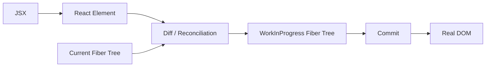


Mermaid 图强调更新链路，本地图进一步区分三类对象的职责：Element 是不可变描述，Fiber 是可变工作单元，DOM 是 Commit 阶段更新的宿主节点。

### React Element 示例

JSX：

```tsx
// 中文注释：该示例聚焦当前机制，省略无关工程细节。
<div className="box">hello</div>
```

可以近似理解为：

```js
// 中文注释：该示例聚焦当前机制，省略无关工程细节。
{
  type: 'div',
  key: null,
  props: {
    className: 'box',
    children: 'hello'
  }
}
```

React Element 是不可变描述对象。每次 render 都会产生新的 Element。

### Fiber 示例

Fiber 可以近似理解为（字段已简化）：

```js
// 中文注释：该示例聚焦当前机制，省略无关工程细节。
{
  type: 'div',
  key: null,
  stateNode: HTMLDivElement,
  child: childFiber,
  sibling: siblingFiber,
  return: parentFiber,
  alternate: oldFiber,
  flags: Update | Placement,
  memoizedProps: oldProps,
  pendingProps: newProps
}
```

其中：

| 字段 | 含义 |
|---|---|
| `type` | 节点类型，例如 `'div'` 或函数组件 |
| `key` | 子节点身份标识 |
| `stateNode` | 对应真实 DOM 或类组件实例 |
| `child` | 第一个子 Fiber |
| `sibling` | 下一个兄弟 Fiber |
| `return` | 父 Fiber |
| `alternate` | current 和 workInProgress 之间的对应关系 |
| `flags` | 本节点需要执行的副作用 |
| `memoizedProps` | 上次渲染的 props |
| `pendingProps` | 本次渲染的新 props |

---

## 6. React Diff 的整体流程

### 问题

React Diff 从整体上怎么走？

### 回答

React 的 Diff 可以从 `beginWork` 开始理解。每个 Fiber 在 render 阶段都会经历 `beginWork`，它会根据当前 Fiber 类型决定如何更新。

简化流程：

```text
beginWork(current, workInProgress)
  ↓
根据 workInProgress.tag 判断节点类型
  ↓
函数组件：执行函数，得到 children
类组件：调用 render，得到 children
原生 DOM 节点：读取 pendingProps.children
  ↓
调用 reconcileChildren
  ↓
根据 children 类型进入单节点、文本节点、数组节点等 Diff
  ↓
返回子 Fiber
```

图示：

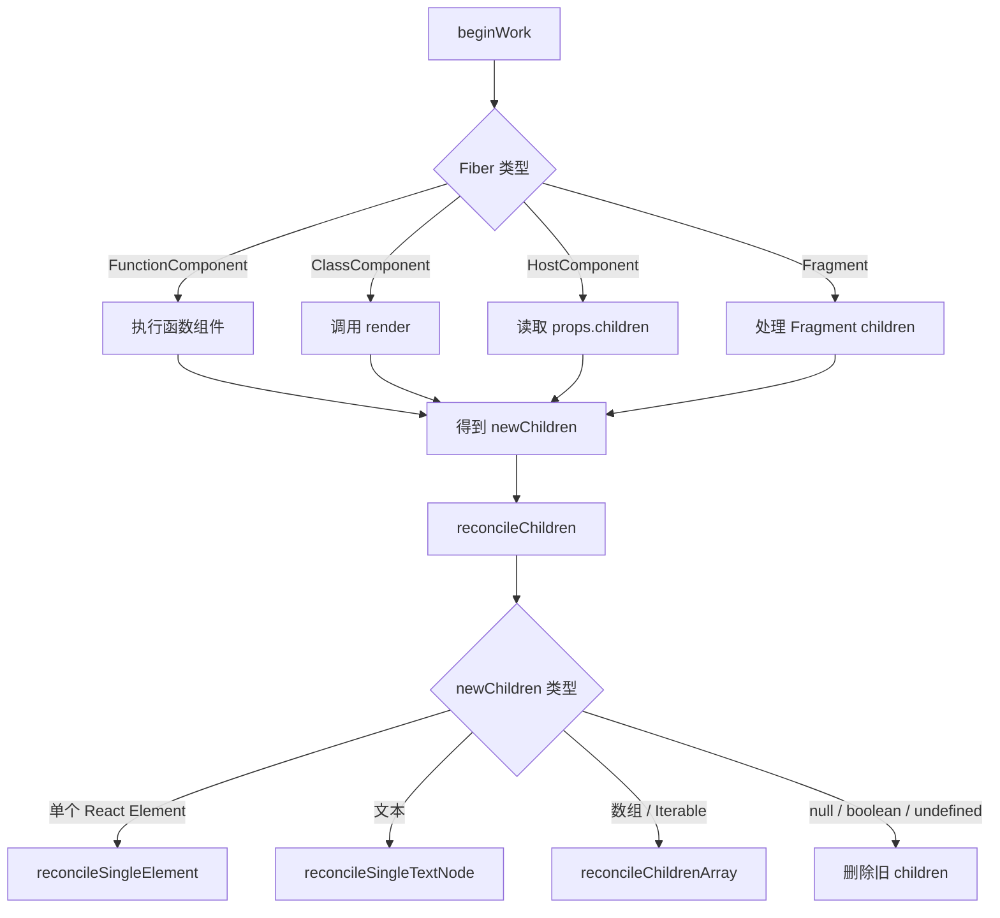

### 新旧节点能复用的核心条件

React 判断一个节点能不能复用，主要看：

```text
key 是否相同
元素 type 是否相同
```

如果 `key` 和 `type` 都相同，通常可以复用旧 Fiber，只更新 props。

如果不同，旧 Fiber 就不能复用，React 会创建新 Fiber，并把旧 Fiber 标记为删除。

---

## 7. 单节点 Diff

### 问题

如果 children 只有一个节点，React 怎么 Diff？

### 回答

单节点 Diff 的核心逻辑是：拿新的单个 Element 和旧的第一个 child Fiber 以及其兄弟节点比较。

例如：

```tsx
// 中文注释：该示例聚焦当前机制，省略无关工程细节。
// old
<div>
  <span key="a">A</span>
</div>

// new
<div>
  <span key="a">B</span>
</div>
```

React 会比较：

```text
old child: type = span, key = a
new child: type = span, key = a
```

两者相同，可以复用旧 Fiber 和真实 DOM，只更新文本。

### 7.1 key 相同，type 相同

```text
old: <span key="a">A</span>
new: <span key="a">B</span>
```

处理：

```text
复用旧 Fiber
复用旧 DOM
更新 props / children
```

图示：

```text
old Fiber(span, key=a) ──复用──> new Fiber(span, key=a)
old DOM <span>         ──复用──> new DOM <span>
文本 A                 ──更新──> 文本 B
```

### 7.2 key 相同，type 不同

```text
old: <span key="a">A</span>
new: <div key="a">A</div>
```

处理：

```text
key 相同但 type 不同
旧 span 不能复用
删除旧 span
创建新 div
```

### 7.3 key 不同

```text
old: <span key="a">A</span>
new: <span key="b">A</span>
```

处理：

```text
key 不同
React 认为它们不是同一个节点
删除旧 key=a 的 span
创建新 key=b 的 span
```

### 7.4 新节点为空

```tsx
// 中文注释：该示例聚焦当前机制，省略无关工程细节。
function App({ show }) {
  return <div>{show ? <Child /> : null}</div>
}
```

当 `show` 从 `true` 变成 `false`：

```text
newChild = null
```

React 会删除旧 child Fiber，对应 DOM 也会在 Commit 阶段被移除。

---

## 8. 多节点 Diff：数组 children 的完整流程

### 问题

React 如何处理数组 children，比如 `list.map(...)` 生成的列表？

### 回答

数组 children 是 React Diff 中最关键的部分。React 的数组 Diff 可以分成两个阶段：

1. 第一轮：按顺序从左到右逐个比较，能复用就继续，不能复用就停止。
2. 第二轮：把剩余旧节点放进 Map，然后遍历剩余新节点，通过 key 或 index 查找可复用旧节点。

整体流程图：

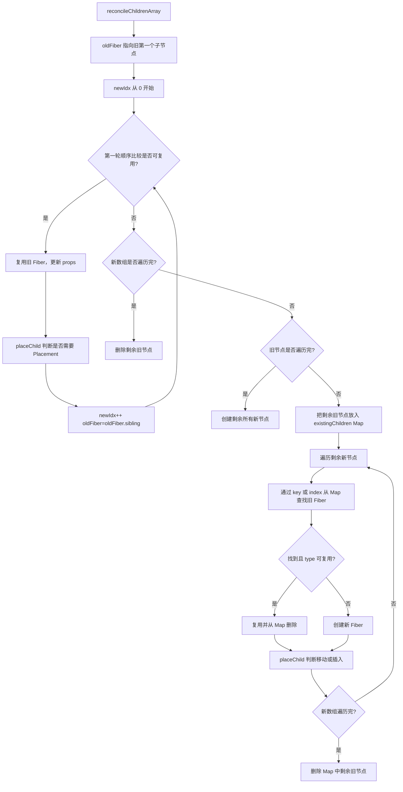

---

### 8.1 第一轮：按顺序比较

React 会从左到右，按新旧列表的相同位置比较。

例如：

```text
old: [A, B, C]
new: [A, B, D]
```

第一轮：

```text
old[0] A 和 new[0] A：key/type 相同，复用
old[1] B 和 new[1] B：key/type 相同，复用
old[2] C 和 new[2] D：key/type 不同，停止第一轮
```

图示：

```text
old: [ A ][ B ][ C ]
new: [ A ][ B ][ D ]
       ✅   ✅   ❌
```

这一轮主要优化“前缀稳定”的场景。

---

### 8.2 第一轮之后：新数组已经结束

如果新数组已经遍历完，说明旧数组还有多余节点，需要删除。

例如：

```text
old: [A, B, C, D]
new: [A, B]
```

第一轮比较：

```text
A 复用
B 复用
new 已结束
```

剩余旧节点：

```text
C、D 删除
```

图示：

```text
old: [ A ][ B ][ C ][ D ]
new: [ A ][ B ]
       ✅   ✅   🗑️   🗑️
```

---

### 8.3 第一轮之后：旧数组已经结束

如果旧数组已经遍历完，说明新数组还有剩余节点，需要创建。

例如：

```text
old: [A, B]
new: [A, B, C, D]
```

第一轮比较：

```text
A 复用
B 复用
old 已结束
```

剩余新节点：

```text
C、D 创建并插入
```

图示：

```text
old: [ A ][ B ]
new: [ A ][ B ][ C ][ D ]
       ✅   ✅   ➕   ➕
```

---

### 8.4 第一轮中断：建立剩余旧节点 Map

如果第一轮在中间中断，并且新旧数组都没结束，React 会把剩余旧 Fiber 放进 Map。

例如：

```text
old: [A, B, C, D]
new: [A, C, B, E]
```

第一轮：

```text
old[0] A 和 new[0] A：复用
old[1] B 和 new[1] C：不匹配，中断
```

剩余旧节点：

```text
[B, C, D]
```

建立 Map：

```js
// 中文注释：该示例聚焦当前机制，省略无关工程细节。
existingChildren = {
  B.key -> oldFiber(B),
  C.key -> oldFiber(C),
  D.key -> oldFiber(D)
}
```

如果旧节点没有 key，则用它原来的 index 作为 Map key。

图示：

```text
old remaining: [ B ][ C ][ D ]
                 │    │    │
                 ▼    ▼    ▼
Map:           B ->  C ->  D ->
```

---

### 8.5 第二轮：遍历剩余新节点，从 Map 中寻找可复用节点

继续上面的例子：

```text
old: [A, B, C, D]
new: [A, C, B, E]
```

第一轮已经处理了 `A`，剩余新节点：

```text
[C, B, E]
```

React 遍历新剩余节点：

#### 处理新节点 C

```text
从 Map 中找到旧 C
key/type 相同
复用旧 C
从 Map 中删除 C
```

#### 处理新节点 B

```text
从 Map 中找到旧 B
key/type 相同
复用旧 B
从 Map 中删除 B
```

#### 处理新节点 E

```text
Map 中找不到 E
创建新 Fiber E
```

最后 Map 还剩：

```text
D
```

说明旧 D 在新列表中不存在，需要删除。

最终结果：

```text
A 复用
C 复用
B 复用，但可能需要移动
E 新增
D 删除
```

---

## 9. `key` 在 React Diff 中的作用

### 问题

React 中 `key` 到底有什么用？

### 回答

`key` 的核心作用是标识兄弟节点之间的稳定身份。React 用 `key` 判断新旧 children 中哪些节点是同一个业务实体。

例如：

```tsx
// 中文注释：该示例聚焦当前机制，省略无关工程细节。
const users = [
  { id: 1, name: 'Alice' },
  { id: 2, name: 'Bob' },
  { id: 3, name: 'Cindy' }
]

function UserList() {
  return users.map(user => (
    <li key={user.id}>{user.name}</li>
  ))
}
```

当列表从：

```text
[Alice, Bob, Cindy]
```

变成：

```text
[Cindy, Alice, Bob]
```

React 可以通过 `key` 知道：

```text
id=3 的 Cindy 还是 Cindy，只是位置变了。
id=1 的 Alice 还是 Alice，只是位置变了。
id=2 的 Bob 还是 Bob，只是位置变了。
```

如果没有 key，React 只能更多地依赖位置来判断，容易产生错误复用。

### key 的几个重要特点

| 特点 | 说明 |
|---|---|
| 只在兄弟节点之间比较 | 不需要全局唯一，但同一层 siblings 中必须稳定唯一 |
| 不会作为普通 props 传给组件 | 组件内部不能通过 `props.key` 读取 |
| 影响状态保留 | key 变化会让 React 认为是新节点，旧状态会被重置 |
| 影响列表复用 | key 稳定时，移动、插入、删除更准确 |

---

## 10. React 如何判断节点移动

### 问题

React 怎么判断列表中的节点是否需要移动？

### 回答

React 使用一个变量 `lastPlacedIndex` 维护已确认稳定的旧索引边界：


图中的 `A C B E` 例子说明：`C` 先把边界推进到旧索引 `2`，随后遇到旧索引为 `1` 的 `B`，便需要给 `B` 标记 `Placement`。这是一种启发式移动判断，不保证得到全局最少 DOM 移动次数。

它表示：到目前为止，已经处理过的新列表节点中，它们在旧列表中出现过的最大位置。

当 React 复用一个旧 Fiber 时，会拿这个旧 Fiber 的旧下标 `oldIndex` 和 `lastPlacedIndex` 比较：

```text
如果 oldIndex < lastPlacedIndex
  说明这个节点在旧列表中的位置落后于前面已经处理过的节点
  它需要移动，标记 Placement

如果 oldIndex >= lastPlacedIndex
  说明它可以留在原地
  更新 lastPlacedIndex = oldIndex
```

可以用伪代码表示（简化示意，并非 React 源码原文）：

```js
function placeChild(newFiber, lastPlacedIndex, newIndex) {
  newFiber.index = newIndex

  const current = newFiber.alternate

  if (current !== null) {
    const oldIndex = current.index

    if (oldIndex < lastPlacedIndex) {
      // 需要移动
      newFiber.flags |= Placement
      return lastPlacedIndex
    } else {
      // 不需要移动
      return oldIndex
    }
  } else {
    // 新节点，需要插入
    newFiber.flags |= Placement
    return lastPlacedIndex
  }
}
```

### 示例：只需要更新，不需要移动

```text
old: [A, B, C]
new: [A, B, C]
```

旧下标序列：

```text
A: 0
B: 1
C: 2
```

处理新列表时：

```text
A oldIndex = 0 >= lastPlacedIndex 0，不移动
B oldIndex = 1 >= lastPlacedIndex 0，不移动，lastPlacedIndex = 1
C oldIndex = 2 >= lastPlacedIndex 1，不移动，lastPlacedIndex = 2
```

### 示例：发生移动

```text
old: [A, B]
new: [B, A]
```

处理 `B`：

```text
B oldIndex = 1 >= lastPlacedIndex 0
B 不标记移动
lastPlacedIndex = 1
```

处理 `A`：

```text
A oldIndex = 0 < lastPlacedIndex 1
A 标记 Placement，需要移动
```

图示：

```text
old: [ A ][ B ]
new: [ B ][ A ]
       ↑    ↑
       │    └ A 的 oldIndex 0 小于 lastPlacedIndex 1，需要移动
       └ B 先被处理，lastPlacedIndex 变成 1
```

注意：React 的 `Placement` 同时表示“插入新节点”或“移动已有节点”，具体在 Commit 阶段根据 Fiber 是否已有 DOM 来处理。

---

## 11. React 列表 Diff 完整示例

### 问题

能用一个完整例子说明 React 列表 Diff 吗？

### 回答

看这个例子：

```text
old: [A, B, C, D]
new: [A, C, B, E]
```

每个字母都表示一个有稳定 key 的节点。

---

### 11.1 初始化

```text
oldFiber -> A
newIdx = 0
lastPlacedIndex = 0
```

---

### 11.2 第一轮顺序比较

#### 比较 A

```text
old[0] = A
new[0] = A
key/type 相同，复用
```

移动判断：

```text
A oldIndex = 0
0 >= lastPlacedIndex 0
A 不移动
lastPlacedIndex = 0
```

继续：

```text
oldFiber -> B
newIdx = 1
```

#### 比较 B 和 C

```text
old[1] = B
new[1] = C
key 不同，中断第一轮
```

图示：

```text
old: [ A ][ B ][ C ][ D ]
new: [ A ][ C ][ B ][ E ]
       ✅   ❌
```

---

### 11.3 建立剩余旧节点 Map

剩余旧节点：

```text
[B, C, D]
```

建立 Map：

```js
// 中文注释：该示例聚焦当前机制，省略无关工程细节。
existingChildren = {
  B: oldFiber(B, index=1),
  C: oldFiber(C, index=2),
  D: oldFiber(D, index=3)
}
```

---

### 11.4 第二轮处理剩余新节点

剩余新节点：

```text
[C, B, E]
```

#### 处理 C

```text
Map 中找到 C
复用 C
删除 Map 中的 C
```

移动判断：

```text
C oldIndex = 2
2 >= lastPlacedIndex 0
C 不移动
lastPlacedIndex = 2
```

#### 处理 B

```text
Map 中找到 B
复用 B
删除 Map 中的 B
```

移动判断：

```text
B oldIndex = 1
1 < lastPlacedIndex 2
B 标记 Placement，需要移动
lastPlacedIndex 仍然是 2
```

#### 处理 E

```text
Map 中找不到 E
创建新 Fiber E
E 标记 Placement，需要插入
```

---

### 11.5 删除剩余旧节点

Map 中剩余：

```text
D
```

说明 `D` 在新列表中不存在，标记删除。

---

### 11.6 最终操作总结

| 节点 | 操作 |
|---|---|
| A | 复用，不移动 |
| C | 复用，不移动 |
| B | 复用，移动 |
| E | 新增 |
| D | 删除 |

图示：

```text
old: [ A ][ B ][ C ][ D ]
new: [ A ][ C ][ B ][ E ]
       │    │    │    │
       │    │    │    └ 新增 E
       │    │    └ B 复用但移动
       │    └ C 复用
       └ A 复用

D 在 new 中不存在 -> 删除
```

---

## 12. 没有 key 或使用 index 作为 key 的问题

### 问题

为什么 React 不推荐在动态列表中使用 index 作为 key？

### 回答

因为 index 表示的是“位置”，不是“业务身份”。当列表插入、删除、排序时，同一个 index 对应的数据可能已经变了，这会导致组件状态和 DOM 状态错误复用。

### 12.1 使用 index 作为 key 的错误示例

```tsx
// 中文注释：该示例聚焦当前机制，省略无关工程细节。
function TodoList({ todos }) {
  return todos.map((todo, index) => (
    <TodoItem key={index} todo={todo} />
  ))
}
```

旧列表：

```text
index 0 -> A
index 1 -> B
index 2 -> C
```

在头部插入 D 后：

```text
index 0 -> D
index 1 -> A
index 2 -> B
index 3 -> C
```

React 根据 key 判断：

```text
key=0 还是同一个节点
key=1 还是同一个节点
key=2 还是同一个节点
```

但业务上已经变成：

```text
原来 key=0 是 A，现在 key=0 是 D
原来 key=1 是 B，现在 key=1 是 A
原来 key=2 是 C，现在 key=2 是 B
```

这会导致：

1. 输入框内容错位。
2. 组件内部 state 错位。
3. 动画状态错位。
4. 焦点状态错位。
5. 表单校验状态错位。

---

### 12.2 正确做法

使用稳定唯一的业务 id：

```tsx
// 中文注释：该示例聚焦当前机制，省略无关工程细节。
function TodoList({ todos }) {
  return todos.map(todo => (
    <TodoItem key={todo.id} todo={todo} />
  ))
}
```

这样 React 可以正确识别：

```text
id=1 始终是同一个 todo
id=2 始终是同一个 todo
id=3 始终是同一个 todo
```

---

### 12.3 什么时候可以使用 index？

满足这些条件时可以考虑：

1. 列表是静态的。
2. 不会插入、删除、排序。
3. 列表项内部没有需要保留的局部状态。
4. 不涉及输入框、动画、焦点等状态。

如果列表会动态变化，应避免使用 index。

---

## 13. React Diff 与组件状态保留

### 问题

React 如何决定组件状态是保留还是重置？

### 回答

React 会根据组件在 UI 树中的位置、组件类型和 key 来决定是否保留状态。

### 13.1 同位置、同类型、同 key：保留状态

```tsx
// 中文注释：该示例聚焦当前机制，省略无关工程细节。
function App({ mode }) {
  return (
    <div>
      {mode === 'edit' ? <Counter /> : <Counter />}
    </div>
  )
}
```

虽然条件不同，但渲染结果在同一个位置都是 `<Counter />`，React 会认为它是同一个组件，状态会保留。

```text
old: position 0 -> Counter
new: position 0 -> Counter
结果：保留 state
```

---

### 13.2 同位置、不同类型：重置状态

```tsx
// 中文注释：该示例聚焦当前机制，省略无关工程细节。
function App({ mode }) {
  return (
    <div>
      {mode === 'edit' ? <EditForm /> : <Preview />}
    </div>
  )
}
```

`EditForm` 和 `Preview` 类型不同：

```text
old: position 0 -> EditForm
new: position 0 -> Preview
```

React 会卸载旧组件，挂载新组件，旧状态丢失。

---

### 13.3 同类型但 key 不同：重置状态

```tsx
// 中文注释：该示例聚焦当前机制，省略无关工程细节。
function Profile({ userId }) {
  return <UserForm key={userId} userId={userId} />
}
```

当 `userId` 从 `1` 变成 `2` 时：

```text
old: UserForm key=1
new: UserForm key=2
```

虽然组件类型都是 `UserForm`，但 key 不同，React 会认为它们不是同一个组件，于是重置状态。

这常用于主动清空表单状态：

```tsx
// 中文注释：该示例聚焦当前机制，省略无关工程细节。
<UserForm key={selectedUserId} userId={selectedUserId} />
```

当切换用户时，表单内部 state 会重新初始化。

---

### 13.4 key 不只是列表中能用

`key` 不只用于 `map` 列表，也可以用于任何需要控制状态保留或重置的组件位置。

例如：

```tsx
// 中文注释：该示例聚焦当前机制，省略无关工程细节。
function Chat({ contact }) {
  return <ChatInput key={contact.id} contact={contact} />
}
```

当切换联系人时，输入框草稿会被清空，避免把 A 的草稿误发给 B。

---

## 14. React Diff 与 Fiber 架构

### 问题

React Fiber 和 Diff 算法是什么关系？

### 回答

Fiber 是 React 的内部架构，也是执行 Diff 的基本工作单元。旧版本 React 的递归更新一旦开始就很难中断，而 Fiber 把更新拆成一个个可处理的单元，使 React 能够进行优先级调度、暂停、恢复和丢弃低优先级工作。

### 14.1 Fiber 解决了什么问题？

假设有一个很大的组件树：

```text
App
 ├─ Header
 ├─ Sidebar
 ├─ Content
 │   ├─ List
 │   │   ├─ Item 1
 │   │   ├─ Item 2
 │   │   └─ Item 1000
 └─ Footer
```

如果一次性同步递归更新整棵树，主线程可能长时间被占用，导致页面卡顿。

Fiber 的思路是：

```text
把整棵树拆成很多 Fiber 节点
每个 Fiber 是一个工作单元
根据优先级分段执行
必要时暂停低优先级工作
优先响应用户输入等高优先级任务
```

---

### 14.2 Fiber 双缓冲树


`current` 保存已提交版本，`workInProgress` 用于计算下一版本；两者通过 `alternate` 对应。只有完整完成 Render 的工作才会进入 Commit，不能把双缓冲理解为页面上同时存在两份 DOM。

React 内部通常有两棵 Fiber 树：

| Fiber 树 | 含义 |
|---|---|
| current tree | 当前屏幕上已经显示的 Fiber 树 |
| workInProgress tree | 本次更新正在构建的新 Fiber 树 |

它们通过 `alternate` 相互关联。

图示：

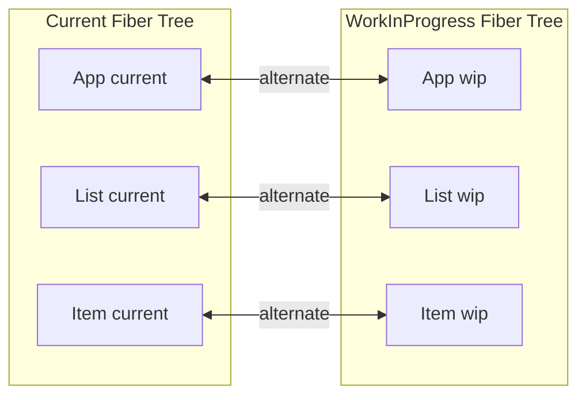

Diff 过程就是根据新的 React Element，尽量复用 current Fiber，构建 workInProgress Fiber。

---

### 14.3 Fiber 上的 flags

在 Diff 过程中，React 不会立即操作 DOM，而是在 Fiber 上打标记。

常见标记包括：

| 标记 | 含义 |
|---|---|
| `Placement` | 需要插入或移动 |
| `Update` | 需要更新属性、文本或 ref |
| `ChildDeletion` / deletion list | 需要删除子节点 |
| `Passive` | 有 passive effect，例如 `useEffect` |
| `Ref` | ref 需要更新 |

简图：

```text
Diff 阶段：
Fiber(A) flags = NoFlags
Fiber(B) flags = Placement
Fiber(C) flags = Update
Fiber(D) flags = Deletion

Commit 阶段：
根据 flags 执行真实 DOM 操作
```


---

### 14.4 Fiber 架构要解决的核心问题

React Fiber 不是单纯为了 Diff 写出来的数据结构，它解决的是 React 更新过程的可调度问题。

在早期 React 中，更新组件树更接近递归调用：

```text
render App
  render Header
  render Content
    render List
      render Item 1
      render Item 2
      render Item 3
      ...
```

这种递归更新有一个明显问题：

```text
一旦开始，就很难暂停。
```

如果组件树很大，React 在一次同步递归中处理太久，浏览器主线程会被占用，用户输入、动画、滚动等任务就可能卡顿。

Fiber 的核心思路是：

```text
把递归更新拆成一个个可中断、可恢复、可丢弃的工作单元。
```

可以把 Fiber 理解为 React 自己实现的一种“虚拟调用栈帧”。每个 Fiber 节点就是一个工作单元，React 可以处理一个 Fiber，看看当前是否还有时间；如果没有时间，就先把控制权还给浏览器，之后再继续处理。

图示：

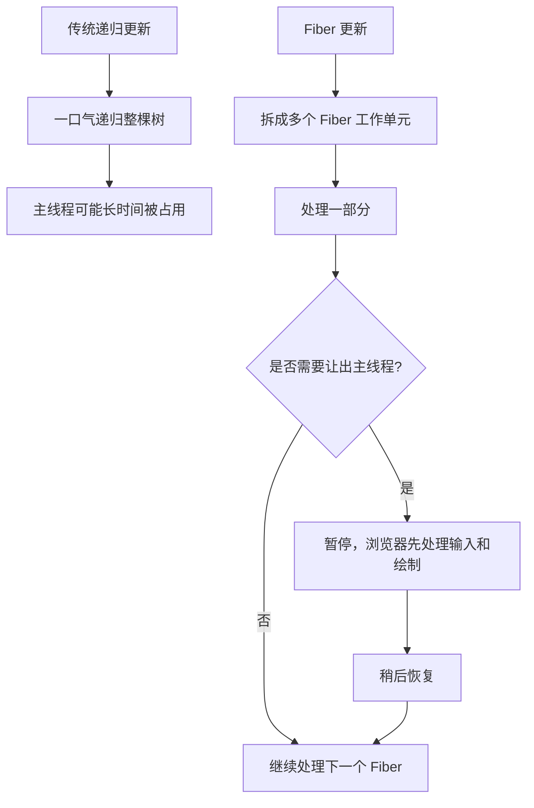

---

### 14.5 Fiber 节点到底是什么？

Fiber 节点是 React 内部用来表示一个组件、一个 DOM 节点、一个文本节点、一个 Fragment 等 UI 单元的数据结构。

React Element 是“本次 render 产生的 UI 描述”，Fiber 是“React 内部可持久化的工作单元”。

对比：

| 对象 | 生命周期 | 作用 |
|---|---|---|
| React Element | 每次 render 新生成，轻量且不可变 | 描述 UI 应该长什么样 |
| Fiber | React 内部维护，可在更新间复用 | 保存状态、引用、更新队列、调度信息、副作用标记 |
| DOM | 浏览器真实节点 | 页面上真正显示的节点 |

一个 Fiber 节点可以近似理解为：

```js
const fiber = {
  // 节点身份相关
  tag,              // Fiber 类型，例如 FunctionComponent、HostComponent
  type,             // 具体类型，例如 div、span、App 函数
  elementType,      // 原始元素类型，和 lazy、memo 等有关
  key,              // key，用于同层 children 复用

  // 树结构相关
  return,           // 父 Fiber
  child,            // 第一个子 Fiber
  sibling,          // 下一个兄弟 Fiber
  index,            // 在兄弟节点中的位置

  // 实例相关
  stateNode,        // DOM 节点、类组件实例或 root 对象
  ref,              // ref 信息

  // props / state 相关
  pendingProps,     // 本次更新的新 props
  memoizedProps,    // 上次完成渲染后的 props
  memoizedState,    // 当前 Fiber 保存的 state，函数组件 hooks 也挂在这里
  updateQueue,      // 更新队列，例如 setState/useState 产生的 update

  // 双缓冲相关
  alternate,        // current Fiber 和 workInProgress Fiber 互相指向

  // 副作用相关
  flags,            // 当前 Fiber 自身的副作用标记
  subtreeFlags,     // 子树中的副作用标记汇总
  deletions,        // 需要删除的子 Fiber 列表

  // 调度优先级相关
  lanes,            // 当前 Fiber 上待处理更新的优先级集合
  childLanes        // 子树中待处理更新的优先级集合
}
```

不用逐个字段记死，但要理解几个关键点：

```text
child / sibling / return：把树变成可遍历的链表结构。
alternate：实现 current 树和 workInProgress 树的双缓冲。
flags / subtreeFlags：记录本轮更新需要提交的副作用。
lanes / childLanes：记录更新优先级。
memoizedState / updateQueue：保存状态和更新队列。
```

---

### 14.6 Fiber 树为什么不用普通 children 数组？

React Fiber 树不是用 `children: []` 保存所有子节点，而是使用：

```text
child：第一个子节点
sibling：下一个兄弟节点
return：父节点
```

例如这棵 UI 树：

```tsx
// 中文注释：该示例聚焦当前机制，省略无关工程细节。
<App>
  <Header />
  <Main>
    <Article />
    <Aside />
  </Main>
  <Footer />
</App>
```

Fiber 链表结构大概是：

```text
App
 ├─ child -> Header
 │            └─ sibling -> Main
 │                           ├─ child -> Article
 │                           │             └─ sibling -> Aside
 │                           └─ sibling -> Footer
```

更完整的指针关系：

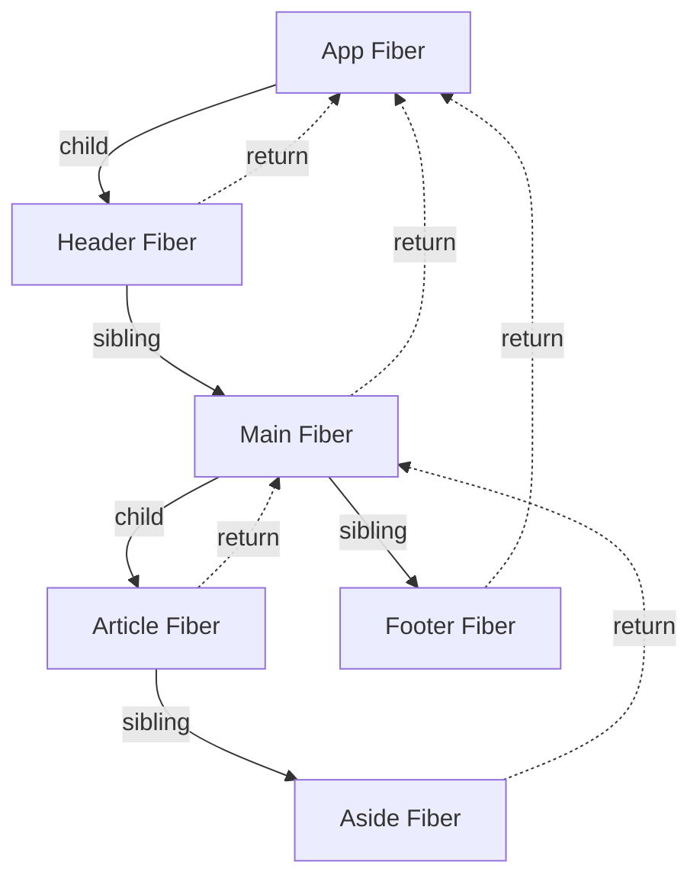

这种结构的好处是：React 可以用循环模拟递归遍历，方便暂停和恢复。

传统递归依赖 JavaScript 调用栈：

```text
App -> Header -> Main -> Article -> Aside -> Footer
```

Fiber 让 React 自己掌控遍历过程：

```text
performUnitOfWork(fiber)
  ↓
做 beginWork
  ↓
如果有 child，下一个工作单元就是 child
  ↓
如果没有 child，就 complete 当前节点
  ↓
如果有 sibling，下一个工作单元就是 sibling
  ↓
如果没有 sibling，就回到 return
```

---

### 14.7 Fiber 的遍历过程：`beginWork` 和 `completeWork`

Render 阶段处理 Fiber 树时，每个 Fiber 大体会经过两个步骤：

```text
beginWork：向下阶段，处理当前节点，并生成 / 复用子 Fiber。
completeWork：向上阶段，完成当前节点，收集副作用，准备 DOM 信息。
```

流程图：

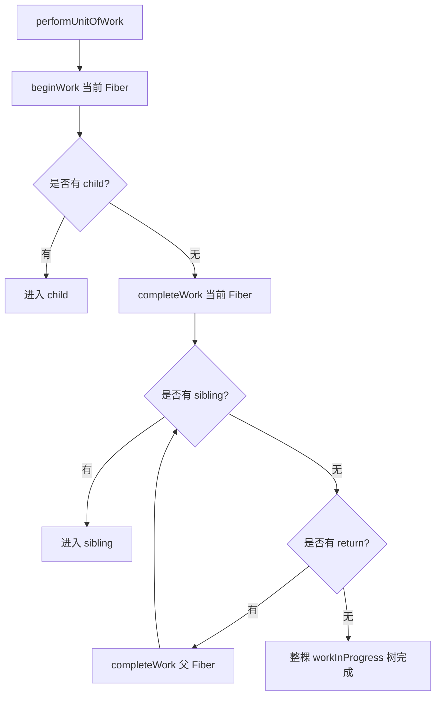

### `beginWork` 做什么？

`beginWork` 负责“往下走”，主要做：

1. 根据 Fiber 类型执行不同更新逻辑。
2. 函数组件会执行函数，得到新的 children。
3. 类组件会处理 updateQueue，然后调用 render。
4. 原生 DOM 节点会读取 `props.children`。
5. 调用 `reconcileChildren` 对比新 children 和旧 Fiber children。
6. 返回下一个要处理的子 Fiber。

简化流程：

```text
beginWork
  ↓
根据 tag 判断 FunctionComponent / ClassComponent / HostComponent
  ↓
计算 nextChildren
  ↓
reconcileChildren current.child 和 nextChildren
  ↓
返回 workInProgress.child
```

### `completeWork` 做什么？

`completeWork` 负责“往上收尾”，主要做：

1. 对首次挂载的 HostComponent 创建 DOM 节点。
2. 把子 DOM 节点 append 到父 DOM 节点。
3. 更新时准备属性更新 payload。
4. 汇总子树的 `subtreeFlags`。
5. 把当前 Fiber 的完成结果交给父 Fiber。

简化流程：

```text
completeWork
  ↓
如果是新 DOM 节点，创建 DOM
  ↓
把子 DOM 挂到当前 DOM 上
  ↓
如果是更新，计算属性差异
  ↓
标记 Update 等 flags
  ↓
向父级返回
```

---

### 14.8 Fiber 双缓冲机制：current 与 workInProgress

React 内部维护两棵 Fiber 树：

```text
current tree：当前已经显示在页面上的 Fiber 树。
workInProgress tree：本次更新正在构建的新 Fiber 树。
```

它们通过 `alternate` 互相连接。

```text
current Fiber <-------- alternate --------> workInProgress Fiber
```

图示：

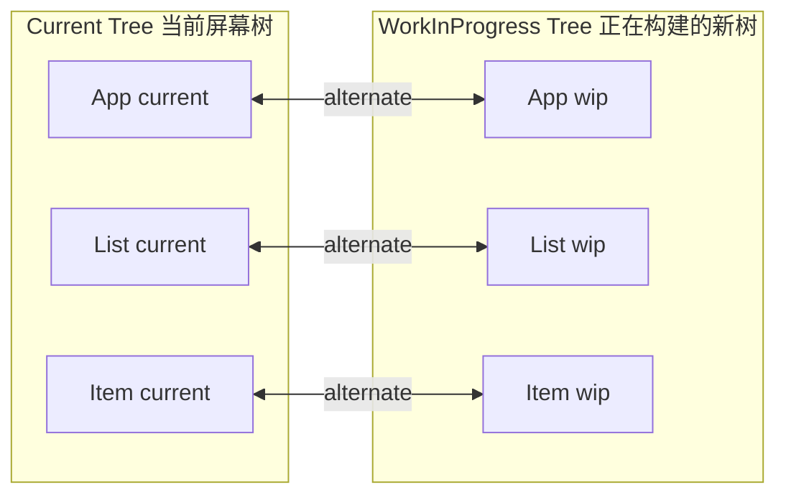

一次更新过程：

```text
1. 页面上显示的是 current tree。
2. 状态变化后，React 基于 current tree 创建 workInProgress tree。
3. Diff 过程中能复用的 Fiber，会通过 alternate 关联旧 Fiber。
4. workInProgress tree 构建完成后进入 Commit。
5. Commit 完成后，workInProgress tree 变成新的 current tree。
```

这种模式叫双缓冲，类似图形渲染中的前后缓冲：

```text
前台显示 current。
后台构建 workInProgress。
构建完成后一次性切换。
```

好处是：

1. Render 阶段可以被中断，不影响当前屏幕。
2. 如果低优先级更新被更高优先级更新打断，未完成的 workInProgress 可以丢弃或重做。
3. Commit 阶段可以一次性提交完整结果，避免页面显示中间状态。

---

### 14.9 Fiber 和 Diff 的关系

React Diff 的结果不是直接改 DOM，而是构建一棵新的 workInProgress Fiber 树，并在 Fiber 上记录变化。

例如：

```text
old: <li key="a">A</li>
new: <li key="a">B</li>
```

Diff 发现：

```text
key 相同
type 相同
可以复用旧 Fiber 和 DOM
但文本 children 变了
```

React 会：

```text
创建或复用 workInProgress Fiber
workInProgress.alternate 指向旧 Fiber
在 Fiber 上标记 Update
Commit 阶段更新文本
```

如果是新增：

```text
old: null
new: <li key="b">B</li>
```

React 会：

```text
创建新 Fiber
标记 Placement
Commit 阶段插入 DOM
```

如果是删除：

```text
old: <li key="c">C</li>
new: null
```

React 会：

```text
把旧 Fiber 放入 deletions
父 Fiber 标记 ChildDeletion
Commit 阶段删除 DOM，并执行卸载逻辑
```

所以 Fiber 是 Diff 的承载结构：

```text
React Element 告诉 React 新 UI 长什么样。
旧 Fiber 告诉 React 之前 UI 和状态是什么。
新 Fiber 记录本轮应该怎么更新。
```

---

### 14.10 Fiber 的 flags：Diff 结果如何记录？

Diff 过程中，React 会在 Fiber 上标记 flags。常见 flags 可以理解为：

| Flag | 含义 |
|---|---|
| `Placement` | 需要插入或移动 |
| `Update` | 需要更新 DOM 属性、文本、ref 等 |
| `ChildDeletion` | 有子节点需要删除 |
| `Passive` | 有 `useEffect` 这类 passive effect |
| `Ref` | ref 需要绑定或解绑 |
| `Visibility` | 和隐藏、显示相关，例如 Offscreen 场景 |

示例：

```text
old: [A, B, C]
new: [A, C, D]
```

Diff 结果可能是：

```text
A：复用，无 DOM 变化
C：复用，可能不移动
D：新增，Placement
B：删除，父 Fiber 记录 ChildDeletion，deletions 包含 B
```

图示：

```text
Parent Fiber
  flags: ChildDeletion
  deletions: [B]

A Fiber
  flags: NoFlags

C Fiber
  flags: NoFlags 或 Placement

D Fiber
  flags: Placement
```

`subtreeFlags` 用于快速判断子树里是否存在副作用。如果一棵子树没有任何 flags，Commit 阶段可以跳过很多无效遍历。

---

### 14.11 Fiber 的 lanes：优先级模型

React Fiber 不只是可中断，还支持优先级。现代 React 使用 lanes 表示更新优先级。

可以把 lane 理解为一条“更新车道”。不同类型更新会被放到不同 lane 中：

| 更新类型 | 优先级倾向 | 示例 |
|---|---|---|
| 同步更新 | 很高 | 受控输入、`flushSync` |
| 连续输入 | 较高 | 滚动、拖拽、鼠标移动 |
| 默认更新 | 普通 | 普通 `setState` |
| Transition 更新 | 较低 | `startTransition` 包裹的非紧急 UI 更新 |
| Idle 更新 | 很低 | 空闲任务 |

lane 通常用位掩码表示，一个 Fiber 上可以同时有多个 lane：

```text
lanes = 0b00010010
```

含义可以理解为：

```text
这个 Fiber 上有多个优先级的更新等待处理。
```

### lanes 如何影响更新？

当调用 `setState` 时：

```text
setState
  ↓
创建 update
  ↓
为 update 分配 lane
  ↓
把 lane 标记到当前 Fiber 和祖先 Fiber
  ↓
调度 root
  ↓
React 根据优先级选择要处理的 lanes
```

图示：

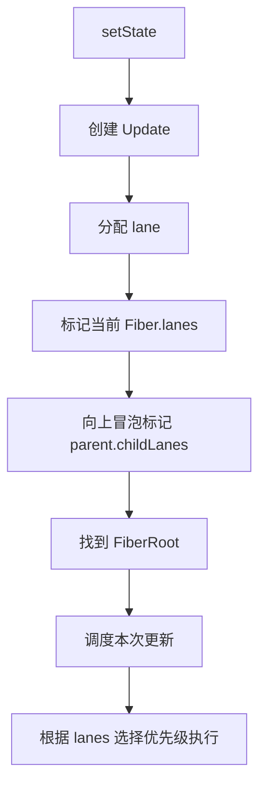

### lanes 和可中断渲染的关系

如果一个低优先级更新正在进行，比如渲染一个很大的列表：

```text
startTransition(() => setList(bigList))
```

这时用户突然在输入框输入内容，React 可以优先处理输入相关的高优先级更新。低优先级渲染可以暂停、丢弃或稍后继续。

可以这样理解：

```text
Fiber 让工作可以被拆分。
lanes 决定哪些工作更重要。
Scheduler 决定什么时候执行这些工作。
```

---

### 14.12 Fiber 的调度链路

一次更新从触发到执行，大体链路如下：

```text
setState / dispatch
  ↓
创建 Update 对象
  ↓
加入 updateQueue
  ↓
为更新分配 lane
  ↓
从当前 Fiber 向上找到 FiberRoot
  ↓
把 lane 冒泡到父级 childLanes
  ↓
调度 root
  ↓
执行 renderRootSync 或 renderRootConcurrent
  ↓
workLoop 处理 Fiber 工作单元
  ↓
构建 workInProgress tree
  ↓
commitRoot
```

流程图：

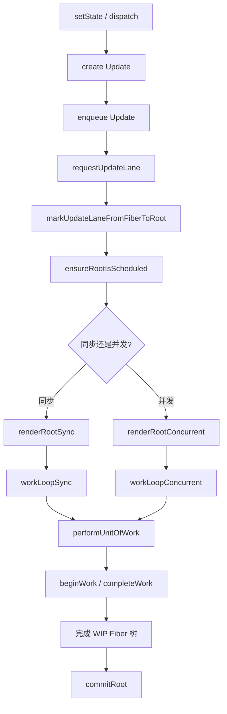

同步 work loop 类似：

```js
// 中文注释：该示例聚焦当前机制，省略无关工程细节。
function workLoopSync() {
  while (workInProgress !== null) {
    performUnitOfWork(workInProgress)
  }
}
```

并发 work loop 类似：

```js
// 中文注释：该示例聚焦当前机制，省略无关工程细节。
function workLoopConcurrent() {
  while (workInProgress !== null && !shouldYield()) {
    performUnitOfWork(workInProgress)
  }
}
```

关键区别：

```text
同步模式：一直处理到整棵树完成。
并发模式：处理一部分后，如果 shouldYield() 为 true，就让出主线程。
```

---

### 14.13 Render 阶段为什么要求纯净？

Fiber 架构下，Render 阶段可能被中断、重做或丢弃。因此 Render 阶段必须是纯计算，不应该产生不可逆副作用。

例如函数组件：

```tsx
function App() {
  // 不推荐：render 阶段直接修改外部变量或操作 DOM
  document.title = 'hello'

  return <div>Hello</div>
}
```

如果 Render 阶段被 React 重复执行，这个副作用也会重复发生，可能导致不可预测的问题。

正确做法是把副作用放到 effect 中：

```tsx
// 中文注释：该示例聚焦当前机制，省略无关工程细节。
function App() {
  React.useEffect(() => {
    document.title = 'hello'
  }, [])

  return <div>Hello</div>
}
```

原因可以总结为：

```text
Render 阶段可能执行多次，不保证最终提交。
Commit 阶段一旦开始，就会把最终结果提交到 DOM。
副作用应该放在 Commit 相关阶段。
```

---

### 14.14 Commit 阶段为什么不可中断？

Render 阶段可以中断，因为它主要是在内存中构建 workInProgress Fiber 树，没有真正改 DOM。

Commit 阶段不能中断，因为它要把 DOM 从旧状态切到新状态。如果中途暂停，页面可能出现不一致状态。

例如：

```text
需要同时更新：
Header 文案
List 内容
Footer 状态
```

如果 Commit 中途停在 List 更新之后，Footer 还没更新，用户就会看到半旧半新的界面。

所以 React 的设计是：

```text
Render 阶段：可中断、可重做、可丢弃。
Commit 阶段：同步、不可中断、尽快完成。
```

---

### 14.15 Fiber 与 Hooks 状态保存

函数组件没有类实例，那 `useState` 的状态存在哪里？答案是：挂在对应函数组件 Fiber 的 `memoizedState` 上。

多个 Hook 会形成链表：

```tsx
// 中文注释：该示例聚焦当前机制，省略无关工程细节。
function Counter() {
  const [count, setCount] = React.useState(0)
  const [name, setName] = React.useState('A')
  React.useEffect(() => {}, [])

  return <div>{count} - {name}</div>
}
```

Fiber 上可以理解为：

```text
FunctionComponent Fiber
  memoizedState -> Hook(useState count)
                    ↓ next
                   Hook(useState name)
                    ↓ next
                   Hook(useEffect)
```

图示：

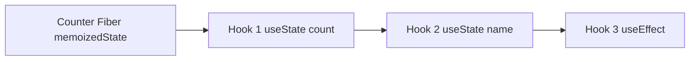

这也解释了为什么 Hooks 不能写在条件语句中：

```tsx
// 中文注释：该示例聚焦当前机制，省略无关工程细节。
function Counter({ enabled }) {
  const [a] = React.useState(1)

  if (enabled) {
    const [b] = React.useState(2)
  }

  const [c] = React.useState(3)
}
```

React 依赖 Hook 调用顺序来匹配链表节点。如果条件变化导致 Hook 顺序不同，React 就无法正确知道哪个 Hook 对应哪个状态。

```text
第一次：useState a -> useState b -> useState c
第二次：useState a -> useState c

链表位置错位，状态匹配错误。
```

---

### 14.16 Fiber 的 bailout：什么时候可以跳过子树？

Fiber 架构不意味着每次都要完整处理整棵树。React 会尽量 bailout，也就是跳过不需要更新的子树。

常见 bailout 条件包括：

1. 当前 Fiber 没有本轮需要处理的 lane。
2. props 没有变化。
3. state 没有变化。
4. context 没有变化。
5. 使用 `React.memo` 后比较结果相等。
6. 类组件 `shouldComponentUpdate` 返回 `false`。

例如：

```tsx
// 中文注释：该示例聚焦当前机制，省略无关工程细节。
const UserCard = React.memo(function UserCard({ user }) {
  return <div>{user.name}</div>
})
```

如果父组件更新，但传给 `UserCard` 的 `user` 引用没有变化，React 可以跳过 `UserCard` 子树。

图示：

```text
App 更新
 ├─ Header 需要更新
 ├─ UserCard props 未变 -> bailout，跳过子树
 └─ Footer 需要更新
```

bailout 的意义：

```text
减少 render 阶段工作量。
减少 Diff 范围。
减少不必要的 Fiber 构建。
```

---

### 14.17 Fiber 架构完整总结

React Fiber 可以从 5 个关键词理解：

| 关键词 | 含义 |
|---|---|
| 工作单元 | 每个 Fiber 是一个可处理的更新单元 |
| 链表树 | 通过 child、sibling、return 表示树，方便中断和恢复 |
| 双缓冲 | current tree 表示当前界面，workInProgress tree 表示正在构建的新界面 |
| 副作用标记 | Render 阶段只打 flags，Commit 阶段真正操作 DOM |
| 优先级调度 | lanes 表示更新优先级，使 React 能优先处理紧急更新 |

完整链路可以压缩成：

```text
setState 产生 update
  ↓
update 获得 lane
  ↓
lane 冒泡到 root
  ↓
React 调度 root
  ↓
Render 阶段从 root 开始构建 workInProgress Fiber 树
  ↓
beginWork 负责计算 children 和执行 Diff
  ↓
completeWork 负责创建 DOM、收集 flags
  ↓
得到带 flags 的 workInProgress tree
  ↓
Commit 阶段根据 flags 修改 DOM、执行 effect
  ↓
workInProgress tree 成为新的 current tree
```

一句话总结：

> Fiber 是 React 为了让更新过程可拆分、可调度、可中断而设计的内部架构。Diff 发生在 Fiber 的 Render 阶段，Diff 结果记录在 Fiber 的 flags 上，真实 DOM 修改发生在不可中断的 Commit 阶段。

---

## 15. React Diff 与 Commit 阶段

### 问题

React Diff 算出的变化什么时候真正作用到 DOM？

### 回答

React 在 Render 阶段完成 Diff，生成带有 flags 的 workInProgress Fiber 树。真正操作 DOM 发生在 Commit 阶段。

Commit 阶段通常可以理解成几个子阶段：

```text
Before Mutation 阶段
  ↓
Mutation 阶段
  ↓
Layout 阶段
  ↓
Passive Effects 阶段
```

### 15.1 Before Mutation

在 DOM 修改之前执行一些准备工作，例如读取 DOM 变更前快照。

类组件中的 `getSnapshotBeforeUpdate` 就属于这个阶段相关逻辑。

### 15.2 Mutation

执行真实 DOM 变更：

```text
插入 DOM
删除 DOM
移动 DOM
更新 DOM 属性
更新文本
解绑旧 ref
```

### 15.3 Layout

DOM 已经更新完成后，执行同步 layout effect：

```text
componentDidMount
componentDidUpdate
useLayoutEffect
绑定新 ref
```

### 15.4 Passive Effects

异步执行 `useEffect` 的销毁和创建。

总结：

```text
Diff 阶段只标记变化。
Commit 阶段真正改变 DOM。
```

---

## 16. React 和 Vue 3 Diff 核心对比

### 问题

React Diff 和 Vue 3 Diff 的核心区别是什么？

### 回答

React 和 Vue 3 都使用虚拟 DOM，都采用同层比较，都依赖 `key` 来判断列表节点身份。但它们的优化方向不同。

Vue 3 有模板编译器，能够在编译阶段标记动态节点，运行时可以跳过大量静态内容。React 更强调运行时的组件模型、Fiber 调度和更新优先级。

### 16.1 总体对比表

| 对比点 | React | Vue 3 |
|---|---|---|
| 更新描述 | React Element + Fiber | VNode + Block Tree |
| 核心更新入口 | Render 阶段的 `beginWork` / `reconcileChildren` | `patch` |
| 是否同层比较 | 是 | 是 |
| 不同 type 的处理 | 卸载旧树，创建新树 | 卸载旧树，创建新树 |
| key 的作用 | 标识 sibling 身份，影响复用和状态保留 | 标识 VNode 身份，影响复用和移动 |
| 列表 Diff | 先顺序比较，再 Map 查找剩余旧节点 | 头部同步、尾部同步、新增、删除、未知序列 |
| 移动判断 | `lastPlacedIndex` | `maxNewIndexSoFar` + LIS |
| 是否使用 LIS | 不使用 | 使用 |
| 编译时优化 | JSX 是通用 JavaScript；React Compiler 可自动应用 memoization，但不生成 Vue 模板式 patch flag | patch flag、block tree、hoistStatic、cacheHandler |
| 调度能力 | Fiber + lanes，强调优先级和可中断渲染 | 组件级响应式调度，更新粒度由响应式和编译优化共同决定 |
| 静态节点跳过 | 运行时 bailout、`memo`，以及 React Compiler 自动 memoization | 编译器自动标记和提升静态节点 |
| 状态保留规则 | 位置 + type + key | 组件实例复用依赖 type + key 等 |

---

### 16.2 React 更偏运行时协调

React 的 JSX 非常灵活，本质上是 JavaScript 表达式：

```tsx
// 中文注释：该示例聚焦当前机制，省略无关工程细节。
function App({ items, renderItem }) {
  return (
    <div>
      {items.map(item => renderItem(item))}
    </div>
  )
}
```

这种灵活性使 React 不采用 Vue 模板编译器同样的 patch flag / block tree 路径。React 仍以运行时 Fiber 协调为基础；稳定版 React Compiler 可以分析符合规则的组件并自动插入 memoization，但不会把 React 变成 Vue 的模板编译模型。

当然，React 也有优化手段：

- `React.memo`
- `useMemo`
- `useCallback`
- key
- Fiber lanes 优先级
- React Compiler 的自动 memoization（它不等同于 Vue 的模板 patch flags）

但默认模型更偏运行时。

---

### 16.3 Vue 3 更强调编译时 + 运行时协同

Vue 3 的模板相对受约束，编译器能静态分析模板结构。

例如：

```vue
<!-- 中文注释：该示例聚焦当前机制，省略无关工程细节。 -->
<template>
  <div class="card">
    <h1>静态标题</h1>
    <p>{{ message }}</p>
  </div>
</template>
```

编译器可以知道：

```text
class="card" 是静态的
h1 是静态的
p 里的 message 是动态的
```

运行时更新时，就可以只关注动态文本。

Vue 3 的典型编译优化：

| 优化 | 作用 |
|---|---|
| `patchFlag` | 标记节点哪些部分是动态的 |
| `block tree` | 收集动态子节点，跳过静态节点 |
| `hoistStatic` | 静态节点提升，避免重复创建 VNode |
| `cacheHandler` | 缓存事件处理函数，减少无意义更新 |

所以 Vue 3 的核心优势之一是：

```text
编译器提前告诉运行时哪里可能变。
运行时只处理真正可能变化的部分。
```

---

## 17. React 与 Vue 3 列表移动策略对比

### 问题

React 和 Vue 3 在列表移动场景中有什么具体差异？

### 回答

两者都依赖 key 来复用节点，但列表移动策略不同。

React 使用 `lastPlacedIndex` 判断节点是否需要移动；Vue 3 在乱序区间中使用最长递增子序列 LIS 找出不需要移动的稳定节点。

---

### 17.1 简单交换：`[A, B] -> [B, A]`

#### React

```text
old: [A, B]
new: [B, A]
```

React 处理：

```text
B oldIndex = 1，不移动，lastPlacedIndex = 1
A oldIndex = 0，小于 lastPlacedIndex，标记移动
```

结果：

```text
移动 A
```

#### Vue 3

Vue 3 得到旧位置序列：

```text
new: [B, A]
old position: [1, 0]
```

LIS 可以保留一个节点，例如保留 `A` 或 `B`，移动另一个。

结果：

```text
移动 1 个节点
```

这个场景两者移动数量接近。

---

### 17.2 头尾旋转：`[A, B, C, D] -> [D, A, B, C]`

这是非常能体现差异的例子。

#### React 的处理

```text
old: [A, B, C, D]
new: [D, A, B, C]
```

第一轮：

```text
old[0] A 和 new[0] D 不匹配，中断
```

建立旧节点 Map：

```js
// 中文注释：该示例聚焦当前机制，省略无关工程细节。
A -> oldIndex 0
B -> oldIndex 1
C -> oldIndex 2
D -> oldIndex 3
```

遍历新节点：

| 新节点 | oldIndex | lastPlacedIndex | React 判断 |
|---|---:|---:|---|
| D | 3 | 0 | 不移动，lastPlacedIndex = 3 |
| A | 0 | 3 | 移动 |
| B | 1 | 3 | 移动 |
| C | 2 | 3 | 移动 |

React 会把 `A`、`B`、`C` 标记为 Placement。

图示：

```text
old: [ A ][ B ][ C ][ D ]
new: [ D ][ A ][ B ][ C ]
       │    │    │    │
       │    ├────┼────┘ React 可能移动 A、B、C
       └ D 作为已处理最大 oldIndex 节点
```

#### Vue 3 的处理

Vue 3 的新序列对应旧位置：

```text
new: [D, A, B, C]
old position: [3, 0, 1, 2]
```

最长递增子序列是：

```text
[0, 1, 2]
```

对应节点：

```text
[A, B, C]
```

所以 Vue 3 可以保留 `A、B、C` 不动，只把 `D` 移到最前面。

图示：

```text
old: [ A ][ B ][ C ][ D ]
              ▲
              │
new: [ D ][ A ][ B ][ C ]
       └──── move D before A

A、B、C 是最长递增子序列，保持不动。
```

#### 结论

```text
React：可能移动 A、B、C，共 3 个节点。
Vue 3：移动 D，共 1 个节点。
```

这就是 Vue 3 使用 LIS 的优势之一。

---

### 17.3 为什么 React 不使用 Vue 3 这种 LIS 策略？

React 的列表 Diff 选择了更简单的启发式策略：

```text
从左到右处理新列表
用 lastPlacedIndex 判断是否需要移动
```

这种策略实现相对直接，并在常见业务列表场景中具有可接受的时间与空间成本。它不保证最少 DOM move；React 的整体更新体系还同时考虑 Fiber 调度、优先级与并发渲染，因此不能只用移动次数评价框架整体性能。

Vue 3 因为模板编译器和运行时 Diff 的协同设计，在 keyed children 的未知序列中加入 LIS，能进一步减少移动。

---

## 18. 高频问题与详细回答

### Q1：React Diff 的核心流程是什么？

React 在状态变化后重新执行组件，生成新的 React Element。然后在 Render 阶段通过 `reconcileChildren` 把新 Element 和旧 Fiber 做比较。比较时，如果 `key` 和 `type` 相同，就复用旧 Fiber 和 DOM；如果不同，就创建新 Fiber 并删除旧 Fiber。对于数组 children，React 先从左到右按位置比较，遇到不匹配后，把剩余旧 Fiber 放入 Map，再遍历剩余新节点，通过 key 或 index 查找可复用 Fiber，最后标记新增、删除、更新或移动。真实 DOM 操作发生在 Commit 阶段。

---

### Q2：React Diff 的复杂度是多少？

React 基于两个假设，把树 Diff 简化为同层比较，并用 key 标识列表节点身份。常见情况下，React children Diff 接近 `O(n)`。当第一轮中断后，会为剩余旧节点建立 Map，再遍历剩余新节点，整体仍然接近线性复杂度。

React 不做通用树编辑距离，也不跨层寻找节点，所以不会追求理论上的最优树变换。

---

### Q3：React 为什么不同类型节点直接销毁重建？

因为 React 的启发式假设是：不同类型元素通常会生成不同结构的子树。

例如：

```tsx
// 中文注释：该示例聚焦当前机制，省略无关工程细节。
// old
<div><Counter /></div>

// new
<section><Counter /></section>
```

`div` 和 `section` 类型不同，React 会卸载旧 `div` 子树，创建新 `section` 子树。这样可以避免复杂跨层比较，让算法保持简单高效。

---

### Q4：React 中 key 的作用是什么？

`key` 用于标识同一层兄弟节点的稳定身份。它让 React 能在列表插入、删除、排序时正确判断哪些节点可以复用。key 还会影响组件状态保留：同位置同类型但 key 不同，React 会认为是不同组件，从而重置状态。

---

### Q5：为什么不要用 index 作为 key？

因为 index 是位置，不是业务身份。列表发生插入、删除、排序后，同一个 index 可能对应不同数据，导致组件状态、输入框状态、动画状态等错误复用。只有在静态列表、不排序、不插入删除、没有局部状态时，才可以考虑 index。

---

### Q6：React 的 `lastPlacedIndex` 是什么？

`lastPlacedIndex` 是 React 在列表 Diff 中用于判断节点是否需要移动的变量。它记录已经处理过的新节点在旧列表中的最大下标。如果当前复用节点的旧下标小于 `lastPlacedIndex`，说明它相对前面的节点发生了逆序，需要标记 Placement；否则可以不移动，并更新 `lastPlacedIndex`。

---

### Q7：React 是否使用最长递增子序列？

React 列表 Diff 不使用 LIS。React 使用 `lastPlacedIndex` 的启发式策略判断移动。Vue 3 在 keyed children 的未知序列中会使用 LIS，找出最长稳定序列，从而减少部分场景中的 DOM 移动。

---

### Q8：React 和 Vue 3 Diff 最大区别是什么？

可以从两个层面理解：

1. 列表 Diff 层面：React 使用从左到右扫描 + Map + `lastPlacedIndex`；Vue 3 使用头尾同步 + Map + `newIndexToOldIndexMap` + LIS。
2. 优化体系层面：React 更偏运行时 Fiber 协调和调度；Vue 3 更强调编译时标记与运行时 Diff 协同，例如 patch flag、block tree、静态提升。

---

### Q9：React Diff 会直接操作 DOM 吗？

Render 阶段的 Diff 不直接操作 DOM，它主要创建或复用 Fiber，并标记 flags。真实 DOM 操作在 Commit 阶段执行，例如插入、删除、移动、更新属性、更新文本。

---

### Q10：React Diff 会跨层级比较吗？

不会。React 是同层比较。如果父节点类型变化，React 会卸载旧子树，挂载新子树，不会跨层级寻找相似节点复用。

---

## 19. 完整总结

React Diff 是 React 更新机制中的协调过程。状态或 props 变化后，组件会重新执行，生成新的 React Element 树。React 在 Render 阶段用新的 Element 和旧 Fiber 树进行比较，构建新的 workInProgress Fiber 树。比较过程中，如果兄弟范围内的 `key` 匹配且元素 `type` 可兼容，React 会复用对应 Fiber，并尽量复用其下可兼容的宿主节点；如果身份不兼容，就创建新 Fiber 并删除旧分支。函数组件 Fiber 的复用不代表它输出的每个 DOM 都必然不变，子树仍需继续协调。

对于单节点，React 主要比较 key 和 type。对于数组 children，React 会先从左到右按位置比较，能复用就继续；一旦遇到不匹配，就停止第一轮。如果新节点已经遍历完，则删除剩余旧节点；如果旧节点已经遍历完，则创建剩余新节点；如果新旧都还有剩余，就把剩余旧 Fiber 放入 Map，然后遍历剩余新节点，通过 key 或 index 查找可复用 Fiber。找到则复用，找不到则创建。遍历结束后，Map 中剩余旧节点被删除。

React 判断列表节点是否移动，主要依赖 `lastPlacedIndex`。如果当前复用节点的旧下标小于 `lastPlacedIndex`，说明它需要移动，会被标记 `Placement`；如果旧下标大于等于 `lastPlacedIndex`，说明它可以保持当前位置。React 不使用最长递增子序列，因此在某些列表移动场景中，移动数量可能比 Vue 3 多。

Vue 3 的 Diff 和 React 一样是同层比较，也依赖 key 标识节点身份。但 Vue 3 在 keyed children 中会先做头部同步、尾部同步，再处理新增、删除和未知乱序区间。乱序区间中，Vue 3 会建立 `key -> newIndex` 映射，记录 `newIndexToOldIndexMap`，判断是否发生移动，并在需要时计算 LIS，找出不需要移动的最长稳定序列。这样 Vue 3 在复杂列表重排场景中通常能减少 DOM 移动。

从整体优化方向看，React 更强调 Fiber 架构、优先级调度、可中断渲染和运行时协调；Vue 3 更强调编译时优化和运行时配合，通过 patch flag、block tree、静态提升等方式减少不必要的比较。

---

## 20. 记忆口诀

### React Diff

```text
React Diff：
先看 type，再看 key；
同层比较，不跨层级；
单节点，相同复用，不同重建；
多节点，先顺序扫；
扫不动，建 Map；
新找旧，找到复用，找不到创建；
旧剩余，全部删除；
移动判断 lastPlacedIndex；
DOM 操作等到 Commit。
```

### Vue 3 Diff

```text
Vue 3 keyed Diff：
头同步，尾同步；
旧完新增，新完删除；
中间乱序建映射；
旧找新，没找到就删；
新记旧，判断移动；
有移动算 LIS；
倒序找 anchor；
0 就新增，不在 LIS 就移动，在 LIS 就不动。
```

### React vs Vue 3

```text
React：运行时协调 + Fiber 调度 + lastPlacedIndex。
Vue 3：编译时标记 + 运行时 patch + LIS 减少移动。
```

---


## 21. 关联专题

- [React 面试知识总纲](./react-interview-guide.md)
- [React 核心与组件模型](./react-core-and-component-model.md)
- [状态更新与渲染](./react-state-and-rendering.md)
- [Fiber、并发与现代 React](./react-fiber-concurrency-and-modern-react.md)
- [性能与工程化](./react-performance-and-engineering.md)

## 22. 参考资料

- React 官方旧版文档：Reconciliation，https://legacy.reactjs.org/docs/reconciliation.html
- React 官方文档：Render and Commit，https://react.dev/learn/render-and-commit
- React 官方文档：Preserving and Resetting State，https://react.dev/learn/preserving-and-resetting-state
- React 源码：`ReactChildFiber.js`，https://github.com/facebook/react/blob/main/packages/react-reconciler/src/ReactChildFiber.js
- Vue 3 源码：`renderer.ts`，https://github.com/vuejs/core/blob/main/packages/runtime-core/src/renderer.ts
