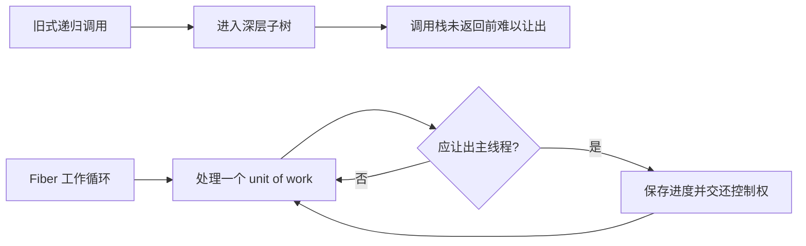
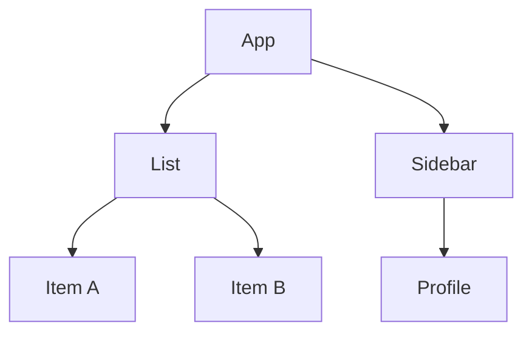
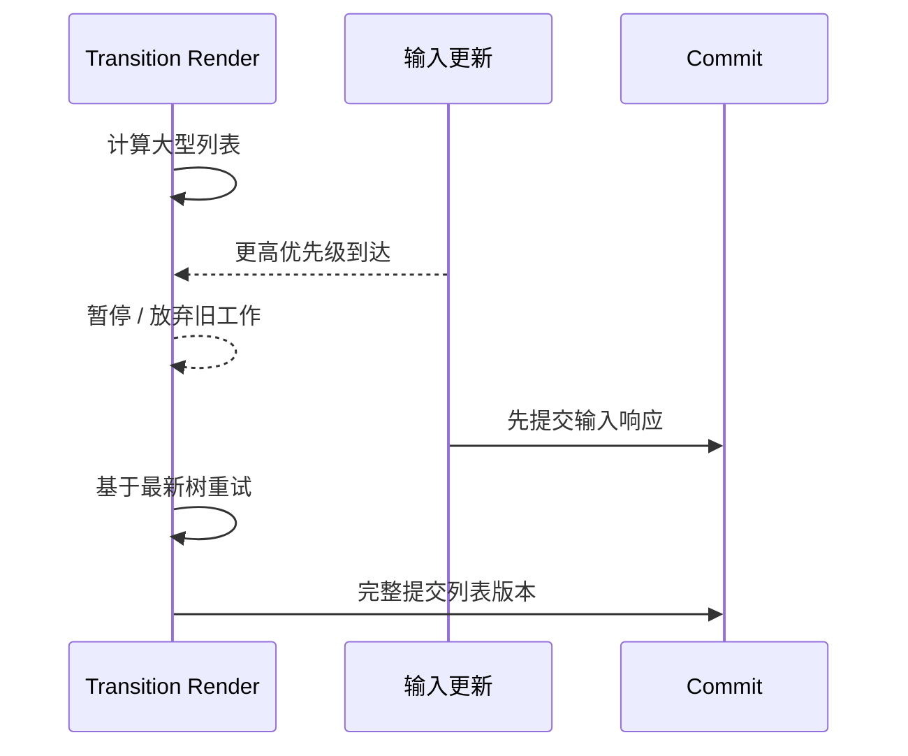

# React Fiber、并发与现代 React：从工作单元到 React 19.x

> 适用版本：以 React 19.x 稳定能力为主，React 18 作为并发基础设施演进背景。源码字段只用于建立心智模型，不要求死记具体实现。
> 难度标签：`进阶重点` `高级深挖` `历史兼容`

## 目录

- [1. Fiber 为什么出现](#1-fiber-为什么出现)
- [2. Fiber 节点与树结构](#2-fiber-节点与树结构)
- [3. 双缓冲与工作循环](#3-双缓冲与工作循环)
- [4. lanes 与优先级](#4-lanes-与优先级)
- [5. 可中断 Render 与不可中断 Commit](#5-可中断-render-与不可中断-commit)
- [6. 并发渲染是什么](#6-并发渲染是什么)
- [7. Transition 与 Deferred Value](#7-transition-与-deferred-value)
- [8. Suspense 的工作边界](#8-suspense-的工作边界)
- [9. React 18 的关键变化](#9-react-18-的关键变化)
- [10. React 19.x 的关键变化](#10-react-19x-的关键变化)
- [11. Server Components 与框架边界](#11-server-components-与框架边界)
- [12. 生命周期、Strict Mode 与并发安全](#12-生命周期strict-mode-与并发安全)
- [13. 面试速查](#13-面试速查)

---

## 1. Fiber 为什么出现

### 面试问题

React Fiber 是什么？它解决了什么问题？

### 30 秒回答

Fiber 既指 React 16 引入的协调架构，也指树中的工作节点。旧的递归协调一旦开始便难以把长任务切开；Fiber 把组件树工作拆成可遍历的单元，并在节点上保存父子兄弟关系、状态、更新队列、优先级和副作用标记，使 Render 阶段能够暂停、恢复、放弃和按优先级重做，为并发渲染、Suspense 和 Transition 提供基础。

### Fiber 不是什么

- 不是浏览器线程，也不会让 JavaScript 真正并行执行。
- 不是“双向链表”这类足以概括的普通数据结构；它更接近带 `child`、`sibling`、`return` 指针的工作树。
- 不是虚拟 DOM 的同义词；Element 是描述，Fiber 是工作与状态载体。
- 不保证所有更新都会被切片；紧急更新或较小工作可能同步完成。

### 从递归到可调度工作单元



Fiber 的核心价值不是“链表比递归快”，而是把原本隐藏在 JavaScript 调用栈里的遍历进度显式保存在可管理对象上。

---

## 2. Fiber 节点与树结构

### 面试问题

Fiber 节点大致保存哪些信息？为什么用 `child`、`sibling`、`return`？

### 30 秒回答

Fiber 保存组件类型、key、输入 props、记忆化 props / state、更新队列、宿主节点引用、树指针、优先级 lanes、变更 flags 和对应的 `alternate`。`child` 指向第一个子节点，`sibling` 串起同级节点，`return` 指向父节点，使 React 不依赖递归调用栈也能进行深度优先遍历和回溯。

```js
// 简化示意，并非 React 源码原文
const fiber = {
  tag: 'FunctionComponent',
  type: ProductList,
  key: null,

  pendingProps: {},        // 本轮准备处理的输入
  memoizedProps: {},       // 上轮已提交的输入
  memoizedState: null,     // Hook 链表或类组件状态入口
  updateQueue: null,       // 待处理更新 / Effect 信息

  child: null,             // 第一个子 Fiber
  sibling: null,           // 下一个兄弟 Fiber
  return: null,            // 父 Fiber

  stateNode: null,         // DOM 节点、类实例或 Root 等宿主数据
  flags: 0,                // 本节点需要在 Commit 执行的工作
  subtreeFlags: 0,         // 子树是否包含 Commit 工作
  lanes: 0,                // 本节点待处理更新优先级集合
  childLanes: 0,           // 子树待处理优先级集合
  alternate: null,         // current 与 workInProgress 对应节点
};
```

### 遍历直觉



深度优先过程可口述为：

1. `beginWork(App)`，进入第一个 `child`。
2. 处理 `List`，继续进入 `Item A`。
3. `Item A` 无子节点，执行 `completeWork`，转向 `sibling Item B`。
4. `List` 子树完成后回到 `App`，处理 `Sidebar`。
5. 回溯时聚合 flags 和 lanes。

### Element、Fiber 与 DOM

参见 [React Element、Fiber 与 DOM 图](https://raw.githubusercontent.com/2530622506/interView-writing-/main/docs/react-interview/assets/react-element-fiber-dom.svg)。Element 可能每次渲染新建；Fiber 在身份匹配时复用；DOM 只在 Commit 有必要时变化。

---

## 3. 双缓冲与工作循环

### 面试问题

什么是 Fiber 双缓冲？`current` 和 `workInProgress` 有什么关系？

### 30 秒回答

屏幕已提交版本由 `current` 树表示；下一次 Render 在 `workInProgress` 树上计算。两棵树的对应节点通过 `alternate` 关联，React 可以复用节点对象并保留已提交版本作为一致快照。新树计算完成后，Commit 让根的 current 指针切换到新树；未完成或被放弃的工作不会成为用户可见版本。


双缓冲的重点是**已提交树与正在计算树隔离**。它不是把两份 DOM 同时放在页面上，也不是每次都完整深拷贝整棵树。

### 工作循环伪代码

> 下列代码是简化 JavaScript 伪代码，并非 React 源码原文。

```js
function workLoopConcurrent() {
  while (workInProgress !== null && !shouldYield()) {
    performUnitOfWork(workInProgress);
  }
}

function performUnitOfWork(unit) {
  const next = beginWork(unit); // 根据输入和更新协调子节点

  if (next !== null) {
    workInProgress = next;      // 深入第一个子节点
  } else {
    completeUnitOfWork(unit);   // 没有子节点，开始回溯与找兄弟
  }
}
```

### `beginWork` 与 `completeWork`

- `beginWork`：处理组件更新、调用组件、协调 children、判断 bailout。
- `completeWork`：创建或准备宿主节点、向上聚合 flags、完成子树。
- 二者都属于 Render，不应执行用户可见且不可回滚的副作用。

### Bailout

如果目标 lanes 不包含当前 Fiber / 子树更新，并且 props、context 等条件允许，React 可以复用既有结果并跳过部分工作。`memo`、稳定引用和局部状态边界可能帮助 bailout，但是否跳过由 React 综合判断。

---

## 4. lanes 与优先级

### 面试问题

React 的 lanes 是什么？它与 Scheduler 优先级有什么关系？

### 30 秒回答

lanes 是 React reconciler 内部用位集合表示更新优先级和批次的模型。一个更新被分配 lane，lane 向根传播；根根据 pending、suspended、pinged 等 lanes 选择下一批 render lanes。Scheduler 负责安排 JavaScript 回调何时运行，lanes 决定 React 当前应该处理哪些更新，两者相关但不是同一个概念。


### 为什么用位集合

位集合可以高效表示“多个优先级集合的合并、包含、删除与比较”：

```js
// 简化示意，并非 React 的真实常量值
const SyncLane = 0b0001;
const DefaultLane = 0b0010;
const TransitionLane = 0b0100;

let pendingLanes = SyncLane | TransitionLane;
const includesSync = (pendingLanes & SyncLane) !== 0;
pendingLanes &= ~SyncLane; // 完成同步更新后移除对应位
```

### 更新被跳过怎么办

低优先级更新不会简单丢弃。处理更新队列时，当前 render lanes 不包含的更新可以保留到 base queue，待后续合适优先级重新计算。这也是为什么真实更新队列比“数组逐个执行”复杂。

```js
// 简化示意，并非 React 源码原文
for (const update of queue) {
  if (!includesLane(renderLanes, update.lane)) {
    cloneIntoBaseQueue(update); // 本轮跳过，保留给后续 Render
    continue;
  }
  state = applyUpdate(state, update);
}
```

### 优先级不是业务重要性

Transition 低优先级只表示它可让位于更紧急交互，不代表业务不重要。支付提交、权限变更等业务重要性仍需由服务端事务、幂等和错误处理保障。

---

## 5. 可中断 Render 与不可中断 Commit

### 面试问题

为什么 Render 可以被中断，而 Commit 不可以？

### 30 秒回答

Render 只在内存中计算 work-in-progress 树，没有改变用户可见宿主环境，因此可在更高优先级更新到来时暂停或丢弃。Commit 会修改 DOM、ref 和布局 Effect；若被中断，页面可能出现结构与事件不一致的半成品，所以 Commit 必须一次完成。并发不是“DOM 分段提交”，而是“下一版本的计算可以调度”。



### Render 纯净性的工程含义

```tsx
function BrokenProfile({ userId }: { userId: string }) {
  analytics.track('render', userId); // ❌ Render 重试会重复上报
  document.title = userId;           // ❌ Render 期间直接修改外部系统
  return <p>{userId}</p>;
}
```

应把上报放在事件或 Effect，把文档标题作为与外部系统同步的 Effect，并设计幂等或清理逻辑。

### Commit 阶段仍要快

Commit 不可中断，因此大量同步布局读取、长时间 `useLayoutEffect` 或第三方 DOM 操作会直接阻塞交互和绘制。并发能力不能挽救一个耗时过长的 Commit。

---

## 6. 并发渲染是什么

### 面试问题

React 的 Concurrent Rendering（并发渲染）是什么？是不是多线程？

### 30 秒回答

并发渲染是 React 能同时管理多个优先级的 UI 版本，并让低优先级 Render 暂停、恢复或重做的能力。它通常仍在主线程执行，不等于多线程并行。并发能力通过 `createRoot` 基础设施和 Suspense、Transition 等 API 按场景使用，不应再把它描述为一个简单的全局 “Concurrent Mode” 开关。

### 并发带来的用户体验能力

- 输入框更新先提交，昂贵列表稍后完成。
- 旧内容在新内容准备时继续可见，避免粗暴 loading 闪烁。
- Suspense 边界协调等待与 reveal 顺序。
- 服务端流式渲染和选择性 hydration 能更早交互。

### 并发不会自动解决

- 昂贵算法本身的总 CPU 成本。
- 网络慢、请求瀑布和缓存失效。
- Commit 阶段阻塞。
- 不纯组件、Effect 泄漏和外部 Store tearing。
- 超大 DOM、图片和样式计算。

### 并发安全的代码特征

1. Render 纯净。
2. 状态更新使用快照与不可变数据。
3. 外部订阅使用一致快照协议。
4. Effect setup / cleanup 对称。
5. 不依赖组件函数只执行一次。
6. 不在模块全局保存请求级可变状态。

---

## 7. Transition 与 Deferred Value

### 面试问题

`useTransition`、`startTransition` 和 `useDeferredValue` 有什么区别？

### 30 秒回答

Transition 把一组状态更新标为非紧急，`useTransition` 还提供 `isPending`；独立的 `startTransition` 适合不需要 pending 状态或组件外封装。`useDeferredValue` 延迟一个已得到的值驱动子树，适合无法控制产生该值的更新位置。它们不是 debounce：不会固定等待毫秒，也不减少每次请求。

### `useTransition`

```tsx
function TabContainer() {
  const [tab, setTab] = useState('overview');
  const [isPending, startTransition] = useTransition();

  function selectTab(nextTab: string) {
    startTransition(() => {
      // Tab 内容可以延后；点击反馈本身仍应立即显示
      setTab(nextTab);
    });
  }

  return (
    <div aria-busy={isPending}>
      <TabButtons current={tab} onSelect={selectTab} />
      <SlowTabContent tab={tab} />
    </div>
  );
}
```

### 不能把输入控制值放入 Transition

```tsx
function Search() {
  const [text, setText] = useState('');
  const [query, setQuery] = useState('');
  const [, startTransition] = useTransition();

  function handleChange(next: string) {
    setText(next); // 受控 input 值应同步响应
    startTransition(() => setQuery(next)); // 结果子树可延后
  }

  return <input value={text} onChange={(event) => handleChange(event.target.value)} />;
}
```

### `useDeferredValue`

```tsx
// 中文注释：该示例聚焦当前机制，省略无关工程细节。
function SearchResults({ query }: { query: string }) {
  const deferredQuery = useDeferredValue(query);
  const isStale = query !== deferredQuery;

  return (
    <div style={{ opacity: isStale ? 0.6 : 1 }}>
      <SlowList query={deferredQuery} />
    </div>
  );
}
```

如果每个 query 都触发请求，仍需框架 / Query Cache、AbortController 或 debounce 管理网络层。

---

## 8. Suspense 的工作边界

### 面试问题

Suspense 是什么？它会自动获取数据吗？

### 30 秒回答

Suspense 是协调“某个子树当前无法完成渲染”时如何显示 fallback 和何时 reveal 内容的边界。React 会捕获支持 Suspense 的资源读取所抛出的 thenable，并在资源就绪后重试渲染。Suspense 本身不是通用数据请求库；数据源必须来自支持 Suspense 的框架、缓存或 React API。

```tsx
// 中文注释：该示例聚焦当前机制，省略无关工程细节。
function Page() {
  return (
    <Suspense fallback={<PageSkeleton />}>
      <Profile />
      <Suspense fallback={<FeedSkeleton />}>
        <Feed />
      </Suspense>
    </Suspense>
  );
}
```

### 边界设计原则

- 边界应对应用户可理解的加载单元，不是每个组件一个 fallback。
- 避免整个页面因一块次要内容反复替换成大 loading。
- 与 Transition 配合时，可保留已显示内容并展示 pending 提示。
- Error Boundary 处理失败，Suspense 处理等待；两者职责不同。

### Suspense 与 Effect 请求

在 Effect 中发起普通 fetch，然后 `setState`，不会自动让 Suspense 捕获这次请求。要使用框架级数据 API、支持 Suspense 的 Query 实现，或 React 提供的资源读取路径。

### 服务端流式渲染

Suspense 边界允许服务端先发送可用 HTML，再把较慢边界的结果流式补充；客户端 hydration 也可按优先级选择性进行。具体能力高度依赖框架和渲染器配置。

---

## 9. React 18 的关键变化

### 面试问题

React 18 有哪些重要变化？

### 30 秒回答

React 18 的主线是把并发基础设施带入稳定版本：`createRoot` / `hydrateRoot`、更广泛的自动批处理、Transition、`useDeferredValue`、`useId`、`useSyncExternalStore`、流式 SSR 与选择性 hydration，以及更严格的开发期 Strict Mode 检查。不要只背 API，要说明它们围绕优先级、响应性和服务端渲染一致性展开。

### 关键能力表

| 能力 | 解决的问题 | 面试边界 |
|---|---|---|
| `createRoot` | 启用现代根与新调度基础 | 不等于所有更新都并发 |
| 自动批处理 | 减少多更新的中间提交 | 不改变 state snapshot |
| Transition | 区分紧急与非紧急更新 | 不减少总计算量 |
| `useDeferredValue` | 延迟值驱动的昂贵子树 | 不是 debounce |
| `useId` | SSR / hydration 稳定无障碍 ID | 不应用作列表 key |
| `useSyncExternalStore` | 外部 Store 一致快照 | 给库和外部订阅使用 |
| Streaming SSR | 更早发送 HTML | 需要框架 / 服务端集成 |

### `useId` 不是列表 key

```tsx
// 中文注释：该示例聚焦当前机制，省略无关工程细节。
function PasswordField() {
  const hintId = useId();

  return (
    <>
      <input type="password" aria-describedby={hintId} />
      <p id={hintId}>至少 12 个字符</p>
    </>
  );
}
```

列表 key 必须来自数据身份；`useId` 的调用位置与组件树相关，不能替代业务 ID。

---

## 10. React 19.x 的关键变化

### 面试问题

React 19.x 相比 React 18，面试中应该重点关注什么？

### 30 秒回答

React 19 延续并发和 Suspense 基础，重点改善异步 Action、表单状态和乐观 UI，引入 `useActionState`、`useOptimistic`、`use` 等能力，并简化 ref 传递、Provider 写法及文档元数据 / 资源处理。React 19.2 又加入 `useEffectEvent` 等稳定能力。回答时必须区分 React 核心稳定 API、框架集成能力和实验性特性。

### Actions 心智模型

Action 表示可能异步完成的状态变更过程，React 可以围绕它协调 pending、错误、乐观状态和表单重置。Action 不是新的网络协议，也不替代后端事务。

```tsx
function RenameForm({ rename }: { rename: (name: string) => Promise<string> }) {
  const [error, submitAction, isPending] = useActionState(
    async (_previousError: string | null, formData: FormData) => {
      const name = String(formData.get('name') ?? '').trim();
      if (!name) return '名称不能为空';

      try {
        await rename(name); // 服务端仍需校验权限与业务规则
        return null;
      } catch {
        return '保存失败，请重试';
      }
    },
    null,
  );

  return (
    <form action={submitAction}>
      <input name="name" disabled={isPending} />
      <button disabled={isPending}>{isPending ? '保存中…' : '保存'}</button>
      {error && <p role="alert">{error}</p>}
    </form>
  );
}
```

### `use`

`use` 可在渲染中读取 Promise 或 Context；Promise pending 时与 Suspense 协作，reject 时交给 Error Boundary。它与普通 Hook 规则不完全相同，可在条件中调用，但资源创建和缓存应由框架或稳定数据层管理，避免每次 Render 新建 Promise 导致重复挂起。

### ref 作为 prop

React 19 中函数组件可接收 `ref` prop，减少部分 `forwardRef` 包装。组件库升级时需要考虑 React 版本范围和类型声明，不能只改源码不改 peer dependency。

### Provider 简化

现代写法可以直接使用 `<ThemeContext value={theme}>`；旧代码中的 `<ThemeContext.Provider>` 仍是常见历史形式。

### 文档元数据和资源

React 19 支持组件中声明 `title`、`meta`、`link` 等文档元数据，并改善样式表、脚本等资源的优先级与去重协调。框架通常会提供更完整的路由级 metadata 方案，项目中应统一一条管理路径。

### React 19.2 重点

- `useEffectEvent`：分离 Effect 的响应式同步与非响应式最新值读取。
- Activity 等能力需要根据官方稳定性与目标版本核对后使用。
- 性能诊断和服务端能力持续增强，但面试回答不应把 canary / experimental API 当成所有项目可直接使用的稳定能力。

---

## 11. Server Components 与框架边界

### 面试问题

React Server Components（RSC）和 SSR 有什么区别？是否属于 React 19 就能直接使用的浏览器 API？

### 30 秒回答

SSR 把组件初始输出渲染为 HTML，客户端通常还需 hydration 建立交互；Server Components 在服务端执行并把序列化组件结果传给客户端，不把对应组件 JavaScript 发送到浏览器，可与 Client Components 组合。RSC 需要 bundler、路由、数据缓存和协议集成，实际项目通常通过 Next.js 等框架使用，不是仅升级 React 就自动获得完整方案。

### 对比表

| 维度 | CSR | SSR | Server Components |
|---|---|---|---|
| 组件执行位置 | 浏览器 | 服务端初始 + 浏览器 hydration | Server Component 仅服务端，Client Component 在客户端 |
| 首屏 HTML | 通常较少 | 有 | 可组合进流式结果 |
| 客户端 JS | 全部客户端组件 | 仍需 hydration 代码 | Server Component 代码不下发 |
| 可直接使用浏览器 API | 是 | 服务端阶段否 | Server Component 否 |
| 状态与事件 | 支持 | hydration 后支持 | 需 Client Component |

### 边界规则

- Server Component 可读取服务端资源，但不能使用客户端状态和 Effect。
- Client Component 用 `'use client'` 声明客户端边界，可使用交互 Hook。
- 从服务端传到客户端的 props 必须可序列化，函数等能力通过框架支持的 Action 协议处理。
- 不要在通用 React 面试中把 Next.js 的缓存策略说成 React 核心固定行为。

---

## 12. 生命周期、Strict Mode 与并发安全

### 面试问题

Fiber 和并发对类组件生命周期有什么影响？为什么 Strict Mode 会“执行两次”？

### 30 秒回答

可中断 Render 意味着 Render 阶段生命周期不能依赖只调用一次，因此旧的 `componentWill*` 生命周期被标记为不安全。Strict Mode 在开发环境额外调用组件、Effect 和 ref 回调流程，帮助暴露不纯渲染和缺少清理的问题；这不是生产环境无条件重复提交，而是并发安全检查。

### 历史生命周期分类

| 阶段 | 生命周期 | 建议 |
|---|---|---|
| Render | `render`、`getDerivedStateFromProps` | 必须纯净 |
| Pre-commit | `getSnapshotBeforeUpdate` | 读取变更前 DOM 快照 |
| Commit | `componentDidMount/Update` | 可执行副作用，但要清理 |
| Unmount | `componentWillUnmount` | 释放外部资源 |
| Legacy unsafe | `componentWillMount/ReceiveProps/Update` | 遗留项目迁移 |

### Strict Mode 发现的典型 bug

```tsx
let nextId = 0;

function BrokenList({ items }: { items: Item[] }) {
  // ❌ Render 期间修改模块全局变量，多次调用会产生不可预测结果
  return items.map((item) => <Row key={nextId++} item={item} />);
}
```

key 应来自稳定数据身份。任何依赖“组件只执行一次”的逻辑，都需要重新设计。

### 外部订阅必须可重入

```tsx
useEffect(() => {
  socket.subscribe(handler);
  return () => socket.unsubscribe(handler); // setup / cleanup 对称，重复验证也安全
}, [socket, handler]);
```

如果 cleanup 不能完整撤销 setup，开发 Strict Mode 常会暴露重复连接、重复监听和计时器泄漏。

---

## 13. 面试速查

### 高频问答

**Q：Fiber 的核心价值？**
A：把协调工作拆成显式单元，保存遍历和优先级信息，让 Render 可调度，为并发、Suspense 和 Transition 提供基础。

**Q：Fiber 是链表吗？**
A：节点通过 child / sibling / return 指针组织为可遍历工作树；单说链表不完整。

**Q：双缓冲是什么？**
A：current 表示已提交版本，workInProgress 表示下一版本，alternate 连接对应节点；完成后切换根指针。

**Q：lanes 和 Scheduler？**
A：lanes 表达 React 更新优先级 / 批次；Scheduler 安排回调执行时机，二者协作但不同层。

**Q：并发是不是多线程？**
A：通常不是。它是主线程上的可中断、可重试和有优先级的渲染管理。

**Q：为什么 Commit 不能中断？**
A：它修改用户可见宿主环境，中断会产生半完成界面；Render 只计算内存树，可安全重做。

**Q：Suspense 会自动请求数据吗？**
A：不会；它协调支持 Suspense 的资源等待与 fallback，数据能力由框架或兼容数据层提供。

### 稳定性边界表

| 层级 | 示例 | 回答方式 |
|---|---|---|
| React 稳定核心 | state、Effect、Transition、Suspense、Actions | 可作为主线 |
| React DOM 能力 | `createRoot`、表单 action、资源协调 | 说明渲染器边界 |
| 框架能力 | 路由缓存、RSC bundling、Server Actions 部署 | 不归因成 React 单独完成 |
| Canary / Experimental | 未进入稳定文档的 API | 明确实验状态，不作为通用方案 |

## 参考资料

- [Render and Commit](https://react.dev/learn/render-and-commit)、[Preserving and Resetting State](https://react.dev/learn/preserving-and-resetting-state)
- [`useTransition`](https://react.dev/reference/react/useTransition)、[`useDeferredValue`](https://react.dev/reference/react/useDeferredValue)、[`Suspense`](https://react.dev/reference/react/Suspense)
- [React v18.0](https://react.dev/blog/2022/03/29/react-v18)、[React 19](https://react.dev/blog/2024/12/05/react-19)、[React 19.2](https://react.dev/blog/2025/10/01/react-19-2)
- [React Server Components](https://react.dev/reference/rsc/server-components)、[Server Functions](https://react.dev/reference/rsc/server-functions)
- [React 源码](https://github.com/facebook/react/tree/main/packages/react-reconciler)：Fiber、work loop、lanes（用于验证实现，不建议面试背字段）

## 关联专题

- [状态更新与渲染](./react-state-and-rendering.md)
- [Hooks 深入](./react-hooks-deep-dive.md)
- [React Diff 与 Vue 3 对比](./react-diff-vue3-compare.md)
- [性能与工程化](./react-performance-and-engineering.md)
