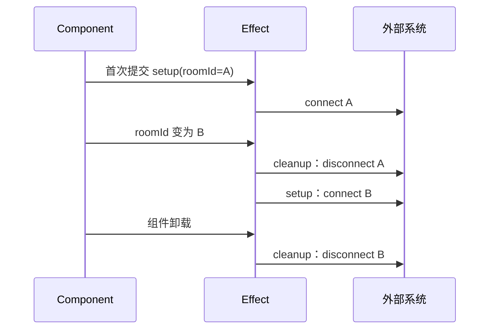
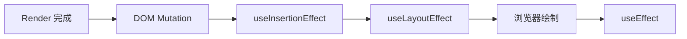

# React Hooks 深入：调用顺序、闭包、Effect 与逻辑复用

> 适用版本：React 19.x；重点不是背 API，而是理解 Hook 如何把状态挂到 Fiber、为什么存在调用规则，以及 Effect 如何描述外部同步。
> 难度标签：`基础必会` `进阶重点` `高级深挖` `历史兼容`

## 目录

- [1. Hooks 解决了什么问题](#1-hooks-解决了什么问题)
- [2. Hook 状态为什么依赖调用顺序](#2-hook-状态为什么依赖调用顺序)
- [3. useState 与 useReducer](#3-usestate-与-usereducer)
- [4. 闭包与过期值](#4-闭包与过期值)
- [5. Effect 的正确心智模型](#5-effect-的正确心智模型)
- [6. 三种 Effect 的时机](#6-三种-effect-的时机)
- [7. useRef 与命令式边界](#7-useref-与命令式边界)
- [8. memo、useMemo 与 useCallback](#8-memousememo-与-usecallback)
- [9. 自定义 Hooks](#9-自定义-hooks)
- [10. React 19.x 常见现代 Hooks](#10-react-19x-常见现代-hooks)
- [11. 高频错误与排查](#11-高频错误与排查)
- [12. 面试速查](#12-面试速查)

---

## 1. Hooks 解决了什么问题

### 面试问题

Hooks 为什么出现？它们比类组件生命周期好在哪里？

### 30 秒回答

Hooks 让函数组件拥有状态、Context、ref 和 Effect 等 React 能力，并允许按业务关注点复用有状态逻辑。类组件常把同一业务同步拆到多个生命周期，又把无关逻辑堆进同一方法；自定义 Hook 可以把“订阅 + 清理”“请求 + 竞态处理”等完整逻辑单元组合起来，同时避免 HOC 和 Render Props 的额外组件层级。

### Hooks 没有解决什么

- 不会自动解决复杂状态建模；复杂迁移仍需要 reducer 或状态机思维。
- 不会自动保证 Effect 正确；依赖和清理仍要精确。
- 不会自动提升性能；滥用 memoization 反而增加复杂度。
- 不会把组件变成“只执行一次”的函数；组件会随渲染多次执行。

### Hook 的分类

| 类别 | 常用 Hook | 核心用途 |
|---|---|---|
| 状态 | `useState`、`useReducer` | 保存组件记忆 |
| 上下文 | `useContext` | 读取祖先提供的值 |
| 引用 | `useRef`、`useImperativeHandle` | 保存非渲染数据或暴露命令式能力 |
| 外部同步 | `useEffect`、`useLayoutEffect`、`useInsertionEffect` | 与 React 外部系统同步 |
| 性能 | `useMemo`、`useCallback`、`useTransition`、`useDeferredValue` | 跳过计算或调节更新优先级 |
| 外部 Store | `useSyncExternalStore` | 并发安全地订阅外部状态 |
| 现代交互 | `useActionState`、`useOptimistic`、`useFormStatus` | Action / 表单 / 乐观更新 |

---

## 2. Hook 状态为什么依赖调用顺序

### 面试问题

为什么 Hook 只能在组件或自定义 Hook 顶层调用？

### 30 秒回答

React 需要在多次渲染之间把第 N 次 Hook 调用对应到同一个 Hook 状态槽。组件 Fiber 上保存着按调用顺序组织的 Hook 节点。若 Hook 位于条件、循环或提前返回之后，不同渲染的调用顺序可能变化，React 就无法知道当前 `useState` 应该对应上次哪个状态。


图示的重点是“顺序寻址”，不是要求记住具体源码字段。React 的不同版本可能调整内部实现，但顶层调用规则来自稳定的身份约束。

### 简化挂载过程

> 下列代码是简化 JavaScript 伪代码，并非 React 源码原文。

```js
let currentlyRenderingFiber = null;
let workInProgressHook = null;

function mountWorkInProgressHook() {
  const hook = {
    memoizedState: null, // 当前 Hook 记住的值
    queue: null,         // 状态更新队列
    next: null,          // 指向下一次 Hook 调用的槽位
  };

  if (workInProgressHook === null) {
    // 第一个 Hook 成为 Fiber 的状态链表入口
    currentlyRenderingFiber.memoizedState = hook;
  } else {
    workInProgressHook.next = hook;
  }

  workInProgressHook = hook;
  return hook;
}
```

### 错误与正确示例

```tsx
function Broken({ enabled }: { enabled: boolean }) {
  if (enabled) {
    // ❌ enabled 变化会改变 Hook 数量和后续槽位顺序
    const [count] = useState(0);
    return <p>{count}</p>;
  }

  const [name] = useState('Ada');
  return <p>{name}</p>;
}
```

```tsx
function Fixed({ enabled }: { enabled: boolean }) {
  // ✅ Hook 始终以相同顺序调用，条件只影响返回内容
  const [count] = useState(0);
  const [name] = useState('Ada');

  return enabled ? <p>{count}</p> : <p>{name}</p>;
}
```

### 为什么 `useState` 返回数组

“为了数组解构时自由命名”是 API 设计层面的解释：

```tsx
// 中文注释：该示例聚焦当前机制，省略无关工程细节。
const [name, setName] = useState('Ada');
const [age, setAge] = useState(36);
```

若返回固定字段对象，就需要别名或不同字段名。需要注意：**数组返回值与 Hook 内部使用链表不是同一件事**，不要把两个概念混为一谈。

---

## 3. useState 与 useReducer

### 面试问题

什么时候用 `useState`，什么时候用 `useReducer`？

### 30 秒回答

独立、简单的状态优先 `useState`；当多个字段围绕事件一起迁移、下一状态规则复杂、希望集中校验状态转换时使用 `useReducer`。Reducer 应保持纯净，只根据 state 和 action 计算下一 state；异步请求和订阅放事件处理器或 Effect。

### 用 reducer 表达状态迁移

```tsx
type State =
  | { status: 'idle'; data: null; error: null }
  | { status: 'loading'; data: null; error: null }
  | { status: 'success'; data: string[]; error: null }
  | { status: 'error'; data: null; error: string };

type Action =
  | { type: 'request' }
  | { type: 'success'; data: string[] }
  | { type: 'failure'; error: string }
  | { type: 'reset' };

function reducer(state: State, action: Action): State {
  switch (action.type) {
    case 'request':
      return { status: 'loading', data: null, error: null };
    case 'success':
      return { status: 'success', data: action.data, error: null };
    case 'failure':
      return { status: 'error', data: null, error: action.error };
    case 'reset':
      return { status: 'idle', data: null, error: null };
    default: {
      // TypeScript 穷尽检查，新增 action 时提醒补全分支
      const exhaustive: never = action;
      return exhaustive;
    }
  }
}
```

### 初始化函数

```tsx
function createInitialState(raw: string[]) {
  // 仅首次挂载时执行昂贵初始化
  return { items: raw.map((value) => value.trim()) };
}

const [state, setState] = useState(() => createInitialState(source));
```

传函数本身与传函数返回值不同：`useState(createInitialState(source))` 会在每次组件执行时先计算参数，即使 React 只采用初始那次结果。

### Reducer 与 Immer

复杂不可变更新可以使用 Immer 降低嵌套复制成本，但要知道它通过代理记录“看似修改”的操作并生成不可变结果。面试中仍应能手写基础结构共享，避免把工具用法当成状态模型。

---

## 4. 闭包与过期值

### 面试问题

什么是 stale closure（过期闭包）？如何解决？

### 30 秒回答

每次渲染都会创建新的函数闭包，闭包读取的是那次渲染的 props 和 state。如果异步回调或 Effect 长期保留旧函数，就会看到旧值。解决方式取决于意图：更新依赖前值时用函数式更新；Effect 需要响应值变化时声明依赖；需要非响应地读取最新值时使用 `useEffectEvent` 或谨慎使用 ref。

### 典型错误：Interval 捕获初始值

```tsx
function BrokenTimer() {
  const [count, setCount] = useState(0);

  useEffect(() => {
    const id = window.setInterval(() => {
      setCount(count + 1); // ❌ 永远基于首次 Effect 捕获的 count
    }, 1000);

    return () => window.clearInterval(id);
  }, []); // 缺失 count 是在掩盖语义问题

  return <p>{count}</p>;
}
```

推荐写法：

```tsx
function Timer() {
  const [count, setCount] = useState(0);

  useEffect(() => {
    const id = window.setInterval(() => {
      // 函数式更新不需要读取闭包中的 count
      setCount((value) => value + 1);
    }, 1000);

    return () => window.clearInterval(id);
  }, []);

  return <p>{count}</p>;
}
```

### 依赖数组不是“执行频率开关”

依赖数组是在声明 Effect 使用了哪些响应式值。不要先决定“只执行一次”，再通过空数组欺骗 linter。正确顺序是：

1. 明确要同步的外部系统。
2. 写出 setup 和 cleanup。
3. 声明 setup 使用的所有响应式依赖。
4. 如果依赖过多，重构代码或分离响应式 / 非响应式逻辑。

---

## 5. Effect 的正确心智模型

### 面试问题

`useEffect` 是什么？返回函数何时执行？

### 30 秒回答

Effect 用于让组件与 React 外部系统保持同步，例如网络连接、浏览器 API、第三方组件和订阅。依赖变化时，React 会先用旧 props / state 执行上一次 cleanup，再用新值执行 setup；卸载时执行最后一次 cleanup。它不是生命周期方法的简单拼接，也不应用于本可在渲染中推导的数据。



### 完整订阅示例

```tsx
function ChatRoom({ roomId }: { roomId: string }) {
  useEffect(() => {
    const connection = createConnection(roomId);
    connection.connect(); // 建立与当前 roomId 对应的外部连接

    return () => {
      connection.disconnect(); // 清理的必须是同一次 setup 创建的连接
    };
  }, [roomId]);

  return <p>房间：{roomId}</p>;
}
```

### 不需要 Effect 的场景

#### 1. 计算派生值

```tsx
// ❌ 多一次状态与提交，还可能短暂显示旧 fullName
useEffect(() => {
  setFullName(`${firstName} ${lastName}`);
}, [firstName, lastName]);

// ✅ 渲染期间直接推导
const fullName = `${firstName} ${lastName}`;
```

#### 2. 响应用户事件

```tsx
function BuyButton({ product }: { product: Product }) {
  function handleBuy() {
    // ✅ 购买是具体用户动作，放在事件处理器中
    purchase(product.id);
  }

  return <button onClick={handleBuy}>购买</button>;
}
```

#### 3. 重置整棵子树

当实体 ID 变化需要全部重置时，优先使用 `key` 定义新身份，而不是 Effect 中逐项 `setState`。

### 数据请求与竞态

```tsx
function SearchResult({ query }: { query: string }) {
  const [result, setResult] = useState<string[]>([]);

  useEffect(() => {
    const controller = new AbortController();

    async function load() {
      const response = await fetch(`/api/search?q=${encodeURIComponent(query)}`, {
        signal: controller.signal,
      });
      const data = (await response.json()) as string[];
      setResult(data); // 只让未取消的请求提交结果
    }

    void load().catch((error: unknown) => {
      if (!(error instanceof DOMException && error.name === 'AbortError')) {
        console.error(error);
      }
    });

    return () => controller.abort(); // query 变化或卸载时取消旧请求
  }, [query]);

  return <ResultList items={result} />;
}
```

工程中还要处理缓存、去重、SSR、预取、错误重试和瀑布请求，通常由框架数据层或 TanStack Query 等服务端状态工具负责，而不是每个组件手写 Effect。

---

## 6. 三种 Effect 的时机

### 面试问题

`useEffect`、`useLayoutEffect`、`useInsertionEffect` 有什么区别？

### 30 秒回答

`useEffect` 通常在浏览器绘制后执行，适合大多数外部同步；`useLayoutEffect` 在 DOM 变更后、绘制前同步执行，适合测量布局并立即修正，过多使用会阻塞绘制；`useInsertionEffect` 更早，用于 CSS-in-JS 库插入样式，不是普通业务副作用工具。



> 图是面试级时序模型。具体调度会受交互来源、根和浏览器任务影响，但三者的设计用途不变。

### 布局测量示例

```tsx
function Tooltip() {
  const ref = useRef<HTMLDivElement>(null);
  const [height, setHeight] = useState(0);

  useLayoutEffect(() => {
    // DOM 已提交但尚未绘制，读取布局后同步修正位置
    const nextHeight = ref.current?.getBoundingClientRect().height ?? 0;
    setHeight(nextHeight);
  }, []);

  return <div ref={ref} style={{ transform: `translateY(-${height}px)` }}>提示</div>;
}
```

能用 CSS 解决时不要使用布局 Effect；服务端渲染环境也没有布局信息，需要避免无意义的服务端调用路径。

### Effect 与生命周期的关系

可以用时机类比帮助迁移，但面试中要补充语义差异：

```text
componentDidMount + componentDidUpdate + componentWillUnmount
                     ≠
                useEffect
```

Effect 的基本单元是“一次 setup / cleanup 同步过程”，而不是组件整体生命周期的三个回调桶。

---

## 7. useRef 与命令式边界

### 面试问题

`useRef` 和 `useState` 有什么区别？

### 30 秒回答

`useRef` 返回跨渲染稳定的对象，修改 `ref.current` 不会触发渲染；适合保存计时器、外部实例、最新值或 DOM 引用。`useState` 表示影响 UI 的数据，更新会请求重新渲染。不要在 Render 期间随意读写 ref，因为这会破坏纯净性和并发可预测性。

```tsx
function Stopwatch() {
  const [elapsed, setElapsed] = useState(0);
  const timerRef = useRef<number | null>(null);

  function start() {
    if (timerRef.current !== null) return;

    timerRef.current = window.setInterval(() => {
      setElapsed((value) => value + 100);
    }, 100);
  }

  function stop() {
    if (timerRef.current !== null) {
      window.clearInterval(timerRef.current);
      timerRef.current = null; // 修改 ref 不需要重新渲染
    }
  }

  return <button onClick={timerRef.current === null ? start : stop}>{elapsed}ms</button>;
}
```

### `forwardRef` 与现代 ref 传递

React 19 支持把 `ref` 作为组件 prop 使用；遗留 React 版本常通过 `forwardRef`。维护跨版本组件库时要明确 peer dependency，不要混写版本假设。

### `useImperativeHandle`

只暴露最小命令式能力：

```tsx
type SearchInputHandle = { focus: () => void };

type SearchInputProps = {
  ref?: React.Ref<SearchInputHandle>;
};

function SearchInput({ ref }: SearchInputProps) {
  const inputRef = useRef<HTMLInputElement>(null);

  useImperativeHandle(ref, () => ({
    focus() {
      inputRef.current?.focus(); // 只暴露 focus，而不是整个 DOM 节点
    },
  }), []);

  return <input ref={inputRef} type="search" />;
}
```

---

## 8. memo、useMemo 与 useCallback

### 面试问题

`memo`、`useMemo`、`useCallback` 的区别是什么？什么时候使用？

### 30 秒回答

`memo` 尝试在 props 通过浅比较未变化时跳过组件重新渲染；`useMemo` 缓存一次计算结果；`useCallback` 缓存函数引用。它们都是性能优化，不是正确性工具。只有在 Profiler 证明子树或计算昂贵，并且引用稳定确实能切断更新传播时才使用。

```tsx
const ProductTable = memo(function ProductTable({ items }: { items: Product[] }) {
  // 这个组件只有在 items 引用变化时才需要重新渲染
  return <table>{/* 省略行渲染 */}</table>;
});

function Page({ products, query }: Props) {
  const visibleProducts = useMemo(
    () => expensiveFilter(products, query),
    [products, query], // 缓存昂贵计算结果，也稳定传给 memo 子组件的引用
  );

  const handleSelect = useCallback((id: string) => {
    // 函数只依赖稳定的 dispatch，因此引用可以保持稳定
    dispatch({ type: 'select', id });
  }, [dispatch]);

  return <ProductTable items={visibleProducts} onSelect={handleSelect} />;
}
```

### 为什么 memo 经常失效

```tsx
// 中文注释：该示例聚焦当前机制，省略无关工程细节。
<Panel options={{ theme: 'dark' }} />
```

父组件每次 Render 都创建新对象，浅比较看到引用变化。解决方法不一定是 `useMemo`：

1. 把常量移到组件外。
2. 传更小的原始值，而不是整个对象。
3. 让 `children` 或局部状态下沉，减少父组件更新。
4. 确有性能价值时再缓存。

### React Compiler 的影响

React Compiler 可以自动应用类似 memoization 的优化，降低手写 `memo`、`useMemo`、`useCallback` 的需要，但它不会修复错误的状态边界、副作用和数据流。面试时应把编译器视为“自动优化层”，而不是取消 React 渲染模型。

---

## 9. 自定义 Hooks

### 面试问题

如何设计一个好的自定义 Hook？

### 30 秒回答

自定义 Hook 用于复用有状态逻辑，不复用状态实例；每次调用都有独立状态。命名必须以 `use` 开头，使 linter 和读者识别 Hook 规则。好的 Hook 提供稳定、最小的领域 API，内部正确处理订阅、清理、竞态和依赖，而不是简单把几行代码搬走。

### 在线状态 Hook

```tsx
function subscribeOnlineStatus(callback: () => void) {
  window.addEventListener('online', callback);
  window.addEventListener('offline', callback);

  return () => {
    window.removeEventListener('online', callback);
    window.removeEventListener('offline', callback);
  };
}

function useOnlineStatus() {
  return useSyncExternalStore(
    subscribeOnlineStatus,
    () => navigator.onLine, // 客户端快照
    () => true,             // 服务端快照，保证 hydration 初始一致
  );
}
```

这里优先 `useSyncExternalStore`，因为浏览器在线状态是 React 外部 Store；它比“Effect + useState”更准确地描述订阅与快照。

### Hook API 设计检查表

- 输入是否都是必要依赖？
- 返回值是否暴露过多内部状态？
- 是否能避免调用者自己拼装 setup / cleanup？
- 错误、加载、取消和重试语义是否明确？
- 返回对象或函数是否需要稳定引用？稳定是否真的带来收益？
- Hook 是否偷偷承担了本应属于服务层或框架的数据缓存？

---

## 10. React 19.x 常见现代 Hooks

### `useTransition`

把某些更新标记为非紧急，使输入等高优先级交互保持响应。Transition 不会让计算变少，而是允许 React 调节执行顺序和显示策略。

```tsx
function SearchPage({ products }: { products: Product[] }) {
  const [query, setQuery] = useState('');
  const [filter, setFilter] = useState('');
  const [isPending, startTransition] = useTransition();

  function handleChange(next: string) {
    setQuery(next); // 输入框必须立即响应
    startTransition(() => {
      setFilter(next); // 昂贵列表可以作为非紧急更新
    });
  }

  return <>{/* 根据 filter 渲染列表，并用 isPending 提示过渡状态 */}</>;
}
```

### `useDeferredValue`

延迟某个值驱动的非紧急子树，常用于调用者无法直接控制更新位置时。它不是固定毫秒数的 debounce，也不会减少网络请求，必要时仍需专门的请求防抖与取消策略。

### `useEffectEvent`

在 React 19.2 中，Effect Event 用于把 Effect 内“需要读取最新 props / state、但不希望让 Effect 因它重连”的逻辑拆成非响应事件。Effect Event 只能在 Effect 相关逻辑中调用，不是规避依赖数组的通用后门。

```tsx
function ChatRoom({ roomId, theme }: { roomId: string; theme: Theme }) {
  const onConnected = useEffectEvent(() => {
    // 始终读取最新 theme，但 theme 变化不需要重连房间
    showNotification('已连接', theme);
  });

  useEffect(() => {
    const connection = createConnection(roomId);
    connection.on('connected', onConnected);
    connection.connect();
    return () => connection.disconnect();
  }, [roomId]); // 连接生命周期只由 roomId 决定
}
```

### `useActionState` 与 `useOptimistic`

- `useActionState`：围绕 Action 管理结果和 pending 状态，常用于表单和服务端 Action 集成。
- `useOptimistic`：在异步操作完成前显示乐观结果，失败时回到权威状态。
- 二者不替代服务端校验、幂等、冲突处理和错误恢复。

```tsx
function LikeButton({ liked, submitLike }: Props) {
  const [optimisticLiked, setOptimisticLiked] = useOptimistic(liked);

  async function handleClick() {
    setOptimisticLiked(!optimisticLiked); // 先给用户即时反馈
    await submitLike(!optimisticLiked);   // 服务端结果仍是最终权威来源
  }

  return <button onClick={handleClick}>{optimisticLiked ? '已赞' : '点赞'}</button>;
}
```

---

## 11. 高频错误与排查

### 错误一：用 Effect 同步派生状态

症状：多一次 Render，页面短暂出现旧值，依赖链越来越复杂。
处理：能在 Render 计算就直接计算；昂贵才 `useMemo`。

### 错误二：忽略 exhaustive-deps

症状：闭包读到旧 props / state。
处理：先补齐依赖，再重构不稳定对象、函数或拆分 Effect，不要随意关闭规则。

### 错误三：Effect 没有对称清理

症状：重复订阅、重复连接、卸载后更新、Strict Mode 暴露问题。
处理：把 Effect 看作独立的 setup / cleanup 进程。

### 错误四：到处 `useCallback`

症状：依赖数组和缓存成本增加，却没有任何子组件使用稳定引用。
处理：先用 Profiler 找到实际瓶颈，再选择最小优化点。

### 错误五：ref 变成隐藏 state

症状：`ref.current` 已变化但 UI 不更新。
处理：影响渲染的数据用 state；ref 只保存渲染不关心的信息。

### 错误六：自定义 Hook 返回不稳定大对象

```tsx
function useSearch() {
  // ❌ 每次渲染返回全新对象，调用者若整体作为依赖会不断变化
  return { query, setQuery, result, retry };
}
```

不必盲目缓存返回对象；更好的第一步是让调用者解构所需值、缩小 Effect 依赖，并确认身份稳定是否属于公开契约。

---

## 12. 面试速查

### 高频问答

**Q：Hook 为什么不能写在 if 中？**
A：React 按调用顺序匹配 Hook 槽位，条件调用会导致跨渲染错位。

**Q：Effect cleanup 什么时候执行？**
A：依赖变化后的新 setup 之前先清理旧同步，卸载时清理最后一次同步；开发 Strict Mode 还会额外验证。

**Q：`useEffect` 与 `useLayoutEffect`？**
A：前者通常不阻塞绘制；后者在 DOM 提交后、绘制前同步执行，用于布局测量和修正。

**Q：`useMemo` 保证值永远不变吗？**
A：不，它是缓存优化，React 可在特定情况下丢弃缓存；正确性不能依赖它。

**Q：`useRef` 为什么更新不渲染？**
A：ref 是稳定可变容器，不参与 React 的渲染数据流，修改 `current` 不会创建更新。

**Q：自定义 Hook 会共享状态吗？**
A：不会；它共享逻辑，每次调用的 Hook 状态仍归属于各自组件 Fiber。

### API 选择口诀

| 需求 | 首选 |
|---|---|
| 简单本地状态 | `useState` |
| 复杂事件驱动迁移 | `useReducer` |
| 读取 Context | `useContext` |
| 保存非渲染数据 / DOM | `useRef` |
| 同步外部系统 | `useEffect` |
| 绘制前测量 | `useLayoutEffect` |
| 订阅外部 Store | `useSyncExternalStore` |
| 降低非紧急更新优先级 | `useTransition` |
| 缓存昂贵纯计算 | `useMemo` |

## 参考资料

- [Rules of Hooks](https://react.dev/reference/rules/rules-of-hooks)、[Built-in React Hooks](https://react.dev/reference/react/hooks)
- [Synchronizing with Effects](https://react.dev/learn/synchronizing-with-effects)、[You Might Not Need an Effect](https://react.dev/learn/you-might-not-need-an-effect)
- [`useEffect`](https://react.dev/reference/react/useEffect)、[`useLayoutEffect`](https://react.dev/reference/react/useLayoutEffect)、[`useInsertionEffect`](https://react.dev/reference/react/useInsertionEffect)
- [`useEffectEvent`](https://react.dev/reference/react/useEffectEvent)、[`useTransition`](https://react.dev/reference/react/useTransition)、[`useDeferredValue`](https://react.dev/reference/react/useDeferredValue)
- [`useSyncExternalStore`](https://react.dev/reference/react/useSyncExternalStore)、[`useActionState`](https://react.dev/reference/react/useActionState)、[`useOptimistic`](https://react.dev/reference/react/useOptimistic)

## 关联专题

- [状态更新与渲染](./react-state-and-rendering.md)
- [组件通信与状态管理](./react-component-communication-and-state-management.md)
- [性能与工程化](./react-performance-and-engineering.md)
