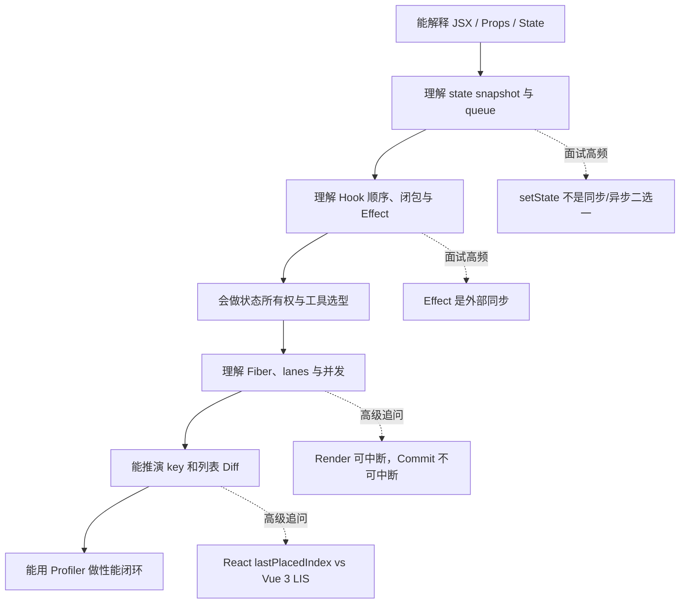

# React 中高级面试知识总纲

> 这不是“背题大全”，而是一套从 **组件模型 → 状态更新 → Hooks → 通信 → Fiber / 并发 → Diff → 性能工程** 逐层深入的知识地图。
> 技术基线：React 19.x；React 18 作为并发基础设施演进背景；类组件与旧生命周期标记为 `历史兼容`。

## 如何使用这套文档

### 面试前 1 天

1. 阅读本总纲的知识地图、快速回答和易错结论。
2. 优先复习 `基础必会` 与 `进阶重点`。
3. 根据目标岗位选择 Fiber / Diff / 性能中的 `高级深挖`。
4. 每道题先口述 30 秒版本，再补原理、代码和边界。

### 面试前 1～2 周

按依赖顺序阅读 7 篇专题，并亲手实现文中的关键示例：

1. [React 核心与组件模型](./react-core-and-component-model.md)
2. [状态更新与渲染](./react-state-and-rendering.md)
3. [Hooks 深入](./react-hooks-deep-dive.md)
4. [组件通信与状态管理](./react-component-communication-and-state-management.md)
5. [Fiber、并发与现代 React](./react-fiber-concurrency-and-modern-react.md)
6. [React Diff 与 Vue 3 对比](./react-diff-vue3-compare.md)
7. [性能与工程化](./react-performance-and-engineering.md)

---

## 1. 知识地图

```mermaid
mindmap
  root((React 面试))
    组件模型
      声明式 UI
      JSX 与 Element
      Props / State
      事件与表单
      组合与组件设计
    状态与渲染
      Snapshot
      Update Queue
      Batching
      Render / Commit
      状态保留与 key
    Hooks
      调用顺序
      闭包
      Effect 同步
      Ref
      Memoization
      自定义 Hook
    状态架构
      Props / Callback
      Context / Reducer
      External Store
      Server State
      URL / Form
    Fiber 与并发
      Work Unit
      Double Buffer
      Lanes
      Transition
      Suspense
      React 18 → 19.x
    Diff
      type / key
      单节点
      数组 children
      lastPlacedIndex
      Vue 3 LIS
    性能工程
      Profiler
      状态边界
      Virtualization
      Compiler
      Bundle
      SSR / SEO
```

这张图的主线是：**组件产生 Element，状态更新触发 Render，Fiber 承载协调工作，Diff 决定复用与 flags，Commit 修改宿主环境，性能工程验证整个链路的成本。**


不要把 JSX、虚拟 DOM、Fiber 和 DOM 混成一个概念：JSX 是语法，Element 是描述，Fiber 是工作与状态节点，DOM 是浏览器宿主结果。

---

## 2. 阅读路线图



### 按岗位选择重点

| 岗位方向 | 必读 | 深挖 |
|---|---|---|
| 中后台业务 | 核心、状态、Hooks、通信 | 表单、Context、Query Cache、性能定位 |
| 基础架构 / 组件库 | 核心、Hooks、Fiber、Diff | ref、事件、SSR、Compiler、兼容性 |
| 大型应用 | 状态、通信、性能 | Store selector、缓存失效、可观测性 |
| SSR / 全栈前端 | 状态、Fiber、性能 | Suspense、hydration、RSC、SEO |
| Vue 转 React | 核心、状态、Hooks、Diff | snapshot vs 响应式、React Compiler vs Vue 编译优化 |

---

## 3. 版本与稳定性边界

面试时不要把所有新名词都归入“React 19 新特性”，应先判断能力属于哪一层。

| 层级 | 代表能力 | 回答口径 |
|---|---|---|
| React 稳定核心 | state、Effect、Context、Transition、Suspense、Actions | 可以作为通用心智模型 |
| React DOM | `createRoot`、表单 action、资源与 metadata 协调 | 指明这是 DOM 渲染器能力 |
| React 18 演进 | 自动批处理、Transition、`useId`、外部 Store 协议 | 解释并发基础设施背景 |
| React 19.x 演进 | Actions、`useActionState`、`useOptimistic`、`use`、ref as prop、`useEffectEvent` | 说明目标小版本与兼容性 |
| React Compiler | 构建期自动 memoization | 不等于运行时新 Hook，也不等于 Vue patch flags |
| 框架能力 | RSC bundling、路由缓存、Server Actions 部署 | 不应说成“只装 React 就有” |
| 实验能力 | Canary / experimental API | 明确实验状态，不作为生产通用答案 |

> 文档主线不依赖某个 canary API。项目落地时应以目标 React、框架和构建工具的官方版本说明为准。

---

## 4. 20 道核心题的 30 秒回答

### 4.1 React 是什么？`基础必会`

React 是声明式 UI 库。组件根据 `props`、`state` 和 `context` 计算当前界面描述，React 通过 Fiber 协调新 Element 与旧 Fiber，并在 Commit 阶段把必要变化应用到 DOM。组件化和单向数据流让状态来源与更新路径更可追踪。

→ [深入：React 核心与组件模型](./react-core-and-component-model.md#1-react-的核心心智模型)

### 4.2 JSX 是什么？`基础必会`

JSX 是 JavaScript 语法扩展，会被编译为 JSX runtime 调用并生成 React Element。它不是 HTML 字符串，也不是 Fiber；浏览器通常不能直接解析，需要 TypeScript、Babel 或构建工具转换。

→ [深入：JSX](./react-core-and-component-model.md#2-jsx-到底是什么)

### 4.3 Props 和 State 有什么区别？`基础必会`

Props 是父组件提供的只读输入，state 是组件记忆。二者在一次渲染中都是快照。修改对象本身不会通知 React，还会破坏历史快照；应创建新值并发出状态更新请求。

→ [深入：Props、State 与单向数据流](./react-core-and-component-model.md#4-propsstate-与单向数据流)

### 4.4 `setState` 是同步还是异步？`进阶重点`

这个二选一问法不够准确。调用更新函数会同步创建更新请求，但当前渲染快照不会原地变化；更新何时 Render / Commit 由队列、batching、优先级、根模式和 `flushSync` 等条件决定。

→ [深入：状态更新链路](./react-state-and-rendering.md#4-一次更新的完整链路)

### 4.5 为什么三次 `setCount(count + 1)` 只加 1？`基础必会`

三次读取的是同一渲染快照，提交了相同替换值。使用 `setCount(value => value + 1)` 把更新函数加入队列，React 会按顺序基于上一步结果计算。

→ [深入：更新队列](./react-state-and-rendering.md#2-更新队列与函数式更新)

### 4.6 React 的 Render 与 Commit 有什么区别？`进阶重点`

Render 调用组件、处理队列和协调 Fiber，只计算下一版本，可能暂停或重做；Commit 根据 flags 修改 DOM、ref 与 Effect，必须保持一致性，不能展示半完成界面。

→ [深入：Render 与 Commit](./react-state-and-rendering.md#5-render-与-commit)

### 4.7 Hooks 为什么不能写在条件里？`进阶重点`

React 依赖调用顺序把第 N 个 Hook 对应到 Fiber 上第 N 个状态槽。条件或循环改变顺序后，后续 Hook 会与旧状态错位。

→ [深入：Hook 链表](./react-hooks-deep-dive.md#2-hook-状态为什么依赖调用顺序)

### 4.8 `useEffect` 是什么？`进阶重点`

Effect 用于让组件与 React 外部系统同步。依赖变化时先清理旧同步，再用新值建立同步；卸载时清理最后一次。能在 Render 推导的值和明确用户事件不应默认放 Effect。

→ [深入：Effect 心智模型](./react-hooks-deep-dive.md#5-effect-的正确心智模型)

### 4.9 `useEffect` 与 `useLayoutEffect`？`进阶重点`

`useEffect` 通常在绘制后执行，适合大多数外部同步；`useLayoutEffect` 在 DOM 提交后、绘制前同步执行，适合布局测量和立即修正，过多使用会阻塞绘制。

→ [深入：Effect 时机](./react-hooks-deep-dive.md#6-三种-effect-的时机)

### 4.10 `useRef` 和 `useState`？`基础必会`

State 影响 UI，更新会请求渲染；ref 是跨渲染稳定的可变容器，修改 `current` 不会渲染，适合 DOM、计时器和外部实例。影响页面显示的数据不应藏在 ref 中。

→ [深入：Ref](./react-hooks-deep-dive.md#7-useref-与命令式边界)

### 4.11 组件通信有哪些方式？`基础必会`

父向子用 props，子向父调用回调，兄弟状态提升，跨层低频值用 Context，复杂高频共享用外部 Store，DOM 命令式能力用 ref。数据默认向下，用户意图通过事件向上。

→ [深入：组件通信](./react-component-communication-and-state-management.md)

### 4.12 Context 能否替代 Redux？`进阶重点`

部分场景可以。Context 是跨层广播值的机制，不自带 selector、middleware、DevTools 或完整状态约束；高频大状态会扩大消费者更新。Redux Toolkit 更适合强约束和可追踪流程，Zustand 适合轻量 selector Store。

→ [深入：Context 与 Store 选型](./react-component-communication-and-state-management.md#7-reduxzustand-与选型)

### 4.13 服务端状态为什么不直接放全局 Store？`进阶重点`

服务端是权威来源，客户端只是有时效的缓存副本，需要去重、失效、重试、预取和 mutation 一致性。框架数据层或 Query Cache 比普通 Store 更贴近这些协议。

→ [深入：服务端状态](./react-component-communication-and-state-management.md#8-服务端状态与-tanstack-query)

### 4.14 Fiber 是什么？`高级深挖`

Fiber 是 React 的协调架构和工作节点。它显式保存树关系、状态、更新队列、lanes、flags 和 alternate，把组件树工作拆成可调度单元，使 Render 可以暂停、恢复、放弃和重做。

→ [深入：Fiber](./react-fiber-concurrency-and-modern-react.md#1-fiber-为什么出现)

### 4.15 lanes 是什么？`高级深挖`

lanes 用位集合表示更新优先级和批次，帮助根选择下一批工作并保留本轮跳过的更新。Scheduler 决定回调何时运行，lanes 决定 React 处理哪些更新，二者协作但不是同一个概念。

→ [深入：lanes](./react-fiber-concurrency-and-modern-react.md#4-lanes-与优先级)

### 4.16 并发渲染是不是多线程？`高级深挖`

通常不是。它表示 React 能管理不同优先级的 UI 版本，让低优先级 Render 暂停或重试，仍多在主线程执行。并发切分的是计算，不会把 Commit 拆成用户可见的半成品。

→ [深入：并发渲染](./react-fiber-concurrency-and-modern-react.md#6-并发渲染是什么)

### 4.17 Suspense 会自动请求数据吗？`进阶重点`

不会。Suspense 协调支持它的资源在等待时显示什么、何时 reveal。数据源必须来自兼容框架、缓存或 API；普通 Effect 中 fetch 再 setState 不会自动触发 Suspense。

→ [深入：Suspense](./react-fiber-concurrency-and-modern-react.md#8-suspense-的工作边界)

### 4.18 React Diff 的核心？`进阶重点`

React 在 Render 阶段用新 Element 与旧 Fiber 协调。兄弟节点通过 key 匹配身份，再检查 type 是否兼容；数组先顺序比较，失配后用 Map 查找剩余旧节点，并用 `lastPlacedIndex` 启发式标记移动。

→ [深入：React Diff](./react-diff-vue3-compare.md)

### 4.19 为什么不建议 index 作为 key？`基础必会`

index 代表位置，不代表业务身份。列表头部插入、排序或删除后，同一 key 可能对应不同数据，导致受控输入、局部 state 和 DOM 复用错位。只有静态、无状态且不重排的列表才可谨慎使用。

→ [深入：key](./react-diff-vue3-compare.md#12-没有-key-或使用-index-作为-key-的问题)

### 4.20 React 性能优化怎么答？`进阶重点`

先用 Performance 与 Profiler 区分网络、Render、Commit、DOM 和绘制成本；再优化状态边界、算法、请求、DOM 规模和包体积；最后对已测量热点使用 memoization、虚拟化、Transition、Compiler 或 SSR 策略，并复测真实用户指标。

→ [深入：性能工程](./react-performance-and-engineering.md)

---

## 5. 深度追问链

面试官往往不会停在第一问。下面按“问题 → 追问”组织复习。

### 状态更新链

```text
setState 是否异步？
  → 为什么当前变量没变？
  → snapshot 与闭包是什么？
  → 多次更新如何进入 queue？
  → batching 合并的是什么？
  → lane 如何影响处理顺序？
  → Render 为什么可以重做？
  → Commit 为什么不能中断？
```

对应阅读： [状态更新](./react-state-and-rendering.md) → [Fiber 与 lanes](./react-fiber-concurrency-and-modern-react.md)。

### Hooks 链

```text
常用 Hooks 有哪些？
  → 为什么顶层调用？
  → Hook 状态存在哪里？
  → stale closure 怎么出现？
  → Effect cleanup 何时执行？
  → exhaustive-deps 为什么不能随便关？
  → useEffectEvent 解决什么边界？
```

对应阅读：[Hooks 深入](./react-hooks-deep-dive.md)。

### Diff 链

```text
虚拟 DOM 是什么？
  → Element 与 Fiber 的区别？
  → key 和 type 如何定义身份？
  → 数组第一轮为何中断？
  → Map 如何查找剩余旧节点？
  → lastPlacedIndex 如何判断移动？
  → Vue 3 为什么使用 LIS？
  → 最少移动是否等于整体性能更好？
```

对应阅读：[React Diff 与 Vue 3 对比](./react-diff-vue3-compare.md)。

### 性能链

```text
如何减少重渲染？
  → 重渲染是否等于 DOM 更新？
  → 状态能否下沉？
  → Context 是否广播过大？
  → memo 为什么失效？
  → 大列表为何必须虚拟化？
  → Transition 减少总计算了吗？
  → React Compiler 能替代架构优化吗？
```

对应阅读：[性能与工程化](./react-performance-and-engineering.md)。

---

## 6. React 与 Vue 3 对比框架

不要只背“React 用 JSX，Vue 用 template”。中高级面试要比较更新路径：

| 维度 | React | Vue 3 |
|---|---|---|
| 响应性入口 | 显式 state 更新 | Proxy 依赖追踪触发 |
| 组件执行 | 更新后重新执行函数并产生 Element | 运行组件更新函数并 patch VNode |
| 编译优化 | React Compiler 自动 memoization | patch flags、block tree、静态提升 |
| 列表移动 | `lastPlacedIndex` 启发式 | 未知序列使用 LIS |
| 状态读取 | 每次渲染 snapshot | ref / reactive 当前响应值 |
| 逻辑复用 | Hooks | Composables |
| 调度重点 | Fiber + lanes + 并发 UI | 响应式组件调度 + 编译提示 |

### 标准回答边界

- 不说 React “全量更新 DOM”；它可能重新执行组件，但只提交必要 DOM 变化。
- 不说 Vue “完全不重新渲染组件”；响应式 effect 仍会执行更新过程。
- 不用单一 Diff 移动数量断言框架性能优劣。
- React Compiler 与 Vue 模板编译优化目标相近但机制不同。

---

## 7. 易错结论纠正

| 易错说法 | 正确心智模型 |
|---|---|
| `setState` 是异步的 | 它发出更新请求；当前 snapshot 不变，处理与提交时机由调度决定 |
| `useEffect(..., [])` 就是 mounted | 空数组表示不读取响应式依赖；Effect 仍是外部同步 setup / cleanup |
| `useMemo` 保证语义 | 它是性能缓存，正确性不能依赖缓存永远存在 |
| Fiber 是双向链表 | Fiber 是 child / sibling / return 组织的工作树，另有 alternate 对应树 |
| Diff 生成 DOM 补丁数组 | Render 在 Fiber 上记录 flags，Commit 按树与 flags 执行宿主操作 |
| key 只用于消除警告 | key 定义兄弟身份，影响复用、移动和状态保留 |
| index 永远不能作 key | 静态、不重排、无局部状态列表可谨慎使用，但业务 ID 更稳健 |
| Context 就是全局状态库 | Context 是值传递 / 广播机制，缺少 selector 等完整 Store 能力 |
| Suspense 就是 loading 组件 | Suspense 协调可挂起资源和 reveal，不自动发请求 |
| 并发渲染是多线程 | 通常是主线程上可中断、可重试、有优先级的 Render |
| SSR 就一定 SEO 好 | 还需 metadata、状态码、语义 HTML、性能与可抓取性 |
| 虚拟 DOM 一定更快 | 它提供可维护的声明式协调，不保证击败所有手写 DOM 微操作 |

---

## 8. 代码题练习清单

每道题都应能解释“为什么”，代码关键位置使用中文注释。

### 基础必会

- 实现受控输入与表单校验。
- 用函数式更新完成连续计数。
- 用稳定业务 `key` 渲染可增删列表。
- 使用 `children` 实现 Dialog 组合组件。
- 使用 `useReducer` 建模 loading / success / error。

### 进阶重点

- 实现带 AbortController 的搜索请求，处理竞态。
- 实现 Context + Reducer，并拆分 state / dispatch Context。
- 用 `useSyncExternalStore` 订阅浏览器在线状态。
- 用 `useTransition` 分离输入与昂贵列表。
- 使用 Profiler 找到一次由 Context 引起的无关渲染。

### 高级深挖

- 手写简化 Hook 链表和更新队列伪代码。
- 推演 `[A,B,C,D] → [A,C,B,E]` 的 Fiber 复用与 Placement。
- 解释 current / workInProgress / alternate。
- 模拟 lanes 跳过低优先级更新并保留 base queue。
- 对比 React `lastPlacedIndex` 与 Vue 3 LIS 的 DOM 移动。

---

## 9. 历史兼容清单

这些内容不作为现代主线，但中高级工程师维护旧项目仍需掌握。

### 类组件

- `this.state` 与对象形式 `setState` 顶层浅合并。
- 函数式 `setState` 处理前值依赖。
- `componentDidMount/Update/WillUnmount` 与 Effect 语义差异。
- `getSnapshotBeforeUpdate` 与 Error Boundary。
- `shouldComponentUpdate`、`PureComponent` 和实例字段。

### 旧生命周期

`componentWillMount`、`componentWillReceiveProps`、`componentWillUpdate` 在可重试 Render 中不安全，遗留项目应逐步迁移。

### HOC 与 Render Props

仍常见于旧生态。能说明 props 注入、命名冲突、静态属性、ref 转发、组件层级和 TypeScript 类型推导问题即可；现代逻辑复用通常优先自定义 Hook。

### React 17 及更早事件语境

旧资料常提事件池化和 `event.persist()`。现代 React DOM 不应继续把“异步后事件对象被清空”作为默认结论。

---

## 10. 自测评分表

对每道核心题按 0～3 分自评：

| 分数 | 标准 |
|---:|---|
| 0 | 只听过名词 |
| 1 | 能背结论，但不能解释原因 |
| 2 | 能解释机制、写正确示例、指出常见错误 |
| 3 | 能处理边界、版本差异、性能取舍和连续追问 |

建议目标：

- `基础必会` 全部达到 3 分。
- `进阶重点` 至少 80% 达到 2～3 分。
- `高级深挖` 根据岗位选择 2 条完整追问链达到 3 分。
- `历史兼容` 能识别并给出迁移方向。

---

## 11. 文档导航

| 专题 | 解决的核心问题 | 重点图示 |
|---|---|---|
| [核心与组件模型](./react-core-and-component-model.md) | React、JSX、组件、事件、表单 | 声明式更新链、Element / Fiber / DOM |
| [状态与渲染](./react-state-and-rendering.md) | snapshot、queue、batching、Commit | 状态时序、完整更新链路 |
| [Hooks 深入](./react-hooks-deep-dive.md) | Hook 顺序、闭包、Effect、现代 Hooks | Hook 链表、Effect 生命周期 |
| [组件通信与状态管理](./react-component-communication-and-state-management.md) | 所有权、Context、Store、服务端状态 | 选型决策树、外部 Store 时序 |
| [Fiber 与现代 React](./react-fiber-concurrency-and-modern-react.md) | Fiber、lanes、并发、Suspense、19.x | 双缓冲、lane 优先级 |
| [Diff 与 Vue 3 对比](./react-diff-vue3-compare.md) | key、列表协调、移动、LIS | Diff 流程、列表移动 |
| [性能与工程化](./react-performance-and-engineering.md) | Profiler、Compiler、SSR、SEO | 性能诊断、渲染模式 |

## 参考资料原则

- React 行为优先查 React 官方文档、官方博客和对应版本源码。
- Vue 3 Diff 优先查 Vue 官方文档、编译器说明和 runtime-core 源码。
- 框架缓存、Server Actions、路由和部署行为以对应框架文档为准。
- 源码字段属于实现细节，面试用来解释机制，不应脱离版本死记。
