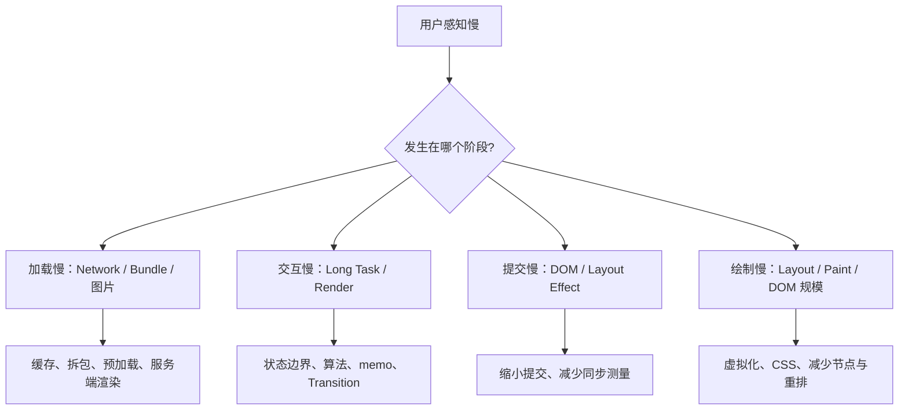
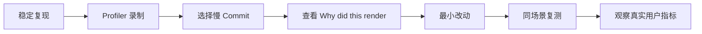
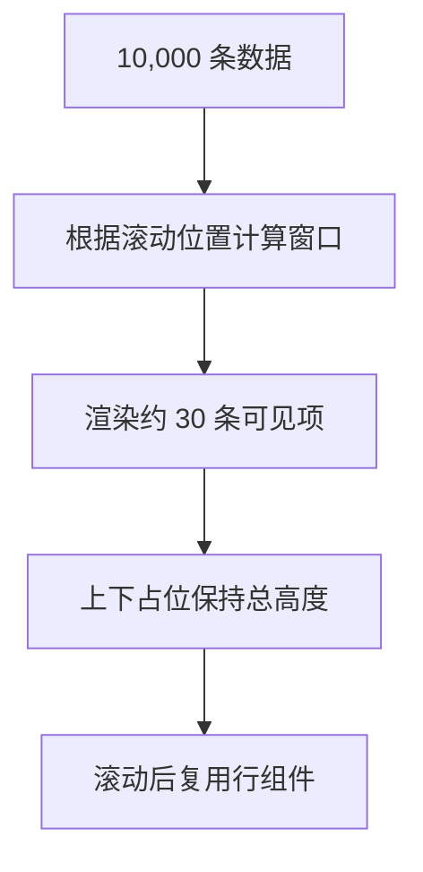
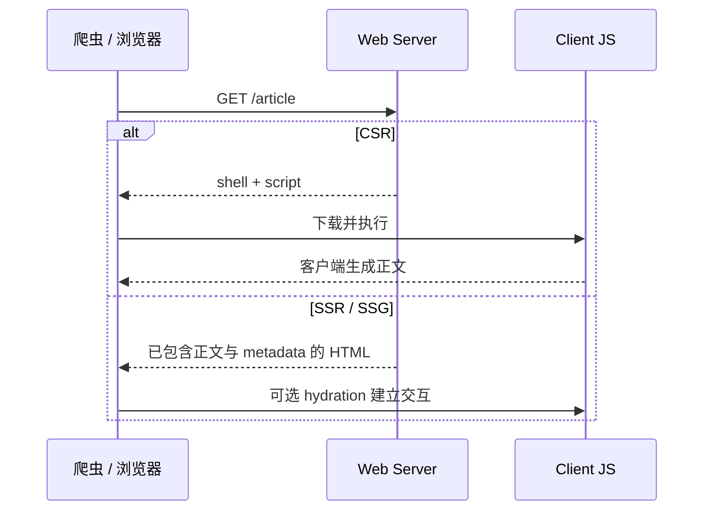

# React 性能与工程化：测量、渲染成本、Compiler、SSR 与 SEO

> 核心原则：性能优化不是背 `useMemo` 清单，而是定位瓶颈属于网络、JavaScript、Render、Commit、布局绘制还是资源加载，再用最小改动消除不必要工作。
> 难度标签：`基础必会` `进阶重点` `高级深挖`

## 目录

- [1. React 性能问题如何分类](#1-react-性能问题如何分类)
- [2. 先测量：Profiler 工作流](#2-先测量profiler-工作流)
- [3. 减少不必要的渲染传播](#3-减少不必要的渲染传播)
- [4. memoization 的收益与成本](#4-memoization-的收益与成本)
- [5. 列表、虚拟化与大计算](#5-列表虚拟化与大计算)
- [6. 并发能力与交互响应](#6-并发能力与交互响应)
- [7. React Compiler](#7-react-compiler)
- [8. 包体积与加载性能](#8-包体积与加载性能)
- [9. SSR、SSG、CSR 与 SEO](#9-ssrssgcsr-与-seo)
- [10. Hydration 与服务端工程边界](#10-hydration-与服务端工程边界)
- [11. 错误边界、测试与可观测性](#11-错误边界测试与可观测性)
- [12. 性能案例](#12-性能案例)
- [13. 面试速查](#13-面试速查)

---

## 1. React 性能问题如何分类

### 面试问题

React 项目卡顿时，你会怎么分析？

### 30 秒回答

先复现并量化，再区分瓶颈层：网络慢、bundle 大、JavaScript 长任务、React Render 重复、Commit / layout effect 过重、DOM 规模大、样式布局抖动或图片资源问题。用浏览器 Performance、React DevTools Profiler、Network 和真实用户指标定位，不能看到组件重渲染就直接加 `memo`。



### 常见指标与含义

| 指标 / 工具 | 主要回答 |
|---|---|
| LCP | 最大内容何时可见，受服务端、网络、图片和渲染影响 |
| INP | 用户交互到下一次绘制的响应性 |
| CLS | 页面是否发生意外布局偏移 |
| React Profiler | 哪个组件何时 Render / Commit，耗时多少 |
| Browser Performance | 主线程长任务、脚本、布局、绘制 |
| Network | 请求瀑布、缓存、资源优先级、压缩 |
| Bundle Analyzer | 哪些依赖进入客户端包 |

### “渲染次数”不是唯一指标

一个只渲染 1 次但执行 300ms 的组件，比渲染 5 次、每次 1ms 更严重。还要区分：

- 组件函数调用；
- React Render 阶段工作；
- DOM Commit；
- 浏览器 layout / paint；
- 开发 Strict Mode 的额外调用。

---

## 2. 先测量：Profiler 工作流

### 面试问题

如何用 React Profiler 定位性能问题？

### 30 秒回答

录制可重复的用户操作，先查看慢 Commit，再沿 Ranked / Flamegraph 找耗时组件和触发原因。确认是组件自身计算昂贵、父级传播、Context 广播还是 props 引用变化。做一次最小优化后重新录制，比较 commit duration 和用户指标，避免凭感觉优化。



### `<Profiler>` API

```tsx
import { Profiler, type ProfilerOnRenderCallback } from 'react';

const onRender: ProfilerOnRenderCallback = (
  id,
  phase,
  actualDuration,
  baseDuration,
  startTime,
  commitTime,
) => {
  // 生产采样时应控制频率，避免观测本身产生过大成本
  performanceLogger.record({
    id,
    phase,
    actualDuration,
    baseDuration,
    startTime,
    commitTime,
  });
};

function App() {
  return (
    <Profiler id="ProductPage" onRender={onRender}>
      <ProductPage />
    </Profiler>
  );
}
```

- `actualDuration`：本次更新实际渲染耗时。
- `baseDuration`：不使用 memoization 时完整子树的估计成本。
- `phase`：mount、update 或 nested-update 等阶段。

### 测量误区

- 开发构建包含额外检查，不代表生产绝对耗时。
- 单次本机测试不能代表低端设备与真实网络。
- 只盯平均值会掩盖 P75 / P95 长尾。
- 微基准可能优化了无关热点，应优先测真实用户路径。

---

## 3. 减少不必要的渲染传播

### 面试问题

父组件更新为什么会让子组件执行？如何减少无关渲染？

### 30 秒回答

父组件重新渲染时会重新计算其 children，默认继续检查子组件。优化优先顺序是：保持 Render 纯净且足够快、把瞬时状态下沉、使用组合隔离稳定子树、拆分高频 Context、缩小外部 Store selector，最后才用 `memo` 和稳定引用切断确实昂贵的传播。

### 状态下沉

```tsx
// ❌ 搜索输入放在 Page 顶层，每次键入都让整个页面子树重新计算
function Page() {
  const [query, setQuery] = useState('');
  return <><Header /><Search query={query} onChange={setQuery} /><ExpensiveDashboard /></>;
}

// ✅ 输入状态由真正使用它的局部组件持有
function Page() {
  return <><Header /><SearchSection /><ExpensiveDashboard /></>;
}
```

### 使用 children 隔离更新

```tsx
// 中文注释：该示例聚焦当前机制，省略无关工程细节。
function ColorPicker({ children }: { children: ReactNode }) {
  const [color, setColor] = useState('#ffffff');

  return (
    <section style={{ background: color }}>
      <input value={color} onChange={(event) => setColor(event.target.value)} />
      {children}
    </section>
  );
}

function App() {
  return (
    <ColorPicker>
      <ExpensiveTree />
    </ColorPicker>
  );
}
```

`children` Element 由 `App` 创建，ColorPicker 局部更新时可帮助 React 复用稳定子树。具体是否跳过仍由 React 决定，但这种架构通常比到处缓存更清晰。

### Context 拆分

把主题、登录用户、每秒变化的进度和大量 actions 放在同一个 value 中，会让所有消费者订阅同一广播。按语义和变化频率拆分，或使用 selector Store。

### 避免“镜像 props”

Effect 中把 props 复制到 state 会额外产生一次更新，且容易失同步。能直接渲染或计算的值不要镜像。

---

## 4. memoization 的收益与成本

### 面试问题

`React.memo`、`useMemo`、`useCallback` 如何正确使用？

### 30 秒回答

三者都通过保留上次结果或引用尝试跳过工作。收益前提是被跳过的计算足够贵、依赖大部分时间稳定、比较成本低于重算成本。缓存会增加内存、依赖维护和调试复杂度；一个始终变化的对象或函数就能让整条 memo 链失效。

### 三者职责

| API | 缓存对象 | 常见目的 |
|---|---|---|
| `memo(Component)` | 组件渲染结果的复用机会 | props 未变时跳过子组件执行 |
| `useMemo(factory, deps)` | 计算结果 | 跳过昂贵纯计算 / 稳定对象引用 |
| `useCallback(fn, deps)` | 函数引用 | 配合 memo 子组件或 Hook 依赖 |

### 正确示例

```tsx
const Chart = memo(function Chart({ points }: { points: Point[] }) {
  return <svg>{/* 绘制大量数据点 */}</svg>;
});

function Dashboard({ records, range }: Props) {
  const points = useMemo(
    () => aggregateRecords(records, range),
    // 聚合计算昂贵，且结果要传给 memo 子组件
    [records, range],
  );

  return <Chart points={points} />;
}
```

### 自定义比较函数的风险

```tsx
const Chart = memo(ChartView, (previous, next) => {
  // ❌ 如果漏比较 onHover，组件会长期使用旧闭包
  return previous.points === next.points;
});
```

自定义比较必须比较所有影响输出与行为的 props，包括函数。深比较可能比重新渲染更慢，并会在数据结构变化后产生隐蔽 bug。

### 依赖最小化

```tsx
const handleAdd = useCallback((text: string) => {
  setTodos((current) => [
    ...current,
    { id: crypto.randomUUID(), text },
  ]);
  // 使用函数式更新后，不需要把 todos 放进依赖
}, []);
```

依赖最小化不是删除 linter 提示，而是重写逻辑，避免读取不必要的响应式值。

### 什么时候不需要 memoization

- 组件很小，计算接近常数时间。
- props 每次都变化。
- 性能问题来自网络、DOM 或 CSS，不在 React Render。
- 缓存只为“看起来专业”。
- React Compiler 已覆盖该热点且测量没有额外收益。

---

## 5. 列表、虚拟化与大计算

### 面试问题

上万条列表如何优化？只加 `key` 和 `memo` 够吗？

### 30 秒回答

不够。`key` 解决身份，`memo` 只能尝试跳过组件计算，但浏览器仍要维护大量 DOM。大列表首选窗口化 / 虚拟化，只渲染视口附近项目；同时使用稳定 key、行高策略、分页或增量加载、事件委托和服务端聚合。复杂排序过滤可移到 Web Worker 或服务端。



### 稳定 key

```tsx
{rows.map((row) => (
  <Row key={row.id} row={row} /> // 使用持久业务 ID，而不是可变化的 index
))}
```

`key` 不会阻止重新渲染，它帮助 React 正确匹配身份、移动和状态。

### 计算移出主线程

Web Worker 适合纯 CPU 计算，但需要考虑结构化克隆成本和取消旧任务：

```ts
worker.postMessage({ type: 'aggregate', records });
worker.onmessage = (event: MessageEvent<AggregateResult>) => {
  // 回到主线程后只提交最终 UI 所需的紧凑结果
  setResult(event.data);
};
```

### 避免布局抖动

在循环中交替读取布局和写样式会强制多次同步布局。批量读取，再批量写入；动画优先 `transform` / `opacity`，并用浏览器 Performance 验证。

---

## 6. 并发能力与交互响应

### 面试问题

`useTransition` 能提升性能吗？

### 30 秒回答

它主要提升感知响应性，不一定减少总计算时间。Transition 让输入等紧急更新先提交，昂贵视图作为低优先级工作可被打断和重试。若计算本身耗时巨大，仍要优化算法、虚拟化或移出主线程；若 Commit 很慢，Transition 也无法中断它。

### 选择策略

| 问题 | 方案 |
|---|---|
| 输入被大列表阻塞 | 拆分紧急输入与 Transition 列表更新 |
| 子组件接收外部 query | `useDeferredValue` 延迟子树 |
| 固定时间内减少请求 | debounce / throttle + 取消请求 |
| CPU 计算太大 | 算法、缓存、Worker、服务端计算 |
| DOM 太多 | 虚拟化 / 分页 |
| Commit / layout effect 太慢 | 减少 DOM 写入和同步布局工作 |

### 乐观 UI

`useOptimistic` 能缩短用户感知等待，但要设计失败回滚、重复提交和并发冲突。乐观展示是交互策略，不是服务端成功保证。

---

## 7. React Compiler

### 面试问题

React Compiler 是什么？有了它还需要 `memo`、`useMemo`、`useCallback` 吗？

### 30 秒回答

React Compiler 是构建期优化器，通过理解组件和 Hook 的 JavaScript 语义，自动插入等价的 memoization，减少无意义重新计算。React Compiler 1.0 已作为稳定版本发布，但项目是否启用取决于构建链、代码兼容性和框架支持。手写缓存 API 仍存在，不过新代码应先保证符合 React 规则并通过测量决定是否保留。


### Compiler 依赖的代码质量

- 组件和 Hook 遵守纯净性。
- 不在 Render 中修改外部可变值。
- 不违反 Hook 规则。
- 不通过隐式 mutation 破坏数据流。
- 第三方库和构建工具版本兼容。

### 编译器不会做什么

- 不优化网络瀑布和数据库查询。
- 不自动虚拟化 10 万 DOM 节点。
- 不修复错误的 Effect 和状态所有权。
- 不保证任意动态 JavaScript 都能安全优化。
- 不替代 Profiler 和真实用户监控。

### 迁移建议

1. 升级并修复 React Hooks / Compiler ESLint 规则。
2. 在受控范围启用，观察诊断和产物。
3. 跑交互、视觉与性能基线。
4. 逐步移除没有必要的手写 memoization。
5. 对关键热点保留基准和回归监控。

---

## 8. 包体积与加载性能

### 面试问题

React 工程如何优化首屏加载？

### 30 秒回答

从请求链路看：减少必须下载的客户端 JavaScript、按路由和功能拆包、避免重复依赖、压缩和长期缓存静态资源、预加载关键资源、优化图片字体，并用 SSR / SSG / 流式渲染尽早输出内容。`React.lazy` 只解决组件代码拆分，不自动解决数据瀑布。

### 组件懒加载

```tsx
// 中文注释：该示例聚焦当前机制，省略无关工程细节。
const AdminPanel = lazy(() => import('./AdminPanel'));

function Route() {
  return (
    <Suspense fallback={<PanelSkeleton />}>
      <AdminPanel />
    </Suspense>
  );
}
```

### 常见工程问题

- barrel file 导致 tree shaking 失效或意外引入大模块。
- 同一库多个版本进入 bundle。
- 整包导入图标、日期或工具库。
- 把仅服务端使用的依赖带入 Client Component。
- 首屏先下载 JS，再由 Effect 发请求，形成请求瀑布。
- 第三方脚本无优先级和延迟策略。

### 预加载必须有证据

过度 `preload` 会争抢关键带宽。应根据真实导航概率、资源大小、缓存命中和浏览器优先级确定，不是把所有下一页资源都提前加载。

---

## 9. SSR、SSG、CSR 与 SEO

### 面试问题

React SPA 能被搜索引擎收录吗？网页源码中只有一个 root div 应该怎么办？

### 30 秒回答

部分搜索引擎能够执行 JavaScript，但渲染存在延迟、资源预算和兼容性差异，不能把 SEO 全押在爬虫执行 SPA。公开内容站点通常使用 SSG、SSR 或支持流式渲染的框架，直接返回有语义的 HTML、正确 metadata、结构化数据和可访问链接；同时优化状态码、canonical、sitemap 和性能。

### 渲染模式对比

| 模式 | HTML 生成时机 | 优点 | 代价 |
|---|---|---|---|
| CSR | 浏览器运行 JS 后 | 纯静态部署、交互灵活 | 首屏与 SEO 风险、JS 负担 |
| SSR | 每次请求或缓存命中时 | 个性化、首屏 HTML | 服务端成本、缓存复杂度 |
| SSG | 构建时 / 增量生成 | CDN 快、稳定 | 内容更新策略 |
| RSC + Streaming | 服务端组件流式输出 | 少客户端 JS、边界级流式 | 高度依赖框架与部署 |



### SEO 不只等于 SSR

还需要：

- 唯一且准确的 `<title>`、description 和 canonical。
- 正确 HTTP 状态码，避免软 404。
- 语义 HTML 与真实 `<a href>` 导航。
- robots、sitemap、结构化数据。
- 移动端体验和 Core Web Vitals。
- 避免 hydration 后把服务端正文替换为空。

### CSR 也可能适合

登录后的后台系统、内部工具和不需要公开索引的应用，CSR 可能足够。渲染策略应服务业务，不是所有 React 应用都必须 SSR。

---

## 10. Hydration 与服务端工程边界

### 面试问题

什么是 hydration mismatch？如何避免？

### 30 秒回答

Hydration 要求客户端首次 Render 与服务端 HTML 结构一致，再复用现有 DOM 绑定事件。若服务端和客户端初始输出不同，就会出现 mismatch，React 可能修复部分内容或回退客户端渲染。常见原因包括随机数、当前时间、浏览器专属 API、地区差异、无效 HTML 嵌套和请求数据不一致。

### 错误示例

```tsx
function Clock() {
  // ❌ 服务端和客户端执行时刻不同，首屏文本可能不一致
  return <time>{new Date().toLocaleTimeString()}</time>;
}
```

### 改进策略

- 服务端传入确定的时间戳和 locale。
- 客户端专属内容在 hydration 后再显示，并提供稳定占位。
- 使用 `useId` 生成 SSR 一致的无障碍关联 ID。
- 不在 Render 中读取 `window.innerWidth`；使用 CSS 或一致快照订阅。
- 确保服务端数据快照能被客户端复用。

```tsx
function ClientOnlyWidth() {
  const width = useSyncExternalStore(
    (notify) => {
      window.addEventListener('resize', notify);
      return () => window.removeEventListener('resize', notify);
    },
    () => window.innerWidth,
    () => 0, // 服务端和 hydration 初始值必须有明确策略
  );

  return <output>{width === 0 ? '未知' : `${width}px`}</output>;
}
```

### 请求级隔离

SSR 服务中不能把当前用户数据保存在模块全局可变单例，否则并发请求可能串数据。缓存应区分公共、用户级和请求级作用域，并遵守框架的失效模型。

---

## 11. 错误边界、测试与可观测性

### 面试问题

React 工程如何保证错误隔离和性能回归可发现？

### 30 秒回答

用 Error Boundary 隔离渲染错误，用路由 / 功能边界提供可恢复 UI；事件和异步错误仍需在相应调用链处理。测试以用户行为为中心，用 React Testing Library 验证可见结果，不把内部 state 当契约。上线后结合错误监控、Web Vitals、Profiler 采样和发布版本定位回归。

### Error Boundary 边界

Error Boundary 通常能捕获子树 Render、生命周期和构造过程中的错误，但不会自动捕获：

- 事件处理器中的异常；
- 任意异步回调；
- 服务端渲染错误的全部场景；
- Error Boundary 自身错误。

函数组件常由框架、路由或小型类包装提供边界能力。

### 测试示例

```tsx
it('提交成功后显示确认信息', async () => {
  render(<Checkout />);

  await user.type(screen.getByLabelText('邮箱'), 'ada@example.com');
  await user.click(screen.getByRole('button', { name: '提交订单' }));

  // 验证用户可见行为，而不是读取组件内部 state
  expect(await screen.findByText('订单已提交')).toBeVisible();
});
```

### 性能预算

可在 CI 和监控中定义：

- 关键路由 JS 预算；
- LCP / INP / CLS 阈值；
- 大列表交互基准；
- 核心 Commit duration 采样；
- 第三方脚本数量与加载策略。

性能预算应以用户和业务场景为单位，而不是只规定一个整个仓库的 bundle 数字。

---

## 12. 性能案例

### 场景：搜索输入卡顿

现象：输入 1 个字符后主线程冻结 200ms。

#### 错误的第一反应

给所有行加 `memo`、给所有函数加 `useCallback`，但 Profiler 显示主要耗时来自 20,000 个 DOM 节点和同步排序。

#### 正确拆解

1. 输入 state 与结果 query 分离。
2. 使用 Transition 保证输入优先响应。
3. 搜索请求 debounce + AbortController，避免网络浪费。
4. 服务端完成大数据筛选和排序。
5. 客户端列表虚拟化，只保留可视行。
6. 行组件热点经测量后再 `memo`。
7. 用 INP 和 Profiler 复测。

```tsx
function SearchPage() {
  const [input, setInput] = useState('');
  const [query, setQuery] = useState('');
  const [isPending, startTransition] = useTransition();

  function handleChange(next: string) {
    setInput(next); // 紧急：用户输入立即显示
    startTransition(() => setQuery(next)); // 非紧急：结果区域可稍后更新
  }

  return (
    <>
      <input value={input} onChange={(event) => handleChange(event.target.value)} />
      <VirtualizedResults query={query} dimmed={isPending} />
    </>
  );
}
```

### 场景：Context 导致全页重渲染

1. Profiler 找到高频 Provider value 每 100ms 变化。
2. 把稳定 auth 信息与进度状态拆成不同 Context。
3. 进度改为 selector Store，只让进度条订阅。
4. 把不消费上下文的昂贵内容放到 Provider 外或通过 children 组合。
5. 验证慢 Commit 是否消失。

### 场景：SSR 首屏快但 hydration 卡顿

SSR 只解决 HTML 到达，不代表交互已就绪。检查：

- 客户端 bundle 是否过大；
- 是否把本可作为 Server Component 的模块标成客户端；
- hydration 是否集中在一个大根；
- 第三方脚本是否抢占主线程；
- layout effect 是否执行大量同步工作；
- 是否能通过 Suspense / 框架边界分段激活。

---

## 13. 面试速查

### 高频问答

**Q：React 性能优化手段？**
A：先测量；优化状态边界和数据结构；减少不必要 Render；对昂贵子树使用 memoization；大列表虚拟化；优化算法和网络；使用 Transition 改善响应；拆包、SSR / Streaming 和资源优化；持续监控。

**Q：父组件更新，子组件一定更新 DOM 吗？**
A：子组件可能重新执行，但协调后若宿主输出不变，不一定修改 DOM。

**Q：`useMemo` 越多越好吗？**
A：不是，缓存有比较、内存和维护成本，应基于测量。

**Q：React Compiler 会淘汰手写 memo 吗？**
A：会降低需求，但仍需兼容性评估、Profiler 验证和正确架构；缓存 API 仍可用于明确场景。

**Q：虚拟 DOM 一定更快？**
A：不一定。它提供声明式协调和批量决策；特定手写 DOM 操作可能更快，但复杂应用可维护性和一致性更难。

**Q：SPA 能做 SEO 吗？**
A：能被部分爬虫渲染，但公开内容通常更适合 SSR / SSG，并配合 metadata、语义 HTML、状态码和性能治理。

### 优化优先级

```text
正确性与可测量性
  → 状态所有权与组件边界
  → 算法、网络、DOM 规模
  → 加载与渲染策略
  → memoization 微优化
```

## 参考资料

- [`<Profiler>`](https://react.dev/reference/react/Profiler)、[`memo`](https://react.dev/reference/react/memo)、[`useMemo`](https://react.dev/reference/react/useMemo)、[`useCallback`](https://react.dev/reference/react/useCallback)
- [`useTransition`](https://react.dev/reference/react/useTransition)、[`useDeferredValue`](https://react.dev/reference/react/useDeferredValue)、[`Suspense`](https://react.dev/reference/react/Suspense)
- [React Compiler v1.0](https://react.dev/blog/2025/10/07/react-compiler-1)
- [web.dev：Web Vitals](https://web.dev/articles/vitals) 与浏览器性能分析
- [React Server Components](https://react.dev/reference/rsc/server-components)、[hydrateRoot](https://react.dev/reference/react-dom/client/hydrateRoot)

## 关联专题

- [状态更新与渲染](./react-state-and-rendering.md)
- [Hooks 深入](./react-hooks-deep-dive.md)
- [Fiber、并发与现代 React](./react-fiber-concurrency-and-modern-react.md)
- [React Diff 与 Vue 3 对比](./react-diff-vue3-compare.md)
