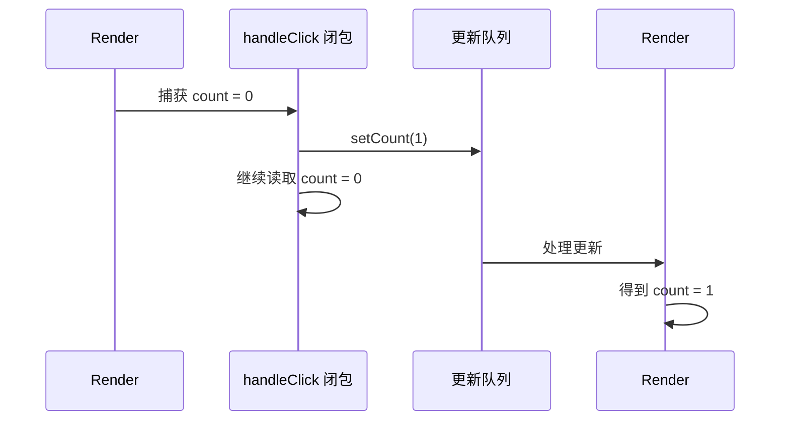
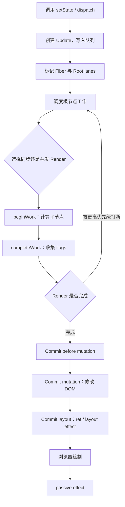
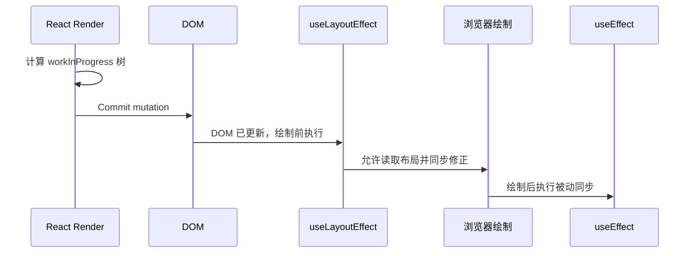

# React 状态更新与渲染：Snapshot、Queue、Batching 与 Commit

> 核心结论：不要再用“`setState` 到底同步还是异步”概括 React 更新。更准确的链路是：**发出更新请求 → 进入队列 → 按优先级参与调度 → Render 计算 → Commit 生效**。
> 难度标签：`基础必会` `进阶重点` `高级深挖` `历史兼容`

## 目录

- [1. State 是一次渲染的快照](#1-state-是一次渲染的快照)
- [2. 更新队列与函数式更新](#2-更新队列与函数式更新)
- [3. Batching 到底做了什么](#3-batching-到底做了什么)
- [4. 一次更新的完整链路](#4-一次更新的完整链路)
- [5. Render 与 Commit](#5-render-与-commit)
- [6. 状态如何保留与重置](#6-状态如何保留与重置)
- [7. Props、State 与派生状态](#7-propsstate-与派生状态)
- [8. 类组件 setState 的历史兼容](#8-类组件-setstate-的历史兼容)
- [9. 高频场景与调试方法](#9-高频场景与调试方法)
- [10. 面试速查](#10-面试速查)

---

## 1. State 是一次渲染的快照

### 面试问题

为什么调用 `setState` 后，当前函数里的变量没有立刻变化？

### 30 秒回答

函数组件每次渲染都会得到一份固定的状态快照。调用状态更新函数不是修改当前闭包里的变量，而是请求 React 使用新状态进行下一次渲染。因此，同一个事件处理器继续读取的仍是创建它的那次渲染快照。

```tsx
function SnapshotDemo() {
  const [count, setCount] = useState(0);

  function handleClick() {
    setCount(count + 1); // 请求下一次渲染使用 1
    console.log(count); // 仍然输出 0：当前闭包中的快照没有改变
  }

  return <button onClick={handleClick}>{count}</button>;
}
```



图中的关键不是“JavaScript 变量更新慢”，而是事件处理器属于旧渲染。每次 Render 都像拍摄一张新的照片，其中包含当时的状态和由它创建的回调。

### 快照模型解决什么问题

- 一次渲染内部读取一致，不会在函数执行到一半时突然变化。
- React 可以保留、暂停或重试某个渲染工作。
- 异步回调的闭包语义可解释，而不是依赖一个随时变化的隐式实例字段。

### 延时回调示例

```tsx
function DelayedAlert() {
  const [count, setCount] = useState(0);

  function handleAlert() {
    const snapshot = count; // 明确记录本次点击看到的状态
    window.setTimeout(() => {
      alert(`点击时的计数：${snapshot}`);
    }, 3000);
  }

  return (
    <>
      <button onClick={() => setCount((value) => value + 1)}>+1</button>
      <button onClick={handleAlert}>3 秒后显示</button>
    </>
  );
}
```

如果需求是读取“回调执行时的最新值”，应重新审视业务语义；确实需要时可用 `ref` 保存 latest value，但不要用 ref 逃避正常状态建模。

---

## 2. 更新队列与函数式更新

### 面试问题

连续调用三次 `setCount(count + 1)` 为什么通常只增加 1？怎么保证增加 3？

### 30 秒回答

同一个事件处理器中的 `count` 都来自同一快照，因此三次传入的都是相同替换值。函数式更新把“如何基于前一个待处理状态计算下一个状态”加入队列，React 会按顺序执行更新函数，所以三次 `setCount(value => value + 1)` 能累加 3。

```tsx
function Counter() {
  const [count, setCount] = useState(0);

  function addWrong() {
    setCount(count + 1);
    setCount(count + 1);
    setCount(count + 1); // 三次都基于同一个 count 快照
  }

  function addCorrectly() {
    setCount((value) => value + 1);
    setCount((value) => value + 1);
    setCount((value) => value + 1); // 队列依次得到 n+1、n+2、n+3
  }

  return (
    <>
      <output>{count}</output>
      <button onClick={addWrong}>错误累加</button>
      <button onClick={addCorrectly}>正确累加</button>
    </>
  );
}
```

### 简化更新队列

> 下列代码是简化 JavaScript 伪代码，并非 React 源码原文。

```js
function processUpdateQueue(baseState, updates) {
  let nextState = baseState;

  for (const update of updates) {
    if (typeof update === 'function') {
      // 函数式更新基于队列中上一步的结果继续计算
      nextState = update(nextState);
    } else {
      // 直接值可理解为“用该值替换当前待计算状态”
      nextState = update;
    }
  }

  return nextState;
}
```

### 混合更新如何计算

假设初始值为 `0`：

```tsx
setCount(count + 5);          // 队列：替换为 5
setCount((value) => value + 1); // 队列：基于 5 得到 6
setCount(42);                 // 队列：最终替换为 42
```

结果是 `42`。面试时应说明这是用于理解的队列语义；真实实现还涉及优先级、被跳过更新、base queue 和 lanes。

### 对象更新为什么要复制

```tsx
type User = { name: string; tags: string[] };

function addTag(user: User, tag: string): User {
  return {
    ...user,
    tags: [...user.tags, tag], // 创建新数组，保留旧快照不被修改
  };
}
```

React 不要求深拷贝整个对象，只需要对发生变化的路径创建新引用。结构共享同时保证不可变语义和较低复制成本。

---

## 3. Batching 到底做了什么

### 面试问题

什么是批处理？React 18 以后有什么变化？

### 30 秒回答

Batching（批处理）是 React 把一段执行上下文中的多个状态更新合并到较少的渲染提交中。React 18 使用 `createRoot` 后扩展了自动批处理范围，不只覆盖 React 事件，也覆盖常见的 Promise、定时器和原生事件回调。批处理减少重复 Render / Commit，但不会把不同 state 更新“合并成一个值”，每条更新仍按队列规则计算。

```tsx
function BatchDemo() {
  const [count, setCount] = useState(0);
  const [pending, setPending] = useState(false);

  async function handleClick() {
    setPending(true);
    const result = await Promise.resolve(3);
    setCount((value) => value + result);
    setPending(false);
    // 在现代根中，这些更新通常可以自动批处理，减少中间提交
  }

  return <button onClick={handleClick}>{pending ? '处理中…' : count}</button>;
}
```

### 批处理不保证什么

- 不保证 `setState` 调用后当前变量立刻改变。
- 不保证所有时刻、所有根、所有外部集成都只有一次渲染。
- 不会跨越必须立即响应的离散用户事件，把两个独立点击错误地混为一个事件。
- 开发环境 Strict Mode 可能额外调用渲染逻辑，不能只用 `console.log` 次数判断生产提交次数。

### `flushSync` 的边界

```tsx
import { flushSync } from 'react-dom';

function MessageList() {
  const [messages, setMessages] = useState<string[]>([]);
  const listRef = useRef<HTMLUListElement>(null);

  function addMessage(message: string) {
    flushSync(() => {
      // 强制这次更新同步提交，以便下一行读取最新 DOM
      setMessages((items) => [...items, message]);
    });

    listRef.current?.lastElementChild?.scrollIntoView();
  }

  return <ul ref={listRef}>{messages.map((item) => <li key={item}>{item}</li>)}</ul>;
}
```

`flushSync` 是与浏览器或第三方命令式 API 集成时的逃生舱，会压缩调度空间并可能伤害性能，不应作为“让 state 立即变化”的常规工具。

---

## 4. 一次更新的完整链路

### 面试问题

调用状态更新函数后，React 内部大致发生什么？

### 30 秒回答

更新会被包装成更新对象并进入对应 Hook / Fiber 的队列，同时把优先级 lane 向根传播。调度器选择合适时机执行 Render，遍历 Fiber 树并进行协调，生成 work-in-progress 树和 flags。Render 完成后进入不可中断的 Commit，执行 DOM 变更、ref、布局 Effect，浏览器绘制后再处理被动 Effect。



### 简化伪代码

> 下列代码是简化 JavaScript 伪代码，并非 React 源码原文。

```js
function dispatchSetState(fiber, queue, action) {
  const lane = requestUpdateLane(fiber); // 根据当前更新上下文选择优先级
  const update = { lane, action, next: null };

  enqueueUpdate(queue, update);          // 更新先进入队列，不直接改当前快照
  const root = markUpdateToRoot(fiber, lane);
  scheduleUpdateOnRoot(root, lane);      // 让调度器决定何时开始工作
}
```

### Eager state 优化

在部分简单场景，React 可以提前计算下一状态；如果与当前状态通过 `Object.is` 比较相同，可能跳过后续调度。但这属于优化，业务逻辑不能依赖“更新函数一定只执行一次”。

---

## 5. Render 与 Commit

### 面试问题

React 渲染流程主要有哪些阶段？哪些阶段能操作 DOM？

### 30 秒回答

Trigger、Render、Commit 是最适合面试表达的三步。Render 调用组件并协调树，只计算下一 UI，不应产生副作用；Commit 把 flags 对应的变更应用到 DOM，并处理 ref 与布局 Effect。浏览器完成布局绘制后，React 通常再执行 `useEffect`。

### Render 阶段

- 调用函数组件或类组件 render。
- 处理更新队列，计算下一状态。
- 比较子元素，复用或创建 Fiber。
- 生成 Placement、Update、Deletion 等 flags。
- 在并发路径中可暂停、继续、放弃或重新开始。

### Commit 阶段

1. **Before Mutation**：读取 DOM 变更前信息等。
2. **Mutation**：插入、移动、删除和更新宿主节点。
3. **Layout**：设置 ref，执行 `useLayoutEffect` 与对应类生命周期。
4. **Passive Effects**：通常在绘制后调度 `useEffect` 清理与执行。



### 为什么 Render 必须纯净

如果在 Render 中发送请求、订阅事件或修改 DOM，一旦渲染被重试，就会重复产生不可回滚的外部影响。副作用应放入事件处理器或 Effect：

- 因用户动作发生的事情，优先放事件处理器。
- 因组件显示并需要与外部系统保持同步的事情，放 Effect。
- 可由现有数据直接推导的值，放 Render，不要放 Effect。

---

## 6. 状态如何保留与重置

### 面试问题

React 根据什么决定组件状态保留还是重置？`key` 为什么也能用于非列表组件？

### 30 秒回答

状态绑定在 Fiber 树中的“组件类型 + 位置 + key”身份上。相同父节点下，相同位置、类型和 key 通常会复用 Fiber 并保留状态；类型或 key 变化会创建新 Fiber，旧状态随卸载丢弃。`key` 是身份提示，不只用于列表，也可用于显式重置表单或会话。

```tsx
type ChatProps = { userId: string };

function Chat({ userId }: ChatProps) {
  const [draft, setDraft] = useState('');
  return <textarea value={draft} onChange={(event) => setDraft(event.target.value)} />;
}

function ChatPage({ selectedUserId }: { selectedUserId: string }) {
  return (
    // 用户变化时 key 变化，React 会创建新的 Chat 身份并清空草稿
    <Chat key={selectedUserId} userId={selectedUserId} />
  );
}
```

### 不要在组件内部定义组件

```tsx
function Parent() {
  // ❌ 每次 Parent 渲染都会创建新的函数类型，Child 状态会反复重置
  function Child() {
    const [value, setValue] = useState('');
    return <input value={value} onChange={(event) => setValue(event.target.value)} />;
  }

  return <Child />;
}
```

应把 `Child` 移到模块顶层，确保组件类型引用稳定。

### CSS 隐藏与条件卸载

- `display: none`：DOM 和组件仍存在，状态保留。
- 条件渲染为 `null`：对应子树卸载，状态通常丢失。
- Suspense / Offscreen 相关能力可能保留隐藏树，需按具体 API 和框架行为判断。

---

## 7. Props、State 与派生状态

### 面试问题

什么时候需要把 props 复制到 state？如何避免派生状态失同步？

### 30 秒回答

默认不要复制。若值能由当前 props / state 计算，应在 Render 中推导；如果计算昂贵再考虑 `useMemo`。只有“把 props 作为初始值后由组件独立编辑”等明确语义才存 state，并通过 key 或显式重置定义切换行为。

```tsx
function ProductList({ products, query }: {
  products: Array<{ id: string; name: string }>;
  query: string;
}) {
  // 这是派生数据，不需要 useEffect + setState 再同步一遍
  const visibleProducts = products.filter((product) =>
    product.name.toLowerCase().includes(query.toLowerCase()),
  );

  return <ul>{visibleProducts.map((item) => <li key={item.id}>{item.name}</li>)}</ul>;
}
```

### 何时可以使用 `useMemo`

```tsx
const visibleProducts = useMemo(
  () => expensiveFilter(products, query),
  // 只有 products 或 query 变化时才重新执行昂贵计算
  [products, query],
);
```

`useMemo` 是性能优化，不是语义保证。若移除它会导致逻辑错误，说明状态或依赖建模存在问题。

---

## 8. 类组件 setState 的历史兼容

### 面试问题

类组件 `this.setState` 与 Hook state 有何不同？

### 30 秒回答

类组件对象形式的 `setState` 会对顶层 state 做浅合并，而 `useState` 更新值是替换语义。类组件连续依赖前值时也应使用函数形式，并在回调或生命周期中读取提交后的结果。二者都应理解为更新请求，不要依赖调用后立即读取的新值。

```tsx
class Counter extends React.Component<object, { count: number; label: string }> {
  state = { count: 0, label: '计数' };

  add = () => {
    this.setState(
      (previous) => ({ count: previous.count + 1 }), // 顶层浅合并，label 被保留
      () => {
        // 回调在提交后执行，可以读取已提交状态
        console.log(this.state.count);
      },
    );
  };

  render() {
    return <button onClick={this.add}>{this.state.count}</button>;
  }
}
```

Hook 对象状态需要显式合并：

```tsx
setForm((previous) => ({
  ...previous,
  name: nextName, // useState 不会自动合并对象字段
}));
```

### “同步 / 异步”问法的标准纠正

可以这样回答：

> `setState` 的调用本身是同步执行的，但它提交的是更新请求；状态变量属于当前渲染快照，不会原地修改。React 是否立刻 Render / Commit 取决于更新来源、批处理、优先级、根模式以及是否使用 `flushSync`。所以更准确地讨论“更新何时被处理和提交”，而不是给 `setState` 贴同步或异步标签。

---

## 9. 高频场景与调试方法

### 场景一：更新丢失

```tsx
// ❌ 多个异步结果都捕获了旧列表，后完成者可能覆盖先完成者
setItems([...items, result]);

// ✅ 基于队列中的最新待处理状态追加
setItems((current) => [...current, result]);
```

### 场景二：对象引用没变

```tsx
// ❌ 原地修改后仍传回同一对象，React 可能通过 Object.is 认为没有变化
user.name = 'Grace';
setUser(user);

// ✅ 创建新对象，保留旧快照
setUser((current) => ({ ...current, name: 'Grace' }));
```

### 场景三：无限更新

```tsx
function Broken() {
  const [count, setCount] = useState(0);
  setCount(count + 1); // ❌ Render 期间无条件更新，引发重复渲染
  return <p>{count}</p>;
}
```

更新应由事件、Effect 的外部同步或明确的条件机制触发，不应把修正逻辑随意放在渲染主体。

### 场景四：开发环境渲染两次

Strict Mode 会在开发环境执行额外检查，帮助发现不纯渲染、Effect 缺少清理和 ref 回调问题。调试时区分：

- 组件函数被调用次数；
- DOM 实际 Commit 次数；
- Effect setup / cleanup 次数；
- 生产构建行为。

### 建议的定位顺序

1. React DevTools Profiler 确认是谁触发更新。
2. 检查 state 所有者是否过高。
3. 检查对象、数组、函数引用是否每次重建。
4. 检查 Context value 是否包含频繁变化的大对象。
5. 检查 Effect 是否在同步可推导状态。
6. 最后再决定是否使用 memoization。

---

## 10. 面试速查

### 一组可以直接口述的答案

**Q：调用 `setState` 后发生什么？**
A：创建更新并入队，标记优先级到根，调度 Render；Render 处理队列并协调 Fiber；完成后 Commit DOM、ref 和 Effect。

**Q：为什么连续三次 `setCount(count + 1)` 只加一次？**
A：三次读取同一渲染快照并提交同一个替换结果，应使用函数式更新表达累加。

**Q：React 18 自动批处理是什么？**
A：现代根把更多异步上下文中的更新合并处理，以减少中间提交；它不改变快照和队列语义。

**Q：什么时候状态会重置？**
A：当组件在树中的类型、位置或 key 身份变化，React 创建新 Fiber，旧状态被丢弃。

**Q：Render 和 Commit 的区别？**
A：Render 计算且可能被重做；Commit 修改宿主环境且必须保持一致性。

### 易错结论对照

| 不准确说法 | 更准确表达 |
|---|---|
| setState 是异步的 | setState 发出更新请求，提交时机由队列、批处理和调度决定 |
| setState 会马上改变量 | 当前渲染快照不变，下一次渲染获得新状态 |
| 批处理会丢更新 | 直接值可能覆盖，函数式更新会按队列顺序计算 |
| 组件更新就一定改 DOM | Render 后可能发现宿主输出没有变化 |
| key 只是消除警告 | key 定义兄弟节点身份，影响复用、移动和状态保留 |

## 参考资料

- [State as a Snapshot](https://react.dev/learn/state-as-a-snapshot)
- [Queueing a Series of State Updates](https://react.dev/learn/queueing-a-series-of-state-updates)
- [Render and Commit](https://react.dev/learn/render-and-commit)
- [Preserving and Resetting State](https://react.dev/learn/preserving-and-resetting-state)
- [React v18.0](https://react.dev/blog/2022/03/29/react-v18)：Automatic Batching 与并发基础设施

## 关联专题

- [React 核心与组件模型](./react-core-and-component-model.md)
- [Hooks 深入](./react-hooks-deep-dive.md)
- [Fiber、并发与现代 React](./react-fiber-concurrency-and-modern-react.md)
- [React Diff 与 Vue 3 对比](./react-diff-vue3-compare.md)
