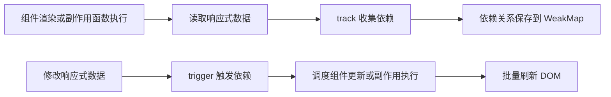
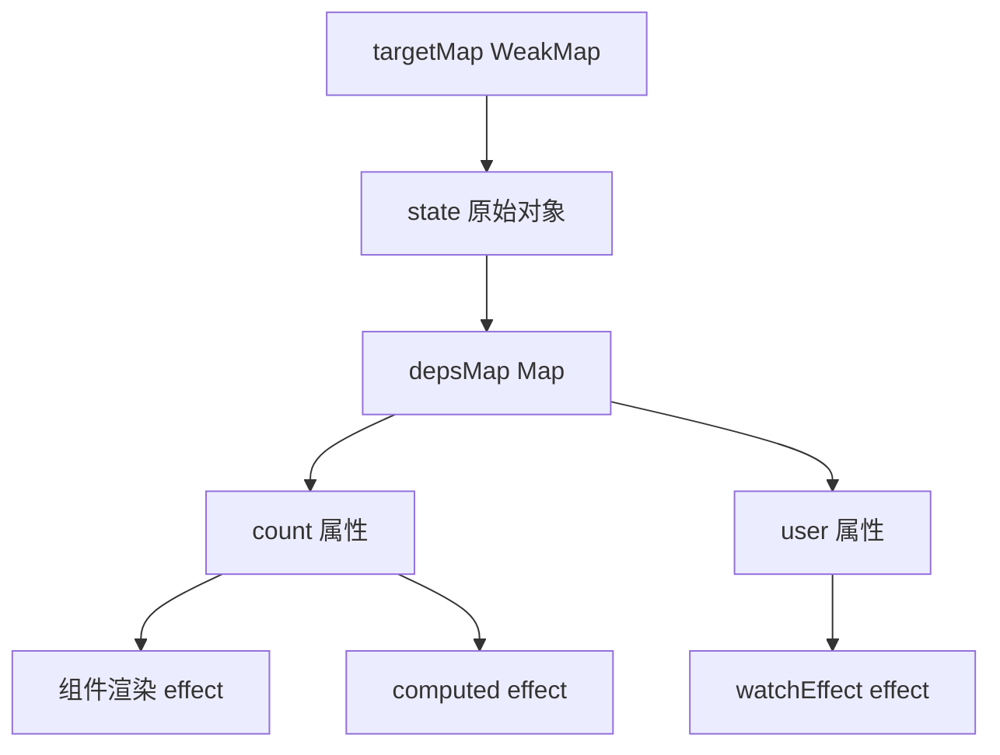
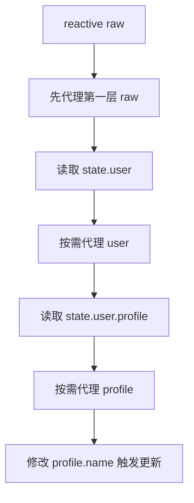
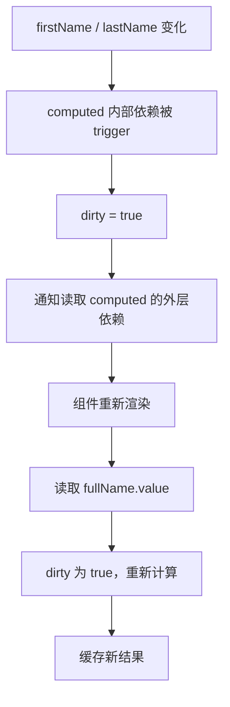
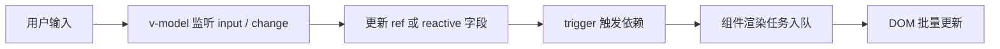
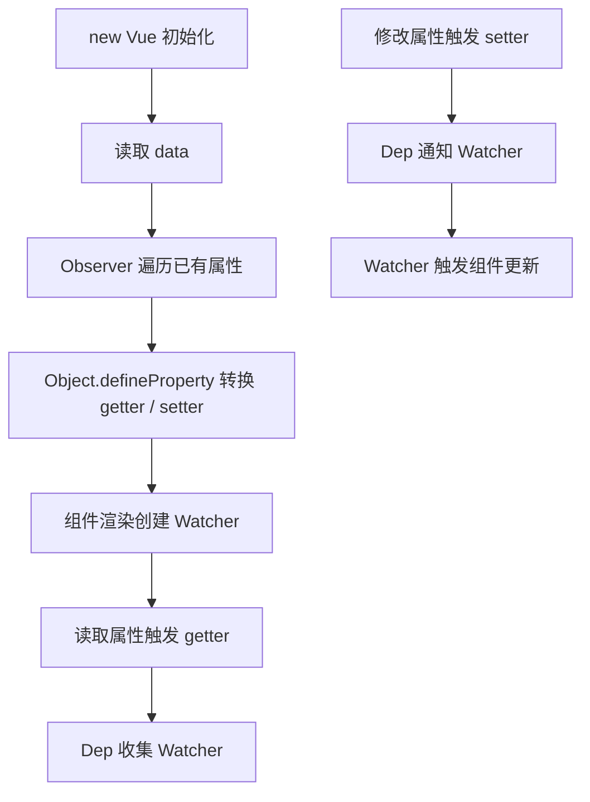
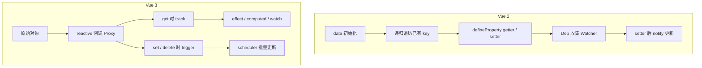
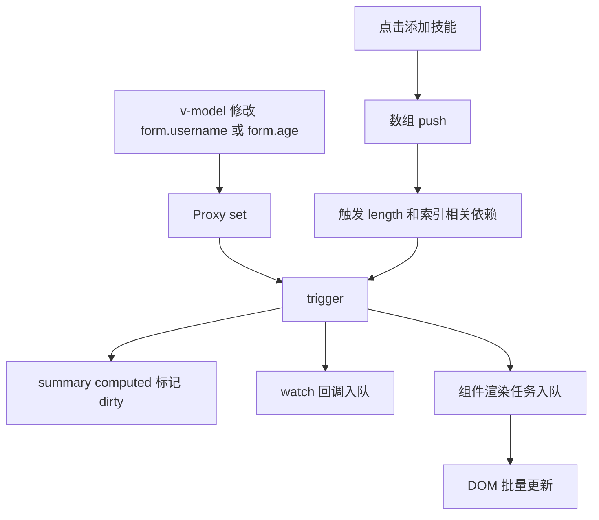

```mermaid
sequenceDiagram
  participant Code as 同步代码
  participant State as 响应式状态
  participant Queue as 更新队列
  participant Micro as 微任务
  participant DOM as DOM

  Code->>State: count.value++
  State->>Queue: 组件更新任务入队
  Code->>DOM: 立即读取可能是旧 DOM
  Queue->>Micro: Promise.then 安排刷新
  Micro->>DOM: 批量 patch
  Code->>DOM: await nextTick 后读取新 DOM
```

# Vue 3 响应式原理与 Vue 2 对比

> 本文从“问题驱动”的角度梳理 Vue 3 响应式原理，并系统对比 Vue 2 的实现差异。文档中的代码示例尽量逐行添加中文说明，帮助把 API 用法和底层机制对应起来。

---

## 1. 总览：响应式到底解决什么问题？

### Q1：什么是 Vue 的响应式？

Vue 的响应式可以概括为一句话：

> **读取数据时建立依赖关系，修改数据时通知依赖重新执行，最终驱动视图更新。**

一个组件渲染时，会读取模板中使用到的状态；Vue 会记录“这个组件依赖了哪些状态”。当这些状态变化时，Vue 不需要手动调用 `render()`，而是自动找到相关组件并安排更新。



Vue 3 的响应式系统主要由下面几个部分组成：

| 模块 | 作用 |
|---|---|
| `reactive()` | 把对象变成响应式代理对象 |
| `ref()` | 把任意值包装成响应式引用，尤其适合基本类型 |
| `effect()` | 表示一个会依赖响应式数据的副作用函数 |
| `track()` | 读取数据时收集依赖 |
| `trigger()` | 修改数据时触发依赖 |
| `computed()` | 基于响应式依赖生成带缓存的派生值 |
| `watch()` | 显式监听一个或多个响应式来源 |
| `watchEffect()` | 自动收集依赖并执行副作用 |
| scheduler | 把更新任务放进队列，避免重复更新 |

---

## 2. Vue 3 的核心原理：`Proxy` + `Reflect` + 依赖图

### Q2：Vue 3 为什么选择 `Proxy`？

Vue 3 使用 `Proxy` 代理整个对象，而不是像 Vue 2 那样逐个属性定义 getter / setter。这样做有几个直接收益：

1. 可以拦截对象属性读取、设置、删除、`in` 操作、遍历等行为。
2. 可以天然识别新增属性和删除属性。
3. 可以更好地处理数组索引、数组长度变化。
4. 可以支持 `Map`、`Set`、`WeakMap`、`WeakSet` 等集合类型。
5. 嵌套对象可以在访问时再代理，减少初始化阶段的递归成本。

简化版 `reactive()` 可以这样理解：

```js
// 定义 reactive 函数，用来把普通对象转换成响应式代理对象。
function reactive(target) {
  // 通过 Proxy 创建代理对象，target 是被代理的原始对象。
  return new Proxy(target, {
    // get 会在读取属性时触发，例如 state.count。
    get(target, key, receiver) {
      // 读取属性时收集依赖，记录当前正在执行的副作用函数依赖了 target[key]。
      track(target, key)

      // 使用 Reflect.get 保持 JavaScript 原本的取值语义，包括 this 指向和原型链行为。
      return Reflect.get(target, key, receiver)
    },

    // set 会在设置属性时触发，例如 state.count = 1。
    set(target, key, value, receiver) {
      // 先使用 Reflect.set 完成真正的赋值操作。
      const result = Reflect.set(target, key, value, receiver)

      // 赋值完成后触发依赖，通知使用过 target[key] 的逻辑重新执行。
      trigger(target, key)

      // set 拦截器需要返回布尔值，表示赋值是否成功。
      return result
    },

    // deleteProperty 会在删除属性时触发，例如 delete state.name。
    deleteProperty(target, key) {
      // 先使用 Reflect.deleteProperty 执行真正的删除操作。
      const result = Reflect.deleteProperty(target, key)

      // 删除属性后触发依赖，通知相关视图或副作用更新。
      trigger(target, key)

      // 返回删除结果，保持代理行为符合语言规范。
      return result
    }
  })
}
```

> 上面是教学版伪代码，不是 Vue 源码，但它表达了 Vue 3 响应式最核心的思想。

---

## 3. Vue 3 的依赖图：`WeakMap -> Map -> Set`

### Q3：Vue 3 如何知道“哪个数据变化后要更新谁”？

Vue 3 会维护一张依赖图。它可以抽象为：

```txt
targetMap: WeakMap
└── target 原始对象
    └── depsMap: Map
        └── key 属性名
            └── dep: Set
                └── effect 副作用函数
```

含义如下：

| 层级 | 含义 | 示例 |
|---|---|---|
| `WeakMap` 的 key | 原始对象 | `state` 对应的原始对象 |
| `Map` 的 key | 对象属性 | `'count'`、`'name'` |
| `Set` 中的值 | 依赖该属性的副作用 | 组件渲染函数、`computed`、`watchEffect` |

依赖收集伪代码：

```js
// 使用 WeakMap 保存所有响应式对象的依赖关系，弱引用可以帮助垃圾回收。
const targetMap = new WeakMap()

// activeEffect 表示当前正在执行、并且需要被收集的副作用函数。
let activeEffect = null

// track 用于在读取响应式属性时收集依赖。
function track(target, key) {
  // 如果当前没有正在执行的副作用函数，说明这次读取不需要建立依赖。
  if (!activeEffect) return

  // 根据原始对象获取它对应的属性依赖表。
  let depsMap = targetMap.get(target)

  // 如果这个对象还没有依赖表，就创建一个新的 Map。
  if (!depsMap) {
    // Map 用来保存每个属性和它的依赖集合。
    depsMap = new Map()

    // 把新建的依赖表关联到当前原始对象。
    targetMap.set(target, depsMap)
  }

  // 根据属性名获取这个属性对应的依赖集合。
  let dep = depsMap.get(key)

  // 如果这个属性还没有依赖集合，就创建一个新的 Set。
  if (!dep) {
    // Set 可以天然去重，避免同一个 effect 被重复收集。
    dep = new Set()

    // 把新建的依赖集合关联到当前属性。
    depsMap.set(key, dep)
  }

  // 把当前正在执行的副作用函数加入依赖集合。
  dep.add(activeEffect)
}
```

触发更新伪代码：

```js
// trigger 用于在响应式属性变化时触发依赖。
function trigger(target, key) {
  // 根据原始对象找到它的属性依赖表。
  const depsMap = targetMap.get(target)

  // 如果对象没有依赖表，说明没有任何逻辑依赖它。
  if (!depsMap) return

  // 根据属性名找到依赖这个属性的所有副作用函数。
  const dep = depsMap.get(key)

  // 如果这个属性没有依赖集合，说明没有逻辑依赖它。
  if (!dep) return

  // 遍历依赖集合，逐个触发副作用函数。
  dep.forEach(effectFn => {
    // 实际 Vue 内部会先交给 scheduler 调度，这里为了理解直接执行。
    effectFn()
  })
}
```

依赖图示例：



---

## 4. `effect`：响应式系统的执行单元

### Q4：`effect` 是什么？

`effect` 可以理解为“依赖响应式数据的函数”。组件渲染、`computed`、`watchEffect` 底层都可以抽象成 effect。

一个最简化的 effect 实现如下：

```js
// activeEffect 保存当前正在执行的副作用函数。
let activeEffect = null

// effect 函数接收一个用户传入的副作用函数。
function effect(fn) {
  // effectFn 是包装后的副作用函数，用于建立当前执行上下文。
  const effectFn = () => {
    // 执行前把当前副作用函数设置为 activeEffect。
    activeEffect = effectFn

    // 执行用户函数，函数内部读取响应式数据时会触发 track。
    fn()

    // 执行完成后清空 activeEffect，避免无关读取被错误收集。
    activeEffect = null
  }

  // 首次注册 effect 时立即执行一次，用来完成首次依赖收集。
  effectFn()

  // 返回包装后的 effect，方便后续手动执行或停止。
  return effectFn
}
```

配合 `reactive()` 后的执行过程：

```js
// 创建一个响应式对象，内部会返回 Proxy 代理对象。
const state = reactive({ count: 0 })

// 注册一个副作用函数，里面读取了 state.count。
effect(() => {
  // 读取 state.count 时会触发 Proxy get，并通过 track 收集当前 effect。
  console.log('当前数量：', state.count)
})

// 修改 state.count 时会触发 Proxy set，并通过 trigger 重新执行 effect。
state.count++
```

执行链路：

```txt
1. effect() 首次执行
2. activeEffect 指向当前 effectFn
3. 函数内部读取 state.count
4. Proxy get 触发 track(state, 'count')
5. 依赖图中记录 state.count -> effectFn
6. state.count++ 触发 Proxy set
7. trigger(state, 'count') 找到 effectFn
8. effectFn 重新执行
```

---

## 5. Vue 3 中 `reactive()` 的详细机制

### Q5：`reactive()` 具体做了哪些事？

`reactive()` 不是简单复制对象，而是返回一个代理对象。Vue 会缓存代理结果，避免同一个原始对象被重复代理。

简化版实现：

```js
// reactiveMap 用来缓存原始对象和代理对象的关系。
const reactiveMap = new WeakMap()

// reactive 接收一个对象，并返回它的响应式代理。
function reactive(target) {
  // 如果传入的不是对象，就无法使用 Proxy 代理。
  if (typeof target !== 'object' || target === null) {
    // 实际 Vue 会在开发环境给出警告，这里直接返回原值。
    return target
  }

  // 如果这个对象已经被代理过，就直接返回缓存中的代理对象。
  const existingProxy = reactiveMap.get(target)

  // 有缓存时避免重复创建 Proxy，也能保持同一对象代理结果稳定。
  if (existingProxy) {
    // 返回已经存在的代理对象。
    return existingProxy
  }

  // 创建新的 Proxy 代理对象。
  const proxy = new Proxy(target, mutableHandlers)

  // 把原始对象和代理对象缓存起来。
  reactiveMap.set(target, proxy)

  // 返回代理对象，后续应该始终通过它读写状态。
  return proxy
}
```

`get` 拦截器的关键逻辑：

```js
// mutableHandlers 保存普通可变对象的代理拦截器。
const mutableHandlers = {
  // get 在读取属性时触发。
  get(target, key, receiver) {
    // 使用 Reflect.get 获取真实属性值。
    const result = Reflect.get(target, key, receiver)

    // 读取属性时收集依赖。
    track(target, key)

    // 如果读取到的结果仍然是对象，就在访问时继续转换为响应式代理。
    if (typeof result === 'object' && result !== null) {
      // 懒代理：只有真正访问嵌套对象时，才创建嵌套代理。
      return reactive(result)
    }

    // 如果是基本类型，直接返回结果。
    return result
  }
}
```

`set` 拦截器的关键逻辑：

```js
// mutableHandlers 保存普通可变对象的代理拦截器。
const mutableHandlers = {
  // set 在新增属性或修改属性时触发。
  set(target, key, value, receiver) {
    // 判断当前属性之前是否已经存在。
    const hadKey = Object.prototype.hasOwnProperty.call(target, key)

    // 保存旧值，用来判断值是否真的发生变化。
    const oldValue = target[key]

    // 使用 Reflect.set 完成真实赋值。
    const result = Reflect.set(target, key, value, receiver)

    // 如果之前没有这个属性，说明这是新增属性。
    if (!hadKey) {
      // 新增属性需要触发新增类型的依赖，例如对象遍历相关依赖。
      trigger(target, key)
    } else if (oldValue !== value) {
      // 已有属性的值变化后，触发这个属性对应的依赖。
      trigger(target, key)
    }

    // 返回赋值是否成功。
    return result
  }
}
```

### 5.1 为什么说 Vue 3 是“懒代理”？

Vue 3 并不是一开始就递归代理整个对象树，而是在读取嵌套对象时才继续代理。

```js
// 创建一个嵌套对象。
const raw = {
  // user 是第一层属性。
  user: {
    // profile 是第二层属性。
    profile: {
      // name 是第三层属性。
      name: 'Ada'
    }
  }
}

// reactive 只会先代理 raw 本身。
const state = reactive(raw)

// 访问 state.user 时，user 才会被包装成代理对象。
const user = state.user

// 访问 state.user.profile 时，profile 才会被包装成代理对象。
const profile = state.user.profile

// 修改深层属性时，依然可以触发依赖更新。
profile.name = 'Grace'
```

图示：



---

## 6. Vue 3 中 `ref()` 的详细机制

### Q6：为什么有了 `reactive()` 还需要 `ref()`？

`Proxy` 只能代理对象，不能直接代理基本类型。`ref()` 的作用是把任意值包装成一个对象，通过 `.value` 的 getter / setter 完成依赖收集和更新触发。

```js
// 从 Vue 中引入 ref。
import { ref } from 'vue'

// 创建一个保存数字的响应式引用。
const count = ref(0)

// 在 JavaScript 中读取 ref 需要访问 .value。
console.log(count.value)

// 修改 .value 会触发依赖更新。
count.value++
```

教学版 `ref()`：

```js
// ref 接收任意类型的原始值。
function ref(rawValue) {
  // 创建一个包装对象，用 .value 保存真实值。
  const wrapper = {
    // get value 会在读取 ref.value 时触发。
    get value() {
      // 读取 .value 时收集依赖。
      track(wrapper, 'value')

      // 返回内部保存的真实值。
      return rawValue
    },

    // set value 会在修改 ref.value 时触发。
    set value(newValue) {
      // 如果新旧值一样，可以跳过触发更新。
      if (Object.is(newValue, rawValue)) return

      // 更新内部保存的真实值。
      rawValue = newValue

      // 修改 .value 后触发依赖更新。
      trigger(wrapper, 'value')
    }
  }

  // 返回包装对象。
  return wrapper
}
```

### 6.1 `ref` 包裹对象时会怎样？

`ref` 包裹对象时，内部对象默认也会被转换成响应式对象。

```js
// 创建一个对象类型的 ref。
const user = ref({
  // name 会在对象被代理后具备响应式能力。
  name: 'Ada',

  // profile 是嵌套对象，也会在访问时继续被代理。
  profile: {
    // city 是深层属性。
    city: 'Hangzhou'
  }
})

// 修改嵌套属性时也可以触发更新。
user.value.profile.city = 'Shanghai'

// 整体替换对象也可以触发更新。
user.value = {
  // 新对象会继续被转换成响应式对象。
  name: 'Grace',

  // 新对象中的嵌套属性也可以响应式追踪。
  profile: {
    // 新的城市字段。
    city: 'Beijing'
  }
}
```

### 6.2 `.value` 的使用规则

| 场景 | 是否需要 `.value` | 示例 |
|---|---:|---|
| JavaScript / TypeScript 中 | 需要 | `count.value++` |
| 模板中使用顶层 ref | 通常不需要 | `{{ count }}` |
| `reactive` 对象属性中 | 通常自动解包 | `state.count` |
| 数组元素中的 ref | 需要 | `list[0].value` |
| `Map` / `Set` 中的 ref | 需要 | `map.get('count').value` |

```js
// 创建一个普通 ref。
const count = ref(1)

// 把 ref 放进 reactive 对象中。
const state = reactive({
  // 对象属性中的 ref 访问时通常会自动解包。
  count
})

// 读取 state.count 时拿到的是 count.value。
console.log(state.count)

// 修改 state.count 会同步影响原来的 count.value。
state.count = 2

// 打印原始 ref 的 value，可以看到已经变成 2。
console.log(count.value)

// 把 ref 放进数组中。
const list = reactive([ref('Vue')])

// 数组元素不会自动解包，所以仍然需要 .value。
console.log(list[0].value)
```

---

## 7. `reactive` 与 `ref` 怎么选？

### Q7：实际开发中选择哪个 API？

建议用状态形态来判断：

| 状态形态 | 推荐 API | 原因 |
|---|---|---|
| 基本类型 | `ref` | `reactive` 不能代理基本类型 |
| 独立状态 | `ref` | 变量之间边界清晰 |
| 需要整体替换的对象 | `ref` | 替换 `.value` 不会丢失容器引用 |
| 表单对象 | `reactive` | 多字段对象读写自然 |
| 复杂结构化状态 | `reactive` | 适合按属性组织状态 |
| 组合函数返回多个状态 | 多个 `ref` 或 `toRefs` | 解构使用更方便 |

示例：

```js
// loading 是独立布尔状态，用 ref 更直接。
const loading = ref(false)

// keyword 是独立字符串状态，用 ref 更直接。
const keyword = ref('')

// page 是独立数字状态，用 ref 更直接。
const page = ref(1)

// form 是结构化表单状态，用 reactive 访问字段更自然。
const form = reactive({
  // username 表示用户名字段。
  username: '',

  // password 表示密码字段。
  password: '',

  // remember 表示是否记住登录状态。
  remember: true
})
```

整体替换对象时更适合 `ref`：

```js
// user 可能从接口返回，初始值可以是 null。
const user = ref(null)

// fetchUser 用来请求用户信息。
async function fetchUser() {
  // 请求接口得到新的用户对象。
  const result = await getUser()

  // 整体替换 .value 会触发依赖更新。
  user.value = result
}
```

`reactive` 不适合直接替换整个引用：

```js
// state 保存一个响应式代理对象。
let state = reactive({ count: 0 })

// 这种写法只是让变量指向新的代理对象，旧依赖仍然连在旧代理上。
state = reactive({ count: 1 })

// 更推荐直接修改已有代理对象上的属性。
state.count = 2
```

---

## 8. 解构、`toRef`、`toRefs`

### Q8：为什么解构 `reactive` 可能丢失响应式？

`reactive` 的依赖收集发生在代理对象的属性读取上。如果直接把基本类型属性解构出来，后续访问的是普通值，不会再触发代理对象的 getter。

错误示例：

```js
// 创建一个响应式对象。
const state = reactive({
  // count 是一个数字字段。
  count: 0
})

// 直接解构会把 state.count 的当前值取出来。
const { count } = state

// 修改代理对象上的 count。
state.count++

// count 是普通数字，不会跟着 state.count 变化。
console.log(count)
```

正确示例：

```js
// 从 Vue 中引入 reactive 和 toRefs。
import { reactive, toRefs } from 'vue'

// 创建一个响应式对象。
const state = reactive({
  // count 是数字字段。
  count: 0,

  // name 是字符串字段。
  name: 'Vue'
})

// toRefs 会把每个属性转换成和原对象属性相连的 ref。
const { count, name } = toRefs(state)

// 修改 count.value 会同步修改 state.count。
count.value++

// 修改 state.name 也会同步反映到 name.value。
state.name = 'Vue 3'
```

`toRef` 适合只转换一个属性：

```js
// 创建一个响应式对象。
const state = reactive({
  // count 是需要单独暴露的属性。
  count: 0
})

// toRef 只把 state.count 转成一个 ref。
const count = toRef(state, 'count')

// 修改 count.value 等价于修改 state.count。
count.value++

// 此时 state.count 也已经更新。
console.log(state.count)
```

---

## 9. `computed`：带缓存的响应式派生值

### Q9：`computed` 为什么会缓存？

`computed` 内部也是 effect，但它是“懒执行”的：首次读取时才计算；依赖没有变化时，重复读取直接返回缓存；依赖变化时，只是先把缓存标记为失效，等下次读取再重新计算。

```js
// 从 Vue 中引入 ref 和 computed。
import { ref, computed } from 'vue'

// firstName 是响应式名字。
const firstName = ref('Ada')

// lastName 是响应式姓氏。
const lastName = ref('Lovelace')

// fullName 是由 firstName 和 lastName 派生出来的计算属性。
const fullName = computed(() => {
  // 读取 firstName.value 时会收集 computed 内部 effect。
  const first = firstName.value

  // 读取 lastName.value 时也会收集 computed 内部 effect。
  const last = lastName.value

  // 返回拼接后的完整姓名。
  return `${first} ${last}`
})

// 第一次读取会执行 getter 并缓存结果。
console.log(fullName.value)

// 依赖没有变化时，再次读取通常直接使用缓存。
console.log(fullName.value)

// 修改依赖会让 computed 缓存失效。
firstName.value = 'Grace'

// 下次读取时重新计算。
console.log(fullName.value)
```

简化版 `computed` 思想：

```js
// computed 接收一个 getter 函数。
function computed(getter) {
  // value 用来缓存计算结果。
  let value

  // dirty 表示缓存是否失效。
  let dirty = true

  // runner 是内部 effect，依赖变化时不会立刻重新算，而是标记 dirty。
  const runner = effect(getter, {
    // lazy 表示不要在创建时立即执行。
    lazy: true,

    // scheduler 在依赖变化时执行。
    scheduler() {
      // 把缓存标记为失效。
      dirty = true

      // 通知依赖 computed.value 的外部逻辑更新。
      trigger(obj, 'value')
    }
  })

  // obj 是 computed 返回的 ref-like 对象。
  const obj = {
    // 读取 value 时触发。
    get value() {
      // 外部读取 computed.value 时也要收集依赖。
      track(obj, 'value')

      // 如果缓存失效，就重新执行 getter。
      if (dirty) {
        // 执行 runner 得到新的计算结果。
        value = runner()

        // 计算完成后把 dirty 置为 false。
        dirty = false
      }

      // 返回缓存值。
      return value
    }
  }

  // 返回计算属性对象。
  return obj
}
```

计算属性链路：



---

## 10. `watch` 与 `watchEffect`

### Q10：`watch` 和 `watchEffect` 的区别是什么？

| 对比项 | `watch` | `watchEffect` |
|---|---|---|
| 依赖来源 | 显式指定 | 自动收集 |
| 首次执行 | 默认不立即执行 | 默认立即执行 |
| 新旧值 | 可以拿到 | 不直接提供旧值 |
| 使用场景 | 精确监听某个来源 | 根据同步读取自动追踪依赖 |

`watch` 示例：

```js
// 从 Vue 中引入 ref 和 watch。
import { ref, watch } from 'vue'

// keyword 表示搜索关键词。
const keyword = ref('')

// watch 显式监听 keyword。
watch(keyword, (newValue, oldValue) => {
  // newValue 是变化后的值。
  console.log('新的关键词：', newValue)

  // oldValue 是变化前的值。
  console.log('旧的关键词：', oldValue)
})

// 修改 keyword.value 会触发上面的 watch 回调。
keyword.value = 'Vue 3'
```

`watchEffect` 示例：

```js
// 从 Vue 中引入 ref 和 watchEffect。
import { ref, watchEffect } from 'vue'

// keyword 表示搜索关键词。
const keyword = ref('')

// page 表示当前页码。
const page = ref(1)

// watchEffect 会立即执行，并自动收集同步读取到的响应式依赖。
watchEffect(() => {
  // 读取 keyword.value 后，keyword 会成为依赖。
  console.log('关键词：', keyword.value)

  // 读取 page.value 后，page 也会成为依赖。
  console.log('页码：', page.value)
})

// 修改 keyword 会触发 watchEffect 重新执行。
keyword.value = 'reactive'

// 修改 page 也会触发 watchEffect 重新执行。
page.value = 2
```

异步副作用清理示例：

```js
// 从 Vue 中引入 ref 和 watch。
import { ref, watch } from 'vue'

// id 表示当前请求的资源 ID。
const id = ref(1)

// watch 用来监听 id 变化并发起请求。
watch(id, async (newId, oldId, onCleanup) => {
  // 创建一个取消控制器，用来取消过期请求。
  const controller = new AbortController()

  // 注册清理函数，当下一次回调执行前会先调用它。
  onCleanup(() => {
    // 取消上一次还未完成的请求，避免过期结果覆盖新结果。
    controller.abort()
  })

  // 根据新的 ID 请求数据。
  const response = await fetch(`/api/user/${newId}`, {
    // 把取消信号传给 fetch。
    signal: controller.signal
  })

  // 解析响应 JSON。
  const data = await response.json()

  // 打印最新请求结果。
  console.log(data)
})
```

---

## 11. 更新调度：为什么 DOM 不是同步更新？

### Q11：修改状态后为什么立刻读 DOM 可能还是旧值？

Vue 会把同一轮事件循环中的多次状态修改合并到一个更新队列中，然后在微任务阶段统一刷新 DOM。这样可以避免同一个组件被重复渲染。

```js
// 从 Vue 中引入 ref 和 nextTick。
import { ref, nextTick } from 'vue'

// count 是响应式数字。
const count = ref(0)

// titleRef 用来引用 DOM 元素。
const titleRef = ref(null)

// add 用来修改状态并读取 DOM。
async function add() {
  // 修改响应式状态后，组件更新任务会进入队列。
  count.value++

  // 此时 DOM 不一定已经更新完成。
  console.log('同步读取 DOM：', titleRef.value.textContent)

  // 等待 Vue 完成本轮 DOM 更新。
  await nextTick()

  // nextTick 之后可以读取到更新后的 DOM。
  console.log('更新后读取 DOM：', titleRef.value.textContent)
}
```

调度队列简化版：

```js
// queue 用来保存待执行的更新任务。
const queue = new Set()

// isFlushing 表示当前是否已经安排了刷新。
let isFlushing = false

// queueJob 用来把更新任务加入队列。
function queueJob(job) {
  // Set 可以避免同一个任务被重复加入。
  queue.add(job)

  // 如果还没有安排刷新，就安排一次微任务刷新。
  if (!isFlushing) {
    // 标记已经安排刷新。
    isFlushing = true

    // 使用 Promise 微任务延迟执行队列。
    Promise.resolve().then(flushJobs)
  }
}

// flushJobs 用来真正执行更新队列。
function flushJobs() {
  // 遍历并执行所有任务。
  queue.forEach(job => job())

  // 清空队列，避免旧任务残留。
  queue.clear()

  // 重置刷新状态，允许下一轮继续入队。
  isFlushing = false
}
```



---

## 12. Vue 3 对数组、对象新增删除、集合类型的处理

### Q12：Vue 3 为什么能检测数组索引和长度变化？

因为 `Proxy` 可以拦截数组本身的属性读写。数组索引本质也是属性，`length` 也是属性。

```js
// 创建一个响应式数组。
const list = reactive(['a', 'b', 'c'])

// watchEffect 会读取 list[1]，因此依赖数组索引 1。
watchEffect(() => {
  // 读取数组指定索引会被 track。
  console.log(list[1])
})

// 直接修改数组索引会触发 set 拦截器。
list[1] = 'x'

// 修改数组长度也会触发相关依赖。
list.length = 1

// 调用 push 会触发数组新增元素和 length 相关依赖。
list.push('d')
```

对象新增和删除：

```js
// 创建一个响应式对象。
const user = reactive({
  // 初始只有 name 属性。
  name: 'Ada'
})

// effect 中遍历对象 key，会依赖对象的迭代行为。
watchEffect(() => {
  // Object.keys 会触发 ownKeys 拦截器。
  console.log(Object.keys(user))
})

// 新增 age 属性会触发新增相关依赖。
user.age = 18

// 删除 name 属性会触发删除相关依赖。
delete user.name
```

集合类型：

```js
// 创建响应式 Map。
const map = reactive(new Map())

// 监听 map 中 name 对应的值。
watchEffect(() => {
  // map.get 会被 Vue 包装，从而完成依赖收集。
  console.log(map.get('name'))
})

// 设置 name 会触发依赖更新。
map.set('name', 'Vue 3')

// 删除 name 也会触发依赖更新。
map.delete('name')
```

```js
// 创建响应式 Set。
const set = reactive(new Set())

// 监听 set.size。
watchEffect(() => {
  // 读取 size 会收集集合大小相关依赖。
  console.log(set.size)
})

// add 会改变集合大小，因此会触发依赖。
set.add('Vue')

// delete 也会改变集合大小，因此会触发依赖。
set.delete('Vue')
```

---

## 13. `shallowRef`、`shallowReactive`、`readonly`

### Q13：浅层响应式适合什么场景？

浅层响应式只追踪第一层变化，适合大型对象、第三方实例、不可变数据结构等场景。

```js
// 从 Vue 中引入 shallowRef 和 triggerRef。
import { shallowRef, triggerRef } from 'vue'

// chart 保存第三方图表实例或大型对象。
const chart = shallowRef({
  // options 是一个深层配置对象。
  options: {
    // title 是内部深层属性。
    title: '销售趋势'
  }
})

// 修改深层属性不会自动触发依赖更新。
chart.value.options.title = '利润趋势'

// 如果确实需要通知依赖，可以手动触发这个 shallowRef。
triggerRef(chart)

// 整体替换 .value 会自动触发依赖更新。
chart.value = {
  // 新的配置对象。
  options: {
    // 新标题。
    title: '库存趋势'
  }
}
```

`readonly` 示例：

```js
// 从 Vue 中引入 reactive 和 readonly。
import { reactive, readonly } from 'vue'

// 内部状态使用 reactive 保存。
const state = reactive({
  // count 是内部可变状态。
  count: 0
})

// increment 是唯一对外暴露的修改方法。
function increment() {
  // 在内部可以正常修改 state。
  state.count++
}

// useCounter 对外暴露状态和方法。
export function useCounter() {
  // 返回只读状态，防止外部直接修改。
  return {
    // readonly 会创建只读代理。
    state: readonly(state),

    // 对外提供明确的修改入口。
    increment
  }
}
```

---

## 14. `v-model` 与响应式

### Q14：`v-model` 的本质是什么？

`v-model` 是语法糖。它把“把状态传给表单或组件”和“监听事件后更新状态”合并成一个写法。

### 14.1 原生表单元素上的 `v-model`

```vue
<!-- 这个组件演示原生表单元素如何通过 v-model 更新响应式状态。 -->
<script setup>
// 从 Vue 中引入 ref。
import { ref } from 'vue'

// username 保存文本框输入值。
const username = ref('')

// agree 保存复选框是否选中。
const agree = ref(false)

// role 保存下拉框选中的角色。
const role = ref('user')
</script>

<template>
  <!-- 文本框输入时会更新 username。 -->
  <input v-model="username" placeholder="请输入用户名" />

  <!-- 复选框勾选状态会更新 agree。 -->
  <label>
    <!-- checkbox 的 checked 状态和 agree 保持同步。 -->
    <input type="checkbox" v-model="agree" />
    同意协议
  </label>

  <!-- 下拉框选中项会更新 role。 -->
  <select v-model="role">
    <!-- value 为 user 时，role 会变成 user。 -->
    <option value="user">普通用户</option>
    <!-- value 为 admin 时，role 会变成 admin。 -->
    <option value="admin">管理员</option>
  </select>

  <!-- 模板中顶层 ref 会自动解包。 -->
  <pre>{{ { username, agree, role } }}</pre>
</template>
```

文本框上的 `v-model` 可以近似理解为：

```vue
<!-- value 负责把状态渲染到输入框，input 事件负责把用户输入写回状态。 -->
<input
  :value="username"
  @input="username = $event.target.value"
/>
```

> 上面是概念说明，不是所有表单控件的真实编译结果。不同控件会使用不同的属性和事件。

### 14.2 组件上的 `v-model`

Vue 3 中组件默认 `v-model` 对应：

- prop：`modelValue`
- event：`update:modelValue`

父组件：

```vue
<!-- 父组件演示如何使用子组件的 v-model。 -->
<script setup>
// 从 Vue 中引入 ref。
import { ref } from 'vue'

// 引入自定义输入组件。
import BaseInput from './BaseInput.vue'

// title 保存输入框状态。
const title = ref('')
</script>

<template>
  <!-- v-model 会把 title 传给子组件，并监听子组件更新事件。 -->
  <BaseInput v-model="title" />
</template>
```

子组件传统写法：

```vue
<!-- 子组件通过 modelValue 接收值，通过 update:modelValue 通知父组件更新。 -->
<script setup>
// defineProps 声明子组件接收的 props。
defineProps({
  // modelValue 是 Vue 3 默认 v-model prop 名。
  modelValue: String
})

// defineEmits 声明子组件会触发的事件。
const emit = defineEmits([
  // update:modelValue 是 Vue 3 默认 v-model 更新事件名。
  'update:modelValue'
])
</script>

<template>
  <!-- 输入框的 value 来自父组件传入的 modelValue。 -->
  <!-- 用户输入时触发 update:modelValue，把新值传回父组件。 -->
  <input
    :value="modelValue"
    @input="emit('update:modelValue', $event.target.value)"
  />
</template>
```

等价理解：

```vue
<!-- v-model 可以展开成属性绑定和事件监听。 -->
<!-- :modelValue 把 title 传入子组件，@update:modelValue 把新值赋回 title。 -->
<BaseInput
  :modelValue="title"
  @update:modelValue="title = $event"
/>
```

### 14.3 `defineModel()` 写法

```vue
<!-- defineModel 可以简化组件 v-model 的声明。 -->
<script setup>
// model 是一个 ref，可以直接在子组件内部读写。
const model = defineModel()
</script>

<template>
  <!-- 输入框修改 model 时，会自动向父组件发送更新事件。 -->
  <input v-model="model" />
</template>
```

### 14.4 多个 `v-model`

父组件：

```vue
<!-- 一个组件可以同时绑定多个 v-model。 -->
<UserName
  <!-- first-name 对应子组件中的 firstName 模型。 -->
  v-model:first-name="firstName"
  <!-- last-name 对应子组件中的 lastName 模型。 -->
  v-model:last-name="lastName"
/>
```

子组件：

```vue
<!-- 子组件分别声明 firstName 和 lastName 两个模型。 -->
<script setup>
// firstName 对应父组件的 v-model:first-name。
const firstName = defineModel('firstName')

// lastName 对应父组件的 v-model:last-name。
const lastName = defineModel('lastName')
</script>

<template>
  <!-- 修改这个输入框会更新父组件的 firstName。 -->
  <input v-model="firstName" />

  <!-- 修改这个输入框会更新父组件的 lastName。 -->
  <input v-model="lastName" />
</template>
```

### 14.5 `v-model` 修饰符

```vue
<!-- trim 会去除输入内容首尾空格。 -->
<input v-model.trim="keyword" />

<!-- number 会尽量把输入内容转换为数字。 -->
<input v-model.number="age" />

<!-- lazy 会改为在 change 时同步数据。 -->
<input v-model.lazy="description" />
```

自定义修饰符：

```vue
<!-- 子组件可以读取并处理自定义 v-model 修饰符。 -->
<script setup>
// defineModel 返回模型 ref 和修饰符对象。
const [model, modifiers] = defineModel({
  // set 可以在值写入父组件前进行转换。
  set(value) {
    // 如果父组件使用了 capitalize 修饰符，就把首字母转成大写。
    if (modifiers.capitalize) {
      // 返回首字母大写后的字符串。
      return value.charAt(0).toUpperCase() + value.slice(1)
    }

    // 没有修饰符时返回原始值。
    return value
  }
})
</script>

<template>
  <!-- 输入框和 model 保持双向同步。 -->
  <input v-model="model" />
</template>
```

父组件使用：

```vue
<!-- capitalize 会被传递给子组件的 modifiers。 -->
<MyInput v-model.capitalize="name" />
```

响应式链路：



---

## 15. Vue 2 响应式原理

### Q15：Vue 2 是如何实现响应式的？

Vue 2 基于 `Object.defineProperty()`。组件初始化时，Vue 会遍历 `data` 中已有属性，把每个属性转换成 getter / setter。

核心角色：

| 角色 | 作用 |
|---|---|
| `Observer` | 遍历对象，把属性转换成响应式 |
| `Dep` | 管理某个属性的依赖集合 |
| `Watcher` | 表示组件渲染、计算属性或监听器 |
| getter | 读取属性时收集 `Watcher` |
| setter | 修改属性时通知 `Watcher` |

简化版实现：

```js
// defineReactive 用来把对象上的某个 key 转成响应式属性。
function defineReactive(obj, key, value) {
  // 每个属性都有一个 dep，用来保存依赖这个属性的 Watcher。
  const dep = new Dep()

  // 如果 value 也是对象，Vue 2 会递归观测它。
  observe(value)

  // 使用 Object.defineProperty 劫持这个属性。
  Object.defineProperty(obj, key, {
    // get 在读取属性时触发。
    get() {
      // 如果当前存在正在求值的 Watcher，就把它收集到 dep 中。
      dep.depend()

      // 返回闭包中保存的属性值。
      return value
    },

    // set 在修改属性时触发。
    set(newValue) {
      // 如果新旧值相同，就不触发更新。
      if (newValue === value) return

      // 如果新值是对象，也要继续递归观测。
      observe(newValue)

      // 更新闭包中保存的属性值。
      value = newValue

      // 通知所有依赖这个属性的 Watcher 更新。
      dep.notify()
    }
  })
}
```

`Observer` 遍历对象：

```js
// observe 用来尝试观测一个值。
function observe(value) {
  // 非对象类型不需要观测。
  if (typeof value !== 'object' || value === null) return

  // 创建 Observer 实例。
  return new Observer(value)
}

// Observer 负责把对象或数组转换为可观测数据。
class Observer {
  // 构造函数接收要观测的 value。
  constructor(value) {
    // 把当前 Observer 实例挂到 value.__ob__ 上。
    Object.defineProperty(value, '__ob__', {
      // value 保存当前 Observer 实例。
      value: this,

      // enumerable 为 false，避免 __ob__ 出现在普通遍历中。
      enumerable: false
    })

    // 如果 value 是数组，需要走数组增强逻辑。
    if (Array.isArray(value)) {
      // 重写数组的变更方法。
      protoAugment(value)

      // 继续观测数组中的每一项。
      this.observeArray(value)
    } else {
      // 普通对象则遍历每个 key。
      this.walk(value)
    }
  }

  // walk 用来遍历对象属性。
  walk(obj) {
    // Object.keys 只能拿到初始化时已经存在的 key。
    Object.keys(obj).forEach(key => {
      // 把每个 key 转换成响应式属性。
      defineReactive(obj, key, obj[key])
    })
  }

  // observeArray 用来观测数组元素。
  observeArray(items) {
    // 遍历数组每一项。
    items.forEach(item => {
      // 如果数组元素是对象，就继续观测。
      observe(item)
    })
  }
}
```

Vue 2 响应式流程：



---

## 16. Vue 2 的限制与解决方式

### Q16：为什么 Vue 2 需要 `Vue.set`？

因为 Vue 2 在初始化时只会把已有属性转换成 getter / setter。后续新增属性没有经过 `defineReactive()`，所以默认不会触发更新。

对象新增属性问题：

```js
// 创建一个 Vue 2 实例。
const vm = new Vue({
  // data 中只有 user.name。
  data: {
    // user 是被 Vue 2 观测的对象。
    user: {
      // name 在初始化时会被转换成 getter / setter。
      name: 'Ada'
    }
  }
})

// age 是后续新增属性，没有在初始化时被转换成 getter / setter。
vm.user.age = 18
```

解决方式：

```js
// Vue.set 会把新增属性转换成响应式属性，并触发更新。
Vue.set(vm.user, 'age', 18)

// 实例方法 $set 是 Vue.set 的别名。
vm.$set(vm.user, 'age', 18)
```

数组索引问题：

```js
// items 是 Vue 2 data 中的响应式数组。
vm.items = ['a', 'b', 'c']

// 直接通过索引赋值无法被 Vue 2 稳定检测。
vm.items[1] = 'x'
```

解决方式：

```js
// Vue.set 可以更新指定索引，并触发视图更新。
Vue.set(vm.items, 1, 'x')

// splice 是 Vue 2 重写过的数组变更方法，也可以触发更新。
vm.items.splice(1, 1, 'x')
```

数组长度问题：

```js
// 直接修改 length 无法被 Vue 2 稳定检测。
vm.items.length = 2
```

解决方式：

```js
// 使用 splice 截断数组可以触发更新。
vm.items.splice(2)
```

数组方法增强：

```js
// 保存原生数组原型。
const arrayProto = Array.prototype

// 创建一个继承自原生数组原型的新对象。
const arrayMethods = Object.create(arrayProto)

// 需要增强的数组变更方法列表。
const methodsToPatch = ['push', 'pop', 'shift', 'unshift', 'splice', 'sort', 'reverse']

// 遍历这些数组变更方法。
methodsToPatch.forEach(method => {
  // 保存原始数组方法。
  const original = arrayProto[method]

  // 在增强对象上重新定义同名方法。
  arrayMethods[method] = function (...args) {
    // 先调用原始数组方法，完成真实数组变更。
    const result = original.apply(this, args)

    // 从数组上取出 Observer 实例。
    const ob = this.__ob__

    // 通知依赖这个数组的 Watcher 更新。
    ob.dep.notify()

    // 返回原始方法执行结果。
    return result
  }
})
```

---

## 17. Vue 3 与 Vue 2 核心差异

### Q17：两代响应式最大的区别是什么？

最大区别是：

- Vue 2：用 `Object.defineProperty()` 劫持“已有属性”。
- Vue 3：用 `Proxy` 代理“整个对象”。

| 对比项 | Vue 2 | Vue 3 |
|---|---|---|
| 底层机制 | `Object.defineProperty()` | `Proxy` + `Reflect` |
| 拦截对象 | 已有属性 | 整个对象 |
| 初始化成本 | 初始化时递归遍历 | 访问嵌套对象时懒代理 |
| 新增属性 | 需要 `Vue.set` | 直接支持 |
| 删除属性 | 需要 `Vue.delete` | 直接支持 |
| 数组索引赋值 | 需要 `Vue.set` 或 `splice` | 直接支持 |
| 数组长度修改 | 需要 `splice` | 直接支持 |
| 集合类型 | 支持有限 | 支持更完整 |
| 基本类型 | 通常放在 `data` 中 | 使用 `ref` |
| 逻辑复用 | mixins 等方案 | composables 更自然 |
| TypeScript | 相对不友好 | 更友好 |

图示对比：



---

## 18. 完整示例：表单、计算属性、监听、`v-model`

```vue
<!-- 这个组件把 ref、reactive、computed、watch 和 v-model 放在一起演示。 -->
<script setup>
// 从 Vue 中引入需要的响应式 API。
import { computed, reactive, ref, watch } from 'vue'

// loading 是简单布尔状态，使用 ref。
const loading = ref(false)

// form 是结构化表单对象，使用 reactive。
const form = reactive({
  // username 保存用户名。
  username: '',

  // age 保存年龄。
  age: 18,

  // skills 保存技能列表。
  skills: ['Vue']
})

// summary 是基于 form 派生出来的计算属性。
const summary = computed(() => {
  // username 为空时使用默认文案。
  const name = form.username || '未命名'

  // skills.length 会被计算属性收集为依赖。
  const skillCount = form.skills.length

  // 返回展示用摘要。
  return `${name}，${form.age} 岁，技能数：${skillCount}`
})

// watch 精确监听 form.username。
watch(
  // getter 返回要监听的响应式来源。
  () => form.username,

  // 回调接收新值和旧值。
  (newValue, oldValue) => {
    // 打印用户名变化过程。
    console.log('用户名变化：', oldValue, '->', newValue)
  }
)

// submit 用来模拟提交表单。
async function submit() {
  // 提交开始时进入 loading 状态。
  loading.value = true

  // try/finally 确保请求结束后恢复 loading。
  try {
    // 展开 form，得到普通对象快照。
    await fakeRequest({ ...form })
  } finally {
    // 请求结束后关闭 loading。
    loading.value = false
  }
}

// fakeRequest 模拟异步请求。
function fakeRequest(data) {
  // 返回一个 Promise，模拟网络延迟。
  return new Promise(resolve => {
    // 500 毫秒后返回传入的数据。
    setTimeout(() => resolve(data), 500)
  })
}
</script>

<template>
  <!-- prevent 修饰符阻止表单默认提交刷新页面。 -->
  <form @submit.prevent="submit">
    <!-- trim 修饰符会去除用户名首尾空格。 -->
    <input v-model.trim="form.username" placeholder="用户名" />

    <!-- number 修饰符会尝试把年龄转换为数字。 -->
    <input v-model.number="form.age" type="number" />

    <!-- 点击按钮时向 skills 数组追加一项。 -->
    <button type="button" @click="form.skills.push('TypeScript')">
      添加技能
    </button>

    <!-- summary 会根据响应式依赖自动更新。 -->
    <p>{{ summary }}</p>

    <!-- loading 为 true 时禁用提交按钮。 -->
    <button :disabled="loading">
      <!-- 模板中 ref 会自动解包，所以可以直接使用 loading。 -->
      {{ loading ? '提交中' : '提交' }}
    </button>
  </form>
</template>
```

这个例子的响应式链路：



---

## 19. 常见误区

### 误区 1：`ref` 只能存基本类型

不对。`ref` 可以存任意类型。存对象时，对象内部默认也会被转换为响应式。

```js
// user 是一个对象类型 ref。
const user = ref({
  // name 是对象内部字段。
  name: 'Ada'
})

// 修改内部字段也能触发依赖更新。
user.value.name = 'Grace'
```

### 误区 2：`reactive` 可以随意整体替换

不推荐。整体替换变量会让旧依赖仍然连在旧代理对象上。

```js
// 创建响应式对象。
let state = reactive({ count: 0 })

// 不推荐直接让 state 指向新代理。
state = reactive({ count: 1 })
```

### 误区 3：修改状态后 DOM 马上同步变化

不准确。Vue 会异步批量更新 DOM。

```js
// 修改状态后，DOM 更新任务进入队列。
count.value++

// 这里可能还读到旧 DOM。
console.log(el.textContent)

// 等待下一轮 DOM 更新完成。
await nextTick()

// 这里可以读到新 DOM。
console.log(el.textContent)
```

### 误区 4：直接解构 `reactive` 一定安全

不一定。基本类型属性解构后会失去响应式连接。

```js
// state 是响应式对象。
const state = reactive({ count: 0 })

// 直接解构得到普通数字。
const { count } = state

// 修改原对象不会影响已经解构出的普通数字。
state.count++
```

---

## 20. 总结

1. Vue 3 响应式核心是 `Proxy` 拦截对象操作，配合 `track()` 和 `trigger()` 建立依赖和触发更新。
2. Vue 3 使用 `WeakMap -> Map -> Set` 保存“对象 -> 属性 -> 副作用函数”的依赖关系。
3. `reactive()` 适合对象状态，返回代理对象，深层对象采用访问时懒代理。
4. `ref()` 适合基本类型、独立状态和需要整体替换的对象，通过 `.value` 的 getter / setter 实现响应式。
5. `computed()` 是懒执行、带缓存、依赖变化后标记失效的派生状态。
6. `watch()` 适合显式监听，`watchEffect()` 适合自动依赖收集。
7. Vue 3 的 DOM 更新是异步批量调度，读取更新后的 DOM 要使用 `nextTick()`。
8. `v-model` 是值绑定和更新事件的语法糖，Vue 3 组件默认对应 `modelValue` 和 `update:modelValue`。
9. Vue 2 使用 `Object.defineProperty()`，只能劫持初始化时已有属性，因此新增属性、删除属性、数组索引和长度变化有明显限制。
10. Vue 3 使用 `Proxy` 代理整个对象，因此对象新增删除、数组索引、数组长度、集合类型的支持更自然。

---

## 21. 练习问题

1. `track()` 和 `trigger()` 分别在什么时候执行？
2. Vue 3 为什么使用 `WeakMap -> Map -> Set` 保存依赖？
3. `ref` 为什么需要 `.value`？
4. 模板中为什么通常不用写 `.value`？
5. `reactive` 为什么不推荐整体替换？
6. 直接解构 `reactive` 为什么可能丢失响应式？
7. `computed` 为什么可以缓存？
8. `watch` 和 `watchEffect` 在依赖来源上有什么区别？
9. `nextTick` 解决的是状态更新问题，还是 DOM 更新时机问题？
10. Vue 2 为什么需要 `Vue.set`？
11. Vue 3 为什么可以检测对象新增属性？
12. Vue 3 组件 `v-model` 默认对应哪个 prop 和哪个 event？
