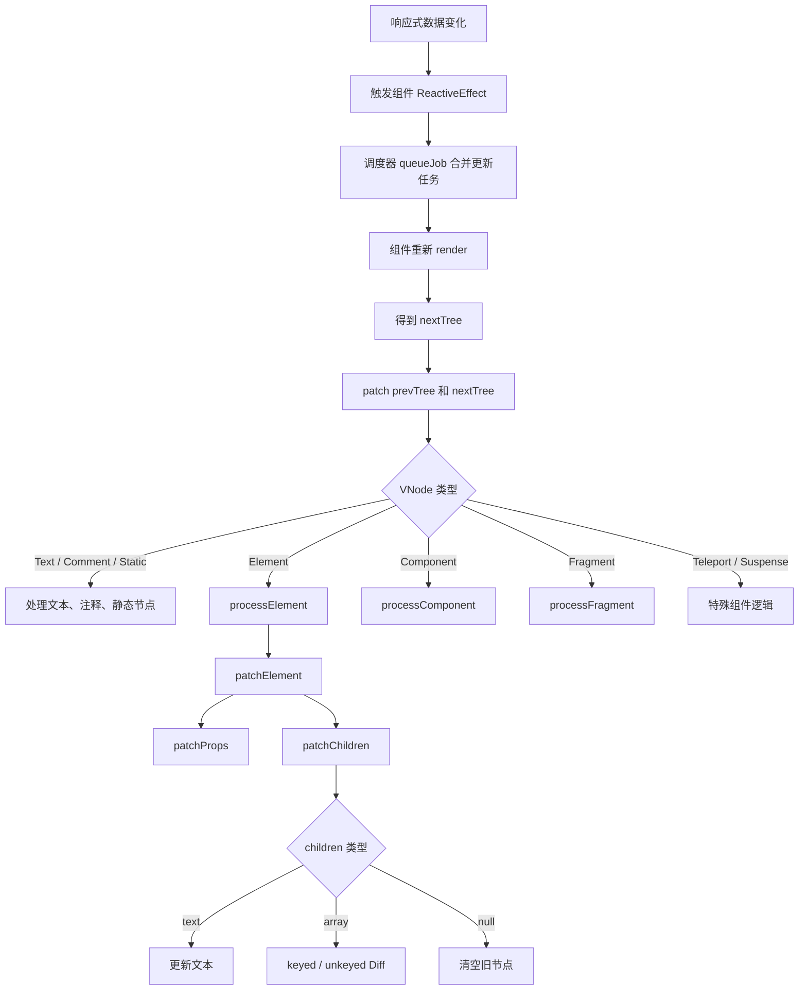
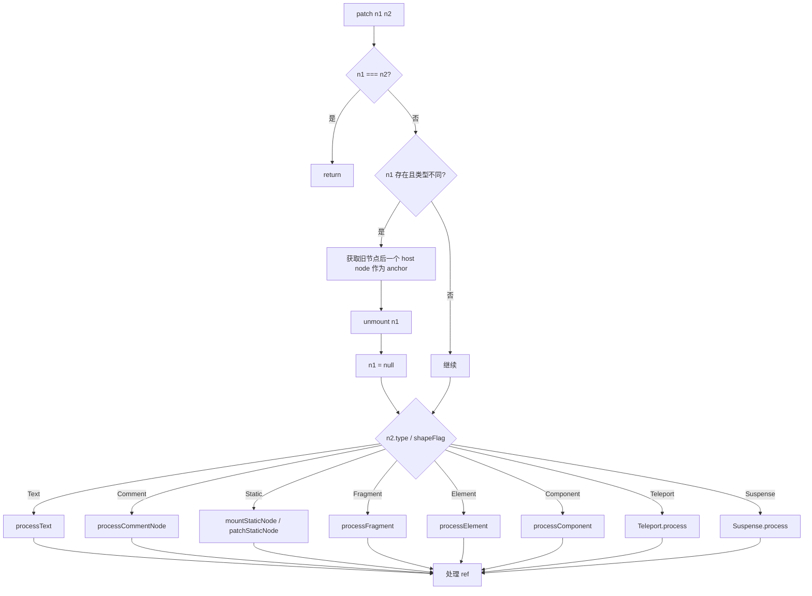
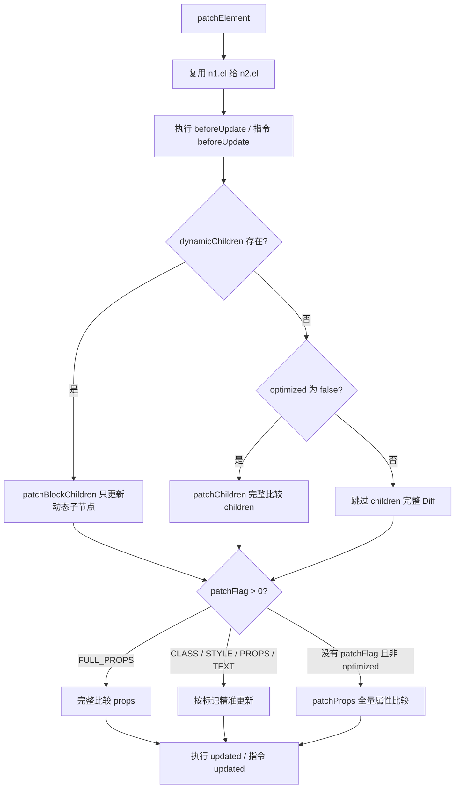
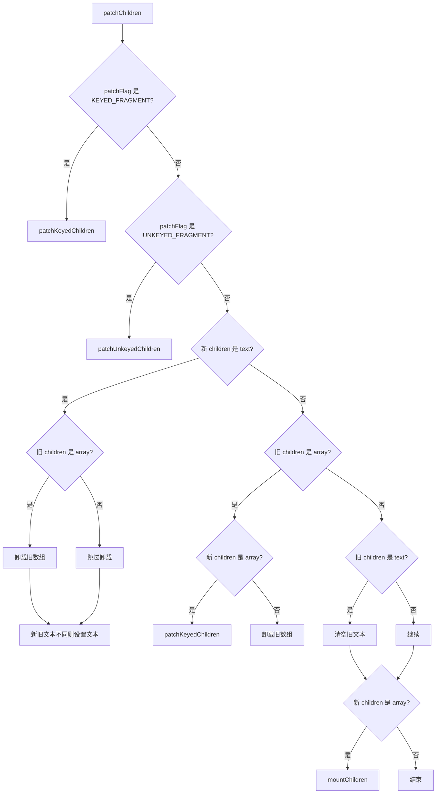
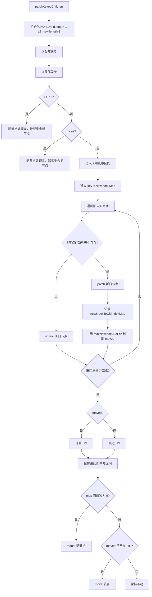

# Vue 3 Diff 算法专题（对比 Vue 2）

> 目标：系统梳理 Vue 3 Diff 算法，并对比 Vue 2 Diff。重点讲清楚：为什么要 Diff、Vue 3 怎么做、相比 Vue 2 优化在哪里、key 和 LIS 的意义是什么。

---

## 1. 什么是 Diff 算法？为什么 Vue 需要 Diff？

### 答案

Diff 算法是虚拟 DOM 更新阶段的核心算法，用来比较新旧两棵 VNode 树，找出最小或较小范围的变更，然后把这些变更应用到真实 DOM 上。

在 Vue 中，当响应式数据发生变化后，组件会重新执行 render 函数，得到一棵新的 VNode 树。框架不会直接把整棵真实 DOM 全部删掉重建，而是会拿新的 VNode 和旧的 VNode 做对比：

1. 如果节点类型不同，直接卸载旧节点，挂载新节点。
2. 如果节点类型相同，复用旧 DOM 节点，只更新 props、children 等变化部分。
3. 如果 children 是数组，则进入子节点 Diff，也就是常说的列表 Diff。

这样可以减少 DOM 操作，因为真实 DOM 操作通常比 JavaScript 对象比较更昂贵。

### 表达

可以这样回答：

> Vue 的 Diff 算法发生在 patch 阶段。数据变化后生成新的 VNode，Vue 会比较新旧 VNode，尽量复用已有 DOM，只对必要的节点进行创建、删除、移动和更新。Vue 的 Diff 是同层比较，不会跨层级寻找可复用节点，因为跨层级 Diff 成本太高，而且前端 UI 中跨层移动的场景较少。

---

## 2. Vue 的 Diff 为什么是同层比较？

### 答案

如果要对两棵树做完全 Diff，理论复杂度可能很高。Vue 做了一个重要假设：

- 两个不同类型的节点产生不同的树。
- 开发者可以通过 `key` 暗示哪些子节点在不同渲染中是稳定可复用的。
- DOM 节点一般只在同一层级内发生顺序变化，很少跨层级移动。

所以 Vue 只比较同一层级的节点，不会把旧树某一层的节点拿去和新树另一层的节点比较。

例如：

```vue
<!-- old -->
<div>
  <p>A</p>
</div>

<!-- new -->
<section>
  <p>A</p>
</section>
```

`div` 和 `section` 类型不同，Vue 会直接卸载旧的 `div` 子树，再挂载新的 `section` 子树，而不会尝试复用里面的 `p`。

---

## 3. Vue 3 的 Diff 流程你能完整讲一下吗？

### 答案

Vue 3 的核心 Diff 入口可以理解为 `patch`。当新旧 VNode 都存在时，会根据节点类型进入不同分支：

1. 文本节点：更新文本内容。
2. 普通元素：复用 DOM，更新 props 和 children。
3. 组件：更新组件实例。
4. Fragment、Teleport、Suspense 等特殊类型：走对应处理逻辑。

对于普通元素，核心流程是：

```text
patch(oldVNode, newVNode)
  ├─ 如果新旧节点不是同一类型：卸载旧节点，挂载新节点
  └─ 如果是同一类型：复用 el
       ├─ patchProps：更新属性、事件、class、style 等
       └─ patchChildren：更新子节点
```

`patchChildren` 会根据新旧 children 的类型分情况处理：

| old children | new children | 处理方式 |
|---|---|---|
| text | text | 文本不同则更新文本 |
| text | array | 清空旧文本，挂载新数组 |
| array | text | 卸载旧数组，设置新文本 |
| array | array | 进入数组 Diff |
| null | text / array | 直接设置或挂载 |
| text / array | null | 清空或卸载 |

重点内容是 `array -> array`，也就是 `patchKeyedChildren`。

---

## 4. Vue 3 的 `patchKeyedChildren` 具体做了哪些步骤？

### 答案

Vue 3 的 keyed children Diff 可以拆成 5 个主要阶段：

```text
old: [a, b, c, d]
new: [a, c, b, e]
```

Vue 3 不会一上来就全量建立映射，而是先做头尾预处理，尽量处理常见场景。

### 第 1 步：从头部开始同步比较

从左往右比较，只要新旧节点是同一类型，就直接 patch。

```text
old: [a, b, c, d]
new: [a, c, b, e]
      ↑
```

`a` 和 `a` 相同，直接复用并更新。

处理后：

```text
old 剩余: [b, c, d]
new 剩余: [c, b, e]
```

### 第 2 步：从尾部开始同步比较

从右往左比较，只要新旧节点相同，也直接 patch。

例如：

```text
old: [a, b, c, d]
new: [a, e, b, c, d]
               ↑  ↑
```

尾部的 `d`、`c`、`b` 都相同，可以先 patch，最后只剩中间新增的 `e`。

### 第 3 步：处理纯新增场景

如果旧节点先遍历完，新节点还有剩余，说明剩下的新节点都是新增节点。

例如：

```text
old: [a, b]
new: [a, b, c, d]
```

头部同步后：

```text
old 已处理完
new 剩余: [c, d]
```

此时直接 mount `c`、`d`。

关键点是插入位置，也就是 anchor。Vue 需要知道新节点应该插到哪个已有 DOM 前面。

```text
new: [a, b, c, d, e]
             ↑ 新增 c、d
anchor 是 e 对应的真实 DOM
```

如果 anchor 不存在，就追加到末尾。

### 第 4 步：处理纯删除场景

如果新节点先遍历完，旧节点还有剩余，说明剩下的旧节点都应该删除。

例如：

```text
old: [a, b, c, d]
new: [a, b]
```

头部同步后：

```text
old 剩余: [c, d]
new 已处理完
```

直接卸载 `c`、`d`。

### 第 5 步：处理未知序列，也就是乱序场景

如果经过头尾同步后，新旧两边都有剩余，就进入最复杂的乱序 Diff。

例如：

```text
old: [a, b, c, d, e]
new: [a, c, b, e, d]
```

头部 `a` 可以同步，剩余：

```text
old unknown: [b, c, d, e]
new unknown: [c, b, e, d]
```

这时 Vue 3 会：

1. 为新 children 的未知区间建立 `key -> newIndex` 映射。
2. 遍历旧 children 的未知区间，判断旧节点是否还存在于新 children。
3. 不存在则卸载。
4. 存在则 patch，并记录旧节点在新序列中的位置。
5. 判断是否发生移动。
6. 如果发生移动，计算最长递增子序列，即 LIS。
7. 倒序遍历新 children，新增缺失节点，移动不在 LIS 中的节点。

---

## 5. Vue 3 为什么要建立 `key -> newIndex` 映射？

### 答案

因为在乱序阶段，需要快速判断旧节点在新 children 中是否还存在，以及存在于新 children 的哪个位置。

假设：

```text
old: [b, c, d, e]
new: [c, b, e, d]
```

Vue 3 会先为 new 建映射：

```js
keyToNewIndexMap = {
  c: 1,
  b: 2,
  e: 3,
  d: 4
}
```

然后遍历 old：

- old `b` 在 new 中的位置是 2，保留并 patch。
- old `c` 在 new 中的位置是 1，保留并 patch。
- old `d` 在 new 中的位置是 4，保留并 patch。
- old `e` 在 new 中的位置是 3，保留并 patch。

如果某个旧节点的 key 在 map 里找不到，说明新列表里已经没有它了，就卸载。

### 为什么这一步重要？

没有 map 的话，每遍历一个旧节点，都要去新节点数组中线性查找，复杂度可能接近 `O(n²)`。建立 map 后，查找可以接近 `O(1)`。

---

## 6. Vue 3 里的 `newIndexToOldIndexMap` 是什么？为什么里面存的是 `oldIndex + 1`？

### 答案

`newIndexToOldIndexMap` 用来记录：新 children 未知区间中的每个节点，对应旧 children 中的哪个位置。

例如：

```text
old unknown: [b, c, d, e]
new unknown: [c, b, e, d]
```

假设旧区间真实下标是：

```text
old: b=1, c=2, d=3, e=4
new: c=1, b=2, e=3, d=4
```

遍历 old 后，可以得到类似数组：

```js
newIndexToOldIndexMap = [3, 2, 5, 4]
```

含义是：

```text
new c 来自 old 下标 2，所以存 2 + 1 = 3
new b 来自 old 下标 1，所以存 1 + 1 = 2
new e 来自 old 下标 4，所以存 4 + 1 = 5
new d 来自 old 下标 3，所以存 3 + 1 = 4
```

为什么要存 `oldIndex + 1`？

因为数组默认用 `0` 表示这个新节点在旧列表里不存在，需要新建。如果直接存 `oldIndex`，当旧下标正好是 `0` 时，就会和“新增节点”的标记冲突。所以 Vue 3 存的是 `oldIndex + 1`。

---

## 7. Vue 3 怎么判断节点是否需要移动？

### 答案

Vue 3 在遍历旧 children 的过程中，会维护一个 `maxNewIndexSoFar`。

它的含义是：目前为止遍历到的旧节点，在新 children 中出现过的最大下标。

如果当前旧节点对应的新下标 `newIndex` 小于 `maxNewIndexSoFar`，说明这个节点在新序列里的位置相对前面的节点发生了逆序，就表示可能需要移动。

例如：

```text
old: [b, c]
new: [c, b]
```

遍历 old：

1. old `b` 在 new 中下标是 1，`maxNewIndexSoFar = 1`。
2. old `c` 在 new 中下标是 0，`0 < 1`，说明发生逆序，需要移动。

如果新下标一直递增，说明旧节点在新列表中的相对顺序没变，不需要移动。

例如：

```text
old: [b, c, d]
new: [b, c, d]
```

对应新下标是 `[0, 1, 2]`，一直递增，不需要移动。

---

## 8. Vue 3 为什么要用最长递增子序列 LIS？

### 答案

LIS，全称是 Longest Increasing Subsequence，最长递增子序列。

在 Vue 3 的列表 Diff 中，LIS 用来找出一组“相对顺序已经正确、不需要移动”的节点。剩下不在 LIS 中的节点才需要移动。

目标不是让移动次数绝对数学最优，而是在常见 DOM 列表更新场景中尽量减少移动。

### 举例

```text
old: [a, b, c, d, e]
new: [a, c, b, d, e]
```

去掉头部相同的 `a` 后：

```text
old unknown: [b, c, d, e]
new unknown: [c, b, d, e]
```

新列表节点对应旧列表位置大概是：

```text
new c -> old 2
new b -> old 1
new d -> old 3
new e -> old 4
```

所以位置序列是：

```js
[2, 1, 3, 4]
```

最长递增子序列可以是：

```js
[1, 3, 4]
```

对应节点：

```text
[b, d, e]
```

说明 `b`、`d`、`e` 的相对顺序可以保留不动，只需要移动 `c` 到合适位置即可。

如果不用 LIS，可能会移动更多节点。

### 更直观的例子

```text
old: [a, b, c, d]
new: [d, a, b, c]
```

新序列对应旧位置：

```js
[4, 1, 2, 3]
```

LIS 是：

```js
[1, 2, 3]
```

对应节点：

```text
[a, b, c]
```

这说明 `a、b、c` 原本的相对顺序已经是对的，只要把 `d` 移到最前面即可。

---

## 9. Vue 3 为什么最后要倒序遍历新 children？

### 答案

因为 DOM 插入需要 anchor（**Anchor = "插到谁前面"的那个"谁"**），也就是“插到哪个节点前面”。

倒序遍历时，右侧节点通常已经处理好了，所以当前节点可以用右边的节点作为 anchor。

例如：

```text
new: [a, b, c, d]
```

从右往左处理：

1. 先处理 `d`，它右边没有节点，anchor 是 `null`，表示追加到末尾。
2. 再处理 `c`，它的 anchor 是 `d.el`，表示插到 `d` 前面。
3. 再处理 `b`，anchor 是 `c.el`。
4. 再处理 `a`，anchor 是 `b.el`。

这样可以稳定地把新增或移动的节点放到正确位置。

---

## 10. Vue 3 的 Diff 能做到绝对最小 DOM 操作吗？

### 答案

不能说绝对最小。

Vue 的 Diff 是基于启发式策略的高效算法，它追求的是在典型 UI 场景下以较低复杂度得到足够好的更新结果，而不是对任意两棵树做理论上的最优编辑距离。

Vue 3 的优化重点包括：

1. 同层比较，避免复杂树编辑距离。
2. 头尾预处理，快速处理常见追加、删除、首尾稳定场景。
3. key 映射，降低查找成本。
4. LIS，尽量减少移动节点数量。
5. 编译时优化，利用 patch flag、block tree 跳过静态节点。

所以更准确的说法是：Vue 3 在运行时 Diff 和编译时标记的配合下，减少了不必要比较和 DOM 操作。

---

## 11. Vue 3 相比 Vue 2 的 Diff 最大区别是什么？

### 答案

Vue 2 和 Vue 3 都是同层 Diff，也都强调使用 `key` 来提升列表更新的准确性和性能。但 Vue 3 的 Diff 在几个方面明显不同：

| 对比点 | Vue 2 | Vue 3 |
|---|---|---|
| 核心列表 Diff | 双端比较 | 头尾同步 + key map + LIS |
| 移动优化 | 通过四个指针和 key map 判断移动 | 通过 `newIndexToOldIndexMap` 和 LIS 减少移动 |
| 编译时优化 | 静态节点优化相对有限 | patch flag、block tree、dynamicChildren |
| Fragment 支持 | 不支持多根节点 | 支持 Fragment，多根节点也能 Diff |
| 静态提升 | 有静态优化，但能力较弱 | hoistStatic 更彻底 |
| 事件缓存 | 相对弱 | cacheHandler 可减少不必要更新 |
| 更新粒度 | 主要依赖运行时递归 Diff | 编译时能标记动态节点，只比较动态部分 |

一句话总结：

> Vue 2 的 Diff 更偏运行时的双端比较；Vue 3 在运行时 Diff 基础上加入了更强的编译时优化，并在乱序列表场景中使用最长递增子序列来减少 DOM 移动。

---

## 12. Vue 2 的 Diff 算法

### 答案

Vue 2 的核心 Diff 发生在 `patch` 阶段，普通元素子节点的 Diff 主要在 `updateChildren` 中完成。

Vue 2 对新旧 children 使用双端比较，也就是维护 4 个指针：

```text
oldStartIdx      oldEndIdx
    ↓                ↓
old: [a, b, c, d]
new: [b, a, d, c]
    ↑                ↑
newStartIdx      newEndIdx
```

每一轮会尝试 4 种比较：

### 1. oldStart 和 newStart 比较

```text
old: [a, b, c]
new: [a, c, b]
      ↑
```

如果相同，直接 patch，两个 start 指针都右移。

### 2. oldEnd 和 newEnd 比较

```text
old: [a, b, c]
new: [b, a, c]
            ↑
```

如果相同，直接 patch，两个 end 指针都左移。

### 3. oldStart 和 newEnd 比较

```text
old: [a, b, c]
new: [b, c, a]
      ↑     ↑
```

说明旧头节点移动到了新尾部。

处理方式：

1. patch `oldStart` 和 `newEnd`。
2. 把 `oldStart.elm` 移动到旧尾节点后面。
3. `oldStartIdx++`，`newEndIdx--`。

### 4. oldEnd 和 newStart 比较

```text
old: [a, b, c]
new: [c, a, b]
      ↑     ↑
```

说明旧尾节点移动到了新头部。

处理方式：

1. patch `oldEnd` 和 `newStart`。
2. 把 `oldEnd.elm` 移动到旧头节点前面。
3. `oldEndIdx--`，`newStartIdx++`。

### 5. 四种都不匹配时

Vue 2 会根据旧 children 建立 `key -> oldIndex` 映射，然后用 `newStartVnode.key` 去旧节点中找。

- 找到了：说明是可复用节点，patch 后移动到当前头部。
- 没找到：说明是新节点，创建并插入。

最后，如果新节点还有剩余，就新增；如果旧节点还有剩余，就删除。

---

## 13. Vue 2 双端 Diff 完整例子

### 答案

例如：

```text
old: [a, b, c, d]
new: [d, a, b, c]
```

指针初始化：

```text
oldStart = a, oldEnd = d
newStart = d, newEnd = c
```

第一轮：

```text
oldEnd d === newStart d
```

说明旧尾 `d` 移动到了新头，于是 Vue 2 会：

1. patch `d`。
2. 把 `d.elm` 移到 `a.elm` 前面。
3. oldEnd 左移到 `c`，newStart 右移到 `a`。

之后：

```text
old: [a, b, c]
new: [a, b, c]
```

接下来 oldStart 和 newStart 依次匹配：

```text
a === a
b === b
c === c
```

所以只需要移动一次 `d`。

---

## 14. Vue 3 和 Vue 2 在列表乱序场景下有什么差异？

### 答案

以这个例子为例：

```text
old: [a, b, c, d, e]
new: [a, c, b, d, e]
```

Vue 2 会通过双端比较处理：

1. 头部 `a` 匹配，patch。
2. 尾部 `e`、`d` 可能依次匹配，patch。
3. 中间剩下 `[b, c]` 和 `[c, b]`。
4. 通过双端比较或 key map 发现移动关系，再移动节点。

Vue 3 会：

1. 头部同步 `a`。
2. 尾部同步 `e`、`d`。
3. 中间剩下：

```text
old unknown: [b, c]
new unknown: [c, b]
```

4. 建立 key map。
5. 得到新节点对应旧位置序列。
6. 计算 LIS，判断哪个节点不需要移动。
7. 只移动必要节点。

在更复杂的乱序场景中，Vue 3 的 LIS 可以更明确地找出最长稳定序列，减少无意义移动。

---

## 15. Vue 3 的 Diff 复杂度是多少？

### 答案

Vue 3 keyed children Diff 的主流程整体接近 `O(n)`，但如果发生移动，需要计算 LIS。Vue 3 中 LIS 通常用贪心 + 二分实现，复杂度是 `O(n log n)`。

所以可以这样回答：

- 头尾同步：`O(n)`。
- 建立 key map：`O(n)`。
- 遍历旧节点并 patch / unmount：`O(n)`。
- 计算 LIS：`O(n log n)`，只在检测到移动时需要。

整体在需要移动的复杂场景中可以认为是 `O(n log n)`；在常见追加、删除、首尾稳定、无需移动的场景中，更接近 `O(n)`。

---

## 16. `key` 在 Diff 中到底有什么作用？

### 答案

`key` 的核心作用是标识 VNode 的身份，帮助 Vue 判断新旧节点是否是同一个节点，从而正确复用 DOM 和组件实例。

例如：

```vue
<li v-for="item in list" :key="item.id">
  {{ item.name }}
</li>
```

当列表顺序变化时，Vue 可以通过 `item.id` 判断：

```text
old: [id=1, id=2, id=3]
new: [id=3, id=1, id=2]
```

虽然位置变了，但 `id=3` 仍然是同一个业务对象，所以对应 DOM 和组件状态可以被复用，只需要移动位置。

如果没有 key，Vue 可能采用就地复用策略，也就是按位置更新。

### 无 key 的问题

```vue
<div v-for="item in list">
  <input :value="item.name" />
</div>
```

如果在列表头部插入一项，没有稳定 key 时，Vue 可能复用原位置 DOM，导致输入框内部状态、焦点、组件局部状态和业务数据错位。

所以讲解中可以说：

> key 不只是性能优化，更是正确性提示。它告诉 Vue 哪些节点在更新前后代表同一个实体。

---

## 17. 为什么不推荐用 index 作为 key？

### 答案

因为 index 代表的是位置，不代表业务身份。

如果列表只展示静态内容，且不会插入、删除、排序，用 index 问题不大。但如果列表会变化，index 会导致节点身份错误。

例如：

```js
old = [
  { id: 1, name: 'A' },
  { id: 2, name: 'B' },
  { id: 3, name: 'C' }
]

new = [
  { id: 4, name: 'D' },
  { id: 1, name: 'A' },
  { id: 2, name: 'B' },
  { id: 3, name: 'C' }
]
```

如果用 index 作为 key：

```text
old key: 0 -> A, 1 -> B, 2 -> C
new key: 0 -> D, 1 -> A, 2 -> B, 3 -> C
```

Vue 会认为：

- key 0 的旧节点 A 变成了 D。
- key 1 的旧节点 B 变成了 A。
- key 2 的旧节点 C 变成了 B。

这会导致错误复用，尤其在表单、动画、组件状态中更明显。

正确做法是使用稳定唯一的业务 id：

```vue
<li v-for="item in list" :key="item.id">
  {{ item.name }}
</li>
```

---

## 18. Vue 3 编译时优化和 Diff 有什么关系？

### 答案

这是 Vue 3 相比 Vue 2 非常重要的点。

Vue 2 的更新更多依赖运行时递归 Diff。Vue 3 除了运行时 Diff，还通过编译器给 VNode 打标记，让运行时知道哪些地方是动态的，从而跳过很多不必要比较。

Vue 3 常见编译优化包括：

### 1. Patch Flag

编译器会给动态节点加 patch flag。

例如：

```vue
<div id="app" :class="cls">{{ msg }}</div>
```

`id="app"` 是静态属性，`class` 和文本是动态的。编译后，VNode 会带上类似标记，告诉运行时：更新时重点检查 class 和 text，不需要全量比较所有 props。

### 2. Block Tree

Vue 3 会把动态节点收集到 block 的 `dynamicChildren` 中。组件更新时，可以跳过大量静态节点，只更新动态节点。

例如：

```vue
<div>
  <h1>静态标题</h1>
  <p>{{ message }}</p>
  <footer>静态底部</footer>
</div>
```

更新时真正需要关注的是 `p` 里的 `message`，`h1` 和 `footer` 可以跳过。

### 3. 静态提升 hoistStatic

静态 VNode 可以被提升到 render 函数外部，避免每次渲染都重新创建。

### 4. 缓存事件处理函数 cacheHandler

对于事件处理函数，Vue 3 可以缓存，减少不必要的更新。

### 小结

> Vue 3 的性能提升不只来自运行时 Diff，而是编译时和运行时协同优化。编译器通过 patch flag 和 block tree 标记动态节点，运行时就可以跳过静态内容，只比较真正可能变化的部分。

---

## 19. Vue 3 keyed Diff 伪代码

### 答案

可以用下面的伪代码表达：

```js
function patchKeyedChildren(oldChildren, newChildren) {
  let i = 0
  let oldEnd = oldChildren.length - 1
  let newEnd = newChildren.length - 1

  // 1. 头部同步
  while (i <= oldEnd && i <= newEnd) {
    if (isSameVNodeType(oldChildren[i], newChildren[i])) {
      patch(oldChildren[i], newChildren[i])
      i++
    } else {
      break
    }
  }

  // 2. 尾部同步
  while (i <= oldEnd && i <= newEnd) {
    if (isSameVNodeType(oldChildren[oldEnd], newChildren[newEnd])) {
      patch(oldChildren[oldEnd], newChildren[newEnd])
      oldEnd--
      newEnd--
    } else {
      break
    }
  }

  // 3. 新增
  if (i > oldEnd) {
    while (i <= newEnd) {
      mount(newChildren[i], anchor)
      i++
    }
    return
  }

  // 4. 删除
  if (i > newEnd) {
    while (i <= oldEnd) {
      unmount(oldChildren[i])
      i++
    }
    return
  }

  // 5. 乱序区间
  const oldStart = i
  const newStart = i

  const keyToNewIndexMap = new Map()
  for (let j = newStart; j <= newEnd; j++) {
    keyToNewIndexMap.set(newChildren[j].key, j)
  }

  const toBePatched = newEnd - newStart + 1
  const newIndexToOldIndexMap = new Array(toBePatched).fill(0)

  let moved = false
  let maxNewIndexSoFar = 0

  for (let j = oldStart; j <= oldEnd; j++) {
    const oldVNode = oldChildren[j]
    const newIndex = keyToNewIndexMap.get(oldVNode.key)

    if (newIndex === undefined) {
      unmount(oldVNode)
    } else {
      newIndexToOldIndexMap[newIndex - newStart] = j + 1
      if (newIndex >= maxNewIndexSoFar) {
        maxNewIndexSoFar = newIndex
      } else {
        moved = true
      }
      patch(oldVNode, newChildren[newIndex])
    }
  }

  const increasingSeq = moved
    ? getSequence(newIndexToOldIndexMap)
    : []

  // 6. 倒序处理新增和移动
  let seqIndex = increasingSeq.length - 1
  for (let j = toBePatched - 1; j >= 0; j--) {
    const newIndex = newStart + j
    const newVNode = newChildren[newIndex]
    const anchor = newChildren[newIndex + 1]?.el ?? null

    if (newIndexToOldIndexMap[j] === 0) {
      mount(newVNode, anchor)
    } else if (moved) {
      if (seqIndex < 0 || j !== increasingSeq[seqIndex]) {
        move(newVNode, anchor)
      } else {
        seqIndex--
      }
    }
  }
}
```

这段伪代码不等同于源码，但能表达核心思想。

---

## 20. Vue 3 Diff 中 `isSameVNodeType` 判断的是什么？

### 答案

它主要判断两个 VNode 是否可以被认为是同一种节点，能否复用。

核心判断通常包括：

1. `type` 是否相同。
2. `key` 是否相同。

例如：

```text
old: <li key="1">A</li>
new: <li key="1">B</li>
```

`type` 都是 `li`，`key` 都是 `1`，可以复用 DOM，只更新文本。

```text
old: <li key="1">A</li>
new: <div key="1">A</div>
```

虽然 key 一样，但 type 不同，不能复用，要卸载旧 `li`，挂载新 `div`。

```text
old: <li key="1">A</li>
new: <li key="2">A</li>
```

type 一样，但 key 不同，也不能认为是同一个业务节点。

---

## 21. Vue 3 中没有 key 的列表怎么 Diff？

### 答案

Vue 3 对 children 有不同处理分支：

- keyed children：有稳定 key，走 `patchKeyedChildren`。
- unkeyed children：没有 key 或不适合按 key 处理，走 `patchUnkeyedChildren`。

无 key 列表一般会按下标就地 patch：

```text
old: [A, B, C]
new: [D, A, B, C]
```

如果没有 key，Vue 可能这样处理：

```text
old[0] A patch 成 new[0] D
old[1] B patch 成 new[1] A
old[2] C patch 成 new[2] B
新增 new[3] C
```

这不是说 DOM 一定错了，而是节点身份可能错位。如果节点里有组件状态、input 状态、动画状态，就可能出现问题。

所以动态列表强烈建议加稳定 key。

---

## 22. Vue 3 Diff 和 React Diff 有什么区别？

### 答案

如果需要扩展到 React，可以简单对比：

- Vue 3 有编译器，可以通过 patch flag、block tree 做更细粒度优化。
- React JSX 更偏运行时表达，通常不知道哪些 props 是动态的，需要更多运行时比较。当然 React 也有 Fiber、memo、useMemo 等优化手段。
- Vue 3 keyed children Diff 使用 LIS 减少移动；React 的 child reconciliation 更关注单向遍历和 placement 标记，不使用同样的 LIS 策略。

这里不建议展开太深，点到为止即可，否则容易偏离 Vue 主题。

---

## 23. 讲 Vue 3 Diff 时有哪些常见误区？

### 误区 1：说 Vue 3 Diff 一定比 Vue 2 快

更准确：Vue 3 在编译优化、响应式系统、block tree 和 keyed Diff 等方面做了大量优化，很多场景更快。但具体性能和模板结构、更新模式、列表规模有关。

### 误区 2：说 key 只是为了性能

更准确：key 首先是节点身份标识，保证复用正确；其次才是帮助 Diff 提升性能。

### 误区 3：说 LIS 让 DOM 移动次数绝对最少

更准确：LIS 找出最长稳定子序列，让这些节点不移动，从而减少移动。它是列表乱序场景中的有效优化，但 Vue 整体 Diff 仍是启发式的。

### 误区 4：说 Vue 3 每次都会算 LIS

更准确：只有在检测到节点顺序发生移动时，才需要计算 LIS。如果只是新增、删除，或者顺序没变，就不需要。

### 误区 5：说 Vue 会跨层复用 DOM

更准确：Vue Diff 是同层比较，不跨层级寻找节点。

---

## 24. 高频问题清单与参考答案

### Q1：Vue 3 Diff 的整体流程是什么？

A：先通过 `patch` 判断新旧 VNode 是否同类型，不同则卸载旧节点并挂载新节点；相同则复用 DOM，更新 props 和 children。children 根据文本、数组、空值分支处理。数组对数组时，如果有 key，走 keyed Diff：头部同步、尾部同步、新增、删除、未知序列处理、key map、patch 旧节点、计算 LIS、倒序移动或挂载。

### Q2：Vue 3 keyed Diff 为什么先做头尾同步？

A：因为实际业务中，列表常见变化是尾部追加、头部插入、局部删除、首尾稳定。先做头尾同步可以快速跳过稳定节点，缩小复杂 Diff 的范围，减少 map 构建和节点移动计算成本。

### Q3：Vue 3 为什么使用 LIS？

A：为了找出在新序列中相对顺序已经正确的旧节点，这些节点可以不移动。只移动不在 LIS 中的节点，从而减少 DOM 移动。

### Q4：Vue 2 Diff 和 Vue 3 Diff 的区别？

A：Vue 2 使用双端比较，通过 oldStart、oldEnd、newStart、newEnd 四个指针匹配头头、尾尾、头尾、尾头，匹配不到再通过 key map 找旧节点。Vue 3 使用头尾同步预处理，然后在未知序列中建立 key map，记录新节点对应旧位置，通过 LIS 减少移动。同时 Vue 3 还有 patch flag、block tree 等编译时优化。

### Q5：为什么不能用 index 当 key？

A：index 是位置，不是业务身份。列表插入、删除、排序后，同一个 index 可能对应不同数据，会导致 DOM 或组件状态错误复用。应该用稳定唯一的业务 id。

### Q6：Vue 3 的 Diff 是不是递归比较整棵树？

A：Vue 会递归 patch 子树，但不是对整棵树做无差别完全比较。Vue 3 通过 patch flag 和 block tree 能跳过静态节点，只更新动态节点，减少递归比较成本。

### Q7：Vue 3 中 Fragment 对 Diff 有什么影响？

A：Vue 3 支持 Fragment，也就是组件可以有多个根节点。Fragment 本身没有真实 DOM 包裹节点，Diff 时会对 Fragment 的 children 进行 patch，并通过 anchor 管理插入、移动和卸载边界。

### Q8：Vue 3 的静态提升如何减少 Diff？

A：静态节点会被提升到 render 函数外部，后续渲染不会重复创建对应 VNode。运行时 patch 时也可以跳过这些静态内容，从而减少对象创建和比较成本。

---

## 25. 常见扩展问题与回答

### Vue 3 用 LIS 减少移动，能举个例子吗？

可以这样答：

> 比如旧列表是 `[a, b, c, d]`，新列表是 `[d, a, b, c]`。新列表对应旧位置是 `[4, 1, 2, 3]`，其中最长递增子序列是 `[1, 2, 3]`，对应 `[a, b, c]`。说明 `a、b、c` 的相对顺序不需要改变，只需要把 `d` 移到最前面。这样 Vue 只移动一个节点。

### 如果不用 LIS 会怎样？

可以这样答：

> 如果不用 LIS，只知道发生了移动，可能会对多个节点都执行移动操作。LIS 的作用是先找出可以保持不动的最长稳定序列，只移动剩下的节点，从而减少 DOM 操作。

### Vue 3 每次更新都会执行完整 Diff 吗？

可以这样答：

> 不会。Vue 3 有编译时优化。模板编译阶段会生成 patch flag 和 block tree，把动态节点收集起来。组件更新时，很多静态节点可以直接跳过，只更新动态 children。所以 Vue 3 不是每次都对整棵 VNode 树做完整 Diff。

### Vue 2 的双端比较是不是 Vue 3 完全不用了？

可以这样答：

> Vue 3 没有照搬 Vue 2 的四指针双端比较策略，但仍然保留了头尾同步思想。它先从头部、尾部同步相同节点，然后对中间未知序列使用 key map 和 LIS。可以理解为 Vue 3 把常见的首尾稳定场景快速处理掉，再用更系统的方式处理乱序移动。

---

## 26. 一句话总结版

如果只用 1 分钟概括，可以这样说：

> Vue 的 Diff 是同层比较。Vue 3 更新时会先比较新旧 VNode 类型，不同就卸载重建，相同就复用 DOM 并更新 props 和 children。数组 children 的 keyed Diff 会先做头部同步、尾部同步，处理纯新增和纯删除；如果中间还有乱序区间，就为新节点建立 key 到 index 的映射，遍历旧节点进行 patch 或 unmount，并记录新节点对应旧位置。若检测到节点移动，则计算最长递增子序列，找出不需要移动的稳定节点，最后倒序遍历新节点，完成新增和移动。相比 Vue 2 的四指针双端 Diff，Vue 3 通过 LIS 减少移动，并结合 patch flag、block tree、静态提升等编译优化，减少不必要的运行时比较。

---

## 27. 记忆口诀

```text
Vue 3 keyed Diff：

头头比，尾尾比；
旧完新增，新完删除；
中间乱序建映射；
旧找新，没找到就删；
新记旧，判断移动；
移动就算 LIS；
倒序插入和移动。
```

Vue 2 双端 Diff：

```text
头头、尾尾、头尾、尾头；
四种不行再 key map；
找到移动，找不到创建；
最后多删少增。
```

---

## 28. 完整总结答案

> Vue 3 的 Diff 核心在 patch 阶段。它首先判断新旧 VNode 是否是同一类型，如果不是就卸载旧节点、挂载新节点；如果是，就复用真实 DOM，然后更新 props 和 children。children 如果都是数组，就进入列表 Diff。Vue 3 的 keyed Diff 会先从头部同步，再从尾部同步，快速处理首尾稳定的情况；如果旧节点遍历完，剩余新节点就是新增；如果新节点遍历完，剩余旧节点就是删除。最复杂的是中间乱序区间，Vue 3 会为新节点建立 key 到 newIndex 的 map，然后遍历旧节点，能在新列表中找到的就 patch，找不到就 unmount，同时记录新节点对应旧节点的位置。如果发现新索引不是递增的，就说明发生了移动，此时计算最长递增子序列，找出可以保持不动的节点，最后倒序遍历新列表，把新增节点 mount，把不在 LIS 中的节点 move 到正确位置。相比 Vue 2 的双端比较，Vue 3 在乱序移动场景中通过 LIS 减少 DOM 移动，并且结合 patch flag、block tree、静态提升等编译时优化，整体减少了运行时比较成本。

---

## 29. Vue 3 Diff 算法详细完整流程（图文版，加深版）

> 这一节是补充版，按源码执行路径从“数据变化”一直讲到“真实 DOM 移动”。如果需要完整讲清 Vue 3 Diff，可以优先按这一节的顺序理解。
>
> 源码主线可以对照 Vue 3 的 `packages/runtime-core/src/renderer.ts`：`patch`、`patchElement`、`patchChildren`、`patchUnkeyedChildren`、`patchKeyedChildren`、`move`。

---

### 29.1 先建立全局视角：Diff 不是从列表开始的

很多同学一说 Vue 3 Diff 就直接讲最长递增子序列，这是不完整的。完整流程应该是：

```text
响应式数据变化
  ↓
触发组件的 ReactiveEffect
  ↓
调度器 scheduler 把组件更新任务放入队列
  ↓
组件重新执行 render 函数
  ↓
生成新的 VNode 树 nextTree
  ↓
拿旧的 VNode 树 prevTree 和新的 nextTree 做 patch
  ↓
patch 内部根据 VNode 类型分发
  ↓
元素节点进入 patchElement
  ↓
子节点进入 patchChildren
  ↓
数组子节点进入 keyed / unkeyed Diff
  ↓
最终执行 DOM 的增、删、改、移
```

可以用一张流程图表示：



如果遇到“Vue 3 Diff 是不是只指列表 Diff”这个问题，可以这样回答：

> 严格来说不是。Diff 是整个 `patch` 更新过程的一部分，列表 Diff 只是 `patchChildren` 中 `array -> array` 的复杂分支。通常语境里常说的 Vue 3 Diff，通常特指 keyed children Diff，也就是 `patchKeyedChildren`。

---

### 29.2 第 0 层：`patch` 入口完整流程

`patch(n1, n2, container, anchor, ...)` 可以理解为：

- `n1`：旧 VNode。
- `n2`：新 VNode。
- `container`：父容器。
- `anchor`：插入参考点，表示要插到哪个 DOM 节点之前。

#### 29.2.1 `patch` 的核心判断

```text
patch(n1, n2)
  ↓
如果 n1 === n2，直接返回
  ↓
如果 n1 存在，并且 n1 和 n2 不是同一种 VNode
  ↓
卸载 n1，把 n1 置为 null
  ↓
根据 n2.type / n2.shapeFlag 分发处理
```

`isSameVNodeType(n1, n2)` 主要看两个条件：

```text
type 是否相同
key 是否相同
```

例如：

```text
old: <li key="1">A</li>
new: <li key="1">B</li>
```

可以复用，更新文本即可。

```text
old: <li key="1">A</li>
new: <div key="1">A</div>
```

`type` 不同，不能复用。

```text
old: <li key="1">A</li>
new: <li key="2">A</li>
```

`key` 不同，不能当成同一个节点。

#### 29.2.2 `patch` 的分发图



注意：

1. 如果新旧 VNode 类型不同，Vue 不会强行深入比较子节点，而是直接卸载旧子树，再挂载新子树。
2. 这就是 Vue 同层 Diff 的体现。
3. `PatchFlags.BAIL` 会让本轮优化失效，退回完整 Diff。

---

### 29.3 第 1 层：普通元素的 `processElement`

当 `n2.shapeFlag` 表示它是普通 DOM 元素时，会进入 `processElement`。

```text
processElement(n1, n2)
  ↓
如果 n1 == null
  ↓
说明是首次挂载，执行 mountElement
  ↓
否则执行 patchElement
```

#### 29.3.1 首次挂载：`mountElement`

首次挂载时主要做：

```text
创建真实 DOM el
  ↓
如果 children 是文本，设置 textContent
  ↓
如果 children 是数组，递归 mountChildren
  ↓
处理指令 created / beforeMount
  ↓
设置 scopeId
  ↓
设置 props
  ↓
执行 transition beforeEnter
  ↓
插入真实 DOM
  ↓
异步队列中执行 mounted / transition enter / 指令 mounted
```

#### 29.3.2 更新元素：`patchElement`

更新元素时不会创建新的真实 DOM，而是复用旧 DOM：

```js
const el = n2.el = n1.el
```

然后做 3 类事情：

1. 更新 children。
2. 更新 props。
3. 执行生命周期、指令、VNode hooks。

流程图：



#### 29.3.3 `patchElement` 的重点：Vue 3 不一定完整 Diff

Vue 3 和 Vue 2 一个很大的不同是：Vue 3 编译器会生成 `patchFlag` 和 `dynamicChildren`。

例如：

```vue
<div>
  <h1>静态标题</h1>
  <p>{{ msg }}</p>
  <button @click="onClick">按钮</button>
</div>
```

理想情况下，更新 `msg` 时：

```text
h1 是静态节点，可以跳过
p 是动态文本，需要更新
button 的事件如果被缓存，也可以减少更新
```

所以 Vue 3 的更新有两条路径：

| 路径 | 说明 |
|---|---|
| 快路径 | 有 `patchFlag` / `dynamicChildren`，只更新动态部分 |
| 慢路径 | 没有可靠优化信息，执行完整 `patchChildren` 和 `patchProps` |

---

### 29.4 第 2 层：`patchChildren` 完整分支

`patchChildren` 处理的是同一个元素下 children 的变化。

children 在 Vue 3 中大体有 3 种形态：

```text
文本 children
数组 children
空 children
```

所以新旧 children 组合起来有这些情况：

| 旧 children | 新 children | 处理方式 |
|---|---|---|
| text | text | 文本不同则 `setElementText` |
| text | array | 清空旧文本，然后 `mountChildren` |
| text | null | 清空文本 |
| array | text | `unmountChildren` 旧数组，然后设置新文本 |
| array | array | 进入列表 Diff |
| array | null | 卸载旧数组 |
| null | text | 设置文本 |
| null | array | 挂载新数组 |
| null | null | 基本不处理 |

流程图：



#### 29.4.1 为什么有 `KEYED_FRAGMENT` 和 `UNKEYED_FRAGMENT` 快路径？

模板编译时，Vue 可以知道某些 Fragment 来自 `v-for`，并且能标记它是不是 keyed：

```vue
<li v-for="item in list" :key="item.id">{{ item.name }}</li>
```

会更倾向走 keyed children 的快路径。

```vue
<li v-for="item in list">{{ item.name }}</li>
```

可能走 unkeyed children。

---

### 29.5 `patchUnkeyedChildren`：无 key 列表的流程

无 key 列表的处理很简单：按位置就地复用。

```text
old: [A, B, C]
new: [D, A, B, C]
```

无 key 时，Vue 可能按下标这样 patch：

```text
old[0] A -> new[0] D
old[1] B -> new[1] A
old[2] C -> new[2] B
new[3] C 是新增
```

完整流程：

```text
oldLength = oldChildren.length
newLength = newChildren.length
commonLength = min(oldLength, newLength)
  ↓
从 0 到 commonLength - 1，逐个 patch old[i] 和 new[i]
  ↓
如果 oldLength > newLength
  ↓
卸载多余旧节点
  ↓
否则如果 newLength > oldLength
  ↓
挂载多余新节点
```

图示：

```text
old: [ A ][ B ][ C ][ D ]
new: [ A' ][ B' ]
       │    │
       └patch┘

多余旧节点：[ C ][ D ] -> unmount
```

无 key Diff 的优点是简单、快；缺点是节点身份可能错位。所以动态列表必须优先使用稳定业务 key。

---

### 29.6 `patchKeyedChildren`：Vue 3 列表 Diff 的完整流程

这是重点。Vue 3 keyed Diff 的源码注释把它拆成 5 个阶段：

```text
1. sync from start        从头部同步
2. sync from end          从尾部同步
3. common sequence + mount    旧序列处理完，新序列还有剩余，挂载新增节点
4. common sequence + unmount  新序列处理完，旧序列还有剩余，卸载旧节点
5. unknown sequence       中间未知乱序区间
```

先看变量：

| 变量 | 含义 |
|---|---|
| `c1` | old children |
| `c2` | new children |
| `i` | 当前从左向右扫描的位置 |
| `e1` | old children 当前尾指针 |
| `e2` | new children 当前尾指针 |
| `l2` | new children 长度 |
| `s1` | old 未知区间开始位置 |
| `s2` | new 未知区间开始位置 |
| `toBePatched` | new 未知区间中待处理节点数量 |
| `patched` | 已经 patch 的新节点数量 |
| `keyToNewIndexMap` | 新节点 key 到 newIndex 的映射 |
| `newIndexToOldIndexMap` | 新节点位置对应的旧节点位置，用于判断新增和 LIS |
| `maxNewIndexSoFar` | 遍历旧节点时，遇到的最大 newIndex |
| `moved` | 是否检测到节点移动 |

---

#### 29.6.1 阶段 1：从头部同步 `sync from start`

从左到右比较：

```text
old: [a, b, c]
new: [a, b, d, e]
      ↑  ↑
```

过程：

```text
i = 0
比较 old[0] a 和 new[0] a，相同 -> patch，i++
比较 old[1] b 和 new[1] b，相同 -> patch，i++
比较 old[2] c 和 new[2] d，不同 -> 停止
```

图示：

```text
old: [ a ][ b ][ c ]
new: [ a ][ b ][ d ][ e ]
       ✅   ✅   ❌

同步后：
old 未处理：[ c ]
new 未处理：[ d ][ e ]
```

这里的 `patch` 不一定只是比较文本，它会递归更新这个节点内部。

---

#### 29.6.2 阶段 2：从尾部同步 `sync from end`

从右到左比较：

```text
old: [a, b, c, d]
new: [e, b, c, d]
            ↑  ↑
```

过程：

```text
oldEnd d 和 newEnd d 相同 -> patch，e1--，e2--
oldEnd c 和 newEnd c 相同 -> patch，e1--，e2--
oldEnd b 和 newEnd b 相同 -> patch，e1--，e2--
oldEnd a 和 newEnd e 不同 -> 停止
```

图示：

```text
old: [ a ][ b ][ c ][ d ]
new: [ e ][ b ][ c ][ d ]
       ❌   ✅   ✅   ✅

同步后：
old 未处理：[ a ]
new 未处理：[ e ]
```

头尾同步的价值是：大量常见场景可以直接在这里结束，根本不用进入复杂乱序 Diff。

---

#### 29.6.3 阶段 3：旧节点先结束，说明新节点有新增

条件：

```js
i > e1
```

含义：旧 children 已经处理完了，新 children 还有剩余。

例子 1：尾部追加

```text
old: [a, b]
new: [a, b, c, d]
```

头部同步后：

```text
i = 2
e1 = 1
e2 = 3
```

因为 `i > e1`，旧节点结束，新节点 `[c, d]` 需要挂载。

图示：

```text
old: [ a ][ b ]
new: [ a ][ b ][ c ][ d ]
       ✅   ✅   ➕   ➕
```

例子 2：头部插入

```text
old: [a, b]
new: [c, a, b]
```

尾部同步会先匹配 `b`、`a`，最后发现新节点 `c` 剩余：

```text
old 已处理完
new 剩余：[ c ]
```

这时 `c` 要插到哪里？靠 `anchor`。

```text
new: [ c ][ a ][ b ]
       ↑
       要插到 a.el 前面
```

源码中会计算：

```text
nextPos = e2 + 1
anchor = nextPos < newLength ? c2[nextPos].el : parentAnchor
```

意思是：剩余新节点要插到“剩余区间后面那个新节点”的真实 DOM 前面。

---

#### 29.6.4 阶段 4：新节点先结束，说明旧节点要删除

条件：

```js
i > e2
```

含义：新 children 已经处理完了，旧 children 还有剩余。

例子：

```text
old: [a, b, c, d]
new: [a, b]
```

头部同步后：

```text
old 剩余：[ c ][ d ]
new 已处理完
```

图示：

```text
old: [ a ][ b ][ c ][ d ]
new: [ a ][ b ]
       ✅   ✅   🗑️   🗑️
```

于是 Vue 会从 `i` 到 `e1` 依次 `unmount`。

---

#### 29.6.5 阶段 5：中间未知乱序区间 `unknown sequence`

如果前 4 个阶段都没有结束，说明中间既有旧节点，也有新节点，且顺序可能变化。

典型结构：

```text
old: [相同头部] [未知旧区间] [相同尾部]
new: [相同头部] [未知新区间] [相同尾部]
```

源码注释中的形态类似：

```text
old: a b [c d e] f g
new: a b [e d c h] f g
```

也就是说：

- `a b` 已经从头部同步。
- `f g` 已经从尾部同步。
- 中间 `[c d e]` 和 `[e d c h]` 需要进一步处理。

这一阶段又分 3 小步：

```text
5.1 建立新节点 key -> newIndex 的映射
5.2 遍历旧节点，patch 可复用节点，删除不存在节点，记录位置关系
5.3 如果需要移动，计算 LIS，然后倒序挂载和移动
```

---

### 29.7 乱序阶段 5.1：建立 `keyToNewIndexMap`

假设：

```text
old: [a, b, c, d, e, x, f, g]
new: [a, b, e, c, h, d, f, g]
```

头部同步：

```text
a、b 相同
```

尾部同步：

```text
f、g 相同
```

剩余未知区间：

```text
old unknown: [c, d, e, x]
new unknown: [e, c, h, d]
```

对应全局下标：

```text
old: [a, b, c, d, e, x, f, g]
          2  3  4  5

new: [a, b, e, c, h, d, f, g]
          2  3  4  5
```

先遍历新未知区间，建立 map：

```js
keyToNewIndexMap = {
  e: 2,
  c: 3,
  h: 4,
  d: 5
}
```

图示：

```text
new unknown:
[ e ][ c ][ h ][ d ]
  │    │    │    │
  2    3    4    5

keyToNewIndexMap:
e -> 2
c -> 3
h -> 4
d -> 5
```

如果发现重复 key，开发环境会报警：

```text
Duplicate keys found during update
```

因为 key 重复会让“节点身份”不可靠。

---

### 29.8 乱序阶段 5.2：遍历旧节点，找可复用节点

这一阶段的目标是回答 3 个问题：

1. 旧节点在新列表中还存在吗？
2. 如果存在，它在新列表的哪个位置？
3. 旧节点对应的新位置是否破坏了递增顺序，也就是是否发生移动？

初始化：

```js
toBePatched = newUnknown.length // 4
patched = 0
moved = false
maxNewIndexSoFar = 0
newIndexToOldIndexMap = [0, 0, 0, 0]
```

`newIndexToOldIndexMap` 的长度等于新未知区间长度。每一项表示：

```text
新未知区间某个位置上的节点，在旧 children 中的下标 + 1
```

为什么要 `+1`？因为 `0` 要留给“新增节点”。

#### 遍历过程示例

旧未知区间：

```text
old unknown: [c, d, e, x]
```

新未知区间：

```text
new unknown: [e, c, h, d]
```

##### 第 1 个旧节点：`c`

```text
c 在 keyToNewIndexMap 中找到 newIndex = 3
```

记录位置：

```text
newIndex - s2 = 3 - 2 = 1
oldIndex + 1 = 2 + 1 = 3

newIndexToOldIndexMap[1] = 3
```

数组变成：

```js
[0, 3, 0, 0]
```

更新移动判断：

```text
newIndex = 3 >= maxNewIndexSoFar = 0
maxNewIndexSoFar = 3
moved 仍然是 false
```

##### 第 2 个旧节点：`d`

```text
d 在新列表中 newIndex = 5
newIndex - s2 = 5 - 2 = 3
oldIndex + 1 = 3 + 1 = 4
```

```js
newIndexToOldIndexMap = [0, 3, 0, 4]
```

移动判断：

```text
newIndex = 5 >= maxNewIndexSoFar = 3
maxNewIndexSoFar = 5
moved 仍然是 false
```

##### 第 3 个旧节点：`e`

```text
e 在新列表中 newIndex = 2
newIndex - s2 = 2 - 2 = 0
oldIndex + 1 = 4 + 1 = 5
```

```js
newIndexToOldIndexMap = [5, 3, 0, 4]
```

移动判断：

```text
newIndex = 2 < maxNewIndexSoFar = 5
```

说明顺序出现了逆序，发生移动：

```js
moved = true
```

##### 第 4 个旧节点：`x`

```text
x 在 keyToNewIndexMap 找不到
```

说明新列表没有 `x`，直接卸载：

```text
unmount x
```

最终得到：

```js
newIndexToOldIndexMap = [5, 3, 0, 4]
moved = true
```

图示：

```text
new unknown:          [ e ][ c ][ h ][ d ]
newIndex:              2    3    4    5
对应 oldIndex + 1:     5    3    0    4
                       │    │    │    │
                       │    │    │    └ d 来自 old[3]
                       │    │    └ h 是新增节点
                       │    └ c 来自 old[2]
                       └ e 来自 old[4]

old x 在 new 中不存在 -> unmount
```

---

### 29.9 `maxNewIndexSoFar` 如何判断是否移动？

这一点很容易被问到。

遍历旧节点时，如果旧节点在新列表中的下标一直递增，说明它们的相对顺序没有变。

例如：

```text
old unknown: [c, d, e]
new unknown: [c, d, e]
```

遍历 old 得到的 newIndex：

```js
[2, 3, 4]
```

一直递增，不移动。

如果出现下降：

```text
old unknown: [c, d, e]
new unknown: [e, c, d]
```

遍历 old 得到的 newIndex：

```js
[3, 4, 2]
```

当遍历到 `e` 时：

```text
2 < maxNewIndexSoFar 4
```

说明 `e` 在新列表中跑到了前面，因此发生移动。

图示：

```text
old 遍历顺序： c -> d -> e
newIndex：     3 -> 4 -> 2
                    ↑    ↓
                 最大 4  突然变小，说明逆序
```

---

### 29.10 乱序阶段 5.3：计算 LIS，找出不需要移动的节点

上面的例子中：

```js
newIndexToOldIndexMap = [5, 3, 0, 4]
```

含义：

```text
new unknown: [ e ][ c ][ h ][ d ]
              5    3    0    4
```

注意：

- `0` 表示新增节点，不参与 LIS。
- LIS 返回的是“下标序列”，不是值序列。

对 `[5, 3, 0, 4]` 忽略 `0` 后，稳定递增序列可以是：

```text
3 -> 4
```

对应下标：

```js
[1, 3]
```

对应节点：

```text
new unknown[1] = c
new unknown[3] = d
```

所以：

```text
c、d 可以保持不动
e 需要移动
h 是新增
```

图示：

```text
new unknown: [ e ][ c ][ h ][ d ]
map:          5    3    0    4
                   └────┘
                    LIS：c -> d 保持不动

不在 LIS：e 需要 move
map 为 0：h 需要 mount
```

为什么 `c -> d` 可以不动？

因为它们在旧 DOM 中的相对顺序就是：

```text
c 在 d 前面
```

新 DOM 中也要求：

```text
c 在 d 前面
```

所以不用动它们，只需要把其他节点插到正确位置。

---

### 29.11 为什么最后必须倒序遍历？

最后 Vue 会从新未知区间的右侧往左处理：

```text
new unknown: [ e ][ c ][ h ][ d ]
倒序处理：d -> h -> c -> e
```

原因是：插入 DOM 时需要 anchor，而倒序时，右边的节点已经在正确位置，可以作为当前节点的 anchor。

完整处理过程：

#### 当前最终目标

```text
new: [a, b, e, c, h, d, f, g]
```

未知区间是：

```text
[e, c, h, d]
```

右侧稳定尾部是：

```text
[f, g]
```

#### 倒序第 1 步：处理 `d`

```text
节点 d 在 map 中不是 0，说明旧节点存在
而且 d 在 LIS 中，所以不移动
anchor 是 f.el
```

结果：

```text
d 保持不动
```

#### 倒序第 2 步：处理 `h`

```text
h 对应 map 值是 0
说明 h 是新增节点
anchor 是 d.el
```

所以：

```text
mount h before d
```

#### 倒序第 3 步：处理 `c`

```text
c 在 LIS 中
不移动
anchor 是 h.el
```

虽然 anchor 是 `h.el`，但因为 `c` 属于稳定序列，不需要移动。

#### 倒序第 4 步：处理 `e`

```text
e 存在于旧节点中
但 e 不在 LIS 中
anchor 是 c.el
```

所以：

```text
move e before c
```

最终：

```text
[a, b, e, c, h, d, f, g]
```

图示：

```text
初始旧 DOM：
[a][b][c][d][e][x][f][g]

删除 x：
[a][b][c][d][e][f][g]

mount h before d：
[a][b][c][h][d][e][f][g]

move e before c：
[a][b][e][c][h][d][f][g]
```

> 注意：真实 DOM 中 `insertBefore(existingNode, anchor)` 对已存在节点会表现为“移动节点”，不是复制节点。

---

### 29.12 Vue 3 keyed Diff 完整执行示例复盘

我们用一个完整例子把所有步骤串起来：

```text
old: [a, b, c, d, e, x, f, g]
new: [a, b, e, c, h, d, f, g]
```

#### Step 1：头部同步

```text
old: [a, b, c, d, e, x, f, g]
new: [a, b, e, c, h, d, f, g]
      ✅ ✅ ❌
```

同步 `a`、`b`。

```text
i = 2
```

#### Step 2：尾部同步

```text
old: [a, b, c, d, e, x, f, g]
new: [a, b, e, c, h, d, f, g]
                         ✅ ✅
```

同步 `g`、`f`。

```text
e1 = 5 // old x 的位置
e2 = 5 // new d 的位置
```

#### Step 3：判断是否纯新增

```text
i = 2, e1 = 5
```

`i > e1` 不成立，不是纯新增。

#### Step 4：判断是否纯删除

```text
i = 2, e2 = 5
```

`i > e2` 不成立，不是纯删除。

#### Step 5：进入未知区间

```text
old unknown: [c, d, e, x]
new unknown: [e, c, h, d]
```

建立新节点 key map：

```js
{
  e: 2,
  c: 3,
  h: 4,
  d: 5
}
```

遍历 old unknown：

| old 节点 | 是否在 new 中 | newIndex | 操作 | `newIndexToOldIndexMap` |
|---|---:|---:|---|---|
| c | 是 | 3 | patch c | `[0, 3, 0, 0]` |
| d | 是 | 5 | patch d | `[0, 3, 0, 4]` |
| e | 是 | 2 | patch e，发现移动 | `[5, 3, 0, 4]` |
| x | 否 | - | unmount x | `[5, 3, 0, 4]` |

计算 LIS：

```text
map: [5, 3, 0, 4]
LIS 下标：[1, 3]
LIS 节点：[c, d]
```

倒序处理：

| 倒序节点 | map 值 | 是否在 LIS | 操作 | anchor |
|---|---:|---:|---|---|
| d | 4 | 是 | 不移动 | f.el |
| h | 0 | 否 | mount | d.el |
| c | 3 | 是 | 不移动 | h.el |
| e | 5 | 否 | move | c.el |

最终 DOM：

```text
[a, b, e, c, h, d, f, g]
```

---

### 29.13 `patchKeyedChildren` 的伪代码完整版

下面是更接近源码结构的伪代码，不需要逐字背，但要理解每一段做什么。

```js
function patchKeyedChildren(c1, c2, container, parentAnchor) {
  let i = 0
  const l2 = c2.length
  let e1 = c1.length - 1
  let e2 = l2 - 1

  // 1. 从头部同步
  while (i <= e1 && i <= e2) {
    const n1 = c1[i]
    const n2 = normalizeVNode(c2[i])
    if (isSameVNodeType(n1, n2)) {
      patch(n1, n2, container)
      i++
    } else {
      break
    }
  }

  // 2. 从尾部同步
  while (i <= e1 && i <= e2) {
    const n1 = c1[e1]
    const n2 = normalizeVNode(c2[e2])
    if (isSameVNodeType(n1, n2)) {
      patch(n1, n2, container)
      e1--
      e2--
    } else {
      break
    }
  }

  // 3. 旧节点先结束：挂载新增节点
  if (i > e1) {
    if (i <= e2) {
      const nextPos = e2 + 1
      const anchor = nextPos < l2 ? c2[nextPos].el : parentAnchor
      while (i <= e2) {
        patch(null, normalizeVNode(c2[i]), container, anchor)
        i++
      }
    }
    return
  }

  // 4. 新节点先结束：卸载多余旧节点
  if (i > e2) {
    while (i <= e1) {
      unmount(c1[i])
      i++
    }
    return
  }

  // 5. 未知乱序区间
  const s1 = i
  const s2 = i

  // 5.1 建立新节点 key -> index 映射
  const keyToNewIndexMap = new Map()
  for (let j = s2; j <= e2; j++) {
    const nextChild = normalizeVNode(c2[j])
    if (nextChild.key != null) {
      keyToNewIndexMap.set(nextChild.key, j)
    }
  }

  // 5.2 遍历旧节点
  let patched = 0
  const toBePatched = e2 - s2 + 1
  let moved = false
  let maxNewIndexSoFar = 0
  const newIndexToOldIndexMap = new Array(toBePatched).fill(0)

  for (let j = s1; j <= e1; j++) {
    const prevChild = c1[j]

    // 如果新节点都 patch 完了，剩下旧节点只能删除
    if (patched >= toBePatched) {
      unmount(prevChild)
      continue
    }

    let newIndex

    if (prevChild.key != null) {
      newIndex = keyToNewIndexMap.get(prevChild.key)
    } else {
      // 没有 key 的节点，只能在新未知区间里找同类型且未匹配的节点
      for (let k = s2; k <= e2; k++) {
        if (
          newIndexToOldIndexMap[k - s2] === 0 &&
          isSameVNodeType(prevChild, c2[k])
        ) {
          newIndex = k
          break
        }
      }
    }

    if (newIndex === undefined) {
      unmount(prevChild)
    } else {
      // 记录新节点对应旧节点的位置，+1 是为了让 0 表示新增
      newIndexToOldIndexMap[newIndex - s2] = j + 1

      // 判断是否移动
      if (newIndex >= maxNewIndexSoFar) {
        maxNewIndexSoFar = newIndex
      } else {
        moved = true
      }

      patch(prevChild, c2[newIndex], container)
      patched++
    }
  }

  // 5.3 移动和挂载
  const increasingNewIndexSequence = moved
    ? getSequence(newIndexToOldIndexMap)
    : []

  let seqIndex = increasingNewIndexSequence.length - 1

  // 倒序遍历新未知区间
  for (let j = toBePatched - 1; j >= 0; j--) {
    const nextIndex = s2 + j
    const nextChild = c2[nextIndex]
    const anchor = nextIndex + 1 < l2
      ? c2[nextIndex + 1].el
      : parentAnchor

    if (newIndexToOldIndexMap[j] === 0) {
      // 新节点没有对应旧节点，需要挂载
      patch(null, nextChild, container, anchor)
    } else if (moved) {
      // 不在 LIS 中，需要移动
      if (seqIndex < 0 || j !== increasingNewIndexSequence[seqIndex]) {
        move(nextChild, container, anchor)
      } else {
        // 在 LIS 中，不动
        seqIndex--
      }
    }
  }
}
```

---

### 29.14 `getSequence` 最长递增子序列到底返回什么？

Vue 3 的 `getSequence` 用于求最长递增子序列，但要注意两点：

1. 它处理的是 `newIndexToOldIndexMap`。
2. 它返回的是 LIS 对应的数组下标，不是数组值。

例如：

```js
newIndexToOldIndexMap = [5, 3, 0, 4]
```

忽略 `0`，递增子序列可以是：

```js
[3, 4]
```

对应下标：

```js
[1, 3]
```

所以 `getSequence` 返回：

```js
[1, 3]
```

这代表：

```text
new unknown 中下标 1 和 3 的节点不用移动
```

也就是：

```text
[c, d] 不用移动
```

---

### 29.15 为什么 Vue 3 不一开始就用 key map？

因为头尾同步可以更快处理常见场景。

例如尾部追加：

```text
old: [a, b, c]
new: [a, b, c, d]
```

只靠头部同步就能发现旧节点结束，然后直接挂载 `d`。没有必要建立 map，也没有必要算 LIS。

例如尾部删除：

```text
old: [a, b, c, d]
new: [a, b, c]
```

也是头部同步后直接删除 `d`。

所以 Vue 3 的策略是：

```text
先用低成本方式处理简单场景
再用 key map + LIS 处理复杂乱序场景
```

---

### 29.16 为什么 Vue 3 不总是计算 LIS？

因为 LIS 有成本，通常是 `O(n log n)`。

Vue 3 会先通过 `maxNewIndexSoFar` 判断是否真的出现移动。

如果没有移动：

```text
moved = false
```

就不算 LIS。

例如：

```text
old unknown: [c, d, e]
new unknown: [c, d, e, h]
```

旧节点对应新位置一直递增，没有移动，只需要挂载 `h`。

只有出现逆序时：

```text
newIndex < maxNewIndexSoFar
```

才说明有移动，才需要 LIS。

---

### 29.17 Vue 3 Diff 中真实 DOM 操作有哪些？

最终落到真实 DOM 上，主要是这些操作：

| 操作 | 触发场景 | 对应行为 |
|---|---|---|
| 创建 | 新节点没有旧节点对应 | `patch(null, newVNode)` 内部创建 DOM |
| 删除 | 旧节点在新列表中不存在 | `unmount(oldVNode)` |
| 更新 | 新旧节点同类型同 key | `patch(oldVNode, newVNode)` |
| 移动 | 节点存在但位置变化且不在 LIS 中 | `move(vnode, container, anchor)` |
| 设置文本 | 文本 children 变化 | `setElementText` / `setText` |
| 更新属性 | props 变化 | `hostPatchProp` |

可以这样理解：

```text
Diff 本身不直接等于 DOM 操作
Diff 负责判断哪些节点要操作
Renderer 的 host 方法负责真正操作平台节点
```

在浏览器中，host 方法对应 DOM API；在自定义渲染器中，可以对应 Canvas、小程序、Native 等平台操作。

---

### 29.18 Vue 3 Diff 的完整总结

如果需要详细讲完整流程，可以这样说：

> Vue 3 的 Diff 发生在组件更新的 `patch` 阶段。响应式数据变化后，组件的渲染 effect 会被调度执行，重新生成新的 VNode 树，然后用旧的 VNode 树和新的 VNode 树调用 `patch`。`patch` 首先判断新旧 VNode 是否完全相同，如果相同直接返回；如果旧节点存在但和新节点不是同一类型，也就是 type 或 key 不同，则卸载旧节点，并把新节点当作挂载处理。然后 `patch` 根据新 VNode 的类型分发，文本节点更新文本，Fragment 处理片段边界，组件进入组件更新，普通元素进入 `processElement`。
>
> 对普通元素来说，如果旧节点不存在就是 `mountElement`；如果旧节点存在，则进入 `patchElement`。`patchElement` 会复用旧 DOM，把 `n1.el` 赋给 `n2.el`，然后根据 `dynamicChildren` 和 `patchFlag` 判断能不能走编译优化快路径。如果有 `dynamicChildren`，就只 patch 动态子节点；否则在非 optimized 情况下走完整 `patchChildren`。props 更新也会根据 patch flag 精准更新 class、style、动态 props、文本等；如果没有优化信息，则全量比较 props。
>
> `patchChildren` 会根据新旧 children 类型分支处理。children 可以是文本、数组或空。文本到文本就更新文本；数组到文本就卸载旧数组再设置文本；文本到数组就清空文本再挂载数组；数组到数组就是列表 Diff。如果编译器标记了 keyed fragment，就走 `patchKeyedChildren`；如果是 unkeyed fragment，就走 `patchUnkeyedChildren`。
>
> `patchUnkeyedChildren` 比较简单，会按相同下标就地 patch，公共长度部分逐个更新，多余旧节点删除，多余新节点挂载。真正复杂的是 `patchKeyedChildren`。Vue 3 keyed Diff 先从头部同步相同节点，再从尾部同步相同节点。同步过程中只要 `isSameVNodeType` 成立，就递归 patch。头尾同步后，如果旧节点先处理完，说明新节点剩余部分都是新增，直接根据 anchor 挂载；如果新节点先处理完，说明旧节点剩余部分都要删除，直接 unmount。
>
> 如果头尾同步后新旧两边都还有剩余，就进入未知乱序区间。Vue 3 会先遍历新未知区间，建立 `key -> newIndex` 的映射。然后遍历旧未知区间：如果旧节点的 key 在新节点 map 中找不到，说明它已经被删除，执行 unmount；如果找到了，就 patch 旧节点和对应的新节点，并在 `newIndexToOldIndexMap` 中记录这个新节点对应的旧下标加 1。这里加 1 是因为 0 被用来表示新增节点。遍历过程中 Vue 还会用 `maxNewIndexSoFar` 判断新索引是否保持递增，如果出现当前 newIndex 小于历史最大 newIndex，就说明发生了移动，把 `moved` 标记为 true。
>
> 旧节点遍历完成后，如果 `moved` 为 true，Vue 会对 `newIndexToOldIndexMap` 计算最长递增子序列。LIS 对应的节点代表相对顺序已经正确，可以不移动。最后 Vue 会倒序遍历新未知区间，因为倒序时右侧节点已经处理好，可以作为 anchor。如果某个位置在 `newIndexToOldIndexMap` 中是 0，说明这是新增节点，执行 mount；如果不是 0 且节点不在 LIS 中，说明它需要移动，执行 move；如果在 LIS 中，则保持不动。这样 Vue 3 就完成了对列表的新增、删除、更新和最小化移动。

---

### 29.19 Vue 3 keyed Diff 主流程图

可以表示为：



---

### 29.20 用一句话区分 `patch`、`patchElement`、`patchChildren`、`patchKeyedChildren`

| 函数 | 一句话解释 |
|---|---|
| `patch` | 比较两个 VNode，按类型分发处理，是更新总入口 |
| `patchElement` | 新旧都是同类型元素时，复用 DOM，更新 props 和 children |
| `patchChildren` | 比较同一个元素下的新旧 children，处理文本、数组、空值转换 |
| `patchUnkeyedChildren` | 无 key 数组按下标就地 patch |
| `patchKeyedChildren` | 有 key 数组通过头尾同步、key map、LIS 完成高效列表 Diff |

---

### 29.21 这一节的记忆口诀

```text
完整流程：
响应式触发，组件重渲染；
生成新树，进入 patch；
type 或 key 不同，卸载重建；
同类元素，复用 el；
先看 block 和 flag，能快则快；
children 三形态：文本、数组、空；
数组对数组，进入列表 Diff。

keyed Diff：
头同步，尾同步；
旧完就新增，新完就删除；
都没完，是乱序；
新建 key map，旧找新；
找不到删，找得到 patch；
记录 new 对 old，判断 moved；
有移动算 LIS；
倒序看 anchor；
0 就新增，不在 LIS 就移动，在 LIS 就不动。
```
